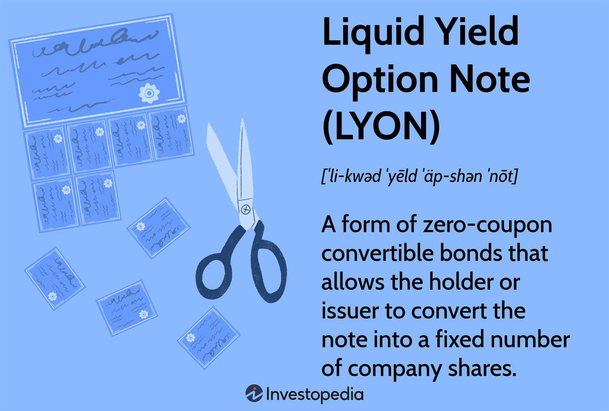

In the ever-evolving world of finance, financial instruments continuously adapt and transform to meet the increasing demands of both investors and issuers. This dynamic environment has given birth to a variety of innovative tools designed to maximize potential returns while managing risks. One such instrument is the Liquid Yield Option Note (LYON), introduced by Merrill Lynch in the mid-1980s. LYONs are distinct in that they are zero-coupon convertible bonds, offering predetermined conversion capabilities, which blend the advantages of both debt and equity instruments.

LYONs stand out as they do not pay periodic interest. Instead, they are issued at a discount, providing investors with the potential for substantial gains upon either maturity or conversion. This feature aligns LYONs with zero-coupon bonds, which accrue value over their lifespan. However, LYONs introduce an additional dimension through conversion capabilities, allowing the bondholder to convert their holdings into a fixed number of shares of common stock. This conversion option offers investors a significant upside opportunity during favorable market conditions, while still retaining the security of the bond's principal.



As financial markets grow increasingly complex, algorithmic trading, or algo trading, has emerged as a critical strategy for optimizing investment outcomes. This article will explore the characteristics, benefits, and trading potential of LYONs, with a particular emphasis on how algorithmic trading strategies can enhance their use. The integration of sophisticated algorithms to automate trading decisions can significantly improve entry and exit points, leveraging the unique features of LYONs to maximize opportunities within volatile markets. Through this lens, the potential of LYONs in investment portfolios can be fully realized, providing valuable tools for both diversification and risk management.

## Table of Contents

## What are Liquid Yield Option Notes (LYONs)?

Liquid Yield Option Notes (LYONs) are a distinctive type of financial instrument that integrates the features of zero-coupon bonds with convertible options. Unlike traditional bonds, LYONs do not distribute periodic interest payments. Instead, they are issued at a discount to their face value, allowing investors to realize significant gains at maturity or upon conversion. This structure provides investors with the potential for capital appreciation due to the conversion feature and the accumulation of the bond's value over time.

The zero-coupon nature of LYONs means that investors do not receive annual interest. For example, suppose a LYON is issued with a face value of $1,000, but it is sold to investors at $650. Over the bond's lifetime, holders do not receive interest payments, but at maturity, investors will obtain the full face value of $1,000, yielding a profit of $350. This capital gain compensates for the absence of periodic interest and is attractive during interest accrual. Hence, the formula representing the yield calculation on a zero-coupon bond, such as LYONs, could be:

$$

\text{Effective Yield} = \left(\frac{\text{Face Value}}{\text{Purchase Price}}\right)^{\frac{1}{n}} - 1 
$$

where $n$ represents the number of years until maturity.

Moreover, LYONs include conversion, call, and put options. The conversion option allows investors to convert their LYONs into a predetermined number of shares of common stock, presenting an opportunity to partake in the equity's potential appreciation. This feature is particularly advantageous in bullish market conditions, where stock prices are expected to rise, enabling investors to convert bonds into shares worth more than the bond's current value.

The callable feature allows issuers to repurchase the bonds from holders before maturity at specific prices and dates. This flexibility enables issuers to refinance debt at a lower cost if interest rates decline or if the company's financial situation improves. The put option grants investors the right to sell the bond back to the issuer at predefined terms, providing a measure of protection against unfavorable market conditions, such as significant declines in the issuer's credit quality. 

In summary, LYONs are geared toward investors seeking a versatile investment aligned with both equity and fixed-income attributes, offering strategic opportunities primarily as a result of various embedded options. This flexibility bolsters their appeal to both issuers and investors seeking to navigate varying market landscapes.

## The Structure and Innovation Behind LYONs

Liquid Yield Option Notes (LYONs) appeared as an innovative financial instrument, integrating the attributes of zero-coupon bonds and convertible bonds to offer a unique cash flow experience. Zero-coupon bonds are typically issued at a discount to their face value and do not provide periodic interest payments. Instead, they yield a profit upon maturity when the bond is redeemed at its full face value. This characteristic allows LYONs to mitigate reinvestment risk, providing predictable returns over the investment horizon.

Convertible bonds, on the other hand, confer bondholders the capability to convert bonds into a predetermined number of shares of the issuing company's stock. This conversion feature represents an optionality aspect, allowing investors to benefit from potential stock price appreciation, thus introducing an equity-like upside into the fixed income investment typically absent in straight bond products.

LYONs simulate the cash flow of both of these instruments by embedding the zero-coupon structure with conversion rights. This synthetic structure becomes particularly appealing during periods of [interest rate](/wiki/interest-rate-trading-strategies) [volatility](/wiki/volatility-trading-strategies). The ability to convert into equity provides investors a hedge against inflation, which typically erodes the value of fixed interest payments. Furthermore, if market interest rates fluctuate, the discount at which LYONs are initially sold becomes favorable compared to bonds sold at par with regular coupon payments.

The conversion feature is designed to be advantageous under favorable market conditions where the stock’s market price surpasses the conversion price of the bond. In such scenarios, bondholders can capitalize on equity gains, thus amplifying the returns beyond the fixed income character. This mechanism transforms the investor's risk and return profile, offering a viable opportunity during bullish market trends while maintaining the downside protection intrinsic to bonds.

Through this combination of features, LYONs cater to diverse investment strategies. By blending the aspects of deferred returns and equity conversion, they offer a strategic response to variable market conditions and are versatile to portfolio compositions aiming for balanced risk-adjusted returns. As such, LYONs represent a fusion of traditional fixed-income with equity-market exposure, embodying financial innovation in bond markets to meet evolving investor needs.

## Algorithmic Trading with LYONs

Algorithmic trading, or algo trading, leverages mathematical models and complex algorithms to automate the trading process. This can be particularly advantageous for managing Liquid Yield Option Notes (LYONs), given their unique structure and flexibility. 

The automation facilitated by algo trading optimizes entry and [exit](/wiki/exit-strategy) points, harnessing the opportunities presented by LYONs' conversion features and market conditions. One of the primary strategies employed is [arbitrage](/wiki/arbitrage), which involves exploiting price discrepancies between the LYONs and the underlying stock. By rapidly executing trades when discrepancies are detected, algorithms can lock in risk-free profits before the market corrects these anomalies.

Another strategy suitable for LYONs is mean reversion, which operates on the principle that asset prices will eventually revert to their historical mean. Algorithmic systems monitor the price of LYONs and their underlying securities, executing trades when prices deviate significantly from their averages. This approach assumes that any deviation is temporary, providing a buy or sell signal. 

Additionally, [momentum](/wiki/momentum) trading strategies can be adapted for LYONs. This involves algorithms detecting trends or patterns in trading volumes and prices, enabling the execution of trades in the direction of the trend. For instance, if the underlying stock of a LYON is on an upward trajectory, an algorithm might convert the bonds into stocks to capture potential gains, taking into account the timing and cost-effectiveness of conversion.

Algo trading with LYONs can also incorporate quantitative analysis to refine these strategies. For example, quantitative models can be developed in Python using libraries like pandas and NumPy to analyze historical price data and volatility. An example Python script to model mean reversion might involve calculating moving averages and standard deviations:

```python
import pandas as pd
import numpy as np

def calculate_moving_average(signal, window):
    return signal.rolling(window=window).mean()

def calculate_bollinger_bands(signal, window, num_std_dev):
    rolling_mean = signal.rolling(window=window).mean()
    rolling_std = signal.rolling(window=window).std()
    upper_band = rolling_mean + (rolling_std * num_std_dev)
    lower_band = rolling_mean - (rolling_std * num_std_dev)
    return upper_band, lower_band

data = pd.DataFrame(...)  # historical price data
moving_average = calculate_moving_average(data['LYON_price'], window=20)
upper_band, lower_band = calculate_bollinger_bands(data['LYON_price'], window=20, num_std_dev=2)

# Trading decision logic based on the calculated bands
for price in data['LYON_price']:
    if price < lower_band:
        print("Buy signal")
    elif price > upper_band:
        print("Sell signal")
```

This computational capability, analyzing large datasets swiftly and accurately, allows for real-time assessment and decision-making. Altogether, integrating algorithmic strategies with the flexible characteristics of LYONs maximizes trading potential while managing inherent risks.

## Benefits and Risks of Trading LYONs

Trading Liquid Yield Option Notes (LYONs) presents notable advantages for investors due to their hybrid nature, combining features of both equity and fixed-income securities. This dual nature provides a balanced approach to portfolio diversification, potentially reducing overall risk. Given their zero-coupon and convertible attributes, LYONs offer the potential for capital appreciation through conversion into common stock, while their bond-like characteristics provide a stable return at maturity when no conversion occurs.

However, LYONs are not devoid of risks. Key among these is market volatility, which can significantly impact their valuation. Interest rate fluctuations can inversely affect bond prices, while the stock price volatility influences the conversion value. Therefore, investors need to be savvy about managing these factors to optimize returns.

Sophisticated trading strategies, especially those leveraging [algorithmic trading](/wiki/algorithmic-trading), can potentially mitigate risks associated with LYONs. Algorithmic trading ensures precision in entering and exiting trades based on pre-defined criteria, reducing emotional bias and enhancing efficiency. For instance, using mean reversion strategies, traders could program algorithms to identify price levels at which LYONs historically tend to reverse direction, thus optimizing entry points. Momentum trading algorithms, on the other hand, could exploit trends in LYON prices to capture gains by tracking price movements over specific periods.

Moreover, arbitrage strategies can be particularly beneficial with LYONs due to their convertible feature. An algorithm could be designed to identify discrepancies between the LYON's market price and its theoretical value based on underlying stock prices, executing trades to capture the differential.

Risk management can also be enhanced through algorithmic trading by integrating data analytics. By processing historical data and market indicators, algorithms can predict potential market movements, thereby allowing traders to make more informed decisions. For example, an algorithm could continuously analyze interest rate trends and adjust positions in LYONs accordingly, hedging against potential adverse shifts. 

In summary, while LYONs offer compelling benefits for portfolio diversification, the associated risks require careful management. Utilizing advanced trading strategies such as algorithmic trading can provide the tools necessary for effectively navigating the challenges and maximizing the potential of LYONs in an investment portfolio.

## Conclusion

Liquid Yield Option Notes (LYONs) are positioned at the unique confluence of bond and stock investing, offering both opportunities and challenges to investors. Unlike traditional bonds or stocks, LYONs provide a hybrid financial structure that includes features such as zero-coupon issuance and convertible options. This effectively allows investors to benefit from both fixed-income stability and the potential for equity growth. Consequently, LYONs serve as an intriguing option for those seeking to diversify their portfolios with innovative financial instruments.

In the context of modern finance, as more sophisticated trading techniques like algorithmic trading emerge, LYONs are poised to benefit significantly. Algorithmic trading allows the automation of complex trading strategies, optimizing the timing of conversion and sale of LYONs. As market data becomes increasingly accessible and computational tools advance, the integration of algorithmic strategies with LYON investments is expected to grow. This integration facilitates data-driven decision-making processes, enhancing entry and exit strategies and potentially increasing yields.

For investors keen on diversifying their financial strategies, leveraging LYONs through algorithmic trading presents a promising opportunity. It allows them to navigate market volatility effectively and manage the risks associated with interest rate fluctuations and stock price changes. As a result, understanding and strategically employing LYONs can unlock significant potential, offering a competitive edge in the ever-evolving financial markets. Investing in LYONs, especially with the aid of algorithmic trading, could be a key component in optimizing long-term investment outcomes.

## References & Further Reading

[1]: ["Liquid Yield Option Notes: A New Financial Instrument"](https://www.investopedia.com/terms/l/lyon.asp) by Charles W. Patton, Jr. - The Journal of Finance, 1987.

[2]: ["Quantitative Finance and Risk Management: A Physicist's Approach"](https://www.amazon.com/QUANTITATIVE-FINANCE-RISK-MANAGEMENT-PHYSICISTS/dp/9814571237) by Jan W. Dash - Springer, 2004.

[3]: ["Convertible Securities: A Guide to Investment and Corporate Financing Strategies"](https://www.amazon.com/Convertible-Securities-Investment-Corporate-Strategies/dp/1260462900) by Tracy V. Maitland and Rick Apone - Wiley, 2016.

[4]: ["Advances in Financial Machine Learning"](https://www.amazon.com/Advances-Financial-Machine-Learning-Marcos/dp/1119482089) by Marcos Lopez de Prado - Wiley, 2018.

[5]: Hendershott, T., Jones, C. M., & Menkveld, A. J. (2011). ["Does Algorithmic Trading Improve Liquidity?"](https://onlinelibrary.wiley.com/doi/full/10.1111/j.1540-6261.2010.01624.x) The Review of Financial Studies, Volume 24, Issue 8, Pages 2653–2687.

[6]: ["Machine Learning for Algorithmic Trading"](https://github.com/stefan-jansen/machine-learning-for-trading) by Stefan Jansen - Packt Publishing, 2020.