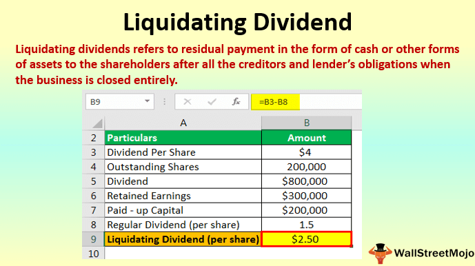

In the ever-evolving landscape of finance, the integration of corporate finance, tax regulations, and investment strategies demands a comprehensive understanding by today's investors. Liquidating dividends, which emerge during the dismantling of a company's operations, are a critical component of this financial confluence. These distributions fundamentally differ from regular dividends, primarily impacting economic decisions and tax outcomes.

Liquidating dividends originate from a company's capital base rather than its profits. As such, they are instrumental in shaping the tax obligations of shareholders, often guiding significant financial decisions. For investors, understanding the implications of these distributions is essential for optimizing their financial strategies and ensuring compliance with tax obligations. The complexities of liquidating dividends necessitate a careful examination of their role within corporate finance and tax planning.

Algorithmic trading provides a sophisticated toolset for investors navigating these intricacies. With the ability to process vast quantities of financial data rapidly, algorithmic strategies offer a predictive and strategic approach to handling liquidation events. These computational methods allow investors to manage their portfolios more efficiently, optimizing positions around liquidating dividends' impact while minimizing associated risks.

Mastery of these interconnected financial domains can enhance investor acumen and strategic planning. By aligning corporate finance actions with tax strategies and market insights, stakeholders can achieve more informed decision-making. Understanding these relationships enables investors to effectively navigate the complex financial waters of liquidating dividends, ultimately improving financial outcomes and adaptability in a dynamic market environment.

## Table of Contents

## Understanding Liquidating Dividends

A liquidating dividend is a type of distribution that occurs when a corporation returns capital to its shareholders during the process of liquidation. Unlike regular dividends, which are paid from a company’s profits or retained earnings, liquidating dividends are typically non-taxable as they represent a return of shareholders' capital investment. This distinction is important because it implies that liquidating dividends do not reduce a corporation's taxable income but rather diminish the shareholder’s cost basis in their investment.

The issuance of liquidating dividends indicates that a company is winding down its operations, potentially due to bankruptcy, voluntary closure, or a strategic decision to terminate business activities. This carries significant financial implications for shareholders, primarily because the liquidation process might lead to a re-evaluation of the intrinsic value of their investment. From an investor's perspective, understanding these distributions is crucial for making informed decisions about the future of their holdings.

Moreover, the classification and tax implications of liquidating dividends require careful consideration from both corporate entities and investors. Corporate entities must maintain precise legal and accounting records to manage these transactions effectively. This documentation is essential for compliance with legal requirements and for accurate financial reporting. For shareholders, the reduction of their stock's cost basis means that any amount received beyond their original investment could be subject to capital gains tax. Therefore, careful planning and consultation with tax professionals are advised to optimize tax outcomes and strategize reinvestment decisions.

In summary, liquidating dividends are key financial instruments that signal the conclusion of a company's operational life, with profound effects on the investment landscape. Their successful management relies on a thorough understanding of their legal and tax implications, highlighting the necessity for detailed financial records and responsible corporate governance.

## Tax Treatment of Liquidating Dividends

The tax treatment of liquidating dividends is inherently more complex than that of regular dividends due to its impact on the shareholder's cost basis in their stock holdings. These dividends are drawn from a company's capital base during the process of liquidation, thus serving as a return of the shareholder's initial capital investment rather than as taxable income. This distinction generally renders liquidating dividends non-taxable, as they initially reduce the shareholder's cost basis in the stock rather than providing immediate taxable income.

Understanding how liquidating dividends work is crucial, particularly when evaluating future capital gains tax obligations. When shareholders receive liquidating dividends, they must adjust their stock's cost basis downward by the amount of the dividend received. Mathematically, this adjustment can be represented as:

$$
\text{Adjusted Cost Basis} = \text{Original Cost Basis} - \text{Liquidating Dividend Received}
$$

If the liquidating distribution exceeds the shareholder's cost basis, the excess portion of the dividend is categorized as a capital gain. This gain can be subject to capital gains tax at the applicable rate, depending on whether it is considered a short-term or long-term capital gain.

Corporations must adhere to specific IRS reporting requirements to ensure compliance. One such requirement is the issuance of Form 1099-DIV to inform shareholders of the distribution and its classification. This form delineates dividends that have been paid, including the total ordinary dividends, qualified dividends, and details about the liquidating distribution.

To effectively manage tax liabilities arising from liquidating dividends, strategic planning and consultation with financial professionals are often necessary. Tax professionals can advise on the timing of receiving dividends, proper cost basis adjustments, and strategies for minimizing tax liabilities. By adopting a strategic approach, shareholders can navigate the intricacies of tax obligations and potentially reduce their taxable gains.

In summary, the taxation of liquidating dividends necessitates a thorough understanding of shareholder cost basis adjustments and IRS compliance. Employing informed strategies can mitigate potential tax liabilities and optimize financial outcomes for shareholders.

## Algorithmic Trading and Liquidating Dividends

Algorithmic trading has become an essential component of modern financial markets, offering innovative and strategic approaches to managing liquidating dividends. By leveraging advanced computational algorithms, investors can predict liquidation events with increased accuracy, enabling them to adjust their investment positions for more favorable outcomes.

### Predicting Liquidation Events
The use of algorithms in trading revolves around analyzing large data sets to anticipate market movements. In the context of liquidating dividends, these algorithms can process historical data and market indicators to forecast potential liquidation scenarios. For instance, [machine learning](/wiki/machine-learning) algorithms can be trained to recognize patterns associated with distressed companies that may eventually undergo liquidation. This preemptive analysis allows investors to strategically position their portfolios, thereby mitigating potential risks associated with sudden liquidating distributions.

### Risk Mitigation
Algorithmic tools are instrumental in managing risks tied to liquidating dividends. By employing sophisticated risk management techniques, such as stop-loss orders or dynamic hedging strategies, these tools can automatically adjust trading positions in response to market [volatility](/wiki/volatility-trading-strategies). This automation helps protect investments from unexpected liquidation events, providing a safety net that enhances portfolio resilience.

### Efficiency and Market Alignment
Incorporating algorithmic strategies in managing liquidation events leads to higher operational efficiency and better alignment with current market conditions. Algorithms can execute trades at speeds and frequencies unattainable by human traders, ensuring optimal pricing and reducing transaction costs. This increased efficiency is particularly advantageous in liquidating scenarios, where swift reactions can significantly influence investor outcomes.

### Technological Integration
The integration of technology within financial operations results in a more agile and data-driven investment model. Algorithms are continuously updated with real-time data, ensuring that investment decisions reflect the latest market developments. This continuous feedback loop allows investors to adjust their strategies accordingly, optimizing their approach to handling liquidating dividends. Furthermore, [algorithmic trading](/wiki/algorithmic-trading) platforms often offer customizable features, enabling investors to tailor strategies that align with their individual financial goals.

In conclusion, algorithmic trading equips investors with powerful tools to navigate the complex landscape of liquidating dividends. By enhancing prediction capabilities, mitigating risks, and improving operational efficiency, these algorithms play a crucial role in modern investment strategies. As financial markets continue to evolve, the integration of technology in managing investments will likely become even more indispensable.

## Corporate Finance Strategies and Liquidation Events

Corporate finance strategies play a crucial role when companies face liquidation events, requiring strategic decision-making that can significantly affect shareholder wealth and future investment strategies. Liquidation involves converting assets into cash, often as part of the winding-up process for a business. The timing and method selected for liquidation can determine the extent of financial impact on both the company and its shareholders.

**Timing and Method of Liquidation**

The timing of a liquidation event is critical. Well-timed liquidation can maximize recoverable value for shareholders and minimize potential losses. Key financial indicators and market conditions should be assessed to determine the optimal timing. Methods of liquidation can vary, with options including selling assets piecemeal or mergers and acquisitions, each with distinct implications for stakeholders. The chosen method must align with organizational goals and market opportunities to protect shareholder value.

**Role of Corporate Governance**

Corporate governance plays a pivotal role in ensuring that the interests of stakeholders are upheld during liquidation processes. This includes transparent decision-making and adherence to legal and regulatory frameworks. Accountability in the execution of liquidation strategies safeguards stakeholder interests, ensuring that all actions taken reflect shareholder objectives and comply with ethical standards.

**Effective Capital Management**

Companies must demonstrate effective capital management to navigate liquidation efficiently. This involves understanding and managing the firm's financial health, leveraging assets strategically, and controlling liabilities to ensure a balanced [exit](/wiki/exit-strategy) strategy. Advanced financial analysis and forecasting are necessary to anticipate cash flow needs and potential disputes, allowing for informed decision-making throughout the liquidation phase.

**Planning and Safeguard Measures**

Thorough planning for liquidation entails robust financial analysis, including asset valuation, liability assessments, and an understanding of the company's contractual obligations. Safeguard measures such as contingency planning, insurance coverage, and stakeholder communication strategies are critical components that protect shareholder interests. Proper planning can mitigate risks associated with asset devaluation and legal challenges, stabilizing the financial position of the firm during liquidation.

In conclusion, corporate finance strategies surrounding liquidation events demand meticulous planning and strategic foresight. Companies need to ensure effective governance and capital management while aligning their liquidation methods with shareholder goals to deliver optimal outcomes.

## Impact on Shareholders and Investment Portfolios

Liquidating dividends can have a profound impact on shareholder equity, signaling a decrease in the value of their investments. This reduction arises as liquidating dividends are typically distributed during the winding-up of a company's operations, suggesting a cessation of future profit opportunities. For shareholders, understanding the timing of these dividends and making informed reinvestment decisions is crucial for maximizing potential gains or minimizing potential losses. 

The timing can be particularly significant, as receiving liquidating dividends at a strategically advantageous moment, such as during a market uptick, can offer a better opportunity to reinvest at favorable prices. On the contrary, poorly timed dividend receipts could coincide with market downturns, diluting potential returns upon reinvestment.

Shareholders with diverse investment portfolios may experience varying impacts from liquidating dividends, depending largely on the portfolio's composition and the sectors it is invested in. For instance, a portfolio heavily weighted toward sectors in decline may feel a greater negative impact, as the liquidating dividends might not sufficiently counterbalance the broader losses. Conversely, portfolios with exposure to more resilient sectors could nonetheless maintain stability even after such dividends are distributed.

To optimize returns amidst these distributions, investors are advised to adopt adaptive strategies. This includes utilizing tax-efficiency programs—like tax-loss harvesting or capital gains deferral—which can help in offsetting or deferring tax liabilities arising from dividend income or capital gains. Furthermore, strategic reallocation involves reassessing and adjusting the investment focus to align better with current market dynamics and individual investment goals.

A keen awareness of macroeconomic indicators is also indispensable. Economic trends such as [interest rate](/wiki/interest-rate-trading-strategies) changes, inflationary pressures, and overall market sentiment can offer valuable signals to guide investment decisions in response to liquidating dividends. By aligning such macroeconomic understanding with personal investment objectives, shareholders can navigate these challenging periods more effectively. 

In conclusion, while liquidating dividends indicate a significant shift in investment value, informed timing, strategic reinvestment, and an understanding of broader economic contexts can help in mitigating adverse impacts and leveraging available opportunities for value preservation or enhancement.

## Conclusion

Liquidating dividends play a crucial role in corporate finance due to their impact on tax treatment and investment strategies. They are integral to how corporations manage their final financial obligations and play a decisive role in how investors assess their portfolio performance and tax liabilities. By incorporating algorithmic trading strategies, investors can enhance their ability to manage these financial events. Algorithms offer a comprehensive approach to predict liquidation events, allowing for timely and strategic asset allocation that benefits from computational efficiency and data-driven insights.

Careful planning and strategic insight can equip investors to handle the complexities associated with liquidation. Insight into timing, tax implications, and market conditions can improve decision-making, helping to mitigate losses and optimize gains. Continuing education and staying informed about the changing financial regulations are essential for mastering the implications of liquidating dividends. As regulatory environments evolve, a proactive approach in understanding these changes is necessary for maintaining compliance and realizing potential financial benefits.

Engaging with financial advisors is recommended for stakeholders to tailor strategies that align with their specific situations and objectives. Given the multifaceted nature of financial markets, individual circumstances vary significantly, underscoring the value of personalized guidance. Advisors can provide nuanced insights that help stakeholders navigate legal complexities and seize opportunities presented by liquidating dividends, ultimately contributing to a more secure and strategically managed investment portfolio.

## References & Further Reading

[1]: Bergstra, J., Bardenet, R., Bengio, Y., & Kégl, B. (2011). ["Algorithms for Hyper-Parameter Optimization."](https://dl.acm.org/doi/10.5555/2986459.2986743) Advances in Neural Information Processing Systems 24.

[2]: ["Advances in Financial Machine Learning"](https://www.amazon.com/Advances-Financial-Machine-Learning-Marcos/dp/1119482089) by Marcos Lopez de Prado

[3]: ["Evidence-Based Technical Analysis: Applying the Scientific Method and Statistical Inference to Trading Signals"](https://www.amazon.com/Evidence-Based-Technical-Analysis-Scientific-Statistical/dp/0470008741) by David Aronson

[4]: ["Machine Learning for Algorithmic Trading"](https://github.com/stefan-jansen/machine-learning-for-trading) by Stefan Jansen

[5]: ["Quantitative Trading: How to Build Your Own Algorithmic Trading Business"](https://www.amazon.com/Quantitative-Trading-Build-Algorithmic-Business/dp/1119800064) by Ernest P. Chan