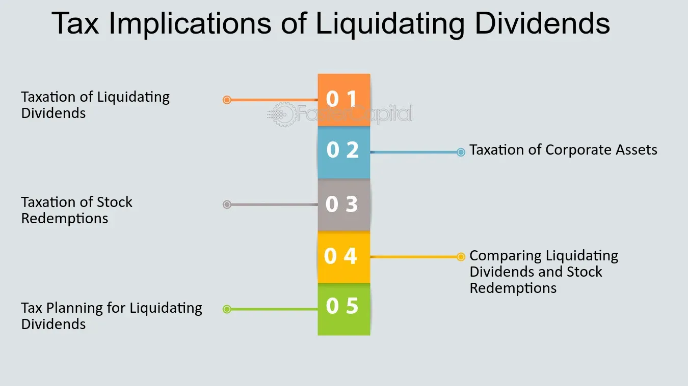

## Table of Contents

## What is a liquidating dividend?

A liquidating dividend is a type of payment that a company makes to its shareholders when it is closing down or selling off its assets. Unlike regular dividends, which come from the company's profits, a liquidating dividend comes from the money the company gets from selling its assets. This means that the company is giving back the shareholders' investment, rather than sharing profits.

When a company decides to liquidate, it might do so because it is going out of business or because it wants to change its business focus. The liquidating dividend is a way to return the remaining value of the company to the shareholders. This can be good for shareholders because they get some of their money back, but it also means the end of their investment in that company.

## How does a liquidating dividend differ from a regular dividend?

A liquidating dividend and a regular dividend are different in where the money comes from and what they mean for the company. A regular dividend is money that a company pays to its shareholders from its profits. It shows that the company is doing well and making money. Shareholders like regular dividends because they get extra money without selling their shares.

On the other hand, a liquidating dividend comes from the money a company gets when it sells its assets. This happens when a company is closing down or changing its business focus. A liquidating dividend means the company is giving back the shareholders' investment, not sharing profits. It's a sign that the company might be ending, which can be good for getting some money back but bad because the investment in the company is over.

## What are the common reasons a company might issue a liquidating dividend?

A company might issue a liquidating dividend when it decides to close down its business. This can happen if the company is not doing well and cannot make enough money to keep going. When a company closes, it sells everything it owns, like buildings, equipment, and other assets. The money from these sales is then given back to the shareholders as a liquidating dividend. This way, shareholders get some of their money back, even though the company is no longer operating.

Another reason for issuing a liquidating dividend is when a company wants to change what it does. Sometimes, a company might decide to stop one part of its business and start doing something new. To do this, it might sell off the parts of the business it no longer wants. The money from these sales can be given to shareholders as a liquidating dividend. This helps the company focus on new things and gives shareholders some money back from the old business.

## How are liquidating dividends taxed for individual shareholders?

When a company gives out a liquidating dividend, it can affect how much tax individual shareholders have to pay. Usually, liquidating dividends are not taxed as regular income like normal dividends. Instead, they are seen as a return of the money shareholders put into the company. This means that shareholders might not have to pay income tax on the liquidating dividend right away. But, they need to adjust the cost basis of their shares. The cost basis is the original amount they paid for the shares. When they get a liquidating dividend, they subtract this amount from their cost basis.

Later, when shareholders sell their shares, they might have to pay capital gains tax. Capital gains tax is based on the difference between what they originally paid for the shares (the adjusted cost basis) and what they sell them for. If the liquidating dividend they received was more than their original cost basis, they might have to pay tax on that extra amount as a capital gain. It's important for shareholders to keep good records of their cost basis and any liquidating dividends they receive, so they can figure out their taxes correctly when they sell their shares.

## What are the tax implications of liquidating dividends for corporate shareholders?

When a company gives a liquidating dividend to another company that owns its shares, the tax rules are a bit different from those for individual shareholders. For corporate shareholders, liquidating dividends are usually treated as a return of capital, similar to how it works for individuals. This means that the corporate shareholder does not have to pay income tax on the dividend right away. Instead, they need to reduce the cost basis of their investment in the company that issued the dividend. The cost basis is the amount the corporate shareholder originally paid for the shares.

Later on, if the corporate shareholder sells the shares, they will have to pay capital gains tax. This tax is based on the difference between what they paid for the shares (after adjusting for the liquidating dividend) and what they sell them for. If the liquidating dividend they received was more than their original cost basis, they might have to pay tax on that extra amount as a capital gain. It's important for corporate shareholders to keep good records of their cost basis and any liquidating dividends they receive, so they can figure out their taxes correctly when they sell their shares.

## Can liquidating dividends affect a company's stock price, and if so, how?

Yes, liquidating dividends can affect a company's stock price. When a company announces it will pay a liquidating dividend, it often means the company is closing down or changing its business focus. This news can make investors worried about the future of the company. Because of this worry, the stock price might go down as people sell their shares to avoid losing money.

On the other hand, the actual payment of the liquidating dividend can sometimes make the stock price go up a little bit. This happens because the dividend gives shareholders some money back from the company's assets. But, this increase is usually small and temporary because the bigger news is that the company is ending or changing its business. So, overall, the announcement of a liquidating dividend often leads to a drop in the stock price.

## What documentation is required for reporting liquidating dividends to tax authorities?

When a company gives a liquidating dividend to its shareholders, it needs to give them a Form 1099-DIV. This form shows how much money the shareholder got from the liquidating dividend. The company needs to send this form to the shareholders and also to the IRS. This helps the IRS know how much money the shareholders received, so they can check if the shareholders are paying the right amount of taxes.

Shareholders also need to keep good records of their own. They should write down how much they paid for their shares at the start, which is called the cost basis. When they get a liquidating dividend, they need to subtract this amount from their cost basis. They should keep the Form 1099-DIV and any other papers that show how much they got. This way, when they sell their shares later, they can figure out if they need to pay capital gains tax and how much.

## How do liquidating dividends impact a company's financial statements?

When a company pays a liquidating dividend, it affects its financial statements in a big way. The company's balance sheet will show a decrease in assets because it is selling off things like buildings and equipment to pay the dividend. At the same time, the company's equity, which is the money that belongs to the shareholders, will also go down. This is because the liquidating dividend is a way of giving back the shareholders' money, so the company's value goes down.

The income statement might not show a direct impact from the liquidating dividend because it is not considered a regular expense or income. However, the sale of assets to fund the dividend could show up as a gain or loss on the income statement, depending on whether the company sold the assets for more or less than what they were worth on the [books](/wiki/algo-trading-books). Overall, the company's financial health looks different after paying a liquidating dividend, showing less money and fewer assets on its financial statements.

## What are the potential legal considerations a company must address before issuing a liquidating dividend?

Before a company can issue a liquidating dividend, it needs to think about some important legal things. First, the company must follow the rules in its own bylaws and any agreements it has with shareholders. These rules might say how the company can pay out money and what it needs to do before it can close down or sell off its assets. The company also needs to make sure it is following the laws of the state where it is based. Some states have special rules about how companies can pay liquidating dividends and what they need to do to protect shareholders.

Another big thing the company needs to consider is telling everyone about the liquidating dividend. The company has to let its shareholders know about the plan to pay a liquidating dividend and give them all the important details. This includes how much money they will get and when they will get it. The company might also need to tell the public and any other people who might be affected, like banks or other companies it works with. This is important to make sure everything is done fairly and openly.

## How might the timing of receiving a liquidating dividend affect an investor's tax strategy?

The timing of receiving a liquidating dividend can change how an investor plans their taxes. If an investor gets a liquidating dividend, they need to adjust the cost basis of their shares. The cost basis is how much they paid for the shares at first. When they get the dividend, they subtract that amount from their cost basis. This is important because when they sell their shares later, they will pay capital gains tax based on the difference between their adjusted cost basis and the sale price. If the investor is close to selling their shares, getting the liquidating dividend might mean they pay more in taxes because their cost basis might be lower than before.

Investors can use the timing of a liquidating dividend to their advantage. If they know they will get a liquidating dividend soon, they might wait to sell their shares until after they get it. This way, they can adjust their cost basis right before selling, which could help them pay less in taxes. But, they need to think about other things too, like if the company's stock price might go down because of the liquidating dividend. Planning around the timing of the dividend can help investors save money on taxes, but they need to look at the whole picture.

## What are the international tax implications of receiving liquidating dividends from a foreign corporation?

When an investor gets a liquidating dividend from a company in another country, they need to think about taxes in both countries. The country where the company is based might take some tax out of the dividend before it is paid. This is called withholding tax. The investor then has to report the dividend on their taxes back home. Depending on where they live and where the company is, they might be able to get some of the foreign tax back as a credit. This means they can use the tax they paid to the foreign country to lower the tax they owe at home.

Different countries have different rules about taxes on liquidating dividends. Some countries have special agreements, called tax treaties, that can change how much tax an investor has to pay. These treaties can help lower the amount of withholding tax or let the investor get more of it back as a credit. It's important for investors to know the tax rules of both the country where the company is and their own country. They might need to talk to a tax expert to make sure they are following all the rules and getting the best tax treatment possible.

## How can shareholders use tax planning strategies to minimize the tax burden from liquidating dividends?

Shareholders can use tax planning to lower the taxes they have to pay on liquidating dividends. One way to do this is by adjusting the cost basis of their shares. When shareholders get a liquidating dividend, they subtract that amount from their original cost basis. This can help them when they sell their shares later because they might pay less in capital gains tax. If they know they will get a liquidating dividend soon, they might wait to sell their shares until after they get it, so they can adjust their cost basis right before selling. This can help them save money on taxes.

Another strategy is to look at the tax rules in different countries if the company paying the dividend is based abroad. Some countries take out a withholding tax on dividends before they are paid. Shareholders can sometimes use this as a foreign tax credit to lower the taxes they owe at home. There might also be tax treaties between countries that can change how much tax shareholders have to pay. By understanding these rules and planning around them, shareholders can reduce their overall tax burden. It's often helpful for shareholders to talk to a tax expert to make sure they are using the best strategies for their situation.

## What is the Tax Treatment of Liquidating Dividends?

The tax treatment of liquidating dividends is inherently more complex than that of regular dividends due to its impact on the shareholder's cost basis in their stock holdings. These dividends are drawn from a company's capital base during the process of liquidation, thus serving as a return of the shareholder's initial capital investment rather than as taxable income. This distinction generally renders liquidating dividends non-taxable, as they initially reduce the shareholder's cost basis in the stock rather than providing immediate taxable income.

Understanding how liquidating dividends work is crucial, particularly when evaluating future capital gains tax obligations. When shareholders receive liquidating dividends, they must adjust their stock's cost basis downward by the amount of the dividend received. Mathematically, this adjustment can be represented as:

$$
\text{Adjusted Cost Basis} = \text{Original Cost Basis} - \text{Liquidating Dividend Received}
$$

If the liquidating distribution exceeds the shareholder's cost basis, the excess portion of the dividend is categorized as a capital gain. This gain can be subject to capital gains tax at the applicable rate, depending on whether it is considered a short-term or long-term capital gain.

Corporations must adhere to specific IRS reporting requirements to ensure compliance. One such requirement is the issuance of Form 1099-DIV to inform shareholders of the distribution and its classification. This form delineates dividends that have been paid, including the total ordinary dividends, qualified dividends, and details about the liquidating distribution.

To effectively manage tax liabilities arising from liquidating dividends, strategic planning and consultation with financial professionals are often necessary. Tax professionals can advise on the timing of receiving dividends, proper cost basis adjustments, and strategies for minimizing tax liabilities. By adopting a strategic approach, shareholders can navigate the intricacies of tax obligations and potentially reduce their taxable gains.

In summary, the taxation of liquidating dividends necessitates a thorough understanding of shareholder cost basis adjustments and IRS compliance. Employing informed strategies can mitigate potential tax liabilities and optimize financial outcomes for shareholders.

## References & Further Reading

[1]: Bergstra, J., Bardenet, R., Bengio, Y., & Kégl, B. (2011). ["Algorithms for Hyper-Parameter Optimization."](https://dl.acm.org/doi/10.5555/2986459.2986743) Advances in Neural Information Processing Systems 24.

[2]: ["Advances in Financial Machine Learning"](https://www.amazon.com/Advances-Financial-Machine-Learning-Marcos/dp/1119482089) by Marcos Lopez de Prado

[3]: ["Evidence-Based Technical Analysis: Applying the Scientific Method and Statistical Inference to Trading Signals"](https://www.amazon.com/Evidence-Based-Technical-Analysis-Scientific-Statistical/dp/0470008741) by David Aronson

[4]: ["Machine Learning for Algorithmic Trading"](https://github.com/stefan-jansen/machine-learning-for-trading) by Stefan Jansen

[5]: ["Quantitative Trading: How to Build Your Own Algorithmic Trading Business"](https://www.amazon.com/Quantitative-Trading-Build-Algorithmic-Business/dp/1119800064) by Ernest P. Chan