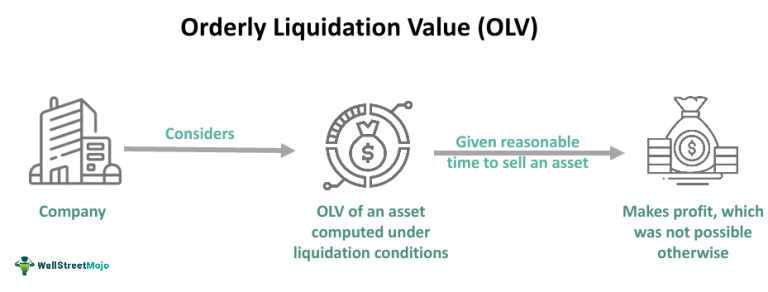

Understanding the dynamics of financial markets is fundamental for both investors and traders. One of the critical concepts in this context is a liquidating market, which has significant implications for financial decision-making. Market liquidation involves the extensive selling of securities, often resulting in downward pressure on asset prices. This phenomenon can be triggered by a range of factors, including economic downturns, financial bubbles bursting, or a significant shift in investor sentiment leading to a sell-off.

Algorithmic trading, often referred to as algo trading, has transformed how these market conditions are managed. Algo trading utilizes computer programs to automatically execute trading orders at high speeds, monitoring market movements and capitalizing on price fluctuations. By employing algorithms, traders can execute strategies more efficiently than is possible manually, particularly in volatile markets prone to rapid liquidation events.

This article provides a comprehensive analysis of financial market liquidation and examines the role algorithmic trading plays in navigating these dynamics. Through historical and contemporary examples, we will illustrate the concepts and strategies involved in market liquidation and explore the mechanisms and impacts of algo trading on market behavior.

## Table of Contents

## Understanding Liquidating Markets

A liquidating market is characterized by a dramatic surge in the selling of securities, leading to a sharp decline in prices. This phenomenon is often triggered by a crisis of confidence among investors, where fear and panic amplify the incentive to sell assets. Such crises frequently accompany financial bubbles—periods marked by excessively inflated asset prices detached from intrinsic values. When these bubbles burst, market participants rush to liquidate their holdings, thus creating a cascade of declining asset prices.

The typical hallmarks of a liquidating market include significant price drops and increased trading volumes as transactions accelerate. The behavioral psychology of investors is crucial in these scenarios. As asset prices begin to fall, a self-perpetuating cycle of fear can develop; investors, fearing further losses, may offload their positions en masse, which in turn exacerbates the downward pressure on prices. This herd behavior, driven by emotion rather than fundamentals, often leads to market overcorrections.

Understanding the dynamics of liquidating markets is essential for investors seeking to identify potential buying opportunities amidst the chaos. Recognizing the signals of market overreaction can provide entry points for purchasing undervalued assets poised for recovery. Historically, episodes of market liquidation have presented savvy investors with opportunities to acquire securities at discounted valuations, positioning themselves for gains as markets stabilize and recover.

Insights into such market dynamics necessitate a grasp of the broader economic indicators and psychological triggers that typically precede market liquidations. This understanding arms investors with the tools to anticipate possible downturns and strategize accordingly, mitigating losses and maximizing potential gains through calculated investment decisions.

## Examples of Market Liquidation

Historical instances of market liquidation serve as fundamental case studies for understanding financial instability and the rapid decline of asset prices. The Stock Market Crash of 1929 is one of the most cited examples of a liquidating market. This event marked the onset of the Great Depression, characterized by a dramatic fall in stock prices, along with a sustained period of economic hardship. During the weeks of October 1929, excessive speculation and leverage led to an unsustainable asset bubble, culminating in panic selling that wiped out billions of dollars in market value.

More recent examples include the financial crisis of 2008, precipitated by the bursting of the housing bubble. This period was marked by a significant decrease in housing prices, leading to a cascading effect on mortgage-backed securities and financial institutions worldwide. The widespread panic selling was exacerbated by fears of institutional collapses, notably Lehman Brothers, triggering a global financial unrest. These instances illustrate how interconnected financial systems can amplify the effects of liquidation across markets.

The 2008 crisis emphasized the role of leverage and inadequate risk management practices in accelerating market liquidation. Mortgage defaults led to a devaluation of securities tied to real estate, prompting investors to liquidate positions to mitigate losses. This panic-induced behavior underscores the importance of maintaining sufficient capital reserves and robust risk management frameworks, especially during market [volatility](/wiki/volatility-trading-strategies).

Analyzing these historic market liquidations offers insights into the psychological and economic triggers that prompt widespread asset sell-offs. Key factors include excessive leverage, irrational exuberance, and systemic risks that become apparent during periods of financial turbulence. These case studies demonstrate how investor psychology can exacerbate market declines, emphasizing the necessity of strategic risk management.

These historical cases also highlight the critical importance of implementing effective risk management strategies. Diversification, hedging, and [liquidity](/wiki/liquidity-risk-premium) reserves are essential tools for maintaining portfolio integrity during market turmoil. Investors and traders learn from these past events to develop robust systems that can withstand potential liquidation pressures. The lessons drawn from these events continue to guide the development of policies and strategies aimed at stabilizing financial markets and preventing future crises.

## Algorithmic Trading in Liquidating Markets

Algorithmic trading, commonly referred to as algo trading, utilizes computer programs to execute pre-defined trading strategies automatically, allowing for high-speed and high-frequency trading that is beyond the capability of human traders. In the context of liquidating markets—characterized by rapid, large-scale selling and resultant price declines—the strategic deployment of algorithms can be particularly advantageous.

In such volatile market conditions, trading algorithms are adept at identifying and capitalizing on swift price movements. Algorithms can be programmed to monitor market data in real-time, spotting trends, inefficiencies, and [arbitrage](/wiki/arbitrage) opportunities as they emerge. For instance, an algorithm might be designed to execute buy orders when it detects a price anomaly or when a security is undervalued compared to its historical data or compared to a similar asset.

Risk management is a crucial aspect of trading in liquidating markets, and algorithms offer distinct advantages. They can rapidly execute trades, thus mitigating risk exposure by preventing the delay inherent in manual trading decisions. This speed allows for the execution of stop-loss orders and other protective measures, reducing potential losses during periods of high market volatility.

Moreover, algorithms employ various strategies to operate effectively in turbulent environments. One such strategy is arbitrage, which exploits price discrepancies of similar assets across different markets or forms of the same security. In a liquidating market, where price dislocations are frequent due to rapid selling, algos can swiftly execute trades to capitalize on these gaps before they close.

The influence of [algorithmic trading](/wiki/algorithmic-trading) on market stability and efficiency is a subject of ongoing research and debate. While algorithms contribute to market efficiency by increasing liquidity and narrowing bid-ask spreads, they can also exacerbate volatility if a large number of orders are placed simultaneously, a phenomenon known as a "flash crash." This dual effect raises important questions about the balance between technological advancement and market regulation, as regulators aim to harness the benefits of algorithmic trading without compromising market integrity.

In summary, algorithmic trading offers powerful tools for navigating the complexities of liquidating markets. By leveraging the speed and precision of computer programs, traders can not only manage risk more effectively but also exploit opportunities that would be impractical through manual trading. As research continues, the role of algo trading in maintaining market stability and its regulatory implications remains a critical area for exploration.

## Financial Strategies for Handling Liquidation Risk

Investors and traders utilize various strategies to mitigate the risks associated with market liquidation, a situation characterized by widespread selling and declining market prices. Diversification plays a vital role in managing exposure during such volatile events. By spreading investments across different asset classes, sectors, or geographies, investors can reduce the impact of a single asset’s poor performance on their overall portfolio. The fundamental principle is based on the fact that not all asset classes react to market stimuli in the same manner, allowing for a balance between risk and reward.

Stop-loss orders are another crucial tool in safeguarding investments during liquidation phases. A stop-loss order automatically triggers the sale of securities when they reach a predetermined price, limiting potential losses without the need for constant monitoring. This method is especially beneficial in fast-moving markets where manual intervention might be delayed.

Furthermore, algorithmic trading systems are increasingly employed to gain an advantage during market liquidations. These systems can analyze vast amounts of data and execute trades with remarkable speed and precision, attributes that are essential in swiftly moving markets. Algos are capable of implementing complex strategies such as arbitrage or [trend following](/wiki/trend-following), enabling traders to seize opportunities that human traders might miss.

Staying informed is also a critical element in managing liquidation risk. This involves keeping abreast of market trends, economic indicators, and geopolitical events that might influence market behavior. Access to real-time information and news can provide traders with the insights needed to adjust their strategies promptly and make informed decisions.

Finally, adaptability is key in navigating liquidating markets effectively. Traders and investors must be prepared to revise their strategies to align with evolving market conditions. This flexibility, combined with the strategic use of technology and risk management tools, equips market participants to handle the challenges and capitalize on the opportunities presented by liquidating markets.

## Conclusion

The phenomenon of market liquidation presents both challenges and opportunities for investors and traders. In such turbulent conditions, algorithmic trading has emerged as an essential tool, offering the ability to manage and exploit rapid market changes. By automating trade execution, algos can react with unparalleled speed and precision, capitalizing on fleeting market inefficiencies and helping to stabilize unpredictable trading environments.

Understanding the underlying causes and mechanisms of market liquidation is fundamental to making informed investment decisions. Factors such as panic selling, economic bubbles, and financial crises can trigger widespread liquidation, leading to sharp declines in asset values. Recognizing these triggers allows market participants to anticipate potential risks and identify opportunities for strategic entry or [exit](/wiki/exit-strategy) from positions.

The dynamic nature of financial markets necessitates continuous learning and adaptation. Investors and traders who stay informed and agile are better equipped to handle the volatility that accompanies market liquidation events. Embracing technological advancements and integrating them into strategic planning can provide a competitive edge. This proactive approach ensures that market participants can not only mitigate risks but also seize profitable opportunities amid the challenges posed by liquidating markets.

## References & Further Reading

[1]: Chaboud, A. P., Chiquoine, B., Hjalmarsson, E., & Vega, C. (2014). ["Rise of the Machines: Algorithmic Trading in the Foreign Exchange Market."](https://www.jstor.org/stable/43612951) FRB International Finance Discussion Paper No. 989.

[2]: Aitken, M., & Harris, F. H. de B. (2005). ["Market Microstructure and Market Integrity: Insights from Regulatory Data."](https://www.semanticscholar.org/paper/Market-Fairness%3A-The-Poor-Country-Cousin-of-Market-Aitken-Aspris/caab4ae8f0d17bd4af6b50cbedad4713bf90637b) Journal of Applied Finance, 15(2), 1-24.

[3]: Aldridge, I. (2010). ["High-Frequency Trading: A Practical Guide to Algorithmic Strategies and Trading Systems."](https://onlinelibrary.wiley.com/doi/pdf/10.1002/9781119203803.fmatter) John Wiley & Sons.

[4]: Hull, J. C. (2015). ["Options, Futures, and Other Derivatives."](https://books.google.com/books/about/Options_Futures_and_Other_Derivatives.html?id=t6CSAgAAQBAJ) 9th Edition. Pearson.

[5]: Shiller, R. J. (2000). ["Irrational Exuberance."](https://press.princeton.edu/books/paperback/9780691173122/irrational-exuberance) Princeton University Press.