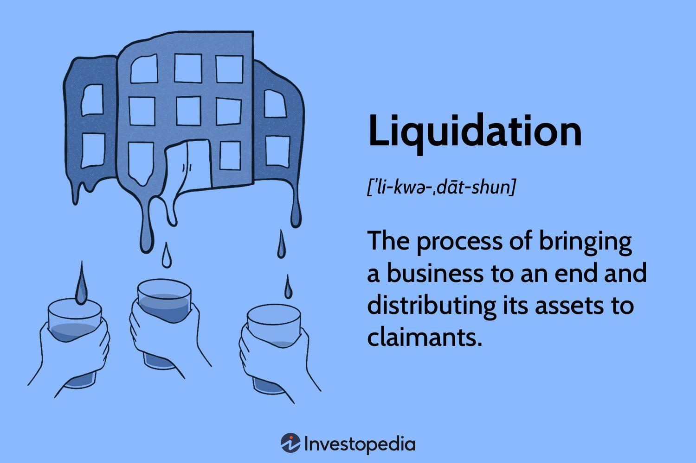

## Table of Contents

## What is a liquidating market?

A liquidating market is when a lot of people are selling their investments, like stocks or bonds, and not many people are buying them. This usually happens when people are worried about the economy or the market, so they want to turn their investments into cash quickly.

When this happens, the prices of these investments can go down a lot because there are more sellers than buyers. It can be a tough time for investors because they might have to sell their investments for less money than they wanted.

## How does a liquidating market differ from a regular market?

In a regular market, there's a balance between people buying and selling investments. Prices go up and down based on what people think the investments are worth. People feel okay about buying and selling because they think the market will stay pretty stable. This means they can wait for a good price before they sell or buy.

In a liquidating market, things are different. A lot more people want to sell their investments than want to buy them. This happens because people are worried and want to get their money out of the market fast. Because so many people are selling, the prices of investments drop a lot. It's a stressful time because people might have to sell their investments for much less than they hoped.

## What are the common causes of a liquidating market?

A liquidating market often happens when people get scared about their money. This fear can come from big problems in the economy, like a recession or a financial crisis. When people hear about these problems, they worry that their investments might lose value, so they rush to sell them and get their money back. This rush to sell can also happen if there's a lot of bad news about companies or the economy, making people think that things will get worse.

Another reason for a liquidating market is when people need money quickly. This can happen if they lose their jobs or if they have big bills to pay. When a lot of people need cash at the same time, they start selling their investments, even if it means selling them for less than they're worth. This need for quick cash can lead to a lot of selling and not much buying, which pushes prices down and creates a liquidating market.

## What are the signs that a market is entering a liquidation phase?

You can tell a market is starting to liquidate when you see a lot more people selling their investments than buying them. The prices of stocks, bonds, or other things people invest in start to drop quickly. This happens because when everyone wants to sell at the same time, there aren't enough buyers to keep the prices up. You might also see the news talking a lot about people being worried about the economy or big companies having problems.

Another sign is when the trading [volume](/wiki/volume-trading-strategy) goes up a lot. This means that a lot more trades are happening than usual, and most of these trades are people selling. If you see that the market is getting more and more trades but the prices are going down, it's a good hint that people are trying to get out of their investments fast. This rush to sell can make the market feel unstable and can lead to even more selling as people get more worried.

## How do liquidating markets affect investors?

When a market turns into a liquidating market, it can be tough for investors. They might see the value of their investments drop a lot because so many people are selling and not many are buying. This can make investors worried and scared, especially if they need to sell their investments to get cash. They might have to sell for much less than what they paid or what they hoped to get, which can hurt their savings or plans.

On the other hand, some investors might see a liquidating market as a chance to buy things at lower prices. If they believe the market will get better later, they might buy investments when prices are low and hope to sell them for more money later. But this can be risky because no one knows for sure when the market will stop going down and start going up again. So, while some investors might lose money, others might see it as a time to make smart buys if they are willing to take the risk.

## What strategies can investors use to navigate a liquidating market?

When a market is liquidating, one good strategy for investors is to stay calm and not make quick decisions. It can be scary to see prices dropping fast, but selling in a panic can make things worse. Instead, investors should think about their long-term goals. If they don't need the money right away, it might be better to wait out the rough times. Sometimes, markets recover, and waiting can help investors avoid selling at a low price.

Another strategy is to look for good deals. When prices are low because everyone is selling, it can be a chance to buy investments at a discount. Investors who believe the market will get better might want to buy things they think are worth more than their current price. But this is risky because no one knows when the market will turn around. So, investors should only buy if they are okay with the risk and can afford to wait for the market to recover.

Lastly, having a diverse portfolio can help. This means not putting all money into one kind of investment. If one part of the market is doing badly, other parts might still be doing okay. By spreading money around, investors can protect themselves a bit from the ups and downs of a liquidating market. It's like not putting all eggs in one basket, which can make things less risky during tough times.

## Can a liquidating market lead to opportunities for investors?

Yes, a liquidating market can lead to opportunities for investors. When a lot of people are selling and prices are going down, it can be a good time to buy things at a lower price. If an investor believes that the market will get better in the future, they can buy investments now and hope to sell them for more money later. This is like shopping during a big sale, where you can get good deals if you're willing to wait for things to get better.

But, it's important to be careful. Buying during a liquidating market is risky because no one knows when the market will stop going down and start going up again. Investors need to be ready to wait and not need the money right away. If they can do that, and if they pick good investments, a liquidating market can be a chance to make money in the long run.

## How do regulatory bodies respond to liquidating markets?

When a market starts liquidating, regulatory bodies like the government or financial watchdogs step in to try to calm things down. They might put rules in place to stop the market from getting too crazy. For example, they might make it harder for people to sell too much at once, which can help slow down the rush to sell and keep prices from dropping too fast. They might also talk to the public to explain what's happening and tell people not to panic, because panic can make the problem worse.

Sometimes, these groups also work to fix the bigger problems causing the liquidating market. If the economy is in trouble, they might change laws or give money to help businesses and people. This can make people feel safer about keeping their money in the market instead of selling everything. By doing these things, regulatory bodies try to stop the liquidating market from getting out of control and help the market start to recover.

## What historical examples illustrate the impact of a liquidating market?

One big example of a liquidating market happened in 1929, which led to the Great Depression. People were scared about the economy and started selling their stocks really fast. This made the stock market crash, and a lot of people lost their money. Because everyone was selling and not buying, prices kept going down, and it took years for the market to start getting better. This shows how a liquidating market can hurt a lot of people and make the economy go through tough times.

Another example is the 2008 financial crisis. It started when people realized that a lot of houses were worth less than what people paid for them. Banks had given out loans for these houses, and when people couldn't pay back the loans, the banks got into trouble. This made everyone scared, and they started selling their investments to get cash. The market turned into a liquidating market, with prices dropping fast. Governments and banks had to step in to try to fix things, but it took a long time for the market to recover. This shows how a liquidating market can spread from one problem, like houses, to the whole economy.

## How can financial models predict the onset of a liquidating market?

Financial models can predict the onset of a liquidating market by looking at a lot of data and finding patterns. These models pay attention to things like how many people are selling their investments compared to how many are buying them. If a lot more people are selling than usual, it might mean a liquidating market is coming. They also look at how fast prices are going down and how much trading is happening. If prices are dropping quickly and there's a lot more trading than normal, it's a sign that people might be getting scared and trying to sell their investments fast.

Another way financial models predict a liquidating market is by looking at the overall mood of the market. They use special numbers called sentiment indicators to see if people are feeling worried or hopeful about the economy. If these indicators show that people are really worried, it could mean that a liquidating market is on the way. By putting all this information together, financial models can give investors a heads-up that the market might start liquidating soon. This helps investors be ready and make smart choices about their money.

## What are the long-term economic effects of a liquidating market?

A liquidating market can have big effects on the economy that last a long time. When a lot of people sell their investments and prices go down, it can make businesses lose money. If businesses are losing money, they might have to let people go or stop growing. This can lead to more people being out of work, which means they have less money to spend. When people spend less, it can slow down the whole economy, making it harder for everyone to get back on their feet. This can start a cycle where the economy keeps getting worse until something changes.

Over time, a liquidating market can also make people lose trust in the market. When they see their investments lose value, they might decide not to invest anymore. This can make it harder for businesses to get the money they need to grow, which can slow down the economy even more. But, if the government and other groups step in to help fix things, the economy can start to recover. It might take a while, but with the right help and time, the market can start to get better, and people can start to trust it again.

## How do global economic factors influence the development of a liquidating market?

Global economic factors can make a liquidating market happen. When big countries have problems with their economy, like a recession or a crisis, it can scare people all over the world. If people in one country start selling their investments because they're worried, it can make people in other countries worried too. They might start selling their own investments, which can make the prices go down everywhere. This is like how a cold can spread from one person to another; economic problems can spread from one country to another and make a liquidating market.

Also, things like trade wars or big changes in how much money countries have can make a liquidating market more likely. If countries can't sell their stuff to other countries because of trade problems, their businesses might lose money. When businesses lose money, people might get scared and start selling their investments to get cash. Changes in how much money countries have, like if the value of their money goes down a lot, can also make people worried and lead to a lot of selling. All these global factors can come together to push the market into a liquidating phase.

## References & Further Reading

[1]: Chaboud, A. P., Chiquoine, B., Hjalmarsson, E., & Vega, C. (2014). ["Rise of the Machines: Algorithmic Trading in the Foreign Exchange Market."](https://www.jstor.org/stable/43612951) FRB International Finance Discussion Paper No. 989.

[2]: Aitken, M., & Harris, F. H. de B. (2005). ["Market Microstructure and Market Integrity: Insights from Regulatory Data."](https://www.semanticscholar.org/paper/Market-Fairness%3A-The-Poor-Country-Cousin-of-Market-Aitken-Aspris/caab4ae8f0d17bd4af6b50cbedad4713bf90637b) Journal of Applied Finance, 15(2), 1-24.

[3]: Aldridge, I. (2010). ["High-Frequency Trading: A Practical Guide to Algorithmic Strategies and Trading Systems."](https://onlinelibrary.wiley.com/doi/pdf/10.1002/9781119203803.fmatter) John Wiley & Sons.

[4]: Hull, J. C. (2015). ["Options, Futures, and Other Derivatives."](https://books.google.com/books/about/Options_Futures_and_Other_Derivatives.html?id=t6CSAgAAQBAJ) 9th Edition. Pearson.

[5]: Shiller, R. J. (2000). ["Irrational Exuberance."](https://press.princeton.edu/books/paperback/9780691173122/irrational-exuberance) Princeton University Press.