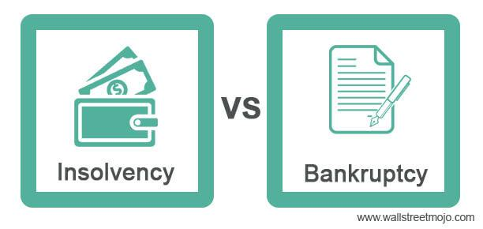

## Table of Contents

## What is liquidation in bankruptcy?

Liquidation in bankruptcy is when a business or person can't pay their debts, so they sell off their assets to pay back what they owe. This process is also called Chapter 7 bankruptcy. A court-appointed trustee takes control of the assets, sells them, and uses the money to pay off the creditors. Any remaining debt that can't be paid off might be discharged, meaning the person or business no longer has to pay it.

Liquidation is different from other types of bankruptcy, like reorganization, where the business tries to keep operating while making a plan to pay back debts. In liquidation, the main goal is to sell everything to pay creditors as much as possible. This can be a difficult process because it often means the end of the business, and it can take time to sell all the assets and figure out who gets paid what.

## How does the liquidation process work?

When a business or person can't pay their debts, they might choose to go through liquidation, which is also called Chapter 7 bankruptcy. To start, they file a bankruptcy petition in court. A trustee is then appointed by the court to take control of all the assets. The trustee's job is to figure out what the assets are worth and sell them. This can include things like property, equipment, or inventory. The money from these sales is used to pay back the people or companies that the business or person owes money to, which are called creditors.

Once the assets are sold, the trustee follows a specific order to pay the creditors. Some debts, like taxes or employee wages, have to be paid first. After those are paid, any remaining money goes to other creditors. If there's not enough money to pay everyone back, the remaining debts might be discharged, meaning the person or business no longer has to pay them. The whole process can take several months or even longer, depending on how complicated it is to sell the assets and sort out who gets paid what. At the end of liquidation, the business usually closes down, and the person or business gets a fresh start, free from the debts that were discharged.

## What are the different types of bankruptcy that involve liquidation?

There are mainly two types of bankruptcy that involve liquidation: Chapter 7 and Chapter 11. Chapter 7 bankruptcy is the most common type where a person or business can't pay their debts. In Chapter 7, a court-appointed trustee takes control of the assets, sells them, and uses the money to pay off the creditors. If there's not enough money to pay everyone back, some debts might be forgiven, and the person or business gets a fresh start.

Chapter 11 bankruptcy is usually used by businesses, and it can involve liquidation, but it's more about reorganizing the business to keep it running while paying back debts. Sometimes, though, if reorganization doesn't work out, the business might have to liquidate its assets to pay creditors. This type of bankruptcy is more complex and can take longer than Chapter 7 because it involves trying to save the business first before deciding to liquidate.

## Who can file for liquidation bankruptcy?

Anyone who can't pay their debts can file for liquidation bankruptcy, which is called Chapter 7. This includes people, businesses, and even married couples. To file, they need to show the court that they don't have enough money to pay what they owe. They also need to take a credit counseling [course](/wiki/best-algorithmic-trading-courses) before they can file. If they meet these requirements, they can start the process of selling their assets to pay back their creditors.

Businesses can also file for Chapter 11 bankruptcy, which can lead to liquidation if reorganizing the business doesn't work out. Chapter 11 is more complicated and is usually used by businesses that want to keep running while they figure out how to pay their debts. If they can't make it work, they might have to sell their assets to pay back what they owe. Both Chapter 7 and Chapter 11 give people and businesses a way to deal with their debts when they can't pay them on their own.

## What assets are typically liquidated during bankruptcy?

When someone files for bankruptcy, they usually have to sell things they own to pay back what they owe. These things are called assets. For people, these can be things like their house, car, jewelry, or money in the bank. For businesses, assets can include buildings, machines, inventory, and money. The court decides which assets can be sold, and sometimes some things are protected and don't have to be sold.

The goal is to turn these assets into money to pay back the people or companies that the person or business owes money to. If the assets are worth a lot, more money can be used to pay back the debts. But if the assets aren't worth much, there might not be enough money to pay everyone back. After the assets are sold, the money goes to pay the debts in a specific order, starting with things like taxes and employee wages. If there's any money left after that, it goes to other debts. If there's still not enough money, some debts might be forgiven.

## How are the proceeds from liquidated assets distributed?

When someone goes through liquidation bankruptcy, the money they get from selling their stuff is used to pay back the people they owe money to. This money is called proceeds. The court decides who gets paid first, and it usually starts with important debts like taxes and money owed to employees. These are called priority debts. The court makes sure these debts get paid before any other debts.

After the priority debts are paid, any money left over goes to other debts, like credit card bills or loans. These are called general unsecured debts. If there's not enough money to pay everyone back, some of these debts might be forgiven, which means the person doesn't have to pay them anymore. The whole process is about making sure the money from selling the stuff is used fairly to pay back as many debts as possible.

## What is the role of a trustee in liquidation bankruptcy?

In liquidation bankruptcy, a trustee is a person chosen by the court to help with the process. The trustee's main job is to take control of the stuff that the person or business owns, which are called assets. The trustee figures out what these assets are worth and then sells them. The money from these sales is used to pay back the people or companies that the person or business owes money to, called creditors.

The trustee also makes sure that the money from selling the assets is given out fairly. They follow a special order set by the court to decide who gets paid first. Some debts, like taxes or money owed to employees, have to be paid before others. If there's any money left after paying these important debts, the trustee uses it to pay other debts. If there's not enough money to pay everyone back, the trustee helps decide which debts can be forgiven, so the person or business doesn't have to pay them anymore.

## How long does the liquidation process usually take?

The liquidation process in bankruptcy can take different amounts of time, usually between a few months to a year or more. It depends on things like how many assets there are and how easy or hard it is to sell them. The court also needs time to figure out who gets paid first and how to share the money from the sales.

Sometimes, if the person or business has a lot of stuff to sell or if there are complicated debts, the process can take longer. The trustee, who is in charge of selling the assets and paying the creditors, works to make things go as smoothly and quickly as possible. But the whole thing can be slow because it's important to do it right and make sure everyone gets treated fairly.

## What are the consequences of liquidation for a debtor?

When someone goes through liquidation bankruptcy, it means they can't pay their debts, so they have to sell their stuff to pay back what they owe. This can be hard because they might have to give up things like their house, car, or other important belongings. It can also hurt their credit score, making it harder to borrow money or get a loan in the future. People might see them as a bigger risk because they filed for bankruptcy, which can affect their ability to rent a place to live or even get a job.

On the other hand, liquidation can give the person a fresh start. After the process is over, any debts that couldn't be paid off might be forgiven, which means the person doesn't have to pay them anymore. This can help them move on and start rebuilding their financial life without the burden of old debts. While it's tough to go through, liquidation can be a way to get out from under a lot of debt and begin again.

## How can a business avoid liquidation during bankruptcy?

A business can try to avoid liquidation by filing for Chapter 11 bankruptcy instead of Chapter 7. Chapter 11 is about reorganizing the business to keep it running while figuring out how to pay back the debts. The business makes a plan to pay creditors over time, and if the court agrees with the plan, the business can keep going. This way, the business doesn't have to sell everything right away and can try to get back on its feet.

It's not easy to avoid liquidation, though. The business has to show the court that it can make enough money to pay back its debts. Sometimes, the business might need to close some locations, cut costs, or change how it works to make the plan work. If the business can't make the plan work, it might still have to go through liquidation. But if it can, Chapter 11 gives the business a chance to survive and keep operating.

## What are the tax implications of liquidating assets in bankruptcy?

When a business or person goes through liquidation in bankruptcy, they have to think about taxes. Selling assets can mean they have to pay capital gains tax if the assets are sold for more than what they were bought for. But, there might be some tax breaks or ways to lower the tax bill because of the bankruptcy. It's important to talk to a tax expert to understand all the tax rules and how they apply to the specific situation.

Also, any debts that are forgiven in bankruptcy might be considered income by the tax people, which could mean more taxes to pay. But there are rules that can help with this, like the insolvency exception, which says if someone owes more than they own, they might not have to pay taxes on the forgiven debt. It's a good idea to get help from a tax professional to make sure everything is done right and to find out about any tax relief that might be available.

## What are the international variations of liquidation in bankruptcy?

Liquidation in bankruptcy can be different in different countries. In the United States, it's called Chapter 7 bankruptcy, where a person or business sells their stuff to pay back debts. In the United Kingdom, it's called compulsory liquidation, where a court can order a business to be liquidated if it can't pay its debts. In Australia, it's known as voluntary administration, where a business can choose to go through a process to try to save itself, but might end up liquidating if it can't be saved. Each country has its own rules about how the process works and who gets paid first.

Even though the names and some details are different, the main idea is the same: when a business or person can't pay their debts, they sell their things to try to pay back what they owe. In some places, like Canada, it's called bankruptcy and insolvency, and there's a special order for paying creditors, starting with important debts like taxes and employee wages. In other places, like Germany, it's called insolvency proceedings, and the process can take a long time because it involves a lot of steps to make sure everything is done fairly. No matter where it happens, liquidation in bankruptcy is a tough process that can mean the end of a business or a big change for a person's finances.

## References & Further Reading

[1]: Bergstra, J., Bardenet, R., Bengio, Y., & Kégl, B. (2011). ["Algorithms for Hyper-Parameter Optimization."](https://papers.nips.cc/paper/4443-algorithms-for-hyper-parameter-optimization) Advances in Neural Information Processing Systems 24.

[2]: ["Advances in Financial Machine Learning"](https://www.amazon.com/Advances-Financial-Machine-Learning-Marcos/dp/1119482089) by Marcos Lopez de Prado

[3]: ["Evidence-Based Technical Analysis: Applying the Scientific Method and Statistical Inference to Trading Signals"](https://www.amazon.com/Evidence-Based-Technical-Analysis-Scientific-Statistical/dp/0470008741) by David Aronson

[4]: ["Machine Learning for Algorithmic Trading"](https://github.com/stefan-jansen/machine-learning-for-trading) by Stefan Jansen

[5]: ["Quantitative Trading: How to Build Your Own Algorithmic Trading Business"](https://books.google.com/books/about/Quantitative_Trading.html?id=j70yEAAAQBAJ) by Ernest P. Chan