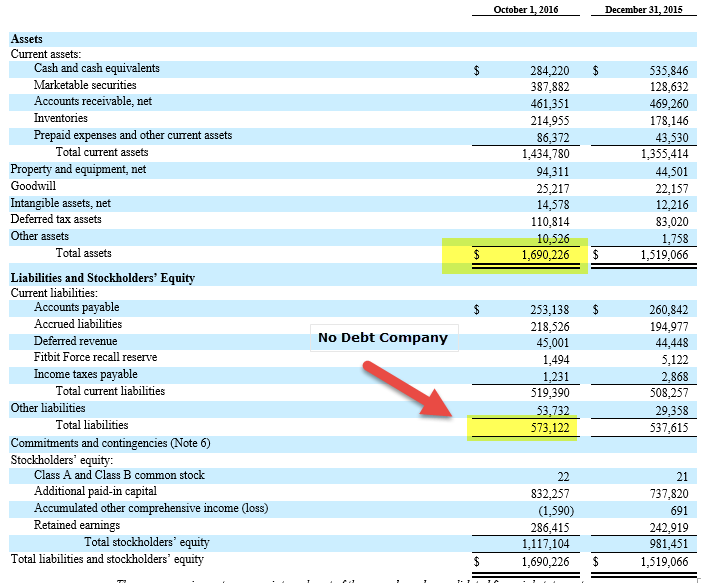

## Table of Contents

## What is a liquidation level?

A liquidation level is the point at which a trader's position in the market is automatically closed to prevent further losses. This happens when the trader does not have enough money in their account to cover potential losses, and it is a safety measure used by trading platforms to protect both the trader and the platform.

When a trader uses borrowed money, or leverage, to make trades, they need to maintain a certain amount of money in their account, called the margin. If the market moves against the trader and the value of their account falls below the required margin, the trading platform will liquidate, or sell, the trader's position to recover the borrowed money. This helps prevent the trader from owing more money than they can afford to lose.

## Why is the liquidation level important in trading?

The liquidation level is important in trading because it helps keep traders safe from losing too much money. When traders use borrowed money to make bigger trades, they need to keep a certain amount of money in their account. This is called the margin. If the price of what they are trading goes down a lot, their account might not have enough money to cover the borrowed amount. The liquidation level is the point where the trading platform will automatically close the trade to stop the losses from getting worse.

Understanding the liquidation level also helps traders plan their trades better. By knowing at what point their position will be closed, traders can decide how much risk they are willing to take. This can help them avoid getting into trades that might lead to big losses. It's like having a safety net that makes sure traders don't lose more than they can afford, which is really important for keeping trading safe and fair for everyone.

## How is the liquidation level calculated?

The liquidation level is calculated based on the amount of money a trader has in their account and the amount of money they have borrowed to make trades. This borrowed money is called leverage. When a trader uses leverage, they need to keep a certain amount of money in their account, called the margin. The liquidation level is the point where the money in the account, plus any unrealized profits or losses, falls below the required margin. At this point, the trading platform will automatically close the trader's position to prevent further losses.

For example, if a trader has $1,000 in their account and borrows $5,000 to make a trade, they might need to maintain a margin of $600. If the trade starts losing money and the account balance drops to $400, the unrealized loss would be $600 ($1,000 initial balance - $400 current balance). If the total value of the account, including the unrealized loss, goes below the required margin of $600, the position would be liquidated. This helps ensure that the trader does not owe more money than they can afford to lose.

## What factors can affect the liquidation level?

The liquidation level can change because of different things. One big thing is how much money a trader has in their account. If a trader adds more money, the liquidation level might go up because they have more money to cover losses. On the other hand, if they take money out, the liquidation level could go down because there's less money to cover losses.

Another thing that can change the liquidation level is how much the trader is borrowing to make trades. If a trader borrows more money, or uses more leverage, the liquidation level might go down. This is because they need to keep more money in their account to cover the bigger loan. If the trader uses less leverage, the liquidation level might go up because they need less money to cover a smaller loan.

The price of what the trader is buying or selling can also affect the liquidation level. If the price goes down a lot, the trader's account might lose value quickly, and the liquidation level could be reached sooner. If the price goes up, the account value might increase, pushing the liquidation level further away. So, keeping an eye on the market and understanding how these factors work together is important for traders.

## Can you explain the difference between liquidation level and margin call?

A liquidation level is the point where a trading platform will automatically close a trader's position to stop them from losing more money. This happens when the money in the trader's account, plus any unrealized profits or losses, falls below the required amount, called the margin. The trading platform does this to make sure the trader doesn't owe more money than they can afford to lose. It's like a safety net that protects both the trader and the platform from big losses.

A margin call is different. It's a warning from the trading platform that the money in the trader's account is getting low and they need to add more money to keep their position open. If the trader doesn't add more money quickly, their position might be closed, but this is not automatic like a liquidation. A margin call gives the trader a chance to fix the problem before it gets worse. So, while both are about managing risk, a liquidation level is the point where the platform takes action, and a margin call is a warning that action might be needed soon.

## What happens when a trader reaches their liquidation level?

When a trader reaches their liquidation level, their trading position is automatically closed by the trading platform. This means the platform sells whatever the trader was buying or selling to stop them from losing more money. It happens because the money in the trader's account, plus any unrealized profits or losses, has fallen below the required margin. The platform does this to make sure the trader doesn't owe more money than they can afford to lose.

After the position is closed, the trader's account will be updated to reflect any losses or gains from the trade. If the trader was using borrowed money, or leverage, the platform will use the money from the closed position to pay back the loan. If there's any money left after paying back the loan, it will stay in the trader's account. If the trader still owes money after the position is closed, they might need to pay it back to the platform.

## How can traders manage their risk to avoid hitting the liquidation level?

Traders can manage their risk to avoid hitting the liquidation level by keeping a close eye on their account balance and the amount of money they are borrowing. If they see that their account balance is getting close to the required margin, they can add more money to their account. This helps make sure they have enough money to cover any losses and keeps their position safe from being automatically closed. Another way to manage risk is by using less borrowed money, or leverage. When traders use less leverage, they need less money in their account to keep their position open, which can help them stay further away from the liquidation level.

It's also important for traders to set stop-loss orders. A stop-loss order is like a safety net that automatically closes a trade if the price goes down to a certain level. This can help limit losses and keep the account balance from dropping too low. Traders should also keep an eye on the market and be ready to close their positions if the market starts moving against them. By being careful and planning ahead, traders can better manage their risk and avoid hitting the liquidation level.

## What are the best practices for setting a liquidation level?

Setting a good liquidation level starts with understanding how much money you have in your account and how much you are borrowing to make trades. It's important to keep enough money in your account to cover any losses, so you don't get too close to the liquidation level. One way to do this is by not borrowing too much money. When you use less borrowed money, you need less money in your account to keep your trades open, which can help keep you further away from the liquidation level. Also, make sure to keep an eye on your account balance and add more money if it starts to get low.

Another good practice is to set stop-loss orders. A stop-loss order is like a safety net that automatically closes your trade if the price goes down too much. This can help limit your losses and keep your account balance from dropping too low. It's also a good idea to watch the market closely and be ready to close your trades if the market starts moving against you. By being careful and planning ahead, you can set a liquidation level that helps you manage your risk and avoid losing too much money.

## How does leverage impact the liquidation level?

Leverage is like borrowing money to make bigger trades. When you use leverage, you need to keep a certain amount of money in your account, called the margin. The more leverage you use, the more money you need to keep in your account. This means that if you use a lot of leverage, your liquidation level can be closer because you need more money to cover the bigger loan. If the market moves against you, your account balance can drop faster, and you might hit the liquidation level sooner.

To manage this, it's important to use leverage carefully. If you use less leverage, you need less money in your account to keep your trades open, which can help keep you further away from the liquidation level. By choosing the right amount of leverage for your account, you can make sure you have enough money to cover any losses and avoid getting your position automatically closed.

## Can the liquidation level be adjusted after a position is opened?

Yes, the liquidation level can be adjusted after a position is opened, but it depends on how the trading platform works. If you add more money to your account, the liquidation level might go up because you have more money to cover losses. If you take money out of your account, the liquidation level could go down because there's less money to cover losses. Also, if you change the amount of money you're borrowing to make trades, that can change the liquidation level too. Using less borrowed money, or leverage, can push the liquidation level further away because you need less money in your account to keep your trades open.

It's important to keep an eye on your account and make changes if needed to stay away from the liquidation level. If the market is moving against you, you might want to add more money to your account or close some of your trades to avoid hitting the liquidation level. By being careful and making smart choices about how much money to borrow and how much to keep in your account, you can manage your risk better and keep your trades safe.

## What are the differences in liquidation levels across various trading platforms?

Different trading platforms might have different rules for setting the liquidation level. Some platforms might need you to keep more money in your account to cover losses, which means the liquidation level could be closer. Other platforms might let you use more borrowed money, or leverage, which can also make the liquidation level closer because you need more money to keep your trades open. It's important to understand the rules of the platform you are using so you know how close you are to the liquidation level and can manage your risk better.

Also, some platforms might give you more time to add money to your account if you get close to the liquidation level, while others might close your position right away. This can make a big difference in how you manage your trades. By knowing how each platform works, you can choose the one that fits your trading style and helps you avoid hitting the liquidation level.

## How do advanced trading strategies utilize the concept of liquidation levels?

Advanced trading strategies often use the concept of liquidation levels to manage risk and make smart decisions. Traders who use these strategies know that the liquidation level is the point where their position will be automatically closed if they don't have enough money in their account. By understanding this, they can plan their trades to stay far away from this point. For example, they might use less borrowed money, or leverage, so they need less money in their account to keep their trades open. This helps them avoid getting too close to the liquidation level and losing money.

Some traders also use stop-loss orders to help them stay away from the liquidation level. A stop-loss order is like a safety net that automatically closes a trade if the price goes down too much. This can help limit losses and keep the account balance from dropping too low. By setting these orders at the right levels, traders can protect their money and keep their trades safe. Understanding and using the concept of liquidation levels in these ways can help traders make better decisions and manage their risk more effectively.

## What is the key to understanding financial market risks?

Financial markets are characterized by their inherent volatility, which presents traders with a variety of risks that need careful management. Among the most significant of these are market risk, credit risk, and liquidity risk. 

Market risk, or systematic risk, relates to the potential loss due to movements in market prices. This type of risk affects the entire market and cannot be entirely diversified away. It includes risks associated with price fluctuations, interest rates, and foreign exchange rates. Traders must navigate this risk through strategic decision-making and market analysis.

Credit risk arises when a counterparty fails to fulfill its contractual obligations, potentially leading to financial losses. This risk is particularly relevant in derivatives and bond markets, where the failure of one party to deliver can have severe repercussions. Traders can mitigate credit risk by conducting thorough due diligence on counterparties and employing credit rating assessments as a guide.

Liquidity risk emerges when a trader is unable to execute a transaction at the desired price due to insufficient market [liquidity](/wiki/liquidity-risk-premium). This can lead to significant losses, especially in rapidly moving markets where the ability to quickly buy or sell assets is crucial. Managing liquidity risk involves maintaining an awareness of market depth and employing strategies, such as staggered order placements, to prevent market disruption.

Leverage is a key [factor](/wiki/factor-investing) that can amplify these risks. While it offers the potential for higher returns by allowing traders to control a larger position with a smaller amount of capital, it also increases the potential for significant losses. The formula for leverage is:

$$
\text{Leverage} = \frac{\text{Total Exposure}}{\text{Equity Capital}}
$$

High leverage can lead to a situation where even small market movements result in substantial financial impact, underscoring the need for cautious leverage management.

Risk management tools play a pivotal role in mitigating these risks. Stop-loss orders, for instance, are designed to automatically trigger a sale when an asset reaches a predetermined price, thus limiting potential losses. Diversification, another major risk management strategy, involves spreading investments across various asset classes to reduce exposure to any single asset's [volatility](/wiki/volatility-trading-strategies). This not only helps in minimizing risks but also enhances portfolio stability.

By comprehending and strategically managing these fundamental financial market risks, traders can fortify their trading strategies against the inherent unpredictability of financial markets, thereby enhancing their potential for achieving sustainable trading success.

## What is Mathematical Representation?

The equity in a trader's account changes with market fluctuations and can be mathematically expressed as:

$$

\text{Equity} = \text{Account Balance} + \text{Unrealized Profits or Losses} 
$$

If the equity falls below the maintenance margin requirement, which can be represented as:

$$

\text{Equity} < \text{Margin Requirement} \times \text{Liquidation Level} 
$$

the brokerage initiates liquidation to close out the trader's positions, thereby mitigating the risk of further losses.

## References & Further Reading

[1]: MacKenzie, D. (2015). ["Flash Boys: Cracking the Money Code,"](https://www.tandfonline.com/doi/pdf/10.1080/14697688.2015.1007472) London Review of Books, 37(8).

[2]: Aldridge, I. (2013). ["High-Frequency Trading: A Practical Guide to Algorithmic Strategies and Trading Systems,"](https://www.wiley.com/en-us/High+Frequency+Trading%3A+A+Practical+Guide+to+Algorithmic+Strategies+and+Trading+Systems%2C+2nd+Edition-p-9781118343500) Wiley.

[3]: Lopez de Prado, M. (2018). ["Advances in Financial Machine Learning,"](https://www.amazon.com/Advances-Financial-Machine-Learning-Marcos/dp/1119482089) Wiley.

[4]: Patterson, S. (2013). ["Dark Pools: The Rise of the Machine Traders and the Rigging of the U.S. Stock Market,"](https://www.amazon.com/Dark-Pools-Machine-Traders-Rigging/dp/0307887189) Crown Business.

[5]: Johnson, B. A. (2010). ["Algorithmic Trading & DMA: An Introduction to Direct Access Trading Strategies,"](https://archive.org/details/algorithmictradi0000john) 4Myeloma Press.