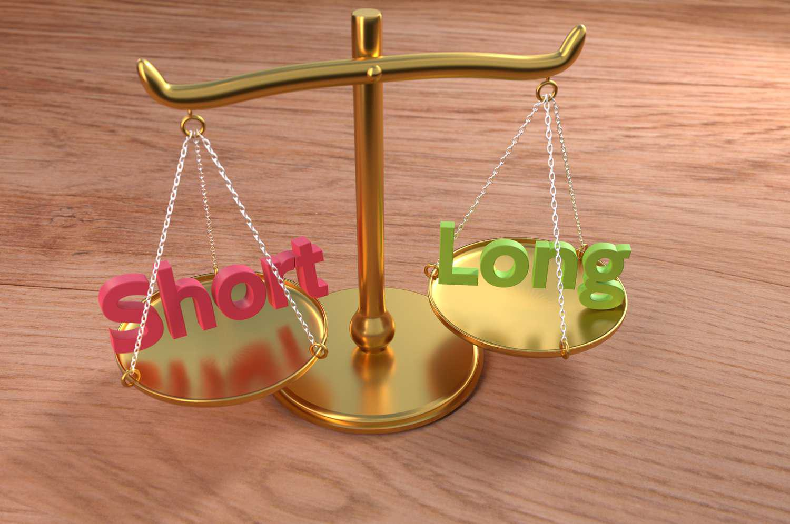

The world of trading is intricate, involving detailed terminology and diversified strategies to navigate the financial markets. A significant area within this realm is margin trading, which enables traders to borrow funds to potentially amplify their returns. By obtaining additional capital, traders are able to increase their trading exposure, potentially leading to higher profits. However, this strategy also introduces increased risks, as losses can be magnified in the same proportion as gains.

In this article, we explore how liquidation margin, types of margins, and margin trading function, alongside the role of algorithmic trading as a complementary tool. Liquidation margin is critical in margin trading, representing the total value possessed in a margin account that includes both cash and the market value of open positions. This concept is vital for traders to keep their accounts above specified thresholds imposed by brokers, which ensures the avoidance of margin calls—situations where traders are required to deposit additional funds or securities to cover potential losses.



Beyond liquidation margin, there are different types of margins that serve unique purposes within trading activities. These include the initial margin, the minimum amount required to open a trade, and the maintenance margin, which is the minimum equity necessary to keep a trade open. Free margin, on the other hand, is the available equity that a trader can use for new positions or to absorb potential losses.

Furthermore, algorithmic trading, often referred to as algo trading, represents an advanced strategy that utilizes computer programs to automatically make trading decisions. This approach is particularly beneficial when combined with margin trading, offering opportunities to optimize strategies and manage risks through rapid and data-driven considerations.

The key objective of this guide is to offer a thorough understanding of these crucial trading elements for both novice and experienced traders. By providing insights into these areas, traders can advance their ability to manage risks effectively and enhance their strategy optimization in the dynamic environments of financial markets.

## Table of Contents

## Understanding Liquidation Margin

Liquidation margin plays a vital role in margin trading as it represents the total value of a margin account, encompassing both available cash and the market value of any open positions. This metric is crucial for traders to maintain because failing to keep their accounts above certain levels can trigger margin calls from their brokers. Margin calls compel traders to either deposit additional funds or exit their positions to cover the deficit, thereby safeguarding the broker's loaned funds.

### How Liquidation Margin Operates

When traders engage in margin trading, they utilize borrowed funds to increase their position size beyond their initial capital. Liquidation margin reflects the overall health of a margin account by considering all assets and liabilities. Should the liquidation margin fall below the established maintenance margin, brokers will issue a margin call. This situation can occur due to a decline in the market value of open positions or an increase in trading costs. For the trader, maintaining a healthy liquidation margin is crucial to sustaining trading activities without interruptions or forced liquidation of positions.

### Impact on Trading Activities

The liquidation margin significantly impacts various trading activities. For instance, it determines the trader's ability to open new positions or hold existing ones during market downturns. Keeping the liquidation margin above the maintenance threshold reduces the risk of forced liquidation, an event where brokers sell off assets to recover borrowed funds. Such sales may occur at unfavorable prices, leading to substantial financial losses.

Consider a trader with a $10,000 account who uses 50% leverage to open a $20,000 position. If the market value drops by 10%, the position's value falls to $18,000. Given the borrowed amount remains unchanged, the account's liquidation value drops to $8,000. If the maintenance margin is set at $9,000, the broker will issue a margin call, urging the trader to add funds or close the position partially.

### Managing Liquidation Margin

Traders have several strategies to manage liquidation margin effectively. By depositing additional collateral, they can buffer against minor declines in market value, thereby avoiding margin calls. Alternatively, adjusting trading strategies to include stop-loss orders or diversifying across less volatile assets can help maintain the liquidation margin. Another approach involves closely monitoring market conditions and adjusting positions proactively before adverse price movements occur.

Efficient management of liquidation margin not only prevents disruptive margin calls but also optimizes overall trading performance. By understanding and effectively controlling this crucial aspect, traders can navigate the volatile financial markets with greater confidence and stability.

## Types of Margin in Trading

Margin trading involves the use of borrowed funds to increase the potential return on investment. In this form of trading, understanding the types of margin is essential as each plays a unique role in managing trading activities and potential risks. The primary types of margin include the initial margin, maintenance margin, and free margin.

The **initial margin** is the amount of equity a trader must contribute to open a position. It acts as a deposit or collateral to cover potential losses. For example, if a trader wants to purchase securities worth $10,000 and the initial margin requirement is 50%, the trader needs to provide $5,000, while the remaining $5,000 can be borrowed.

The **maintenance margin** is the minimum equity that must be maintained in a trader's account to keep the position open. This margin acts as a safeguard for brokers, ensuring that traders can cover potential losses. If the account equity falls below the maintenance margin due to market movements, the broker may issue a margin call, demanding the trader to either deposit additional funds or liquidate positions. For instance, if the maintenance margin is set at 25% for a $10,000 position, the trader must maintain at least $2,500 in their account.

Finally, the **free margin** is the amount of equity available in a trader’s account to open new positions or withstand potential losses on existing positions. It is calculated by subtracting the used margin (the margin tied up in open positions) from the total equity in the account. Free margin provides traders with the flexibility to manage their portfolios and respond to market opportunities.

Each type of margin serves as a pivotal component in trading, influencing trading strategies and risk management. The initial margin ensures traders have sufficient funds to cover potential entry-level losses, while the maintenance margin acts as a buffer to protect against more significant downturns. Free margin provides the financial flexibility needed to continue trading or adjust positions in response to market conditions. Understanding these types allows traders to effectively manage their financial resources and navigate the complexities of margin trading.

## Margin Trading: Opportunities and Risks

Margin trading is a strategic approach that allows investors to borrow funds from a brokerage to purchase more securities than they could with their available capital alone. This leverage effectively amplifies the investor's buying power, potentially leading to higher returns. However, it also increases the risks of significant losses if the market moves unfavorably.

### Advantages of Margin Trading

The primary advantage of margin trading is increased purchasing power. By using borrowed funds, traders can amplify their investment potential, thus providing the opportunity for larger profits. For example, if an investor uses $10,000 of their own money and borrows another $10,000 on margin, they can purchase $20,000 worth of securities. If the securities appreciate, the investor benefits from the returns on $20,000, despite only having initially invested $10,000 of their own funds.

Another benefit is the flexibility it offers. Margin accounts allow for a broader range of investment strategies that would be otherwise unattainable with limited capital. Traders can quickly capitalize on market opportunities without the need to liquidate existing assets for cash.

### Risks of Margin Trading

While margin trading can amplify gains, it equally amplifies losses. If the market moves against the trader’s position, losses will be incurred on the total amount of the investment, not just on the personal capital. Thus, if the value of the investment drops significantly, the trader might end up losing more than their initial investment.

Moreover, margin trading introduces the risk of a margin call. A margin call occurs when the value of the securities in a margin account falls below a certain level, known as the maintenance margin. Brokerages require traders to maintain a minimum account balance to cover potential losses, known as the maintenance margin requirement. If the account value falls below this threshold, the trader is required to either deposit additional funds or sell off some assets to meet the margin call. Failure to do so may result in the brokerage automatically selling securities from the account to bring it back to the required level, potentially locking in losses for the trader.

### Understanding Margin Trading Requirements

Brokerages set specific requirements for margin accounts, and these must be comprehensively understood by traders to effectively manage risks. Initially, traders are required to meet the initial margin requirement, which is typically a percentage of the purchase price of the securities being bought. 

The maintenance margin is another critical requirement imposed by brokerages, often set at a lower percentage than the initial margin. This margin is the minimum account balance a trader must maintain at all times. For example, if a brokerage has a 25% maintenance margin requirement, the equity in the trader’s account must not fall below 25% of the total market value of the securities.

Understanding these requirements and the potential for a margin call is crucial for managing the risks associated with margin trading. Traders must continuously monitor their positions and market conditions to ensure they do not breach their brokerage’s requirements.

In conclusion, while margin trading provides the opportunity for amplified returns, it also significantly increases the risk of considerable financial losses. Traders must diligently manage their accounts and adhere to brokerage requirements to navigate the complexities of margin trading effectively.

 to Algo Trading

Algorithmic trading, commonly known as algo trading, employs computer programs to automate the process of trading financial assets. By leveraging predefined criteria and algorithms, traders can execute strategies with increased speed and precision compared to manual trading. This form of trading capitalizes on computational power to identify opportunities and execute trades at the best possible prices, thus reducing the emotional involvement that often hampers trading decisions.

Algo trading plays a critical role in modern financial markets due to its efficiency in processing extensive datasets and performing complex calculations in fractions of a second. Traders can capitalize on market inefficiencies by deploying algorithms that incorporate various strategies, such as [trend following](/wiki/trend-following), statistical [arbitrage](/wiki/arbitrage), or mean reversion.

When combined with margin trading, algorithmic strategies can significantly enhance a trader's capability to exploit market conditions. Margin trading involves borrowing funds to increase purchasing power, thus amplifying both potential returns and risks. By incorporating algo trading, traders can devise more sophisticated strategies that efficiently manage leverage, optimizing both entry and [exit](/wiki/exit-strategy) points in volatile markets.

A typical application of algo trading in margin trading might involve the use of a simple moving average (SMA) crossover strategy to trigger buy or sell signals. For instance, if a short-term SMA crosses above a long-term SMA, the algorithm might initiate a buy order using margin, with rules in place to manage risks such as stop-loss levels. Conversely, a crossover in the opposite direction could trigger a sell order to close the position.

Python is a popular programming language for implementing algorithmic strategies due to its extensive libraries and ease of use. Here is a basic example of a moving average crossover strategy coded in Python:

```python
import pandas as pd
import numpy as np

# Load price data
data = pd.read_csv('price_data.csv')
data['SMA_short'] = data['Close'].rolling(window=50).mean()
data['SMA_long'] = data['Close'].rolling(window=200).mean()

# Generating trading signals
data['Signal'] = np.where(data['SMA_short'] > data['SMA_long'], 1, 0)
data['Position'] = data['Signal'].diff()

# Display where buy/sell signals occur
buy_signals = data.loc[data['Position'] == 1]
sell_signals = data.loc[data['Position'] == -1]

print("Buy signals at:")
print(buy_signals)

print("Sell signals at:")
print(sell_signals)
```

The code loads historical price data and calculates two simple moving averages. It generates signals based on the crossover of these averages, indicating potential buy and sell opportunities.

Algo trading's capacity to efficiently manage risks alongside margin strategies highlights its effectiveness. For instance, by continually assessing the market and adjusting positions in real-time, algorithms can help manage liquidation margins by maintaining appropriate collateral levels or by dynamically adjusting leverage as market conditions evolve.

In summary, the collaboration between margin trading and algorithmic strategies offers traders a powerful toolkit. By automating trading processes and optimizing strategies, traders can capably navigate the complexities of financial markets, thereby enhancing their potential for success while mitigating risks.

## Managing Risks in Margin and Algo Trading

Effective risk management is crucial in both margin and [algorithmic trading](/wiki/algorithmic-trading) to minimize potential losses and stabilize returns. Techniques in margin trading involve maintaining appropriate margin levels. Traders must ensure their margin accounts stay above the maintenance margin, the minimum equity value required to keep a leveraged position open. Failure to do so results in a margin call, where traders must deposit additional funds or liquidate positions to confirm compliance. The formula for determining free margin, which indicates available equity for trading, can be expressed as:

$$
\text{Free Margin} = \text{Equity} - \text{Used Margin}
$$

Equity refers to the total value of an account, encompassing the initial deposit and unrealized gains or losses from open positions. Knowledge of free margin assists traders in managing their positions to avert liquidation.

In algorithmic trading, algorithms enhance risk management by optimizing entry and exit strategies. By leveraging historical data and market trends, algorithms can identify favorable conditions for executing trades, thereby mitigating emotional biases. For instance, a simple moving average crossover strategy can be programmed in Python as follows:

```python
import pandas as pd

# Load historical data
data = pd.read_csv('historical_data.csv')
data['SMA20'] = data['Close'].rolling(window=20).mean()
data['SMA50'] = data['Close'].rolling(window=50).mean()

# Generate trading signals
data['Signal'] = 0  
data.loc[data['SMA20'] > data['SMA50'], 'Signal'] = 1
data.loc[data['SMA20'] < data['SMA50'], 'Signal'] = -1

# Determine positions
data['Position'] = data['Signal'].diff()

# Print the dataframe with signals
print(data[['Close', 'SMA20', 'SMA50', 'Signal', 'Position']])
```

This script calculates the 20-day and 50-day simple moving averages and generates buy signals when the 20-day MA crosses above the 50-day MA and sell signals when it crosses below. Such automation reduces the likelihood of human error and facilitates timely execution of trades.

Balancing potential rewards against risks necessitates deploying stop-loss orders and position sizing appropriately to prevent excessive exposure. Calculating a risk-reward ratio for each trade supports making informed decisions by weighing potential profits against anticipated risks. Ultimately, integration of these strategies allows traders to harness the benefits of both margin and algo trading while curtailing undesirable consequences.

## Conclusion

The integration of liquidation margin, various types of margins, and algorithmic trading forms a robust framework that can significantly enhance a trader's ability to navigate financial markets. Liquidation margin, being the safety net that ensures traders maintain sufficient balance, plays a pivotal role in safeguarding against excessive losses and margin calls. Understanding and effectively managing types of margins — including initial, maintenance, and free margin — empower traders to keep a balanced and sustainable trading account. These margins contribute to maintaining the financial health of trading positions, making them essential tools for risk management.

Algorithmic trading (algo trading) supplements this framework by leveraging computational algorithms to automate trading decisions. This automation allows for rapid execution of trades, minimizing human error and emotional bias. Algo trading, when used alongside margin strategies, can optimize trading activities by swiftly identifying and capitalizing on market opportunities that align with the trader’s risk tolerance and financial goals.

To employ these strategies effectively, traders must cultivate a thorough understanding of each component. It involves continuous monitoring of margin requirements and the performance of automated trading systems. By setting algorithm parameters that account for margin thresholds and market [volatility](/wiki/volatility-trading-strategies), traders can optimize the synergy between margin and algo trading. This approach helps in achieving a balance between maximizing potential returns and mitigating risks.

Ultimately, a disciplined application of these strategies, underpinned by a robust risk management plan, enables traders to maximize their market opportunities while protecting themselves against potential downsides. Adopting these integrated strategies requires constant learning and adaptation to market conditions, ensuring long-term resilience and success in trading activities.

## References & Further Reading

[1]: ["Mastering the Trade, Third Edition: Proven Techniques for Profiting from Intraday and Swing Trading Setups"](https://www.amazon.com/Mastering-Trade-Third-Techniques-Profiting/dp/1260121593) by John F. Carter

[2]: ["Algorithmic Trading: Winning Strategies and Their Rationale"](https://play.google.com/store/books/details/Algorithmic_Trading_Winning_Strategies_and_Their_R?id=CIwCTVqEj4oC&hl=en-US) by Ernie Chan

[3]: ["Margin Trading from A to Z: The Complete Guide on What Margin is and How to Use it"](https://www.amazon.com/Margin-Trading-Borrowing-Investing-Regulation/dp/1119108519) by Rebecca Johnson

[4]: Hull, J. (2018). ["Options, Futures, and Other Derivatives"](https://www.semanticscholar.org/paper/Options%2C-Futures%2C-and-Other-Derivatives-Hull/89bdee500c8623864fc9eb7a471546aa713acc44) (10th Edition). Pearson.

[5]: ["Trading and Exchanges: Market Microstructure for Practitioners"](https://academic.oup.com/book/52292) by Larry Harris