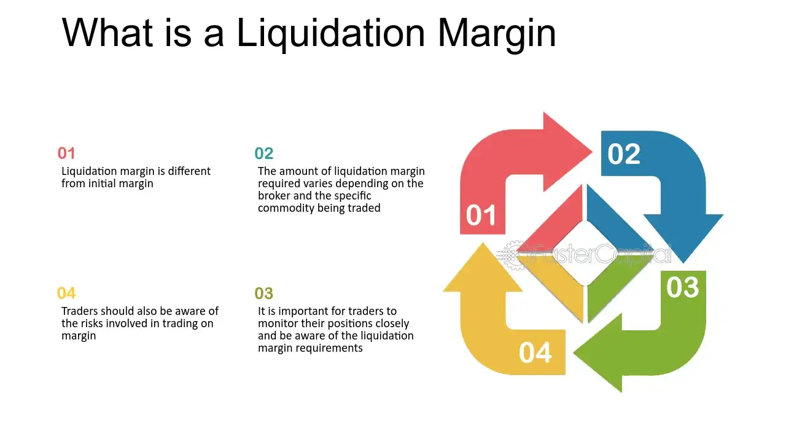

## Table of Contents

## What is margin trading?

Margin trading is when you borrow money from a broker to buy stocks or other investments. Instead of using only your own money, you use a mix of your money and borrowed money. This can let you buy more stocks than you could with just your own money. But it's risky because if the value of your investments goes down, you could lose more money than you started with.

When you use margin trading, you have to pay interest on the money you borrow. The broker will also set rules, like a minimum amount of money you need to keep in your account. If your investments lose value and your account balance drops below this minimum, you'll need to add more money or sell some investments quickly. This is called a margin call. Margin trading can help you make more money if your investments do well, but it can also lead to bigger losses if they don't.

## What is liquidation in margin trading?

Liquidation in margin trading happens when the value of your investments falls too low and you can't meet the broker's minimum balance requirement. This minimum balance is called the maintenance margin. When your account balance drops below this level, the broker will sell some or all of your investments to get the account back to the required level. This process is called a margin call, and if you don't add more money to your account quickly, the broker will start liquidating your assets.

Liquidation is a way for the broker to protect themselves from losing money. If the value of your investments keeps falling and you don't have enough money to cover the losses, the broker could be left with a big bill. By selling your investments, the broker makes sure they get paid back. It's important to understand that liquidation can happen fast and you might not have control over which investments are sold. This can lead to big losses, so it's a risk you take when you use margin trading.

## What is liquidation margin?

Liquidation margin is the minimum amount of money you need to keep in your account when you're using margin trading. It's like a safety net set by the broker to make sure they don't lose money if your investments start losing value. If the value of your investments goes down and your account balance drops below this liquidation margin, the broker will step in and start selling your investments to get the account back to the safe level.

This process is called liquidation. It's important because it protects the broker from losing money, but it can be bad for you if it happens. When your investments are liquidated, you might not have a say in which ones get sold, and you could end up losing a lot of money. That's why it's good to keep an eye on your account and make sure you have enough money to cover the liquidation margin.

## How is liquidation margin calculated?

Liquidation margin is figured out by looking at the total value of your investments and how much money you borrowed from the broker. The broker decides on a certain percentage, called the maintenance margin, which is the least amount of money they want you to have in your account. For example, if the maintenance margin is 25%, you need to keep at least 25% of the total value of your investments in your account. If your investments are worth $10,000, you need to have at least $2,500 in your account to avoid a margin call.

If the value of your investments goes down, the liquidation margin goes down too. Let's say your investments drop to $8,000. Now, you need to have at least $2,000 in your account (25% of $8,000). If your account balance falls below this new liquidation margin, the broker will start selling your investments to get your account back to the safe level. This is why it's important to keep an eye on your account and make sure you have enough money to cover the liquidation margin, so you don't get caught off guard by a margin call.

## What factors can trigger liquidation?

Liquidation in margin trading happens when the value of your investments goes down a lot and your account doesn't have enough money to meet the broker's rules. The main thing that can trigger liquidation is if your account balance drops below the liquidation margin. This can happen if the price of your stocks or other investments falls. If you borrowed money from the broker to buy these investments, and their value goes down, you might not have enough money left in your account to cover the loan.

Another [factor](/wiki/factor-investing) that can lead to liquidation is if you don't add more money to your account when you get a margin call. When your account balance gets too low, the broker will ask you to put in more money to bring it back up to the safe level. If you don't do this quickly, the broker will start selling your investments to get the money they need. This is called liquidation, and it can happen fast, so it's important to keep an eye on your account and be ready to add more money if you get a margin call.

## What are the risks associated with liquidation margin?

Liquidation margin is risky because if the value of your investments goes down a lot, you might lose more money than you put in. When you use margin trading, you borrow money to buy more investments than you could with just your own money. If the prices of those investments fall, and your account balance drops below the liquidation margin, the broker will sell your investments to get their money back. This can happen fast, and you might not have a say in which investments get sold. So, you could end up losing a lot of money, even more than you started with.

Another risk is that you might get a margin call, which is when the broker tells you to add more money to your account to meet the liquidation margin. If you can't add more money quickly, the broker will start liquidating your investments. This can be stressful and can lead to big losses. It's important to keep an eye on your account and be ready to add more money if you get a margin call, but even then, there's no guarantee you can avoid liquidation if the market keeps going down.

## How can traders manage their liquidation margin effectively?

Traders can manage their liquidation margin effectively by keeping a close watch on their account balance and the value of their investments. It's important to know the maintenance margin set by the broker, which is the minimum amount of money you need to keep in your account. By regularly checking your account, you can see if the value of your investments is going down and if your balance is getting close to the liquidation margin. If it is, you can take action to avoid a margin call, like adding more money to your account or selling some investments to reduce your borrowed amount.

Another way to manage liquidation margin is to be careful about how much you borrow. Don't use all the money the broker lets you borrow, because if the market goes down, you'll have a smaller buffer before hitting the liquidation margin. It's also a good idea to have a plan for what you'll do if you get a margin call. This could mean having extra money ready to put into your account or knowing which investments you might sell to meet the margin requirement. By being prepared and not borrowing too much, you can lower the risk of liquidation and protect your investments.

## What is the difference between initial margin and maintenance margin?

Initial margin is the amount of money you need to put into your account to start margin trading. It's like a down payment. When you want to buy stocks or other investments using borrowed money, the broker will ask you to put in a certain percentage of the total cost. For example, if you want to buy $10,000 worth of stocks and the initial margin is 50%, you need to put in $5,000 of your own money. The rest, $5,000, you can borrow from the broker.

Maintenance margin is different. It's the minimum amount of money you need to keep in your account after you start trading. The broker sets this as a safety net to make sure they don't lose money if your investments go down in value. If the value of your investments drops and your account balance falls below the maintenance margin, you'll get a margin call. You'll need to add more money or sell some investments to bring your account back up to the required level. If you don't, the broker will start selling your investments to get their money back, which is called liquidation.

## How do different exchanges handle liquidation margin?

Different exchanges have their own rules for how they handle liquidation margin. Some exchanges might set a higher maintenance margin than others, which means you need to keep more money in your account to avoid a margin call. For example, one exchange might require a maintenance margin of 25% of your investments' value, while another might set it at 30%. This can affect how much risk you take on when you trade on different exchanges, because if the maintenance margin is higher, you have less room for the value of your investments to fall before you get a margin call.

Exchanges also have different ways of handling margin calls and liquidation. Some might give you more time to add money to your account before they start selling your investments, while others might act faster. For instance, one exchange might give you a day to meet a margin call, while another might only give you a few hours. It's important to know these rules before you start trading on a new exchange, because they can make a big difference in how you manage your account and avoid liquidation.

## What are some strategies to avoid liquidation?

To avoid liquidation, you need to keep an eye on your account balance and the value of your investments. Make sure you know the maintenance margin set by your broker, which is the least amount of money you need to keep in your account. Check your account often to see if the value of your investments is going down. If it is, and your balance is getting close to the liquidation margin, you can take action to avoid a margin call. This might mean adding more money to your account or selling some investments to lower how much you've borrowed.

Another strategy is to be careful about how much you borrow. Don't use all the money the broker lets you borrow, because if the market goes down, you'll have less room before hitting the liquidation margin. It's also smart to have a plan for what you'll do if you get a margin call. This could mean having extra money ready to put into your account or knowing which investments you might sell to meet the margin requirement. By being prepared and not borrowing too much, you can lower the risk of liquidation and protect your investments.

## How does leverage affect liquidation margin?

Leverage is when you borrow money from a broker to buy more investments than you could with just your own money. When you use leverage, you're using a mix of your money and borrowed money, which can let you buy more stocks or other investments. But leverage also makes your account more sensitive to changes in the value of your investments. If the value goes down, your account balance can drop faster because you've borrowed money. This means you might hit the liquidation margin sooner if the market goes against you.

To avoid hitting the liquidation margin when using leverage, it's important to keep a close eye on your account. You need to know how much you've borrowed and what the maintenance margin is, which is the minimum amount of money you need to keep in your account. If the value of your investments starts to fall, and your account balance gets close to the liquidation margin, you might need to add more money to your account or sell some investments to reduce how much you've borrowed. By being careful with how much leverage you use and keeping an eye on your account, you can lower the risk of liquidation.

## What are the regulatory considerations regarding liquidation margin in different countries?

Different countries have different rules about liquidation margin to make sure trading is safe and fair. In the United States, the Federal Reserve sets rules for margin trading. They say you need to put in at least 50% of the cost of the stocks you want to buy as an initial margin, and you need to keep at least 25% of the value of your investments in your account as a maintenance margin. If your account balance drops below this, you'll get a margin call and might have to add more money or sell some investments. These rules help protect both traders and brokers from big losses.

In Europe, the rules can be different from one country to another, but the European Securities and Markets Authority (ESMA) sets some general guidelines. They might ask for higher initial and maintenance margins than in the U.S., especially for riskier investments. This is to make sure traders don't take on too much risk. In Asia, countries like Japan and Singapore also have their own rules. Japan, for example, might have different margin requirements for different types of investments. Knowing these rules is important because they can affect how you trade and manage your account to avoid liquidation.

## How can one manage risks in margin and algo trading?

Effective risk management is crucial in both margin and [algorithmic trading](/wiki/algorithmic-trading) to minimize potential losses and stabilize returns. Techniques in margin trading involve maintaining appropriate margin levels. Traders must ensure their margin accounts stay above the maintenance margin, the minimum equity value required to keep a leveraged position open. Failure to do so results in a margin call, where traders must deposit additional funds or liquidate positions to confirm compliance. The formula for determining free margin, which indicates available equity for trading, can be expressed as:

$$
\text{Free Margin} = \text{Equity} - \text{Used Margin}
$$

Equity refers to the total value of an account, encompassing the initial deposit and unrealized gains or losses from open positions. Knowledge of free margin assists traders in managing their positions to avert liquidation.

In algorithmic trading, algorithms enhance risk management by optimizing entry and [exit](/wiki/exit-strategy) strategies. By leveraging historical data and market trends, algorithms can identify favorable conditions for executing trades, thereby mitigating emotional biases. For instance, a simple moving average crossover strategy can be programmed in Python as follows:

```python
import pandas as pd

# Load historical data
data = pd.read_csv('historical_data.csv')
data['SMA20'] = data['Close'].rolling(window=20).mean()
data['SMA50'] = data['Close'].rolling(window=50).mean()

# Generate trading signals
data['Signal'] = 0  
data.loc[data['SMA20'] > data['SMA50'], 'Signal'] = 1
data.loc[data['SMA20'] < data['SMA50'], 'Signal'] = -1

# Determine positions
data['Position'] = data['Signal'].diff()

# Print the dataframe with signals
print(data[['Close', 'SMA20', 'SMA50', 'Signal', 'Position']])
```

This script calculates the 20-day and 50-day simple moving averages and generates buy signals when the 20-day MA crosses above the 50-day MA and sell signals when it crosses below. Such automation reduces the likelihood of human error and facilitates timely execution of trades.

Balancing potential rewards against risks necessitates deploying stop-loss orders and position sizing appropriately to prevent excessive exposure. Calculating a risk-reward ratio for each trade supports making informed decisions by weighing potential profits against anticipated risks. Ultimately, integration of these strategies allows traders to harness the benefits of both margin and algo trading while curtailing undesirable consequences.

## References & Further Reading

[1]: ["Mastering the Trade, Third Edition: Proven Techniques for Profiting from Intraday and Swing Trading Setups"](https://www.amazon.com/Mastering-Trade-Third-Techniques-Profiting/dp/1260121593) by John F. Carter

[2]: ["Algorithmic Trading: Winning Strategies and Their Rationale"](https://play.google.com/store/books/details/Algorithmic_Trading_Winning_Strategies_and_Their_R?id=CIwCTVqEj4oC&hl=en-US) by Ernie Chan

[3]: ["Margin Trading from A to Z: The Complete Guide on What Margin is and How to Use it"](https://www.amazon.com/Margin-Trading-Borrowing-Investing-Regulation/dp/1119108519) by Rebecca Johnson

[4]: Hull, J. (2018). ["Options, Futures, and Other Derivatives"](https://www.semanticscholar.org/paper/Options%2C-Futures%2C-and-Other-Derivatives-Hull/89bdee500c8623864fc9eb7a471546aa713acc44) (10th Edition). Pearson.

[5]: ["Trading and Exchanges: Market Microstructure for Practitioners"](https://academic.oup.com/book/52292) by Larry Harris