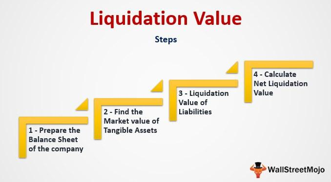

Understanding financial terminologies related to business valuations is crucial for making informed decisions. In this context, concepts like liquidation value and asset valuation are vital in assessing a company's financial health, especially during volatile markets. Liquidation value refers to the net worth of a company's physical assets if it were to cease operations and sell its assets promptly, excluding intangibles. Meanwhile, asset valuation encompasses various methods to estimate asset worth under different conditions.

The significance of these terms extends to their application in business liquidation—a process that involves winding down company operations and selling off assets, either voluntarily or as a result of bankruptcy. Accurately determining liquidation value and choosing appropriate asset valuation methods are essential for stakeholders, such as investors and creditors, in predicting financial outcomes and aligning strategies accordingly.

In modern finance, algorithmic trading plays a crucial role, leveraging computer algorithms to execute trades with precision and speed. By analyzing large datasets, these algorithms assist in determining asset prices, enhancing decision-making during liquidations and investments. Understanding the synergy between algorithmic trading and asset valuation is vital for future financial strategies, offering new dimensions for faster and more accurate assessments.

This article examines the relationship between business liquidation, liquidation value, asset valuation, and algorithmic trading and explores their impacts on investors and stakeholders. The discussion aims to provide clarity and insight into these interconnected components, empowering businesses and investors to navigate the complexities of financial markets effectively.

## Table of Contents

## Understanding Business Liquidation

Business liquidation is a structured procedure in which a company discontinues its business operations and systematically divests its assets. This typically marks the end of the company's existence, whether prompted by voluntary choice or necessitated by insolvency. 

**Reasons for Liquidation:** Liquidation can be initiated voluntarily by shareholders when they decide to cease business for strategic reasons, such as declining profitability or market exit strategies. Alternatively, it can be compulsory, often imposed by courts in response to bankruptcy proceedings when a company is unable to meet its financial commitments to creditors. 

**Stakeholder Implications:** For stakeholders, particularly investors, creditors, and employees, understanding the nuances of the liquidation process is critical. Investors may see liquidation as a way to recoup investments. Creditors are concerned with reclaiming owed debts from the liquidation proceeds, and employees may be directly affected by job displacement.

**Process and Focus of Liquidation:** The liquidation process prioritizes settling the company's outstanding liabilities, which may encompass outstanding loans, unpaid wages, and taxes. Once liabilities are cleared, any remaining assets are distributed among stakeholders according to the legal hierarchy of claims. This generally means secured creditors are prioritized over unsecured creditors and equity holders.

**Types of Liquidation:** There are two primary types of liquidation:

1. **Voluntary Liquidation:** This type is initiated by the company's directors or shareholders. In solvent cases, members' voluntary liquidation occurs, where assets exceed liabilities. In contrast, creditors' voluntary liquidation is used when the company is insolvent.

2. **Compulsory Liquidation:** Also termed as court-mandated liquidation, this is initiated via a court order typically due to a petition by creditors. The process involves the appointment of a liquidator who assumes control of the company and manages the asset realization and debt repayment.

Each liquidation type follows different legal procedures and has distinct implications for how assets are liquidated and proceeds distributed. Understanding these processes is crucial for stakeholders to effectively anticipate and navigate the potential outcomes of business liquidation.

## Defining Liquidation Value

Liquidation value is defined as the net worth of a company's tangible assets if it ceases operations and needs to sell these assets swiftly. This valuation specifically excludes intangible assets such as patents, trademarks, and goodwill, resulting in a valuation lower than the company's going concern value, which considers the firm's ability to continue operations and generate future income.

In financial distress scenarios like bankruptcies and forced asset sales, liquidation value plays a significant role. It provides a conservative estimate of the firm's worth, highlighting the minimum expected returns from asset disposal. This is crucial for creditors and investors seeking assurance of recoverable value.

The calculation of liquidation value considers several factors, including market conditions, asset characteristics, and legal constraints affecting asset disposition. The formula is often expressed as:

$$
\text{Liquidation Value} = \text{Total Tangible Assets} - \text{Total Liabilities}
$$

Where:
- **Total Tangible Assets** represent physical properties that can be sold, such as machinery, inventory, and real estate.
- **Total Liabilities** cover all financial obligations the company must settle.

Market conditions significantly influence the liquidation value. During economic downturns, asset prices may plummet, thus lowering the liquidation value. Additionally, the specifics of the assets, such as their condition and the marketability, directly affect feasible sale prices. Legal regulations may also impose constraints on how assets can be liquidated, which can further impact the value obtained.

Providing a conservative baseline, the liquidation value gives investors and creditors a tangible benchmark reflecting a worst-case scenario for asset recovery. This estimation acts as a security measure, ensuring stakeholders better understand the minimum financial security available in distress situations.

## Asset Valuation Methods in Liquidation

Asset valuation in liquidation contexts employs specific methodologies to estimate the recoverable value of a business's assets. The choice of method is critical as it influences the perceived worth during liquidation, affecting stakeholders like creditors, investors, and the liquidating entity itself.

One common method is the Orderly Liquidation Value (OLV), which is based on the assumption that assets are sold in a structured manner over a reasonable timeframe. This method often results in higher valuations than more abrupt liquidation approaches because it allows for potential buyers to evaluate and bid for the assets without undue pressure. The assets are typically sold through negotiated sales or auctions, where there is enough time for sufficient marketing and due diligence to achieve a favorable price.

Conversely, the Forced Liquidation Value (FLV) assumes that the assets must be sold quickly, often under distress, such as in bankruptcy scenarios. The urgency typically leads to discounted prices due to the limited time for buyers to make informed decisions. This method is indicative of a more conservative estimate and is often used to determine the worst-case scenario valuations.

Another important method is the Net Realizable Value (NRV), which considers the expected selling price of assets minus any associated costs necessary to make the sale. NRV is particularly useful when assets require processing, transport, or other expenses before completion of a sale. Unlike OLV and FLV, NRV gives a clear view of the net revenue expected from a liquidation process after accounting for all outgoing expenses.

The selection of a specific asset valuation method depends on several factors, including the type of asset being liquidated, prevailing market conditions, and the urgency of the liquidation process. For example, while OLV might be more appropriate for real estate or machinery that requires time to find optimal buyers, FLV might be better suited for inventory that depreciates quickly or has a limited shelf life.

Understanding these methodologies helps stakeholders anticipate financial outcomes associated with liquidation and align their strategies to mitigate risks. Proper assessment allows parties involved to make informed decisions about the timing and nature of asset disposition, ensuring that assets are sold in a manner that aligns with the overarching financial goals of the liquidation process.

## Role of Algorithmic Trading in Asset Valuation

Algorithmic trading, a technological advancement in financial markets, employs sophisticated computer algorithms to execute trades based on specific criteria. These trades are typically initiated with minimal human intervention, enabling high precision and speed. In asset valuation, algorithmic methods are instrumental in determining asset prices with heightened accuracy. By analyzing extensive datasets, algorithms provide critical insights into the fair value of assets, which is invaluable for investors and stakeholders.

The strength of [algorithmic trading](/wiki/algorithmic-trading) lies in its ability to swiftly process and analyze vast amounts of data that encompass market trends, fluctuations in supply and demand, and broader economic indicators. Traditional methods of asset valuation often rely on manual data collection and analysis, which can be time-consuming and subject to human error. In contrast, algorithms analyze historical data patterns, current market conditions, and forecast potential changes more efficiently. This results in more accurate asset valuations that reflect real-time market conditions.

Algorithmic trading enhances decision-making processes, particularly in situations involving liquidations and investments. During business liquidation, accurate asset valuation is crucial to determine the fair value of assets being sold. Algorithms can accurately project potential sale outcomes by considering variables such as market [liquidity](/wiki/liquidity-risk-premium) and [volatility](/wiki/volatility-trading-strategies). This information is essential for ensuring assets are correctly valued and helping maximize recovery for creditors and other stakeholders.

Moreover, algorithms play a pivotal role in aligning asset valuation with investment strategies. Investors use algorithmic outputs to make informed decisions on asset purchases, sales, or retention. As algorithmic trading strategies evolve, they integrate [machine learning](/wiki/machine-learning) and [artificial intelligence](/wiki/ai-artificial-intelligence) to improve predictions and enhance investment outcomes further.

Understanding the synergy between algorithmic trading and asset valuation is vital for developing future financial strategies. As markets become increasingly data-driven, leveraging algorithmic trading offers a competitive edge. By harnessing these technologies, financial professionals can swiftly adjust to market changes and anticipate future trends, ensuring optimal allocation and management of financial resources. The convergence of algorithmic trading and asset valuation signifies a transformative shift in how financial evaluations are conducted, underscoring the need for stakeholders to adapt to ever-evolving market dynamics.

## Examples and Practical Applications

Real-world examples demonstrate the importance and application of liquidation value in various industries. One notable instance is the liquidation of Toys 'R' Us in 2018. The company, once a dominant player in the toy retail sector, filed for bankruptcy due to mounting debts and a changing retail landscape. The process involved the evaluation and subsequent sale of the company's physical assets to satisfy creditor claims. The liquidation value provided a benchmark for creditors to assess their potential recoveries, emphasizing the necessity of understanding liquidation as a financial strategy rather than merely a consequence of business failure.

In the tech sector, companies like Circuit City faced similar challenges. Once a significant electronics retailer, Circuit City filed for bankruptcy and liquidated its assets in 2009. The valuation of its inventory, fixtures, and property highlighted the crucial role of precise asset valuation in determining the liquidation value. These examples underscore not only the calculation of liquidation values but also the broader financial and strategic implications for stakeholders.

The automotive industry has also witnessed its share of liquidation events, such as the case with Saab Automobile. The Swedish car manufacturer declared bankruptcy in 2011 after attempts to restructure failed. The liquidation process involved assessing the recoverable value of its production line, inventories, and intellectual property. This scenario demonstrated the impact of industry-specific factors on liquidation strategies and values.

Understanding these examples aids stakeholders in realizing the practical implications of liquidation value assessments. Various factors, including market conditions, asset types, and strategic planning, play significant roles in these situations. Legal and ethical considerations are paramount, as they guide the liquidation process, ensuring fairness and compliance with bankruptcy laws. The ethical dimension addresses stakeholder interests, seeking to balance the duties owed to creditors, employees, and other parties involved.

These applications highlight the importance of strategic asset management and proactive financial planning. Analyzing real-world scenarios informs businesses and investors about both the risks and opportunities presented by liquidation events. Proactive planning can mitigate losses, while informed asset management can maximize recoverable value. Thus, understanding liquidation values is pivotal not only in crisis scenarios but also as a strategic component of comprehensive financial planning.

## Conclusion

Business liquidation, liquidation value, and asset valuation are interconnected concepts essential for comprehensive financial evaluations. A thorough understanding of these processes equips stakeholders with the necessary tools to make informed decisions and effectively manage financial risks. Liquidation value provides a baseline assessment of a company's worth when operations cease, ensuring that creditors and investors have a safety net in financial downturns or forced asset sales. 

Algorithmic trading introduces a new dimension to asset valuation by employing advanced computational techniques to enhance precision and speed. Through algorithms analyzing vast datasets, investors gain faster and more accurate assessments of asset prices, responding rapidly to market fluctuations. This integration not only streamlines valuation processes but also supports more strategic investment decisions, offering a competitive edge.

Remaining informed about the evolving practices and technologies in these areas is crucial for stakeholders who wish to optimize their financial strategies. The dynamic nature of modern financial markets necessitates continuous learning and adaptation. By understanding the interplay of business liquidation, liquidation value, and asset valuation, along with the benefits of algorithmic trading, investors and businesses can navigate the complexities of the financial landscape with greater confidence and foresight. These insights empower them to make decisions that align with their economic goals while safeguarding their financial interests.

## References & Further Reading

[1]: Damodaran, A. (2009). ["Valuing Distressed and Declining Companies."](https://people.stern.nyu.edu/adamodar/pdfiles/papers/NewDistress.pdf) NYU Stern School of Business.

[2]: Pinto, J. E., Henry, E., Robinson, T. R., & Stowe, J. D. (2015). ["Equity Asset Valuation."](https://onlinelibrary.wiley.com/doi/abs/10.1002/rfe.1040) CFA Institute.

[3]: Lopez de Prado, M. (2018). ["Advances in Financial Machine Learning."](https://www.amazon.com/Advances-Financial-Machine-Learning-Marcos/dp/1119482089) Wiley.

[4]: Hull, J. C. (2018). ["Options, Futures, and Other Derivatives."](https://www.semanticscholar.org/paper/Options%2C-Futures%2C-and-Other-Derivatives-Hull/89bdee500c8623864fc9eb7a471546aa713acc44) Pearson.

[5]: Chan, E. P. (2009). ["Quantitative Trading: How to Build Your Own Algorithmic Trading Business."](https://github.com/ftvision/quant_trading_echan_book) Wiley.