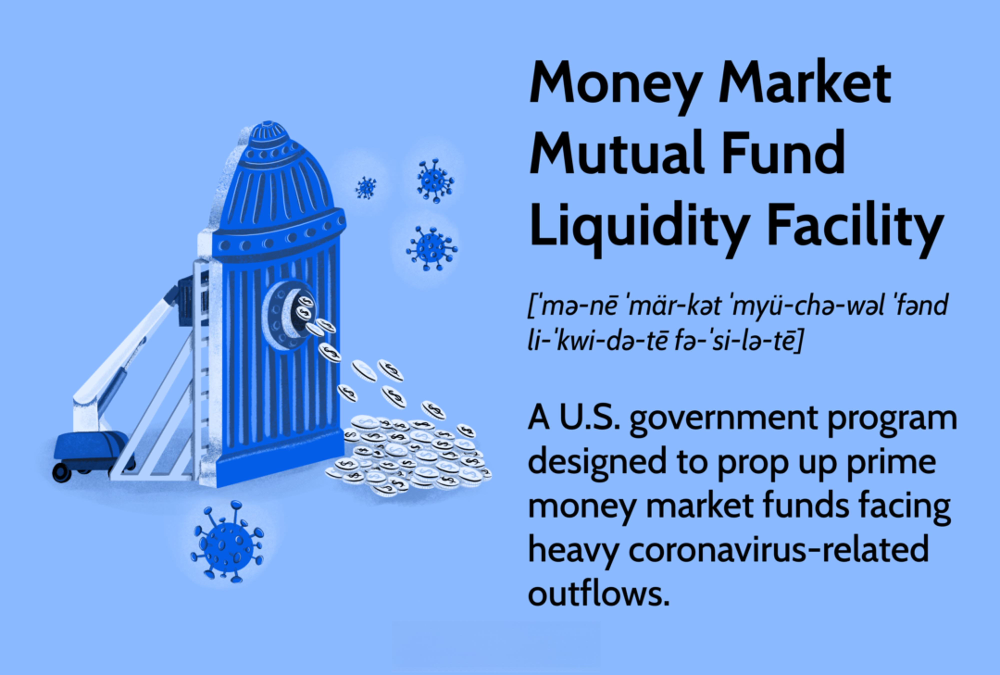

## Table of Contents

## What is the Liquidity Adjustment Facility (LAF)?

The Liquidity Adjustment Facility (LAF) is a tool used by central banks to manage the amount of money that banks have available to lend. It helps control the flow of money in the economy by allowing banks to borrow money from the central bank when they need it, or deposit money with the central bank when they have extra. This borrowing and depositing happen at interest rates set by the central bank, which can influence overall economic activity.

For example, if the central bank wants to increase the money supply in the economy, it can lower the interest rate at which banks can borrow through the LAF. This encourages banks to borrow more and lend more to businesses and individuals, which can boost economic activity. On the other hand, if the central bank wants to reduce the money supply, it can raise the interest rate, making it more expensive for banks to borrow, which can slow down economic activity. By adjusting these rates, the central bank can help stabilize the economy.

## How does the Liquidity Adjustment Facility work?

The Liquidity Adjustment Facility (LAF) is a way for central banks to help manage the amount of money that banks have to lend. It works by letting banks borrow money from the central bank when they need more cash, or deposit money with the central bank when they have extra. The central bank sets the interest rates for these transactions. If banks need money, they can borrow it through what's called a repo (repurchase agreement), where they give the central bank securities as collateral and promise to buy them back later. If banks have extra money, they can deposit it with the central bank and earn interest on it.

The central bank uses the LAF to control how much money is in the economy. If the central bank wants more money to be available for lending, it can lower the [interest rate](/wiki/interest-rate-trading-strategies) for borrowing through the LAF. This makes it cheaper for banks to borrow, so they are more likely to take out loans and then lend that money to businesses and people. On the other hand, if the central bank wants to reduce the amount of money in circulation, it can raise the interest rate. This makes borrowing more expensive, so banks are less likely to borrow and lend, which can slow down the economy. By adjusting these rates, the central bank can help keep the economy stable.

## What are the main components of the LAF?

The Liquidity Adjustment Facility (LAF) has two main parts: the repo and the reverse repo. The repo, short for repurchase agreement, is when banks borrow money from the central bank. They give the central bank securities as a promise to pay back the money later. This helps banks when they need more cash to lend to people and businesses. The reverse repo is the opposite. It's when banks have extra money and they deposit it with the central bank. The central bank pays them interest for keeping their money.

The central bank uses these two parts to control how much money is in the economy. If they want more money to be available for lending, they lower the interest rate for the repo. This makes it cheaper for banks to borrow, so they borrow more and lend more. If the central bank wants less money in the economy, they raise the interest rate for the repo. This makes borrowing more expensive, so banks borrow less and lend less. By changing these rates, the central bank can help keep the economy stable.

## Why is the Liquidity Adjustment Facility important in monetary policy?

The Liquidity Adjustment Facility (LAF) is important in monetary policy because it helps the central bank control how much money is available in the economy. The central bank can use the LAF to make borrowing cheaper or more expensive for banks. If the central bank wants more money to be available for people and businesses to borrow, it can lower the interest rate for the repo part of the LAF. This makes it easier for banks to borrow money from the central bank, so they can lend more to people and businesses. This can help the economy grow.

On the other hand, if the central bank thinks there is too much money in the economy and wants to slow things down, it can raise the interest rate for the repo. This makes it more expensive for banks to borrow, so they will lend less. This can help prevent the economy from growing too fast and getting out of control. By using the LAF, the central bank can help keep the economy stable and balanced.

## How does the LAF influence interest rates?

The Liquidity Adjustment Facility (LAF) helps the central bank control the interest rates in the economy. When the central bank wants to make borrowing cheaper, it lowers the interest rate for the repo part of the LAF. This means banks can borrow money from the central bank at a lower cost. When banks can borrow cheaply, they are more likely to lend money to people and businesses at lower interest rates too. This can help the economy grow because more people and businesses can afford to borrow money.

On the other hand, if the central bank wants to make borrowing more expensive, it raises the interest rate for the repo. This makes it costlier for banks to borrow money from the central bank. When borrowing is more expensive, banks will charge higher interest rates to people and businesses. This can slow down the economy because fewer people and businesses will want to borrow money. By changing the interest rates through the LAF, the central bank can help keep the economy stable.

## What is the difference between repo and reverse repo operations in the LAF?

In the Liquidity Adjustment Facility (LAF), repo and reverse repo are two important operations that help the central bank manage the money supply. A repo, short for repurchase agreement, is when banks borrow money from the central bank. They give the central bank securities as collateral and promise to buy them back later. This helps banks when they need more cash to lend to people and businesses. The interest rate for the repo is set by the central bank, and if it's low, it's cheaper for banks to borrow, which can help the economy grow.

On the other hand, a reverse repo is when banks have extra money and they deposit it with the central bank. The central bank pays the banks interest for keeping their money. This is the opposite of a repo because instead of borrowing, banks are lending money to the central bank. The interest rate for the reverse repo is also set by the central bank. If this rate is high, it encourages banks to deposit more money with the central bank, which can help slow down the economy by reducing the amount of money available for lending. By adjusting these rates, the central bank can control how much money is in the economy and help keep it stable.

## How often does the central bank conduct LAF operations?

The central bank usually conducts LAF operations every day. This means they help banks borrow or deposit money every day to keep the economy running smoothly. By doing this daily, the central bank can quickly respond to changes in how much money banks need or have.

The exact times and how often the LAF operations happen can be different in each country. But the main idea is the same: the central bank wants to make sure there's the right amount of money in the economy. By doing LAF operations every day, they can keep things balanced and help the economy stay stable.

## Can you explain the impact of LAF on the money supply?

The Liquidity Adjustment Facility (LAF) helps the central bank control how much money is in the economy. When the central bank wants more money to be available for people and businesses to borrow, it lowers the interest rate for the repo part of the LAF. This makes it cheaper for banks to borrow money from the central bank. When banks can borrow cheaply, they lend more money to people and businesses. This increases the money supply because more money is being lent and used in the economy.

On the other hand, if the central bank wants to reduce the amount of money in the economy, it raises the interest rate for the repo. This makes it more expensive for banks to borrow money from the central bank. When borrowing is more expensive, banks lend less money to people and businesses. This decreases the money supply because less money is being lent and used in the economy. By adjusting these rates, the central bank can help keep the economy balanced and stable.

## What are the eligibility criteria for banks to participate in the LAF?

Banks need to meet certain rules to be able to use the Liquidity Adjustment Facility (LAF). They must be part of the central bank's system and follow the rules set by the central bank. This means they need to have the right kind of securities to use as collateral when they want to borrow money through the repo part of the LAF. The central bank checks these securities to make sure they are good enough to be used.

Also, banks need to have an account with the central bank to deposit money through the reverse repo part of the LAF. They must follow the central bank's rules about how much money they can deposit and the interest rates they will get. By meeting these criteria, banks can take part in the LAF and help manage the money supply in the economy.

## How does the LAF help in managing liquidity in the banking system?

The Liquidity Adjustment Facility (LAF) helps manage [liquidity](/wiki/liquidity-risk-premium) in the banking system by letting banks borrow money from the central bank when they need it, or deposit money when they have extra. This is important because it helps banks have the right amount of money to lend to people and businesses. When banks need more money, they can use the repo part of the LAF to borrow from the central bank. They give the central bank securities as a promise to pay back the money later. This helps banks when they don't have enough money to lend.

On the other hand, when banks have extra money, they can use the reverse repo part of the LAF to deposit it with the central bank. The central bank pays them interest for keeping their money. This helps take money out of the banking system when there is too much. By adjusting the interest rates for the repo and reverse repo, the central bank can control how much money is in the economy. This helps keep the banking system stable and makes sure there is enough money for people and businesses to borrow when they need it.

## What are the potential risks associated with the LAF?

Using the Liquidity Adjustment Facility (LAF) can have some risks. One risk is that if banks rely too much on borrowing from the central bank through the repo part of the LAF, they might not be careful enough with their money. They might take too many risks because they know they can always borrow more money. This can lead to problems if the banks can't pay back what they borrowed, which could cause trouble for the whole economy.

Another risk is that if the central bank changes the interest rates too quickly or too much, it can cause big changes in the economy. If the rates go up suddenly, it can make borrowing more expensive and slow down the economy too fast. If the rates go down suddenly, it can make borrowing too easy and cause the economy to grow too fast, which can lead to inflation. So, the central bank needs to be careful and make changes slowly to keep the economy stable.

## How has the implementation of the LAF evolved over time in response to economic changes?

The Liquidity Adjustment Facility (LAF) has changed a lot over time to help the economy stay stable. When it first started, the LAF was a simple way for banks to borrow or deposit money with the central bank every day. But as the economy grew and changed, the central bank had to make the LAF more flexible. For example, during times when the economy was growing too fast, the central bank would raise the interest rates for the repo part of the LAF to make borrowing more expensive and slow things down. When the economy was slow, they would lower the rates to make borrowing cheaper and help the economy grow.

Over the years, the central bank also added new tools to the LAF to deal with different economic situations. For instance, during big financial crises, like the one in 2008, the central bank used the LAF to give banks more money quickly to keep them from running out of cash. They also started using the LAF to help control inflation by adjusting the rates more often and in smaller steps. This way, they could keep the economy stable without causing big changes. By making these changes, the LAF has become a very important tool for the central bank to manage the economy.

## What is LAF's Role in Interest Rate Management?

The Liquidity Adjustment Facility (LAF) plays a pivotal role in managing interbank interest rates and, by extension, ensuring financial stability. Central banks utilize LAF as a dynamic instrument to modulate short-term liquidity in the banking system, directly impacting the cost at which banks borrow and lend money to each other. This impact on interbank rates is achieved primarily through the repo (repurchase agreement) and reverse repo operations, which are integral components of the LAF mechanism.

### Interplay Between LAF, Repo, and Reverse Repo Rates

At its core, the LAF comprises two primary tools: the repo rate and the reverse repo rate. The repo rate is the rate at which central banks lend short-term funds to commercial banks against government securities as collateral. This rate effectively sets the floor for interest rates in the country's financial system. Conversely, the reverse repo rate is the rate at which banks can park their surplus funds with the central bank, providing an efficient mechanism for liquidity absorption.

LAF operations influence interbank rates by adjusting these repo and reverse repo rates. When the central bank increases the repo rate, borrowing becomes costlier, which tends to reduce liquidity in the financial system, thereby pushing up short-term interest rates. On the other hand, raising the reverse repo rate can incentivize banks to deposit more funds with the central bank, effectively soaking up excess liquidity and potentially stabilizing or increasing interbank rates.

In quantitative terms, the effect of these rate changes on liquidity and interest rates can be expressed with:

$$
\Delta \text{Liquidity} = \begin{cases} -C & \text{if } \Delta \text{Repo Rate} > 0 \\ +C & \text{if } \Delta \text{Reverse Repo Rate} > 0 \end{cases}
$$

Where $\Delta \text{Liquidity}$ is the change in system liquidity and $C$ represents the central bank's intervention capacity.

### Examples of LAF's Impact During Economic Fluctuations and Crises

The influence of LAF operations on interest rate management becomes particularly evident during periods of economic instability. For instance, during the global financial crisis of 2008, many central banks, including the Reserve Bank of India, frequently adjusted their repo and reverse repo rates to stabilize market conditions. By lowering the repo rate, they aimed to inject additional liquidity into the system, encouraging banks to lend more freely and facilitate economic activity.

Another notable example is the COVID-19 pandemic-induced economic shock, which saw central banks globally reducing repo rates to historic lows. This strategy aimed to provide sufficient liquidity to combat the potential liquidity crunch and maintain functional financial markets. By ensuring that banks had adequate access to funds, these adjustments in LAF operations helped mitigate systemic risks and support economic recovery.

In summary, the effective manipulation of repo and reverse repo rates under the LAF framework allows central banks to influence interbank interest rates directly, balancing liquidity and stability in the financial system. Such interventions are crucial during economic fluctuations and crises, providing a critical mechanism to buffer against [volatility](/wiki/volatility-trading-strategies) and ensure ongoing financial stability.

## References & Further Reading

[1]: Mohan, Rakesh (2009). ["Monetary Policy in a Globalized Economy: A Practitioner's View."](https://archive.org/details/monetarypolicyin0000moha) Reserve Bank of India Bulletin.

[2]: Hull, John, & White, Alan (2019). ["Algorithmic Trading and Liquidity: Risk and Reward."](https://www-2.rotman.utoronto.ca/~hull/DownloadablePublications/index.html) Journal of Derivatives.

[3]: Reserve Bank of India (2021). ["Report on Currency and Finance."](https://www.rbi.org.in/Scripts/AnnualPublications.aspx?head=Report%20on%20Currency%20and%20Finance) 

[4]: Caruana, Jaime (2010). ["The Challenge of Taking Macroprudential Decisions: Who Will Press Which Button(s)?"](https://www.bis.org/speeches/sp100928.pdf) Bank for International Settlements.

[5]: Gomber, Peter, Arndt, Björn, & Lutat, Marco (2011). ["Algorithmic Trading: A Literature Review."](https://papers.ssrn.com/sol3/papers.cfm?abstract_id=1858626) Financial Markets and Portfolio Management.