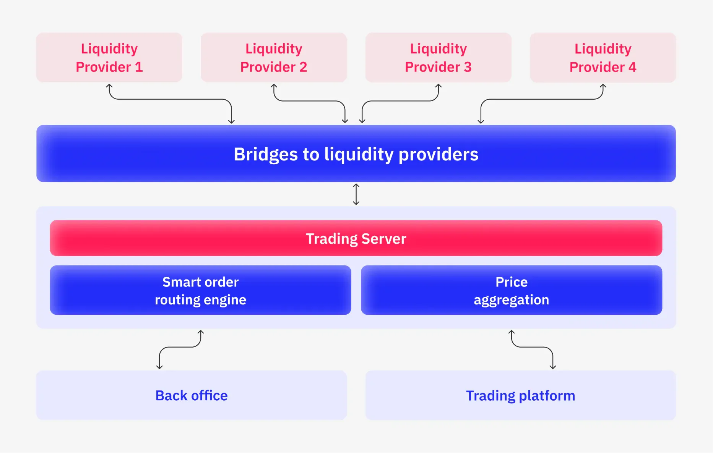

## Table of Contents

## What is liquidity aggregation?

Liquidity aggregation is a process used in financial markets to gather and combine liquidity from multiple sources into one pool. This means that instead of trading on just one exchange or platform, traders can access liquidity from many different places at the same time. By doing this, it becomes easier to buy or sell assets quickly and at better prices because there is more competition among the different sources of liquidity.

In simpler terms, think of liquidity aggregation like shopping for the best deal. If you only go to one store, you might not get the best price. But if you can check prices from many stores at once, you're more likely to find a better deal. Liquidity aggregation works the same way by helping traders find the best prices across different markets, making trading more efficient and cost-effective.

## Why is liquidity aggregation important in trading?

Liquidity aggregation is important in trading because it helps traders get the best possible prices for their trades. When you can see and use liquidity from many different places at the same time, you have a better chance of finding someone willing to buy or sell at a good price. This means you can buy things cheaper or sell them for more money than if you were limited to just one place.

It also makes trading faster and easier. If you only have one place to trade, you might have to wait a long time to find someone to trade with. But with [liquidity](/wiki/liquidity-risk-premium) aggregation, you can quickly match with many different buyers and sellers. This reduces the time you spend waiting and makes the whole trading process smoother and more efficient.

## What are the basic components of a liquidity aggregation system?

A liquidity aggregation system has a few main parts that work together to make trading easier and more efficient. The first part is the connection to different liquidity sources, like exchanges, brokers, and other trading platforms. This part makes sure the system can gather information and trade with many places at the same time. The second part is the price engine, which takes all the prices from these different sources and figures out the best price for buying or selling. This helps traders get the best deals possible.

The third part is the order management system, which handles all the orders that traders place. It sends these orders to the best liquidity source based on the prices found by the price engine. This part makes sure that trades happen quickly and at the best possible prices. The last part is the user interface, which is what traders see and use to place their orders. It needs to be easy to use and show all the important information clearly, so traders can make good decisions quickly.

These parts all work together to make trading smoother and more efficient. By connecting to many liquidity sources, finding the best prices, managing orders well, and providing a clear and easy-to-use interface, a liquidity aggregation system helps traders get better prices and trade faster.

## How does liquidity aggregation improve market efficiency?

Liquidity aggregation improves market efficiency by bringing together prices and trading options from many different places into one place. When traders can see and use liquidity from lots of different sources, they can find the best prices more easily. This means they can buy things for less money and sell things for more money than if they only used one place to trade. By making it easier to find the best prices, liquidity aggregation helps the whole market work better because it encourages more trading and makes sure that prices are fair and competitive.

Another way liquidity aggregation improves market efficiency is by making trading faster and easier. When a trader wants to buy or sell something, they don't have to wait as long to find someone to trade with. The system quickly looks at all the available options and matches the trader with the best one. This reduces the time and effort traders need to spend on each trade, which makes the market more efficient. When trading is fast and easy, more people are likely to trade, which makes the market more active and liquid, leading to even better prices and more efficient trading overall.

## What are the different types of liquidity aggregation techniques?

There are a few main types of liquidity aggregation techniques that traders use to find the best prices and make trading easier. One common technique is called "smart order routing." This means the system looks at prices from different places and sends the order to the place with the best price. Another technique is "[volume](/wiki/volume-trading-strategy)-weighted average price" (VWAP) aggregation, where the system figures out the average price of an asset based on how much is being traded at different places. This helps traders get a fair price that reflects what's happening in the whole market.

Another type of liquidity aggregation is "time-weighted average price" (TWAP) aggregation. This technique spreads out orders over time to get a better average price, which is helpful if the price of an asset changes a lot. Some systems also use "multi-asset aggregation," which means they combine liquidity from different types of assets, like stocks and bonds, to help traders find the best overall deals. Each of these techniques helps traders by making it easier to find good prices and trade quickly.

Overall, the different types of liquidity aggregation techniques help make the market more efficient by giving traders more options and better prices. Whether it's smart order routing, VWAP, TWAP, or multi-asset aggregation, these methods all work to bring together the best parts of different markets into one place. This makes trading easier, faster, and more cost-effective for everyone involved.

## Can you explain how volume-weighted average price (VWAP) aggregation works?

Volume-weighted average price (VWAP) aggregation is a way to find a fair price for trading by looking at how much of an asset is being traded at different places. Imagine you want to buy a toy and you look at different stores to see their prices. But instead of just looking at the price, you also see how many toys each store is selling. If one store sells a lot of toys at a certain price, that price is more important because it shows what most people are willing to pay. VWAP does the same thing for trading. It takes the prices from different places and weighs them based on how much is being traded at each price. This way, you get an average price that reflects what's really happening in the market.

Using VWAP aggregation helps traders get a better idea of the fair value of an asset. For example, if you want to buy a stock, the VWAP will show you a price that considers both the price and the volume of trades happening across different exchanges. This means you're not just looking at the cheapest price, but a price that's more likely to be stable and fair because it's based on a lot of trading activity. By using VWAP, traders can make smarter decisions and avoid buying or selling at prices that might not reflect the true market value.

## What role do algorithms play in liquidity aggregation?

Algorithms are really important for liquidity aggregation because they help make the whole process automatic and quick. When you want to buy or sell something, algorithms look at prices from lots of different places at the same time. They figure out the best price for you by using special math rules. This means you don't have to check each place yourself, which saves a lot of time and helps you get the best deal.

Algorithms also make sure that trades happen fast and at the best possible prices. They can send your order to the place with the best price without you having to do anything. This is really helpful because markets can change quickly, and you want to make sure your trades happen as soon as possible. By using algorithms, liquidity aggregation systems can work smoothly and help traders buy and sell things more easily.

## How do smart order routers enhance liquidity aggregation?

Smart order routers help make liquidity aggregation better by automatically finding the best place to send your trade. They look at prices from many different places all at once and pick the one that gives you the best deal. This means you don't have to check each place yourself, which saves time and helps you get the best price possible. By using smart order routers, you can be sure that your trade will go to the place where you'll get the most money for selling or pay the least for buying.

Another way smart order routers help is by making trading faster and smoother. When you place an order, the smart order router quickly sends it to the best place without you having to wait. This is really important because prices in the market can change fast, and you want your trade to happen as soon as possible. By using smart order routers, liquidity aggregation systems can work better and help traders buy and sell things more easily and efficiently.

## What are the challenges faced in implementing liquidity aggregation techniques?

Implementing liquidity aggregation techniques can be tricky because it involves connecting to many different places where trading happens. Each place might have different rules and ways of doing things, which can make it hard to gather all the information and send orders to the right spots. Also, keeping everything up to date and working smoothly is a big job. If one part of the system stops working, it can slow down or mess up the whole process, which means traders might not get the best prices or have to wait longer to make their trades.

Another challenge is making sure the system is safe and secure. When you're dealing with a lot of money and important information, you need to make sure no one can hack into the system or steal data. This means using strong security measures and always checking for any weak spots. Plus, the system needs to be able to handle a lot of trades at the same time without slowing down. If too many people try to trade at once, the system might get overwhelmed and not work as well as it should. So, making sure everything runs smoothly and safely is a big challenge in liquidity aggregation.

## How can liquidity aggregation be optimized for high-frequency trading?

Liquidity aggregation can be optimized for high-frequency trading by making the system very fast and able to handle a lot of trades at the same time. High-frequency trading means doing many trades very quickly, so the system needs to be able to look at prices from different places and send orders almost instantly. To do this, the system can use special computers that are really good at doing math and sending information quickly. It's also important to have a strong connection to all the places where trading happens, so there's no delay in getting prices or sending orders.

Another way to optimize liquidity aggregation for high-frequency trading is by using smart algorithms that can make decisions very fast. These algorithms can look at a lot of information and figure out the best place to send each trade in just a few moments. They can also change their decisions quickly if the market changes. By using these fast and smart algorithms, the system can help traders get the best prices and make trades happen as fast as possible, which is really important for high-frequency trading.

## What advanced technologies are being used to improve liquidity aggregation?

Advanced technologies like [artificial intelligence](/wiki/ai-artificial-intelligence) (AI) and [machine learning](/wiki/machine-learning) are being used to make liquidity aggregation better. These technologies help the system learn from past trades and get smarter over time. They can look at a lot of information very quickly and find patterns that humans might miss. This means the system can make better decisions about where to send trades and when to do it, which helps traders get the best prices and make trades faster.

Another technology that's helping is called cloud computing. It lets the system use a lot of computers at the same time, which makes it faster and able to handle more trades. With cloud computing, the system can also be more reliable because if one computer has a problem, others can take over. This is really important for high-frequency trading, where even a small delay can make a big difference. By using these advanced technologies, liquidity aggregation systems can work better and help traders make the most of their trades.

## How do regulatory frameworks impact the development and use of liquidity aggregation techniques?

Regulatory frameworks play a big role in how liquidity aggregation techniques are developed and used. Rules from places like the government or financial watchdogs can affect what kinds of trades can be made and how they're done. For example, some rules might say that trades need to be reported in a certain way or that only certain people can use liquidity aggregation systems. These rules are there to make sure trading is fair and safe, but they can also make it harder to set up and use these systems. Developers have to make sure their systems follow all the rules, which can take a lot of time and money.

On the other hand, regulatory frameworks can also help make liquidity aggregation better. By setting clear rules, regulators can make the market more transparent and fair, which can encourage more people to use liquidity aggregation. This can lead to more competition and better prices for everyone. Also, rules about security and data protection can help keep trading safe and protect traders' information. So, while regulations can create challenges, they can also help make liquidity aggregation more effective and trusted by everyone in the market.

## References & Further Reading

[1]: Moosa, I. A., & Ramiah, V. (2016). ["The Economics of High-Frequency Trading: Algorithmic Trading and Market Dynamics."](https://www.semanticscholar.org/paper/The-regulation-of-high-frequency-trading%3A-A-view-Moosa/8b276137102fc50a9f0ddedf0b9821d76c931cfc) Palgrave Macmillan.

[2]: Vaidyanathan, R. (2013). ["Algorithmic Trading: Winning Strategies and Their Rationale."](https://www.wiley.com/en-us/Algorithmic+Trading%3A+Winning+Strategies+and+Their+Rationale-p-9781118460146) 21st Century Books.

[3]: Narang, R. (2009). ["Inside the Black Box: The Simple Truth About Quantitative Trading."](https://onlinelibrary.wiley.com/doi/book/10.1002/9781118267738) Wiley.

[4]: Aldridge, I. (2013). ["High-Frequency Trading: A Practical Guide to Algorithmic Strategies and Trading Systems."](https://www.amazon.com/High-Frequency-Trading-Practical-Algorithmic-Strategies/dp/1118343506) Wiley.

[5]: Garcia, R., & Gencay, R. (2009). ["High Frequency Financial Econometrics."](https://shop.elsevier.com/books/an-introduction-to-high-frequency-finance/gencay/978-0-12-279671-5) Wiley.