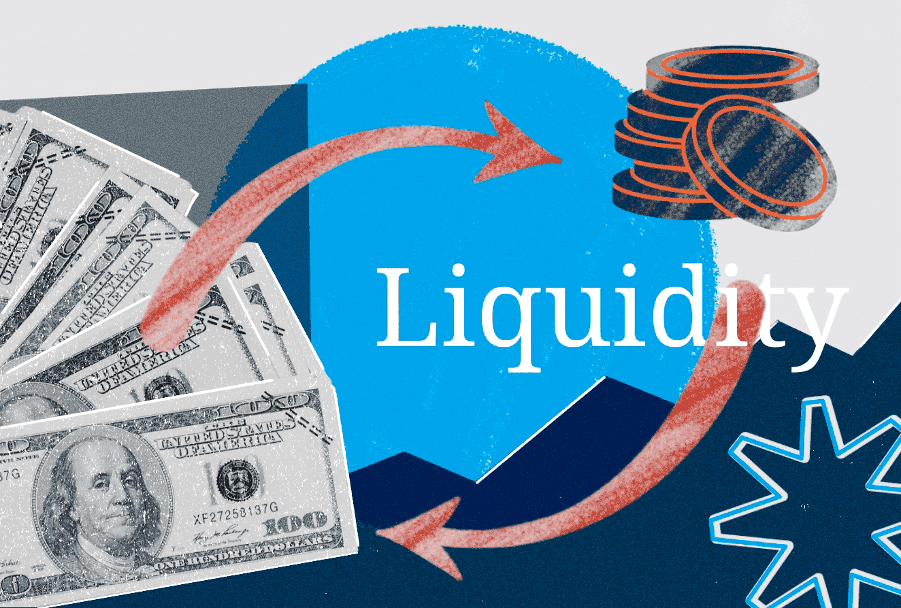

Liquidity consumption in algorithmic trading refers to the impact that trading algorithms have on the available liquidity in the financial markets. Liquidity is a critical component in trading as it represents the ease with which assets can be bought or sold in the market without causing significant price changes. For traders, high liquidity ensures that large orders can be executed with minimal price disruption, making it a cornerstone for both efficiency and stability in financial markets.

In the context of trading, liquidity is essential because it facilitates smoother transactions and maintains market stability. When liquidity is ample, market participants can execute large trades without causing dramatic shifts in asset prices. This ability is crucial as it allows for accurate price discovery and limits volatility, thereby reducing the risk for investors. A liquid market signifies the presence of numerous buyers and sellers, resulting in tighter bid-ask spreads and deeper market depth, which further aid in efficient trading operations.

The introduction of algorithms in modern trading has revolutionized how liquidity is interacted with. Algorithms, particularly in algorithmic trading, are designed to execute trades automatically based on predefined criteria, which can range from simple rule-based systems to complex predictive models. These algorithms are capable of processing vast amounts of data at high speeds, allowing for rapid decision-making and execution that aligns with market conditions. As such, algorithms can both supply liquidity, by setting bid and ask prices, and consume it by executing trades swiftly. Their activities inherently influence market liquidity, sometimes enhancing it through market-making practices, while at other times consuming it, as seen in high-frequency trading.

The objective of this article is to explore how algorithmic trading affects liquidity consumption. We aim to understand the dual role algorithms play in providing and consuming liquidity, and how this impacts overall market conditions. Additionally, we will look at strategies to manage liquidity consumption effectively and the role of regulatory measures in monitoring algorithmic trading activities. This exploration is crucial for both understanding and optimizing trading practices in contemporary financial markets.

## Table of Contents

## Understanding Liquidity in Financial Markets

Liquidity in financial markets refers to the ease with which assets can be bought or sold in a market without causing a significant change in the asset's price. It is a crucial indicator of market health and efficiency, affecting trading decisions and market stability. 

One primary indicator of liquidity is market depth, which represents the market's ability to absorb large order volumes without substantial price changes. Market depth is determined by the number and size of buy and sell orders at various price levels. A market with significant depth can handle large transactions smoothly, whereas a shallow market may experience price volatility with similar transactions.

Another critical indicator is the bid-ask spread, defined as the difference between the highest price a buyer is willing to pay for an asset (bid) and the lowest price a seller is willing to accept (ask). A narrow bid-ask spread usually implies a liquid market, as prices at which one can buy and sell are closer. In contrast, a wide bid-ask spread indicates a less liquid market with potential higher costs for executing trades.

Several factors influence [liquidity](/wiki/liquidity-risk-premium) in financial markets. Market participants, such as individual traders, institutional investors, and market makers, contribute to liquidity by providing buy and sell orders. Higher trading volumes typically enhance liquidity as more transactions occur, allowing assets to change hands with less price disruption. Market structure, including the design of trading platforms and regulatory frameworks, also affects liquidity. Well-structured markets encourage participation and order flow, bolstering liquidity.

The consequences of low liquidity can be adverse, leading to increased [volatility](/wiki/volatility-trading-strategies) and the potential for wider bid-ask spreads. When liquidity is low, even small trades can result in significant price swings, creating an unstable market environment. This volatility complicates price discovery and impairs market efficiency, making it difficult for traders to enter or [exit](/wiki/exit-strategy) positions without incurring substantial slippage.

Liquidity providers, such as dealers and market makers, play a vital role in maintaining market efficiency by offering buy and sell orders that add depth to the market. They bridge the gap between buyers and sellers, reducing transaction costs and enhancing price stability. By providing liquidity, these participants improve market conditions, facilitating smoother and more predictable trading.

## Algorithmic Trading: A Modern Approach

Algorithmic trading, often referred to as algo-trading, involves the use of computer algorithms to automatically execute trades based on predefined criteria. This modern approach to trading has evolved significantly since its inception, largely due to advances in technology and the increasing complexity of financial markets. At its core, [algorithmic trading](/wiki/algorithmic-trading) aims to execute orders at optimal prices, with minimal market impact and reduced trading costs. 

The foundation of algorithmic trading lies in its ability to perform trades using a set of predetermined rules. These rules, encoded in algorithms, can include criteria such as timing, price, and quantity of the trade. For instance, an algorithm might be programmed to purchase an asset once its price falls below a certain threshold and sell when it rises above a specific level. By automating these processes, algorithms can execute trades at speeds and frequencies far beyond human capability, which is particularly advantageous in fast-paced market environments.

Various types of trading algorithms have been developed to cater to different trading strategies. Market-making algorithms, for example, continuously provide bid and ask quotes to capture the spread between them. These algorithms play a crucial role in enhancing market liquidity. Trend-following algorithms, on the other hand, capitalize on the persistence of market trends, executing trades in line with the market's direction. Statistical [arbitrage](/wiki/arbitrage) algorithms exploit pricing inefficiencies between related securities, identifying discrepancies and executing trades to make a profit.

Algorithmic trading offers numerous benefits, such as increased speed and efficiency in trade execution. By removing the need for manual intervention, algorithms minimize the risk of human error and psychological biases that can adversely affect trading decisions. Additionally, these algorithms can process large volumes of data and execute trades in fractions of a second, which is essential for maintaining competitiveness in markets where latency is a critical [factor](/wiki/factor-investing).

However, algorithmic trading also faces several challenges and criticisms. One of the primary concerns is the occurrence of flash crashes, where algorithms execute large volumes of trades in mere moments, leading to drastic and rapid price fluctuations. Such incidents can destabilize markets and erode investor confidence. Moreover, there are concerns related to market manipulation, where sophisticated algorithms can potentially exploit minor market movements to create misleading price signals.

Regulatory bodies have raised issues surrounding transparency and fairness, urging for increased oversight and controls to mitigate these risks. As algorithmic trading continues to evolve, the financial industry must address these challenges to ensure market integrity and stability. Through continuous innovation and regulation, the positive impact of algorithmic trading on market efficiency can be maximized while mitigating the associated risks.

## How Algorithmic Trading Impacts Liquidity

Algorithmic trading plays a significant role in both providing and consuming liquidity within financial markets. Algorithms designed for trading can perform trades at speeds and efficiencies unattainable by human traders, thereby influencing market liquidity in multifaceted ways.

High-frequency trading ([HFT](/wiki/high-frequency-trading-strategies)) algorithms are particularly influential in this context. These algorithms are capable of executing trades in fractions of a second, enabling them to both add and remove liquidity almost instantaneously. When HFT algorithms act as liquidity providers, they submit numerous buy and sell orders, which can narrow the bid-ask spread and enhance market depth. This activity is often seen as beneficial during normal market conditions, as it promotes tighter spreads and increased liquidity. However, the same algorithms can also consume liquidity just as quickly, particularly during periods of market stress or high volatility. In such scenarios, HFT algorithms might withdraw orders to mitigate risk, leading to widened bid-ask spreads and reduced market depth.

The impact of algorithmic trading on the bid-ask spread and market depth is significant. By providing continuous quoting and trading, HFT algorithms help maintain a liquid market environment under typical conditions. Yet, this dynamic can shift rapidly with the onset of market stress. During these times, the propensity for algorithms to switch from liquidity providing to liquidity consuming can exacerbate volatility and contribute to a dramatic reduction in market stability.

Several case studies and research findings illustrate these effects. For example, during flash crashes—sudden, deep, and rapid market declines—algorithmic trading has been shown to amplify price movements. Research indicates that in periods of extreme stress, liquidity provision by HFTs may deteriorate as market participants become increasingly risk-averse.

From a regulatory standpoint, understanding and monitoring the influence of algorithmic trading on liquidity is crucial. Regulatory bodies have implemented measures to ensure that algorithmic trading does not disrupt market integrity. These include circuit breakers and minimum tick sizes aimed at controlling excessive volatility and reducing the risk of market manipulation. Continuous monitoring and adaptation of regulatory frameworks are necessary to address the evolving nature of algorithm-driven market environments and to maintain a balanced ecosystem.

In conclusion, algorithmic trading holds a dual capability in impacting liquidity—it can both enhance and detract from market stability. The challenge lies in carefully managing these influences through both innovative trading strategies and vigilant regulatory oversight.

## Strategies for Managing Liquidity Consumption

To effectively manage liquidity consumption within algorithmic trading, traders and firms employ a variety of strategies and tools designed to optimize the sourcing and use of liquidity.

### Smart Order Routing (SOR)

One of the primary tools used to manage liquidity consumption is Smart Order Routing (SOR). SOR technologies enhance liquidity sourcing by automatically determining the best venues and methods to execute trades based on real-time market conditions. These systems analyze data across multiple exchanges and trading platforms to identify opportunities where the order could be executed at optimal prices and without significantly impacting the market. For example, an SOR might split a large order into smaller parts to execute across different venues, thereby minimizing price impact and slippage.

### Dark Pools and Crossing Networks

Dark pools and crossing networks are non-public trading venues that provide liquidity with minimal market impact. Their use is primarily to execute large orders without revealing the full size to the wider market, which can help prevent adverse price movements. In these venues, orders are matched internally, providing a private alternative to open exchanges. This reduces the likelihood of slippage and provides an additional layer of privacy, which is particularly beneficial for institutional traders dealing with large volumes.

### Real-Time Data Analytics and Monitoring

The role of real-time data analytics is critical in managing liquidity consumption effectively. Traders use advanced analytics and monitoring tools to gather and interpret vast amounts of market data as it unfolds. These systems provide insights into market trends, [order book](/wiki/order-book-trading-strategies) dynamics, and potential liquidity constraints, enabling traders to make informed decisions quickly. The ability to adapt trading strategies based on live data helps mitigate risks associated with rapid market changes and unexpected liquidity shortages.

### Risk Management Practices

Effective risk management practices are essential in mitigating the risks associated with liquidity consumption in algorithmic trading. Traders and firms often implement pre-trade risk assessments to analyze the potential impact of their trades on the market. Post-trade analytics also play a crucial role in reviewing the effectiveness of the executed trades and making necessary adjustments to strategies. Moreover, setting thresholds and using volatility metrics can help traders manage execution risks better.

In summary, the combination of smart order routing, dark pools, real-time data analytics, and robust risk management practices enables traders to manage liquidity consumption effectively, ensuring that algorithmic trading contributes positively to market efficiency and stability.

## Conclusion

In this article, we've explored the complex dynamics of liquidity consumption in algorithmic trading, examining its profound implications on financial markets. A key takeaway is the critical interplay between algorithmic activity and market liquidity. Algorithmic trading, while offering advantages in speed and efficiency, can both provide and consume liquidity, affecting market depth and bid-ask spreads. Understanding this relationship is crucial for traders to execute large orders smoothly and for maintaining market stability.

To further benefit from algorithmic trading, it is essential to invest in ongoing research and development. By doing so, market participants can refine algorithms to better adapt to varying market conditions, thus enhancing their positive impact on liquidity. Regulators and market participants play a pivotal role in ensuring that these technologies contribute to an efficient financial ecosystem, emphasizing the need for appropriate oversight and transparent practices.

Finally, as technology and market dynamics continue to evolve, traders and firms must remain vigilant and adaptable. By considering future technological advancements and shifts in market structure in their strategies, stakeholders can better navigate the challenges and opportunities presented by algorithmic trading, ensuring sustained market efficiency and liquidity.

## References & Further Reading

[1]: Aldridge, I. (2013). ["High-Frequency Trading: A Practical Guide to Algorithmic Strategies and Trading Systems."](https://www.amazon.com/High-Frequency-Trading-Practical-Algorithmic-Strategies/dp/1118343506) Wiley.

[2]: Narang, R. (2009). ["Inside the Black Box: A Simple Guide to Quantitative and High Frequency Trading."](https://onlinelibrary.wiley.com/doi/book/10.1002/9781118267738) Wiley.

[3]: Easley, D., López de Prado, M. M., & O'Hara, M. (2011). ["The Microstructure of the 'Flash Crash': Flow Toxicity, Liquidity Crashes, and the Probability of Informed Trading."](https://papers.ssrn.com/sol3/papers.cfm?abstract_id=1695041) The Journal of Portfolio Management.

[4]: Cartea, Á., & Penalva, J. (2012). ["Where is the Value in High Frequency Trading?"](https://papers.ssrn.com/sol3/papers.cfm?abstract_id=1712765) The Journal of Trading, 39(1), 39-52.

[5]: Gomber, P., Arndt, B., Lutat, M., & Uhle, T. (2011). ["High-Frequency Trading."](https://papers.ssrn.com/sol3/papers.cfm?abstract_id=1858626) Business & Information Systems Engineering, 3(2), 53-57.