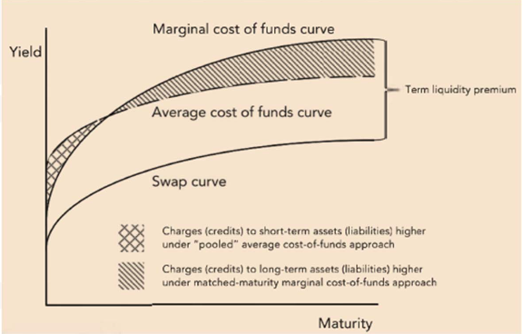

## Table of Contents

## What is a liquidity cost curve?

A liquidity cost curve is a graph that shows how much it costs to buy or sell a certain amount of an asset quickly. Imagine you want to sell a lot of shares of a company's stock. If you try to sell them all at once, the price might go down because there aren't enough buyers at the current price. This drop in price is the liquidity cost, and the curve helps you see how this cost changes with the amount you want to trade.

The curve is useful for traders and investors because it helps them understand the trade-off between the speed of their trade and the cost they have to pay. For example, if you need to sell a large amount of stock very quickly, you might have to accept a lower price. The liquidity cost curve shows this relationship clearly, helping people make better decisions about when and how much to trade.

## Why are liquidity cost curves important in financial markets?

Liquidity cost curves are important in financial markets because they help traders and investors understand how much it will cost them to buy or sell a large amount of an asset quickly. If someone wants to sell a lot of shares fast, the price might drop because there aren't enough buyers at the current price. The liquidity cost curve shows this drop in price, which is the cost of liquidity. By looking at the curve, traders can see how much the price might change if they trade a big amount, helping them decide if it's worth it to trade quickly or if they should take their time.

These curves are also useful for planning and managing risk. If a trader knows how the cost of liquidity changes with the size of their trade, they can plan their trades better. For example, if they need to sell a large number of shares, they might choose to do it slowly over time to avoid a big drop in price. This helps them manage their risk better and avoid losing too much money on the trade. Understanding liquidity costs can lead to smarter trading decisions and better overall market performance.

## How do liquidity cost curves differ from supply and demand curves?

Liquidity cost curves and supply and demand curves both help us understand how prices work, but they show different things. A supply and demand curve shows how the price of something changes based on how much people want it (demand) and how much is available (supply). If more people want something, the price goes up. If there's more of it available, the price goes down. These curves help us see the overall balance between what people want and what's available.

On the other hand, a liquidity cost curve focuses on the cost of trading a large amount of an asset quickly. It shows how the price might change if you try to buy or sell a lot of something all at once. For example, if you want to sell a lot of shares fast, the price might drop because there aren't enough buyers at the current price. This drop in price is the liquidity cost. So, while supply and demand curves show the general price level based on overall market conditions, liquidity cost curves show the specific cost of trading large amounts quickly.

## What factors influence the shape of a liquidity cost curve?

The shape of a liquidity cost curve is influenced by several factors. One big [factor](/wiki/factor-investing) is how many people are trading the asset. If lots of people are buying and selling, it's easier to trade a big amount without changing the price too much. This makes the curve flatter because the cost of trading quickly is lower. On the other hand, if not many people are trading, it's harder to sell a big amount without dropping the price a lot. This makes the curve steeper because the cost of trading quickly is higher.

Another factor is how easy it is to find someone to trade with. If there are lots of buyers and sellers ready to trade at any time, the curve will be flatter. But if it's hard to find someone to trade with, the curve will be steeper. The type of asset also matters. Stocks of big companies usually have flatter curves because lots of people trade them. But stocks of smaller companies might have steeper curves because fewer people trade them. All these things together decide how the liquidity cost curve looks.

## Can you explain the concept of liquidity using a simple example?

Imagine you have a collection of baseball cards. You want to sell them quickly to buy a new bike. If lots of people want to buy baseball cards and there are many people selling them too, you can sell your cards fast without having to lower the price much. This is because the market for baseball cards is very liquid. It's easy to turn your cards into cash because there are plenty of buyers and sellers.

Now, think about if you had a rare stamp instead. Not many people collect stamps, and even fewer are looking to buy one right now. If you need to sell it quickly, you might have to lower the price a lot to find a buyer. This is because the market for rare stamps is not very liquid. It's hard to turn your stamp into cash quickly without losing value. So, liquidity is all about how easy it is to buy or sell something without affecting its price too much.

## How do liquidity cost curves impact trading strategies?

Liquidity cost curves help traders figure out the best way to buy or sell a lot of something. If a trader needs to sell a big amount of stock quickly, the curve shows how much the price might drop. This helps them decide if it's better to sell everything at once and accept a lower price, or if they should sell the stock slowly over time to keep the price higher. By understanding the liquidity cost, traders can make smarter choices about when and how to trade.

For example, if the liquidity cost curve is steep, it means the price will drop a lot if a trader tries to sell a big amount quickly. In this case, the trader might choose to break up the sale into smaller parts and spread it out over time. This way, they can avoid a big drop in price and get a better overall price for their stock. Understanding liquidity costs helps traders manage their risks and make more money in the long run.

## What are the common methods used to estimate liquidity cost curves?

One common way to estimate liquidity cost curves is by looking at how much the price changes when people trade a lot of something. Traders might look at past trades to see how the price moved when big amounts were bought or sold. This helps them guess how the price might change if they do the same thing. Another way is to use special formulas that take into account how many people are trading and how easy it is to find someone to trade with. These formulas help traders predict the cost of trading quickly.

Another method is to use computer models that simulate trading. These models can show what might happen if a trader tries to buy or sell a big amount all at once. By running lots of different scenarios, traders can see how the price might change and plan their trades better. All these methods help traders understand the cost of liquidity and make smarter decisions about when and how to trade.

## How do market conditions affect liquidity cost curves?

Market conditions play a big role in shaping liquidity cost curves. When the market is busy with lots of people buying and selling, it's easier to trade a big amount without changing the price too much. This makes the liquidity cost curve flatter because the cost of trading quickly is lower. For example, during times when the stock market is doing well and everyone wants to trade, the curve will be flatter because there are plenty of buyers and sellers.

On the other hand, when the market is quiet and not many people are trading, it can be harder to sell a big amount without dropping the price a lot. This makes the liquidity cost curve steeper because the cost of trading quickly is higher. For instance, if there's bad news about the economy and people are scared to trade, the curve will be steeper because there are fewer buyers and sellers. So, market conditions like how busy the market is and how people feel about trading can really change the shape of the liquidity cost curve.

## What role do liquidity cost curves play in asset pricing models?

Liquidity cost curves help people understand how easy or hard it is to buy or sell a lot of an asset quickly. In asset pricing models, these curves are important because they show how much the price might change if someone wants to trade a big amount. If the curve is flat, it means the price won't change much, so the asset is easy to trade. But if the curve is steep, it means the price will drop a lot if someone tries to sell a big amount quickly, making the asset harder to trade. This information helps people decide how much an asset is really worth, because they need to think about the cost of trading it.

Asset pricing models try to figure out the true value of an asset by looking at many things, like how much people want it and how much is available. Liquidity cost curves add another piece to this puzzle by showing the cost of trading quickly. If an asset has a steep liquidity cost curve, it might be seen as less valuable because it's harder to sell without losing money. On the other hand, an asset with a flat curve might be seen as more valuable because it's easier to trade without big price changes. So, understanding liquidity cost curves helps people make better guesses about what an asset is really worth.

## How can liquidity cost curves be used to assess market efficiency?

Liquidity cost curves help us see how well a market works by showing how easy it is to buy or sell a lot of something quickly. If the curve is flat, it means you can trade a big amount without the price changing much. This shows that the market is efficient because there are lots of people ready to buy and sell, making it easy to trade without big price changes. On the other hand, if the curve is steep, it means the price will drop a lot if you try to sell a big amount quickly. This shows that the market is not very efficient because it's hard to find someone to trade with, and big trades can mess up the price.

By looking at liquidity cost curves, we can tell if a market is working well or not. If the curves are flat for many different assets, it means the market is efficient overall. People can trade what they want without worrying too much about the price changing. But if the curves are steep, it means the market might have problems. It could be hard to trade certain things, and this can make people less confident in the market. So, liquidity cost curves give us a good way to check how efficient a market is and help us understand how well it's working.

## What advanced statistical techniques are used to model liquidity cost curves?

To model liquidity cost curves, people often use something called regression analysis. This is a way to look at past trades and see how the price changed when big amounts were bought or sold. By using regression, they can make a formula that predicts how much the price might change if someone tries to trade a big amount quickly. This helps them understand the cost of liquidity and plan their trades better. Another method is called time series analysis, which looks at how prices change over time. This can show patterns in how the market reacts to big trades and help predict what might happen in the future.

Sometimes, people use [machine learning](/wiki/machine-learning) to model liquidity cost curves. Machine learning is like teaching a computer to find patterns in data. By feeding the computer lots of information about past trades, it can learn how the price changes when big amounts are traded. This can make the predictions more accurate because the computer can find patterns that might be hard for people to see. All these methods help traders understand the cost of trading quickly and make better decisions about when and how to trade.

## How do liquidity cost curves vary across different asset classes?

Liquidity cost curves can look very different depending on the type of asset you're trading. For example, stocks of big companies usually have flatter curves. This means if you want to sell a lot of these stocks quickly, the price won't drop much. That's because lots of people trade these stocks, so it's easy to find buyers. On the other hand, stocks of smaller companies might have steeper curves. If you try to sell a lot of these stocks fast, the price might drop a lot because not many people are trading them, making it hard to find buyers.

Bonds and commodities can also have different liquidity cost curves. Government bonds often have flatter curves because they are traded a lot and are seen as safe investments. This makes it easier to buy or sell them without big price changes. Commodities like oil or gold might have steeper curves, especially if they are not traded as often or if there's a lot of uncertainty in the market. When the market is unsure, people might not want to trade as much, making it harder to sell a big amount quickly without dropping the price. So, the type of asset really matters when it comes to how easy or hard it is to trade a lot of it quickly.

## What are liquidity cost curves?

Liquidity cost curves are mathematical constructs that provide crucial insights into the cost dynamics associated with trading different quantities of an asset. These curves serve as vital tools for traders, enabling them to estimate the cost implications of executing trades of various sizes. By depicting how trading costs escalate with the increase in trade volumes, liquidity cost curves offer a visual and quantitative representation that is instrumental in strategic trade planning.

At their core, liquidity cost curves are designed to represent the relationship between trade size and the corresponding market impact cost. The basic premise is that larger trades tend to exert more pressure on the market, thus increasing the expenses incurred from executing the trade. This is typically due to factors such as wider bid-ask spreads and reduced market depth when attempting to buy or sell substantial quantities of an asset.

The cost of executing a trade can be conceptually visualized using a function $C(x)$, where $x$ represents the trade size, and $C(x)$ denotes the total trading cost. Mathematically, [liquidity](/wiki/liquidity-risk-premium) cost curves can be expressed as:

$$
C(x) = f(x) + g(x)
$$

Here, $f(x)$ might account for the direct costs associated with trade execution, such as transaction fees, while $g(x)$ represents market impact costs, which increase with trade size.

These curves are invaluable for strategizing best execution practices, providing benchmarks against which traders can measure their trade execution performance. Liquidity cost curves help in making informed decisions on the timing and sizing of orders to minimize market impact and execution costs, thus enhancing the overall efficiency of trading operations.

Through the use of liquidity cost curves, traders can tailor their strategies to align with their specific goals, whether minimizing costs in high-frequency trades or optimizing the execution of large block trades. This strategic application establishes liquidity cost curves as an essential benchmark in evaluating the efficacy of execution strategies, playing a crucial role in modern trading environments.

## How do liquidity cost curves work?

Liquidity cost curves function as a crucial tool in evaluating the cost implications of trading different volumes of an asset. They achieve this by aggregating data from historical trades, providing a robust framework derived from past market behavior. This data integration includes information from the [order book](/wiki/order-book-trading-strategies), capturing the dynamics of bid-ask spreads and market depth, which are key variables influencing the curve's shape and slope.

The core purpose of liquidity cost curves is to offer cost estimations relative to trade size, enabling traders to predict how transaction costs escalate with larger trades. Typically, this relationship is nonlinear: as the size of a trade increases, the cost per unit often increases due to market impact and slippage. This is largely because larger trades are more likely to move market prices adversely against the trader's position.

The mathematical underpinnings of these curves can be visualized using different models, such as linear, piecewise linear, or nonlinear representations. A simple mathematical articulation might express the cost $C$ as a function of trade size $x$: 

$$
C(x) = a + bx + cx^2
$$

where $a$, $b$, and $c$ are coefficients derived from regression analysis on historical data.

The gradient of the curve, or the rate at which costs change with respect to trade size, is particularly important for traders. It allows them to adjust strategies in real-time, optimizing their orders to minimize costs and maximize execution efficiency. For instance, if the gradient becomes very steep, it might signal that executing a larger trade could incur disproportionately higher costs, prompting the trader to reconsider the trade size or execution timing.

The advent of real-time data integration has significantly enhanced the practical utility of liquidity cost curves. Modern trading systems can update curve parameters dynamically, reflecting current market conditions and orders. This dynamism ensures that traders operate with the most accurate and up-to-date information, effectively managing risks associated with rapidly changing market environments. 

In conclusion, liquidity cost curves blend mathematical modeling with real-time market insights, forming an indispensable element of sophisticated trading strategies. By evaluating these curves, traders can forecast costs more accurately, tailor their order strategies, and maintain competitiveness in complex market landscapes.

## References & Further Reading

[1]: Almgren, R., & Chriss, N. (2000). ["Optimal Execution of Portfolio Transactions."](https://smallake.kr/wp-content/uploads/2016/03/optliq.pdf) Journal of Risk, 3(2), 5-39.

[2]: Kissell, R. (2013). ["The Science of Algorithmic Trading and Portfolio Management"](https://www.sciencedirect.com/book/9780124016897/the-science-of-algorithmic-trading-and-portfolio-management). Academic Press.

[3]: Gatheral, J., & Schied, A. (2011). ["Optimal Trade Execution under Geometric Brownian Motion in the Almgren and Chriss Framework."](https://papers.ssrn.com/sol3/papers.cfm?abstract_id=1654151) International Journal of Theoretical and Applied Finance, 14(03), 353-368.

[4]: Bouchaud, J.P., Kockelkoren, J., & Potters, M. (2006). ["Random Walks, Liquidity Molasses and Critical Response in Financial Markets."](https://arxiv.org/abs/cond-mat/0406224) Quantitative Finance, 6(2), 115-123.

[5]: Lopez de Prado, M. (2018). ["Advances in Financial Machine Learning"](https://www.amazon.com/Advances-Financial-Machine-Learning-Marcos/dp/1119482089). Wiley.

[6]: Kissell, R., & Malamut, R. (2006). ["Algorithmic Decision Making Framework."](https://www.semanticscholar.org/paper/Algorithmic-Decision-Making-Framework-Kissell-Malamut/5da40e3ffcf6ca9e60f1cdfa39bad1c0d2290ce5) The Journal of Trading, 1(1), 12-21.