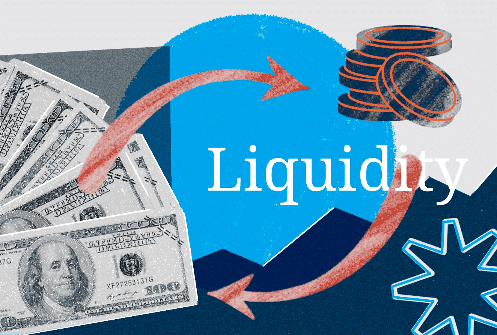

Liquidity cost in the context of algorithmic trading refers to the expenses incurred from executing large orders that may impact the market price, mainly due to limited market depth and bid-ask spreads. Such costs are a critical consideration in trading and financial markets as they directly influence the profitability of trading strategies. High liquidity generally allows traders to buy or sell assets quickly without causing a significant impact on the price, reducing the cost associated with large order executions.

The importance of managing liquidity costs in trading cannot be overstated. These costs form a substantial portion of the total transaction expenses, especially for high-frequency and large-volume trades typical in algorithmic trading. Efficient management of these costs is crucial to retain competitive advantage and optimize returns. Traders and financial institutions continuously seek methods and strategies to minimize liquidity costs, thereby enhancing the efficiency and effectiveness of their trading operations.



This article is structured to provide a comprehensive understanding of liquidity and liquidity costs in algorithmic trading. It begins with a section dedicated to understanding liquidity in financial markets, explaining why liquidity is essential for traders, and how it can differ across various markets and instruments. Following this, the article explores the components of liquidity costs, detailing the main elements like bid-ask spreads and market impact, and discusses how they affect trading expenses. The role of algorithmic trading in managing liquidity is then examined, focusing on how algorithms can both utilize and generate liquidity, with a particular emphasis on liquidity providers and high-frequency trading.

Subsequent sections address the calculation of liquidity costs in algorithmic trading, introduce models and tools employed by traders, and highlight the significance of technology and data in precise cost estimation. The article then outlines strategies to minimize these costs, exploring common approaches and their trade-offs with examples of successful implementation. Finally, challenges and risks associated with liquidity costs are considered, paying attention to low liquidity environments, regulatory issues, and market dynamics, before concluding with a summary and encouragement for ongoing research and optimization efforts in this domain.

## Table of Contents

## Understanding Liquidity in Financial Markets

Liquidity in financial markets refers to the ability to buy or sell an asset without causing a significant change in its price. It is a measure of how quickly and easily an asset can be exchanged for cash. High liquidity implies a large volume of activity in the market and the availability of many buyers and sellers, ensuring that trades can be executed rapidly and with minimal price disruption.

For traders, liquidity is crucial for several reasons. First, it reduces the cost of trading by minimizing the bid-ask spreads, which is the difference between the price at which a buyer is willing to purchase an asset and the price at which a seller is willing to sell it. Tighter spreads mean that traders can enter and exit positions with lower transaction costs. Moreover, high liquidity provides the flexibility to adjust positions quickly in response to market movements or new information, thereby managing risks more effectively.

Liquidity can vary significantly between different markets and financial instruments. In equity markets, large-cap stocks tend to be more liquid compared to small-cap stocks, due to their higher trading volumes and market capitalization. In contrast, the fixed income market, particularly bonds, may experience lower [liquidity](/wiki/liquidity-risk-premium) because trades are less frequent, and the market size for individual securities may be smaller. Furthermore, even in the foreign exchange market, which is generally known for its high liquidity, some currency pairs are more liquid than others. Major pairs like EUR/USD exhibit higher liquidity compared to exotic pairs such as USD/THB.

In essence, the availability and variability of liquidity across markets and instruments influence trading strategies and the ability to implement them effectively. Understanding liquidity dynamics is essential for market participants to manage trading costs, optimize strategies, and maintain effective risk management practices.

## Components of Liquidity Costs

Liquidity costs in [algorithmic trading](/wiki/algorithmic-trading) are pivotal in determining the efficiency and profitability of trading strategies. These costs arise from the frictions inherent in executing trades and are primarily composed of two main components: the bid-ask spread and market impact.

The bid-ask spread is the difference between the price at which participants in the market are willing to sell an asset (ask price) and the price at which they are willing to buy it (bid price). This spread constitutes an immediate cost encountered by traders when entering or exiting a position. For example, if a security has a bid price of $100 and an ask price of $101, purchasing the asset incurs an instant cost of $1 per unit. The spread can vary significantly depending on the liquidity of the asset; highly liquid securities generally exhibit tighter spreads, contributing to lower transaction costs.

Market impact refers to the change in an asset's price caused by the act of trading itself. Large orders, or a series of smaller orders executed rapidly, can move the price unfavorably due to the supply-demand dynamics they introduce. This effect is particularly pronounced in less liquid markets where even moderate trade sizes can significantly alter the price level. Market impact can be quantified by assessing the slippage, which is the difference between the expected price of a trade and the price at which it is executed.

Algorithmic trading strategies are designed to minimize these liquidity costs through various techniques. Minimizing the bid-ask spread typically involves timing trades more effectively, such as executing trades during periods of high market activity when spreads are generally narrower. Some strategies incorporate liquidity-providing tactics, such as posting limit orders rather than market orders, thereby avoiding the immediate cost of crossing the spread.

To mitigate market impact, sophisticated algorithms break down large orders into smaller tranches executed over time. This tactic, known as order slicing, helps in distributing the market presence, reducing the likelihood of noticeable price disturbances. The use of statistical models and real-time data analytics is essential in predicting optimal execution paths that minimize market impact. Algorithms may leverage [machine learning](/wiki/machine-learning) to predict short-term price movements and adjust execution plans dynamically.

Moreover, Volume Weighted Average Price (VWAP) and Time Weighted Average Price (TWAP) are popular execution algorithms designed to achieve trades close to market-average prices by averaging out execution over time or by [volume](/wiki/volume-trading-strategy). These strategies reduce the likelihood of adverse price movements, ensuring a more cost-effective execution.

In conclusion, understanding the components of liquidity costs is crucial for optimizing trading strategies in algorithmic trading. By employing techniques that minimize bid-ask spreads and market impact, traders can enhance the efficiency and success of their trading operations.

## Algorithmic Trading and Liquidity

Algorithmic trading employs computer programs and systems to execute trades based on pre-set criteria and quantitative models. It allows for swift execution of trades, often leveraging market inefficiencies to achieve better pricing and reduced transaction times. Liquidity, defined as the ease with which assets can be bought or sold in the market without causing a significant price change, plays a critical role in algorithmic trading systems. Algorithms are designed to navigate various liquidity scenarios, aiming to optimize trade executions through precise entry and [exit](/wiki/exit-strategy) points.

Algorithms, by nature, both utilize and contribute to liquidity. When a trading algorithm executes a buy order, it consumes existing liquidity. Conversely, when it places an order that another trader can purchase, it provides liquidity. A well-designed algorithmic trading system can achieve a balance where it benefits from market liquidity without excessively impacting prices. This dual role underscores the symbiotic relationship between algorithms and liquidity provision.

High-frequency trading ([HFT](/wiki/high-frequency-trading-strategies)), a subset of algorithmic trading, epitomizes this dual function. HFT firms engage in numerous trades per second, often serving as key liquidity providers in the markets. These firms exploit bid-ask spread changes, facilitating transactions for other market participants. The presence of HFT firms typically enhances market efficiency by tightening spreads, increasing liquidity, and reducing trading costs. However, their rapid trading can occasionally lead to market [volatility](/wiki/volatility-trading-strategies), drawing scrutiny from regulators and market participants alike.

Moreover, specialized liquidity providers use sophisticated algorithms to quote buy and sell prices for various assets, maintaining competitive spreads. Their role is crucial in ensuring continuous market activity, especially in periods of scarcity, thus supporting overall market stability. By providing liquidity, these participants facilitate smoother price discovery and enhance the market's ability to handle large transactions without significant price distortions.

Overall, the interplay between algorithmic trading and liquidity is complex, involving multiple dynamics and strategic considerations. Market participants and liquidity providers continuously adapt to changing conditions, employing technology and innovation to manage liquidity costs effectively. This ongoing evolution drives the development and refinement of algorithmic strategies, ensuring their continued relevance and efficacy in modern financial markets.

## Calculating Liquidity Costs in Algorithmic Trading

Calculating liquidity costs in algorithmic trading is a multifaceted process that involves various methods, models, and technological tools. These calculations are crucial for traders seeking to optimize their strategies and minimize costs associated with trading.

Liquidity costs in algorithmic trading can generally be broken down into two primary components: the bid-ask spread and market impact. To estimate these costs accurately, traders apply different models and analytical tools.

The bid-ask spread is often calculated as the difference between the best available ask price and the best available bid price in the market. This cost is relatively straightforward to quantify, as it is directly observable from the market data.

Market impact, however, is more complex. It refers to the change in the asset price caused by the execution of a trade. To estimate market impact costs, traders use models such as the Almgren-Chriss model, which is designed to minimize transaction costs by optimizing the execution path for large trades. This model considers factors such as trade size, market volatility, and time horizon to provide an estimate of the expected market impact.

Another commonly used method is the implementation shortfall framework, which measures the performance of a trade execution by comparing the price achieved to a benchmark price, such as the opening price, mid-market price, or volume-weighted average price (VWAP). This approach allows traders to assess the cost incurred due to timing delays and market movements.

Technological advancements and data have significantly enhanced the accuracy of liquidity cost calculations. High-frequency data feeds allow traders to capture real-time market conditions, enabling more precise estimations of liquidity and impact costs. Machine learning algorithms are increasingly used to model and predict market behavior, considering a myriad of variables that influence liquidity costs.

Python is often the go-to programming language for developing tools and models for liquidity cost estimation. For instance, using libraries like Pandas for data manipulation, NumPy for numerical computations, and Scikit-learn for implementing machine learning techniques, traders can build robust models to forecast liquidity costs.

Here is a simple example of how one might calculate the bid-ask spread using Python:

```python
import pandas as pd

# Sample market data
market_data = pd.DataFrame({
    'bid_price': [100.5, 100.6, 100.7],
    'ask_price': [100.8, 100.9, 101.0]
})

# Calculate bid-ask spread
market_data['bid_ask_spread'] = market_data['ask_price'] - market_data['bid_price']

print(market_data)
```

Through the combination of models, technology, and data, traders are better equipped to quantify and manage liquidity costs in algorithmic trading. This continuous improvement in calculation methods helps enhance profitability and efficiency in trading strategies.

## Strategies to Minimize Liquidity Costs

Minimizing liquidity costs is a fundamental strategy for enhancing profitability in algorithmic trading. There are several approaches utilized by traders to achieve this goal, each with its own trade-offs and practical implications.

One common strategy is trade slicing, which involves breaking a large order into smaller, more manageable parts to minimize the market impact. This approach allows traders to execute orders over time, blending them into the market flow to avoid significant price movements that can increase costs. The trade-off here is the potential delay in execution and the risk of adverse price movements during the period over which the trades are executed.

Another technique is the use of dark pools, which are private exchanges where large orders can be executed anonymously. Dark pools offer the advantage of reduced market impact, as trades are not visible to the public market. However, this comes at the cost of potential counterparty risk and less price transparency, which can affect the quality of the execution.

Traders also employ smart order routing (SOR) algorithms, which are designed to find the best available prices across multiple trading venues. These algorithms can dynamically adjust order placement based on real-time liquidity conditions, thereby optimizing execution costs. The challenge with SOR is the need for sophisticated technology and real-time data processing capabilities, which might not be accessible to all market participants.

The use of high-frequency trading (HFT) strategies can also be a means to reduce liquidity costs. HFT capitalizes on speed to capture small price discrepancies across markets. These strategies provide liquidity by participating in a large number of transactions with minimal market impact due to their rapid execution times. However, HFT is highly dependent on technological infrastructure and can be influenced by market volatility and regulatory changes.

A notable real-world example of successful liquidity cost minimization is the use of the Arrival Price algorithm by institutional investors. This algorithm aims to minimize the difference between the execution price and the market price at the start of the execution. By adapting the execution rate based on market conditions, the algorithm manages to reduce market impact costs effectively.

In conclusion, while various strategies exist to minimize liquidity costs in algorithmic trading, they all involve inherent trade-offs. Achieving the right balance between cost reduction and execution efficiency requires a careful examination of market conditions, infrastructure capabilities, and risk tolerance. Through continuous optimization and technological advancement, traders can better manage these costs to enhance their trading outcomes.

## Challenges and Risks

Managing liquidity costs in algorithmic trading presents several challenges, given the dynamic nature of financial markets and the reliance on sophisticated technology and strategies. One primary challenge is the accurate estimation and management of liquidity costs, which often requires advanced modeling techniques and real-time data analysis. Traders must account for bid-ask spreads, market impact costs, and potential slippage to effectively manage these costs, making it essential to have precise measurement and optimization tools.

Another significant challenge in managing liquidity costs is navigating low liquidity environments. Markets or instruments with low liquidity are characterized by wide bid-ask spreads and significant price impacts for large trades, resulting in higher execution costs. This environment increases the risk of adverse price movements, making it difficult for traders to enter or exit positions without incurring substantial costs. Low liquidity can exacerbate volatility, leading to erratic price movements and unpredictability that can undermine algorithmic trading strategies.

Regulatory considerations also impact liquidity costs in algorithmic trading. Regulatory changes can alter market dynamics, affect liquidity provision, and impose additional compliance burdens on traders. For instance, regulations designed to increase market transparency or reduce systemic risk may inadvertently reduce liquidity by increasing transaction costs or discouraging market participation. Understanding and adapting to these regulatory changes is crucial for managing liquidity costs effectively.

Market changes and technological advancements continuously reshape liquidity conditions. Algorithmic traders must stay abreast of these changes, adapting their strategies to new market conditions. High-frequency trading firms, as liquidity providers, play a vital role in maintaining market liquidity but also introduce risks of sudden liquidity withdrawal or flash crashes. Maintaining robust risk management and monitoring systems is essential to mitigate these risks and reduce the impact on trading operations.

Overall, managing liquidity costs in algorithmic trading requires a comprehensive understanding of market microstructure, advanced technological tools, and the ability to adapt to an evolving regulatory and market landscape. Continued research and development in these areas are crucial for improving the effectiveness and efficiency of liquidity cost management.

## Conclusion

In this article, we have explored the multifaceted nature of liquidity costs in algorithmic trading. It is evident that understanding and managing these costs is crucial for optimizing trading performance and ensuring profitability. Liquidity costs, comprising elements such as bid-ask spreads and market impact, directly influence the overall trading costs and can significantly affect the outcomes of trading strategies. 

Algorithmic trading, with its capacity to both utilize and provide liquidity, plays a pivotal role in enhancing market efficiency. However, the challenges of accurately calculating and minimizing liquidity costs necessitate the use of sophisticated models and technological tools. As highlighted, traders leverage various strategies to mitigate these costs, balancing the trade-offs inherent in such decisions.

The complexities involved underscore the importance of ongoing research and innovation in this field. As markets evolve and new regulatory frameworks emerge, the ability to adeptly manage liquidity costs will remain a critical determinant of success in algorithmic trading. Encouraging further inquiry and the development of advanced optimization techniques will pave the way for more resilient and adaptive trading practices.

## References & Further Reading

[1]: Bouchaud, J.-P., Farmer, J. D., & Lillo, F. (2009). ["How Markets Slowly Digest Changes in Supply and Demand."](https://arxiv.org/abs/0809.0822) Quantitative Finance, 9, 279-282.

[2]: Kissell, R. (2013). ["The Science of Algorithmic Trading and Portfolio Management."](https://www.sciencedirect.com/book/9780124016897/the-science-of-algorithmic-trading-and-portfolio-management) Academic Press.

[3]: Almgren, R., & Chriss, N. (2000). ["Optimal Execution of Portfolio Transactions."](https://smallake.kr/wp-content/uploads/2016/03/optliq.pdf) Journal of Risk, 3(2), 5-40.

[4]: Hasbrouck, J. (2007). ["Empirical Market Microstructure: The Institutions, Economics, and Econometrics of Securities Trading."](https://academic.oup.com/book/52241) Oxford University Press.

[5]: Cartea, Á., Jaimungal, S., & Penalva, J. (2015). ["Algorithmic and High-Frequency Trading."](https://assets.cambridge.org/97811070/91146/frontmatter/9781107091146_frontmatter.pdf) Cambridge University Press.