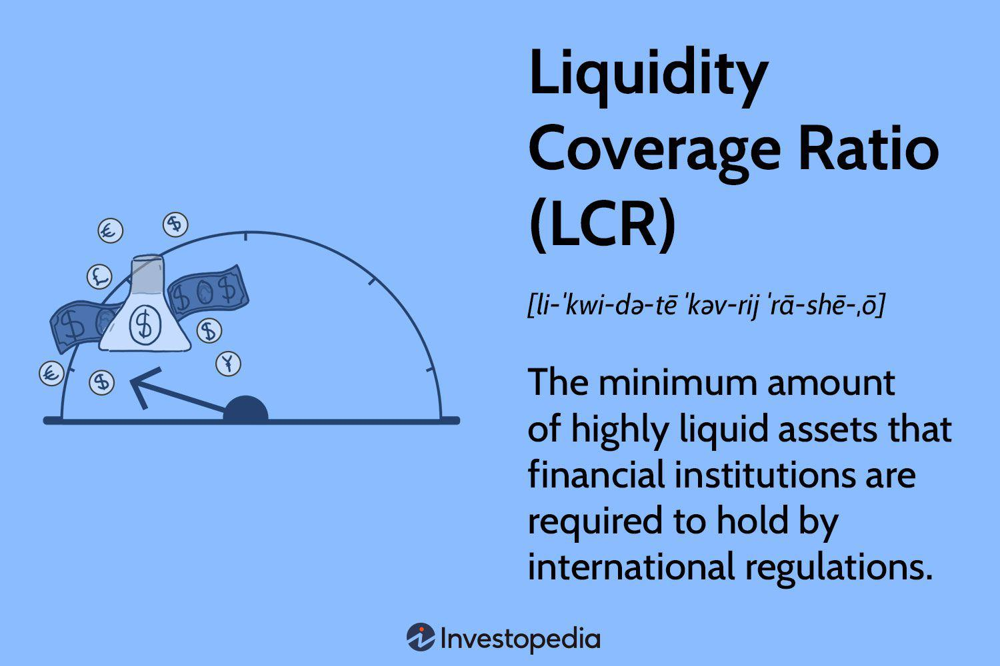

The financial stability of banks is crucial to the global economy, acting as a backbone for both national and international financial systems. One key element ensuring this stability is the Liquidity Coverage Ratio (LCR), a regulatory standard that allows banks to fulfill their short-term obligations, even amidst financial turbulence. Introduced as part of the Basel III regulations by the Basel Committee on Banking Supervision, the LCR aims to prevent financial crises by requiring banks to hold a sufficient amount of high-quality liquid assets (HQLA) to survive a 30-day stress scenario.

This article explores the intricacies of the LCR, detailing its calculation, implementation, and its impact on modern banking, including the role of algorithmic trading in optimizing liquid asset management. Understanding the LCR is essential for anyone studying how banks manage liquidity and maintain regulatory compliance, shedding light on its importance as a safeguard against economic instability. Through this exploration, we gain insights into the contemporary practices of bank regulation and the ways in which financial institutions adapt to evolving global standards.



## Table of Contents

## What is the Liquidity Coverage Ratio (LCR)?

The Liquidity Coverage Ratio (LCR) is a critical regulatory standard formulated under the Basel III Accords by the Basel Committee on Banking Supervision. Its primary aim is to ensure that banks maintain an adequate level of high-quality liquid assets (HQLA) that can be quickly converted into cash under stress conditions, specifically over a 30-day period. This requirement is designed to safeguard banks against immediate financial turmoil, ensuring they possess enough liquidity to manage outflows and survive abrupt economic downturns.

The calculation of LCR is straightforward yet pivotal, defined by the following equation:

$$
\text{LCR} = \frac{\text{Stock of High-Quality Liquid Assets (HQLA)}}{\text{Total Net Cash Outflows over the next 30 days}}
$$

1. **High-Quality Liquid Assets (HQLA)**: These are assets that can be easily and immediately converted into cash with little or no loss of value. They include cash itself, central bank reserves, and certain marketable securities backed by sovereign entities. The assets are further categorized into Level 1 and Level 2 assets, with Level 1 assets like cash and central bank reserves carrying no haircut, while Level 2 assets, such as certain corporate bonds, are subject to a discount reflecting their comparative liquidity and value stability.

2. **Total Net Cash Outflows**: This portion of the calculation encompasses the bank's expected cash outflows minus its anticipated cash inflows within a 30-day period. Key components include liabilities that might arise due to deposit withdrawals, credit commitments, and contractual and non-contractual funding obligations.

The ratio is designed to ensure that banks have a [liquidity](/wiki/liquidity-risk-premium) buffer that is sufficient to offset potential net cash outflows during a significant period of financial stress, thus enhancing the sector's resilience and protecting the broader financial system from shocks. In essence, the LCR acts as a regulatory measure forcing banks to hold a sufficient amount of liquid assets to guarantee their short-term obligations can be met, thereby providing a cushion against systemic risk in times of economic stress.

## Understanding LCR Calculation

High-quality liquid assets (HQLA) form the backbone of the Liquidity Coverage Ratio (LCR). These assets are defined by their ability to be quickly and easily converted into cash with minimal value loss, ensuring a bank's liquidity during times of financial stress. HQLA primarily consist of cash itself, central bank reserves, and government securities, which are considered the most reliable due to their low risk and high marketability. In some frameworks, other assets like highly rated corporate bonds or equities might also be considered, contingent upon specific regulatory criteria.

The LCR is calculated using the formula:

$$
\text{LCR} = \frac{\text{Stock of HQLA}}{\text{Total Net Cash Outflows over the next 30 calendar days}} \geq 100\%
$$

Total net cash outflows are assessed over a short-term period of 30 days. This timeframe is critical because it reflects a period of assumed financial distress. Within this period, banks predict cash outflows by examining liabilities coming due and factoring in potential off-balance sheet obligations. These obligations might include unfunded credit lines or other commitments likely to be called upon under stress conditions. On the other hand, banks also evaluate expected cash inflows that can occur over the same period, typically reducing the net cash outflow figure. However, regulators often apply a haircut to these inflows to maintain a conservative stance.

The methodology for calculating LCR involves several layers, ensuring banks retain sufficient liquid assets to cover potential outflows in stressful scenarios. Stress testing and constant monitoring of cash flow assumptions are essential components of this process. Furthermore, banks might employ sophisticated modeling software to perform real-time analysis and stress-testing, aiding in dynamic LCR management. This ensures not only regulatory compliance but also fortifies the bank against unanticipated market fluctuations.

## Implementation of LCR in Banks

The implementation of the Liquidity Coverage Ratio (LCR) in banks is a critical aspect of the Basel III regulations, aiming to enhance the financial stability of banking institutions by ensuring they have sufficient liquidity to cover their short-term obligations during periods of financial stress. The Basel III accord, developed by the Basel Committee on Banking Supervision, mandates that banks hold a minimum LCR of 100%, meaning they must have enough high-quality liquid assets to cover total net cash outflows over a 30-day stress period.

The rollout of the LCR began with phase-ins starting in 2015, allowing banks to gradually adjust to the new requirements. By 2015, banks were required to maintain an LCR of at least 60%, with this minimum threshold increasing by 10 percentage points each subsequent year until reaching 100% in 2019. This phased approach allowed banks to transition smoothly without causing undue market disruption.

Not all banks are subject to the same LCR requirements. The regulation primarily targets larger institutions with significant asset holdings, typically those with total consolidated assets exceeding $250 billion or foreign exposures beyond $10 billion. These thresholds ensure that banks with a greater potential impact on the financial system maintain sufficient liquidity to prevent systemic risks.

Effective implementation of the LCR is essential not just for individual banks but for the stability of the financial system as a whole. By imposing a liquidity buffer, the LCR reduces the risk of bank runs and enhances the resilience of banks against shocks. This inturn minimizes the ripple effects on market stability and ultimately, the global economy.

Moreover, LCR compliance requires banks to regularly report their liquidity positions to regulators, fostering transparency and informed oversight. This regulatory framework not only safeguards individual institutions but also provides a standardized measure for comparing the liquidity preparedness across banks globally.

## LCR vs. Other Liquidity Ratios

The Liquidity Coverage Ratio (LCR) is fundamentally different from other liquidity ratios such as the current ratio, quick ratio, and cash flow ratios due to its specific focus and regulatory nature. General liquidity ratios are primarily designed to assess a company's ability to meet short-term obligations by comparing liquid assets to liabilities. For instance:

1. **Current Ratio**: This is calculated as the ratio of a company's current assets to its current liabilities. It provides a general indication of a company's short-term financial health and ability to cover its short-term liabilities with its short-term assets. 
$$
   \text{Current Ratio} = \frac{\text{Current Assets}}{\text{Current Liabilities}}

$$

2. **Quick Ratio**: Also known as the acid-test ratio, it refines the current ratio by excluding inventory from current assets, focusing on the most liquid assets a company possesses.
$$
   \text{Quick Ratio} = \frac{\text{Current Assets} - \text{Inventory}}{\text{Current Liabilities}}

$$

3. **Cash Flow Ratios**: These assess a company's ability to generate cash to meet its short-term liabilities through operations. The cash flow coverage ratio, for instance, examines the cash a company generates through its operations relative to its total debt.
$$
   \text{Cash Flow Coverage Ratio} = \frac{\text{Operating Cash Flow}}{\text{Total Debt}}

$$

While these ratios provide valuable insights into a company's liquidity positions, they are not designed specifically for banks and fall short in scenarios of financial stress or systemic crisis. 

In contrast, the LCR is explicitly formulated to gauge a bank’s capacity to endure short-term financial stress over a 30-day period by ensuring that it has sufficient high-quality liquid assets (HQLA) to cover its net cash outflows. This makes the LCR not just a measure of liquidity, but a regulatory standard integral to maintaining economic and financial stability globally. Unlike the general liquidity ratios, which are largely applied on a discretionary basis depending on the sector and company, the LCR is more prescriptive and mandated by international regulatory frameworks such as Basel III. This reflects its role as a global standard, compelling banks to adhere strictly to its guidelines to bolster resilience during potential liquidity crises. This regulatory focus distinguishes the LCR, underscoring its significance in modern banking practices particularly in preventing bank failures and in maintaining systemic financial stability.

## Limitations of LCR

A major criticism of the Liquidity Coverage Ratio (LCR) is that it may necessitate banks to maintain higher levels of cash or other high-quality liquid assets (HQLA), which can lead to a reduction in loan issuance. The fundamental idea behind this regulatory measure is to ensure banks can meet their short-term obligations during periods of financial stress, but this comes with potential implications for economic growth. 

When banks allocate a larger portion of their balance sheets to liquid assets to comply with LCR requirements, they may have less capital available for lending to businesses and consumers. This reduced lending capacity can slow down economic growth, as businesses may struggle to obtain financing for expansion and investment, and consumers may find it harder to secure loans for significant purchases such as homes and cars. Therefore, while the LCR is designed to enhance the stability and resilience of the financial system, it could inadvertently constrain economic activity.

Additionally, the effectiveness of the LCR during financial crises is yet to be conclusively proven. The LCR aims to safeguard banks against severe liquidity stress; however, its actual performance in crisis scenarios remains uncertain given the relatively short period since its full implementation in 2019. While the LCR provides a robust framework for liquidity risk management, the real-world dynamics during a crisis can be complex and challenging to model. It is anticipated that future financial upheavals will offer more data to assess the LCR’s capacity to avert crises.

These limitations underscore the need for a balanced approach in financial regulation, where the benefits of increased systemic stability are weighed against potential constraints on economic growth. Ongoing assessments and potential revisions of the LCR could address these issues, ensuring that banking regulation supports both financial stability and sustained economic development.

## LCR in Algorithmic Trading

Algorithmic trading has increasingly become integral to optimizing liquid asset management in banks, particularly concerning the Liquidity Coverage Ratio (LCR). This technology leverages automated software programs designed to execute financial transactions at high speed and [volume](/wiki/volume-trading-strategy), ensuring real-time compliance with regulatory requirements such as the LCR. These automated systems enhance banks' ability to perform LCR calculations accurately and swiftly, incorporating real-time updates and stress testing.

A fundamental advantage of [algorithmic trading](/wiki/algorithmic-trading) systems is their capacity to process vast amounts of data and execute trades faster than human traders, thereby maximizing the yield on liquid assets while ensuring compliance with LCR standards. They analyze market conditions and make split-second decisions on asset allocations to maintain optimal liquidity levels. This level of automation is essential for real-time LCR calculation, allowing banks to respond to market changes immediately and accurately calculate their liquidity position under various scenarios. 

Real-time LCR calculation involves dynamically assessing the stock of High-Quality Liquid Assets (HQLA) against net cash outflows over a 30-day period. Python code can illustrate a simplified version of this process:

```python
def calculate_LCR(HQLA, cash_outflows, cash_inflows):
    net_cash_outflow = cash_outflows - cash_inflows
    LCR = HQLA / net_cash_outflow
    return LCR

HQLA = 200000  # Example amount of high-quality liquid assets in dollars
cash_outflows = 180000  # Expected cash outflows over the next 30 days
cash_inflows = 50000  # Expected cash inflows over the next 30 days

lcr = calculate_LCR(HQLA, cash_outflows, cash_inflows)
print(f"The LCR is: {lcr:.2f}")
```

In addition to optimizing real-time calculations, algorithmic tools also facilitate comprehensive stress testing by simulating various market scenarios to assess a bank's robustness under potential financial distress. These simulations help banks preemptively adjust their strategies to maintain an adequate liquidity buffer. By integrating algorithmic trading into their liquidity management practices, banks not only enhance compliance with regulatory standards but also optimize their asset yield, thereby achieving a balance between regulatory adherence and profitability. 

Overall, the integration of algorithmic trading systems into liquidity management processes enables banks to maintain financial stability and meet their regulatory obligations with greater efficiency and precision.

## Conclusion

The Liquidity Coverage Ratio (LCR) has emerged as a pivotal component of banking regulation, primarily designed to shield the financial system from potential crises. By compelling banks to maintain a reserve of high-quality liquid assets, the LCR ensures that these institutions are better equipped to weather short-term liquidity disruptions. This framework not only provides a safety net for banks but also reinforces the broader financial system's stability, reflecting the lessons learned from past economic downturns.

Through its implementation, LCR offers valuable insights into contemporary bank management techniques and exemplifies the global regulatory efforts to harmonize banking practices. Banks are now incentivized to prioritize liquidity and are better prepared to meet their financial obligations without resorting to emergency measures. This regulatory approach underscores the importance of liquidity management as a strategic priority, rather than a mere compliance obligation.

As the banking industry is constantly evolving—faced with technological advances and shifting economic landscapes—the role of LCR remains critical. Adaptive mechanisms such as algorithmic trading further enhance the effectiveness of LCR by optimizing liquid asset management in real-time. These innovations ensure that banks don't just comply with regulatory standards but also maximize their operational efficiency.

In sum, the LCR is more than just a regulatory requirement; it is a fundamental safeguard that anchors financial institutions, fostering a stable economic environment. As technology and market conditions continue to advance, the LCR's adaptability and core principles will sustain its relevance, anchoring the pillars of economic stability for the future.

## References & Further Reading

[1]: Basel Committee on Banking Supervision. (2013). ["Basel III: The Liquidity Coverage Ratio and liquidity risk monitoring tools."](https://www.bis.org/publ/bcbs238.htm) Bank for International Settlements.

[2]: Shaffer, S. (2012). ["Bank Liquidity Requirements: An Introduction and Overview."](https://www.brookings.edu/articles/bank-liquidity-requirements-an-introduction-and-overview/) Federal Reserve Bank of Saint Louis Working Paper Series.

[3]: Matz, L., & Neu, P. (2007). ["Liquidity Risk Measurement and Management: Basel III and Beyond."](https://onlinelibrary.wiley.com/doi/book/10.1002/9781118390399) John Wiley & Sons.

[4]: Drehmann, M., & Nikolaou, K. (2013). ["Funding liquidity risk: Definition and measurement."](https://www.sciencedirect.com/science/article/pii/S0378426612000039) European Central Bank Working Paper Series.

[5]: Schroeck, G. (2002). ["Risk Management and Value Creation in Financial Institutions."](https://books.google.com/books/about/Risk_Management_and_Value_Creation_in_Fi.html?id=cDmtUnYhacUC) John Wiley & Sons.

[6]: Bank for International Settlements. (2010). ["Basel III: International framework for liquidity risk measurement, standards and monitoring."](https://www.bis.org/publ/bcbs188.htm)

[7]: Lopez de Prado, M. (2018). ["Advances in Financial Machine Learning."](https://books.google.com/books/about/Advances_in_Financial_Machine_Learning.html?id=oU9KDwAAQBAJ) Wiley.