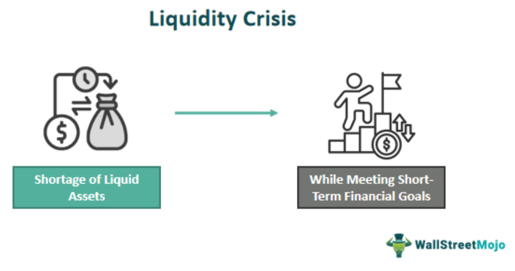

## Table of Contents

## What is a liquidity crisis?

A liquidity crisis happens when there isn't enough money or easily tradable assets available to meet the demands of people who need to withdraw or use their funds. Imagine you have money in a bank, but when you go to take it out, the bank can't give it to you because it doesn't have enough cash on hand. This can happen to banks, businesses, or even whole countries when they can't convert their assets into cash quickly enough.

This situation can cause big problems. People might panic and try to get their money out all at once, which can make the crisis worse. If a lot of people can't get their money, businesses might not be able to pay their bills or workers, and this can lead to more economic trouble. Governments and central banks often step in to help by providing emergency funds or changing rules to make it easier for money to flow.

## How does insufficient short-term cash flow lead to a liquidity crisis?

When a business or a bank doesn't have enough short-term cash, it can lead to a liquidity crisis. Short-term cash is the money that's needed to pay for everyday things like salaries, bills, and other immediate expenses. If there's not enough of this cash, the business might not be able to pay what it owes on time. This can make people worried and they might start asking for their money back all at once, which puts even more pressure on the business's cash reserves.

If this problem keeps growing, it can turn into a full-blown [liquidity](/wiki/liquidity-risk-premium) crisis. People and other businesses that have money with the struggling company will want to take their money out quickly. But if the company can't sell its assets fast enough to get cash, it won't be able to give everyone their money back. This can cause panic, and if many people are affected, it can spread to other businesses and even the whole economy, making the crisis much bigger.

## What are the common causes of a liquidity crisis?

A liquidity crisis can happen for different reasons. One common cause is when too many people want to take their money out of a bank or a business at the same time. This is called a bank run. If the bank doesn't have enough cash on hand to give to everyone, it can lead to a liquidity crisis. Another reason is when a business can't sell its things quickly enough to get cash. If it can't pay its bills because it's waiting for money to come in, this can also cause problems.

Economic problems can also lead to a liquidity crisis. For example, if the economy is doing badly, businesses might struggle to sell their products. This means they won't have enough money coming in to pay for what they need right away. Also, if interest rates go up suddenly, borrowing money becomes more expensive. This can make it harder for businesses to get the cash they need to keep going. All these things together can make a liquidity crisis more likely to happen.

## What industries are most vulnerable to liquidity crises?

Some industries are more likely to face liquidity crises because of how they work. For example, banks are very vulnerable. They take money from people and lend it out. If everyone wants their money back at the same time, the bank might not have enough cash to give to everyone. This can start a big problem because people might panic and try to take out even more money. Real estate is another industry that can have trouble with liquidity. It can take a long time to sell a house or a building, and if a real estate company needs cash quickly, it might not be able to get it fast enough.

Other industries that can be hit hard by liquidity crises include retail and manufacturing. Retail stores need money to buy new products to sell. If they can't sell their products quickly, they might not have enough cash to buy more. This can lead to a situation where they can't pay their bills or their workers. Manufacturing companies also need cash to buy materials and pay for production. If they can't sell what they make quickly, they might run out of money to keep going. Both of these industries can get into trouble if they don't have enough cash coming in to cover their short-term needs.

## How can a business identify early signs of a liquidity crisis?

A business can spot early signs of a liquidity crisis by watching its cash flow closely. If the business is having trouble paying its bills on time, this could be a warning sign. For example, if suppliers start asking for payment more often or if the business has to delay paying its workers, these are signs that there might not be enough cash coming in to cover what needs to go out. Another sign is if the business has to borrow more money just to keep running, especially if it's having trouble getting loans or if the interest rates are going up.

Another way to see early signs is by looking at how quickly the business can turn its stuff into cash. If it's taking longer to sell products or collect money from customers, this can lead to a cash shortage. Also, if the business is selling things at a discount just to get cash quickly, that's another warning. Keeping an eye on these things can help a business act fast to avoid a bigger problem. By managing cash carefully and planning ahead, a business can try to prevent a liquidity crisis from happening.

## What are the immediate steps a company should take during a liquidity crisis?

When a company is in a liquidity crisis, the first thing it should do is find out how much cash it has right now and how much it will need soon. This means looking at all the money coming in and going out. The company might need to talk to its bank about getting a short-term loan to help with the immediate cash needs. It's also important to talk to suppliers and see if they can wait a bit longer for their payments or agree to different payment terms.

Next, the company should try to speed up how quickly it gets money from customers. This could mean offering discounts for early payments or being more strict about when payments are due. It might also need to sell some things it owns quickly, even if it means selling them for less than they're worth, just to get cash fast. During this time, the company should also think about cutting costs wherever possible, like reducing spending on things that aren't necessary right now. By taking these steps, the company can try to get through the crisis and keep running.

## How do liquidity crises affect the broader economy?

When a liquidity crisis hits a business or a bank, it can start to affect the whole economy. If a big company can't pay its bills because it doesn't have enough cash, it might have to lay off workers. Those workers will have less money to spend, which can hurt other businesses that rely on their spending. This can create a chain reaction where more and more businesses struggle, and the economy slows down. If banks are involved, people might start to worry about their savings and try to take out all their money at once. This can lead to more bank runs and make the crisis worse, spreading fear and uncertainty throughout the economy.

Governments and central banks usually step in to help during a liquidity crisis. They might give emergency loans to banks or businesses to keep them running. They can also change rules to make it easier for money to move around. But even with help, a liquidity crisis can lead to less spending and investing, which can slow down economic growth. If the crisis is bad enough, it can even lead to a recession, where the economy shrinks and many people lose their jobs. So, a liquidity crisis in one part of the economy can have big effects on everyone.

## What are the long-term strategies to prevent liquidity crises?

To prevent liquidity crises over the long term, businesses need to keep a close eye on their cash flow. This means always knowing how much money is coming in and going out. A good way to do this is by making a cash flow plan that shows what the business expects to happen with its money in the future. This plan can help the business see when it might run into trouble and take steps to avoid it. Another important strategy is to keep some money saved up for emergencies. This emergency fund can help the business get through tough times without running out of cash. Also, having good relationships with banks and suppliers can help. If the business needs a loan or more time to pay its bills, these relationships can make it easier to get help.

Another long-term strategy is to manage the business's debts carefully. This means not borrowing too much money and making sure that the business can pay back what it owes on time. It's also a good idea to spread out when debts need to be paid so that the business doesn't have to pay back a lot of money all at once. Keeping a balance between what the business owns and what it owes can help prevent a liquidity crisis. Lastly, the business should always be ready to change its plans if something unexpected happens. By being flexible and ready to adapt, the business can better handle any problems that come up and keep its cash flowing smoothly.

## How do financial ratios help in assessing liquidity risk?

Financial ratios are like health checks for a business's money situation. They help figure out if a business has enough cash to pay its bills and keep running smoothly. One important ratio is the current ratio, which compares what a business owns (its assets) to what it owes (its liabilities) in the short term. If the current ratio is high, it means the business has more than enough money to cover its bills. Another ratio is the quick ratio, which is similar but doesn't count things that might take a while to turn into cash, like inventory. A good quick ratio shows that the business can pay its bills even if it can't sell its stuff right away.

Another useful ratio is the cash ratio, which looks at how much actual cash a business has compared to what it needs to pay right away. This ratio is very strict because it only counts cash and doesn't include other things that could be turned into cash. A high cash ratio means the business is in a strong position to handle a sudden need for cash. By keeping an eye on these ratios, a business can see early signs of trouble and take steps to avoid a liquidity crisis. Regularly checking these ratios helps a business stay healthy and ready for any money problems that might come up.

## What role do central banks play in managing liquidity crises?

Central banks are very important when it comes to handling liquidity crises. They act like the big helpers of the economy. When a bank or a business is in trouble and can't pay its bills because it doesn't have enough cash, the central bank can step in. They can give out emergency loans to banks to help them have enough money to give to people who want to take out their savings. This helps stop people from panicking and trying to take out all their money at once, which can make the crisis worse.

Central banks also have other ways to help. They can change the rules about how much money banks need to keep on hand, making it easier for money to move around. They can also change interest rates, making it cheaper for businesses to borrow money when they need it. By doing these things, central banks can help keep the economy stable and prevent a liquidity crisis from spreading and causing more problems. Their actions can make a big difference in keeping things running smoothly during tough times.

## How can advanced financial modeling predict liquidity crises?

Advanced financial modeling can help predict liquidity crises by looking at a lot of information about a business's money situation. These models use numbers and data to make guesses about what might happen in the future. They can show how much cash a business will have coming in and going out, and they can warn if there might not be enough money to pay bills. By using past data and looking at different situations that could happen, these models can help spot early signs of trouble. For example, if the model sees that a business might have trouble selling its products or getting money from customers, it can predict a possible cash shortage.

These models can also help businesses plan ahead. By running different scenarios, they can see what would happen if interest rates go up, if the economy slows down, or if there are other big changes. This helps businesses get ready for problems before they happen. If the model shows that a business might run out of cash in the future, the business can take steps like saving more money, borrowing less, or finding other ways to get cash quickly. By using advanced financial modeling, businesses can be better prepared and avoid a liquidity crisis.

## What are the global case studies of liquidity crises and their outcomes?

One big example of a liquidity crisis happened in 2008 with the global financial crisis. It started in the United States when many people couldn't pay back their home loans. Banks had given out a lot of these loans and when people couldn't pay, the banks didn't have enough money. This led to a big problem because many banks were in trouble at the same time. The crisis spread all over the world, causing businesses to fail and many people to lose their jobs. Governments and central banks had to step in with a lot of money to help the banks and try to fix the economy. It took years for things to get better, but eventually, new rules were made to try to stop it from happening again.

Another example is the Asian financial crisis in 1997. It started in Thailand when the country ran out of money to pay its debts. This made people worry about other countries in Asia, and soon, many of them were in trouble too. Banks and businesses couldn't get loans, and the value of their money went down a lot. Many people lost their jobs and the economies in these countries got very weak. The International Monetary Fund (IMF) and other countries helped by giving loans and advice on how to fix things. It took time, but the countries slowly got better. They learned to keep more money saved up and to be more careful with borrowing.

A more recent example is the liquidity crisis that hit some businesses during the COVID-19 pandemic in 2020. When the virus started spreading, many businesses had to close down. They couldn't sell their products or services, so they didn't have enough money coming in to pay their bills. Governments around the world gave out money to help these businesses stay open. Central banks also made it easier for businesses to borrow money. While many businesses still had a hard time, the help from governments and central banks prevented an even bigger crisis. It showed how important it is to have plans ready for unexpected problems.

## References & Further Reading

[1]: U.S. Securities and Exchange Commission & Commodity Futures Trading Commission (2010). ["Findings Regarding the Market Events of May 6, 2010."](https://www.sec.gov/news/studies/2010/marketevents-report.pdf) 

[2]: de Prado, M. L. (2018). ["Advances in Financial Machine Learning."](https://www.amazon.com/Advances-Financial-Machine-Learning-Marcos/dp/1119482089) Wiley.

[3]: Chan, E. P. (2008). ["Quantitative Trading: How to Build Your Own Algorithmic Trading Business."](https://github.com/ftvision/quant_trading_echan_book) Wiley.

[4]: Jansen, S. (2020). ["Machine Learning for Algorithmic Trading."](https://github.com/stefan-jansen/machine-learning-for-trading) Packt Publishing.

[5]: Aronson, D. (2007). ["Evidence-Based Technical Analysis: Applying the Scientific Method and Statistical Inference to Trading Signals."](https://www.amazon.com/Evidence-Based-Technical-Analysis-Scientific-Statistical/dp/0470008741) Wiley.