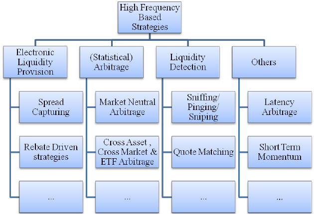

## Table of Contents

## What is liquidity in financial markets?

Liquidity in financial markets refers to how easily you can buy or sell an asset without causing a big change in its price. Think of it like a busy market where you can quickly sell your goods at a fair price because there are lots of buyers and sellers. If a market is liquid, it means there are enough people trading that you can get in and out of your investments without waiting too long or losing much money.

On the other hand, if a market is not liquid, it can be hard to sell your assets quickly. You might have to wait a long time to find a buyer, or you might have to lower your price a lot just to make a sale. This is like trying to sell something rare or unusual at a small local market where few people are interested. Low liquidity can make trading riskier and more costly, so it's an important thing to consider when investing.

## Why is liquidity detection important for traders and investors?

Liquidity detection is important for traders and investors because it helps them know how easily they can buy or sell assets. If a market has high liquidity, it means there are lots of buyers and sellers, so you can trade quickly and at a fair price. This is good because it reduces the risk of losing money due to big price changes when you want to make a trade. Traders and investors can feel more confident making decisions in a liquid market because they know they can get in and out of their investments without much trouble.

On the other hand, if a market has low liquidity, it can be risky. It might take a long time to find someone to buy or sell to, and you might have to accept a lower price just to make the trade happen. This can lead to bigger losses or missed opportunities. By detecting liquidity, traders and investors can avoid these risks and plan their strategies better. They can choose to invest in more liquid assets or be more careful when dealing with less liquid ones, helping them manage their money more wisely.

## What are the basic principles behind liquidity detection algorithms?

Liquidity detection algorithms work by looking at how easy it is to buy or sell something in the market. They check things like how many people are buying and selling, how quickly trades are happening, and how much the price changes when someone makes a trade. If there are lots of buyers and sellers, and prices stay pretty steady, the market is probably liquid. But if there are only a few people trading and prices jump around a lot, then the market might not be very liquid.

These algorithms often use numbers to measure liquidity, like the bid-ask spread, which is the difference between the highest price someone is willing to pay and the lowest price someone is willing to sell at. A small bid-ask spread usually means the market is liquid because it's easy to make a trade without losing much money. Another number they look at is trading volume, which is how many trades are happening. High trading volume can mean the market is liquid because there are lots of people trading. By looking at these and other numbers, liquidity detection algorithms help traders and investors understand how easy it will be to buy or sell their assets.

## Can you explain the difference between market liquidity and asset liquidity?

Market liquidity is about how easy it is to buy or sell things in a whole market. It looks at how many people are trading and how quickly they can make trades without changing the price too much. If a market is liquid, there are lots of buyers and sellers, so you can trade your stuff quickly and at a good price. For example, the stock market for big companies like Apple or Microsoft is usually very liquid because lots of people want to buy and sell their stocks.

Asset liquidity, on the other hand, is about how easy it is to buy or sell a specific thing, like a single stock or a piece of real estate. Some assets, like stocks of big companies, are very liquid because lots of people want them. But other assets, like a rare painting or a house in a small town, might not be liquid because fewer people are interested in buying them. So, while market liquidity is about the overall ease of trading in a market, asset liquidity focuses on how easy it is to trade a particular item.

## What are some common metrics used to measure liquidity?

Some common metrics used to measure liquidity include the bid-ask spread, trading volume, and market depth. The bid-ask spread is the difference between the highest price someone is willing to pay for an asset (the bid) and the lowest price someone is willing to sell it for (the ask). A smaller bid-ask spread means the asset is more liquid because you can buy or sell it without losing much money. Trading volume is another important metric, which shows how many shares or units of an asset are being traded over a certain time, like a day. High trading volume usually means the market is liquid because lots of people are buying and selling.

Market depth is another metric that looks at how many buy and sell orders are waiting in the market at different price levels. If there are lots of orders, it means the market can handle big trades without the price changing too much, which is a sign of good liquidity. These metrics help traders and investors figure out how easy it will be to buy or sell an asset. By looking at these numbers, they can make better decisions and avoid getting stuck with assets they can't sell quickly or at a good price.

## How do liquidity detection algorithms use order book data?

Liquidity detection algorithms use order book data to see how many people want to buy or sell an asset at different prices. The order book is like a list that shows all the buy and sell orders waiting in the market. By looking at this list, the algorithms can see if there are lots of orders close to the current price, which means the market is liquid. If there are only a few orders, or if they are far away from the current price, it might mean the market isn't very liquid.

These algorithms look at things like the bid-ask spread in the order book, which is the difference between the highest price someone wants to buy at and the lowest price someone wants to sell at. A small spread usually means the market is liquid because you can make a trade without losing much money. They also check the depth of the order book, which is how many orders are waiting at different price levels. If there are lots of orders at prices close to the current price, it means the market can handle big trades without the price changing too much, which is a sign of good liquidity.

## What role do volume and volatility play in liquidity detection?

Volume is really important for figuring out how liquid a market is. It's just the number of trades happening in a certain time, like how many shares of a stock are bought and sold in a day. If lots of people are trading, that's a sign the market is liquid. It means there are enough buyers and sellers that you can quickly buy or sell your stuff without waiting too long or losing much money. So, when liquidity detection algorithms look at volume, they're trying to see if there's enough activity in the market to make trading easy.

Volatility also plays a big role in liquidity detection. Volatility is how much the price of something goes up and down. If prices are jumping around a lot, it can mean the market isn't very liquid. When there aren't many people trading, even small trades can make the price change a lot, which makes it harder and riskier to buy or sell. So, algorithms look at volatility to see if the market is stable enough for easy trading. If the price stays pretty steady, it's a good sign that the market is liquid because lots of people are trading and keeping things balanced.

## How can machine learning enhance the performance of liquidity detection algorithms?

Machine learning can make liquidity detection algorithms better by learning from lots of data. These algorithms can look at things like how many people are buying and selling, how quickly prices change, and how much stuff is being traded. By studying this data over time, machine learning can find patterns that tell it when a market is liquid or not. This means it can predict how easy it will be to buy or sell things better than if it just looked at the numbers right now. It's like having a smart friend who remembers what happened before and uses that to guess what will happen next.

Also, machine learning can keep getting better as it sees more data. If the market changes or new things start affecting liquidity, the algorithm can learn from that and adjust how it works. This makes it more flexible and accurate over time. Traders and investors can use these improved predictions to make smarter choices about when to buy or sell, helping them manage their money better and avoid getting stuck with things they can't sell easily.

## What are the challenges in detecting liquidity in less transparent markets?

Detecting liquidity in less transparent markets can be really tough. These markets don't have a lot of information available, so it's hard to know how many people want to buy or sell something. Without clear data, it's tricky to figure out how easy it will be to trade. For example, in markets for things like rare art or small local businesses, there might not be many people trading, and the prices might not be public. This makes it hard to see if there's enough activity to call the market liquid.

Another challenge is that less transparent markets often have bigger gaps between what people want to buy at and what people want to sell at. This is called the bid-ask spread, and it can be a lot wider when there aren't many trades happening. If you can't see a lot of orders waiting in the market, it's hard to know if you'll be able to sell something quickly without losing money. So, detecting liquidity in these markets means dealing with a lot of unknowns and trying to make the best guesses with the little information you have.

## How do high-frequency trading strategies incorporate liquidity detection?

High-frequency trading strategies use liquidity detection to make quick and smart trades. These strategies rely on computers to buy and sell things very fast, sometimes in just milliseconds. To do this, they need to know if the market is liquid, meaning there are lots of people trading so they can get in and out of their trades quickly without losing much money. By using algorithms that look at things like how many trades are happening and how much the price is changing, high-frequency traders can figure out the best times to trade. This helps them make more money and avoid getting stuck with something they can't sell easily.

Liquidity detection is also important for high-frequency traders because it helps them manage risk. If the market isn't very liquid, it can be risky to trade because prices might change a lot when they try to buy or sell. By keeping an eye on liquidity, high-frequency traders can adjust their strategies to avoid these risky situations. They might trade less or choose different assets that are more liquid. This way, they can keep trading fast and safely, making the most of the opportunities in the market.

## What are the regulatory considerations for using liquidity detection algorithms?

When using liquidity detection algorithms, there are some rules and regulations that traders and investors need to follow. These rules are there to make sure the market stays fair and that everyone can trade without being tricked or hurt. For example, some countries have laws about how much information you have to share when you use these algorithms. They want to make sure that everyone knows what's happening in the market and that no one is hiding important details. Also, there might be rules about how fast you can trade or how much you can trade at once, to stop people from using these algorithms to mess up the market.

Another thing to think about is that regulators want to make sure these algorithms don't cause problems. Sometimes, if lots of people are using the same kind of algorithm, it can lead to big changes in the market that hurt everyone. So, there are rules about testing these algorithms before using them in the real market. Regulators might also watch how these algorithms are used to make sure they're not causing trouble. By following these rules, traders and investors can use liquidity detection algorithms to help them make better decisions, while also keeping the market safe and fair for everyone.

## How do advanced liquidity detection algorithms adapt to market microstructure changes?

Advanced liquidity detection algorithms are smart because they can change how they work when the market changes. The market microstructure is all about how trading happens, like how many people are buying and selling, how quickly trades are made, and how prices change. If these things start to change, the algorithms can learn from the new data and adjust their way of figuring out liquidity. They might look at different numbers or use new ways to guess how easy it will be to buy or sell something. This helps them stay accurate and useful even when the market is different from before.

These algorithms use machine learning to get better over time. As they see more data, they can spot new patterns and learn from them. For example, if a new rule changes how people trade, the algorithm can see how this affects liquidity and then change its predictions. This means traders and investors can keep using these algorithms to make smart choices, even when the market is changing. By adapting to new situations, these advanced algorithms help people trade more confidently and avoid getting stuck with things they can't sell easily.

## How do liquidity detection algorithms work?

Liquidity detection algorithms operate by meticulously analyzing market data to identify the most advantageous venue and timing for trade execution. They leverage complex mathematical models and machine learning techniques to forecast the availability and flow of liquidity. These predictions are critical in ensuring large trades are executed efficiently, minimizing market impact and slippage.

The core mechanism of liquidity detection algorithms involves processing a vast array of data sources to gauge liquidity conditions accurately. Key data points include market [volatility](/wiki/volatility-trading-strategies), [order book](/wiki/order-book-trading-strategies) depth, and historical trade patterns. By integrating these variables, the algorithms can develop robust trading strategies that adjust dynamically to real-time market conditions.

Mathematical models are at the heart of these algorithms, utilizing statistical methods such as regression analysis, time-series forecasting, and stochastic processes to assess liquidity. For instance, using a linear regression model, an algorithm might predict future liquidity levels by analyzing historical price and [volume](/wiki/volume-trading-strategy) data:

$$
\text{Liquidity}_{t} = \beta_0 + \beta_1 \times \text{Price}_{t-1} + \beta_2 \times \text{Volume}_{t-1} + \epsilon_t
$$

Where $\text{Liquidity}_{t}$ is the predicted liquidity at time $t$, $\text{Price}_{t-1}$ and $\text{Volume}_{t-1}$ are lagged price and volume data, and $\epsilon_t$ represents the error term.

Machine learning enhances this predictive capability by allowing algorithms to learn from historical data and adapt to changes. Techniques such as neural networks or support vector machines (SVM) are often employed to capture complex, non-linear relationships within the data. For example, a [neural network](/wiki/neural-network) model may take inputs such as order book imbalances and macroeconomic indicators to forecast liquidity shifts.

Moreover, these algorithms continuously refine their strategies by [backtesting](/wiki/backtesting) against historical data, ensuring that their models remain relevant in dynamic market conditions. They also consider the interplay between various asset classes and geographic markets to optimize execution readiness.

The technology powering these algorithms extends beyond data aggregation and analysis. It includes real-time processing engines capable of execution decisions with minimal latency, ensuring traders can respond promptly to market developments. This is often implemented in high-frequency trading systems where speed is paramount.

The success of liquidity detection algorithms is contingent upon their ability to synthesize diverse data inputs and predictive models, continuously calibrating them to the evolving financial landscape. Through advanced analytics and machine learning, they offer a strategic edge in efficiently executing sizeable trades without disrupting market order.

## References & Further Reading

[1]: ["Advances in Financial Machine Learning"](https://www.amazon.com/Advances-Financial-Machine-Learning-Marcos/dp/1119482089) by Marcos Lopez de Prado

[2]: Aldridge, I. (2013). ["High-Frequency Trading: A Practical Guide to Algorithmic Strategies and Trading Systems"](https://www.wiley.com/en-us/High+Frequency+Trading%3A+A+Practical+Guide+to+Algorithmic+Strategies+and+Trading+Systems%2C+2nd+Edition-p-9781118343500). Wiley.

[3]: Chakraborty, M., & Kok, C. H. (2019). ["The Role of High-Frequency Trading in Fragmented Markets."](https://www.emerald.com/insight/content/doi/10.1108/jrim-06-2018-0080/full/html) International Journal of Central Banking.

[4]: Cartea, Á., Jaimungal, S., & Penalva, J. (2015). ["Algorithmic and High-Frequency Trading"](https://assets.cambridge.org/97811070/91146/frontmatter/9781107091146_frontmatter.pdf). Cambridge University Press.

[5]: Bouchaud, J. P., Gefen, Y., Potters, M., & Wyart, M. (2004). ["Fluctuations and response in financial markets: The subtle nature of 'random' price changes."](https://arxiv.org/abs/cond-mat/0307332) Quantitative Finance.