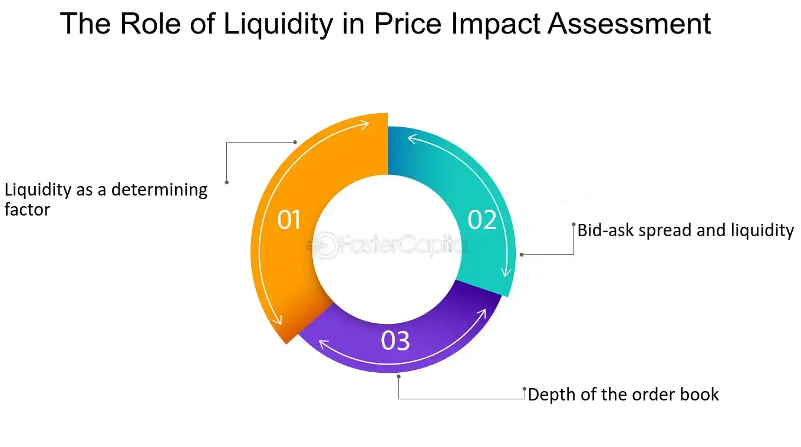

## Table of Contents

## What is liquidity in financial markets?

Liquidity in financial markets refers to how easily you can buy or sell an asset without causing a big change in its price. Think of it like a busy marketplace where you can quickly trade goods. If there are lots of buyers and sellers, it's easy to make a trade at a fair price. This is what we call a liquid market. On the other hand, if there are few people trading, it might be hard to find someone to buy or sell to, and the price might jump around a lot. This is an illiquid market.

Liquidity is important because it affects how safe and efficient trading is. In a liquid market, you can get in and out of trades quickly, which is good if you need to react to changes in the market. It also means that prices are more stable because there are always people ready to buy or sell. For example, stocks of big companies like Apple or Microsoft are usually very liquid because many people trade them. But smaller, less-known companies might have less liquid stocks, making it harder to trade them without affecting the price.

## How does liquidity affect asset prices?

Liquidity can have a big impact on asset prices. When an asset is liquid, it means there are lots of buyers and sellers, so you can trade it easily without moving the price much. This makes the price more stable because there's always someone ready to buy or sell at a fair price. For example, if you want to sell a very liquid stock, you can do it quickly and get a price close to what you see on the market.

On the other hand, if an asset is illiquid, it can be hard to find someone to trade with. This can cause big swings in the price. If you try to sell an illiquid asset, you might have to lower the price a lot to find a buyer. And if you want to buy, you might have to pay more than you expected. So, illiquid assets can be riskier because their prices can change a lot when people try to trade them.

## What is a price impact model?

A price impact model helps us understand how buying or selling a lot of an asset can change its price. Imagine you're at a store and you want to buy all the apples. If you buy a few, the price might stay the same. But if you buy all of them, the store might raise the price because they know you really want them. In financial markets, if you trade a big amount of an asset, it can push the price up or down. A price impact model tries to predict how much the price will change based on how much you're trading.

These models are important for traders and investors because they help them plan their trades better. If someone knows that selling a lot of a stock will make its price drop a lot, they might decide to sell it slowly over time instead of all at once. This way, they can get a better average price. Price impact models use math and data from past trades to make these predictions. They can be simple or very complex, depending on how much detail you need.

## What are the basic components of a liquidity-driven price impact model?

A liquidity-driven price impact model helps us understand how trading a lot of an asset can change its price. The main parts of this model are the size of the trade and how easy it is to trade the asset. If you trade a big amount of an asset, it can push the price up or down. This is because there might not be enough people on the other side of the trade to keep the price steady. The model uses the size of your trade to guess how much the price will move.

The other key part is how liquid the asset is. Liquidity means how easy it is to buy or sell the asset without changing its price a lot. In a liquid market, there are lots of buyers and sellers, so big trades don't move the price much. But in an illiquid market, even small trades can cause big price changes. The model looks at how liquid the asset is to predict the price impact. By thinking about both the trade size and the liquidity, the model can give a good guess on how the price might change.

## How do liquidity-driven price impact models differ from other price impact models?

Liquidity-driven price impact models focus on how easy it is to buy or sell an asset and how the size of a trade can change its price. These models look at how liquid the market is, meaning how many buyers and sellers are around. If there are lots of people trading, the market is liquid, and big trades won't move the price much. But if there are few people trading, the market is illiquid, and even small trades can cause big price changes. So, these models use the size of your trade and the liquidity of the market to predict how the price will move.

Other price impact models might focus on different things. For example, some models might look at how the market reacts to news or big events. These models might use information about the economy or company news to predict price changes. Another type of model might focus on how traders behave, looking at things like how quickly they trade or how much they trade at once. These models try to understand the psychology of trading and how it affects prices. So, while liquidity-driven models focus on the ease of trading and trade size, other models might look at news, events, or trader behavior to predict price impacts.

## What are some common metrics used to measure liquidity in these models?

In liquidity-driven price impact models, common metrics used to measure liquidity include the bid-ask spread and trading volume. The bid-ask spread is the difference between the highest price someone is willing to pay for an asset (the bid) and the lowest price someone is willing to sell it for (the ask). A smaller bid-ask spread means the market is more liquid because it's easier to buy and sell without moving the price much. Trading volume is the total number of shares or contracts traded in a given time. Higher trading volume usually means the market is more liquid because there are more people buying and selling.

Another important metric is market depth, which shows how many buy and sell orders are waiting at different price levels. If there are lots of orders at prices close to the current market price, the market is deep and liquid. This means you can trade larger amounts without causing big price changes. These metrics help models predict how much a trade will affect the price by giving a clear picture of how easy it is to buy or sell an asset.

## Can you explain the concept of market depth in relation to liquidity-driven price impact models?

Market depth is a key part of understanding how liquid a market is, which is important for liquidity-driven price impact models. Think of market depth like a list of orders waiting to buy or sell an asset at different prices. If there are lots of orders close to the current market price, we say the market has good depth. This means if you want to buy or sell a big amount of the asset, you can do it without pushing the price up or down too much. That's because there are enough people ready to trade at prices close to where the market is now.

In liquidity-driven price impact models, market depth helps predict how a big trade will affect the price. If the market has good depth, a big trade won't move the price much because there are plenty of orders to match with. But if the market depth is low, meaning there are few orders at prices near the current market price, a big trade can cause a big price change. This is because there aren't enough people ready to trade at those prices, so the price has to move a lot to find someone to trade with. So, market depth is a big part of figuring out how easy it is to trade an asset and how much a trade will impact its price.

## How do liquidity-driven price impact models account for order book dynamics?

Liquidity-driven price impact models use the order book to understand how a big trade can change an asset's price. The order book is like a list of all the buy and sell orders waiting at different prices. If you want to buy or sell a lot of an asset, you might have to go through many of these orders. If there are lots of orders close to the current price, you can trade without moving the price much. But if there are few orders, you might have to change the price a lot to find someone to trade with. So, the model looks at the order book to see how deep the market is and how much a trade might affect the price.

These models also look at how the order book changes over time. People are always adding new orders or taking away old ones, and this can change how liquid the market is. If lots of new orders come in, the market gets deeper and more liquid, so a big trade won't move the price as much. But if lots of orders are taken away, the market gets thinner and less liquid, so a big trade can cause a bigger price change. By watching how the order book changes, the model can better predict how a trade will impact the price.

## What are some of the challenges in calibrating liquidity-driven price impact models?

Calibrating liquidity-driven price impact models can be tricky because markets are always changing. One big challenge is getting the right data. You need lots of information about past trades, the order book, and how prices moved. But this data can be hard to get, and it might not be perfect. Sometimes, the data you have might not show everything that's happening in the market, like hidden orders or trades that happen off the main market. So, you have to be careful to use the best data you can find and understand its limits.

Another challenge is figuring out how to use the data to make the model work well. Markets can act differently at different times, so a model that works great one day might not work as well the next. You need to keep updating the model to make sure it stays accurate. This means you have to keep testing it and changing it as the market changes. It's like trying to hit a moving target. You also have to think about how different parts of the market might affect each other, which can make the model even harder to calibrate.

## How can liquidity-driven price impact models be used in algorithmic trading strategies?

Liquidity-driven price impact models can be really helpful for people who use computers to trade, which is called algorithmic trading. These models help traders figure out how buying or selling a lot of something will change its price. If a trader knows that selling a big amount of a stock will make its price drop a lot, they might decide to sell it slowly over time instead of all at once. This way, they can get a better average price for their trades. By using these models, traders can plan their trades better and make smarter decisions about when and how much to buy or sell.

These models also help traders understand how easy or hard it is to trade in the market. If the market is very liquid, meaning there are lots of people buying and selling, traders can move in and out of trades quickly without causing big price changes. But if the market is not so liquid, traders might need to be more careful. They might use the models to find the best times to trade or to break up big trades into smaller ones. This way, they can reduce the risk of big price swings and make their trading strategies work better.

## What are the latest research developments in liquidity-driven price impact models?

Recent research in liquidity-driven price impact models has been focusing on making them more accurate and useful. One big area is using machine learning to improve these models. Machine learning can look at lots of data and find patterns that might be hard for people to see. This can help the models predict how a big trade will change the price better. Researchers are also looking at how different types of traders affect the market. For example, some traders might trade a lot in a short time, while others might trade slowly over a longer time. Understanding these different behaviors can help make the models more realistic and useful for real-world trading.

Another area of research is about how these models can work in different markets around the world. Markets in different countries can act differently because of things like rules, culture, and how people trade. Researchers are trying to make models that can work well in many different places. They're also looking at how to use these models with other types of data, like news or social media. This can help the models understand how events outside the market might affect trading and prices. By making these models better and more flexible, researchers hope to help traders make smarter decisions and manage their risks better.

## How do advanced statistical techniques enhance the accuracy of liquidity-driven price impact models?

Advanced statistical techniques help make liquidity-driven price impact models more accurate by using lots of data to find patterns that might be hard to see. These techniques, like machine learning, can look at past trades, order books, and even other information like news or social media to understand how the market works. By finding these patterns, the models can better predict how a big trade will change the price. For example, machine learning can learn from how prices moved after big trades in the past and use that to guess how prices might move in the future.

These techniques also help the models adapt to changes in the market. Markets are always changing, with new traders coming in and old ones leaving, and events happening that can affect prices. Advanced statistics can help the models keep up with these changes by constantly updating and learning from new data. This makes the models more flexible and able to give good predictions even when the market is different from how it was before. By using these advanced techniques, traders can get better information to help them make smart decisions about when and how to trade.

## What are Price Impact Models in Algorithmic Trading?

Price impact models are fundamental tools in [algorithmic trading](/wiki/algorithmic-trading), designed to quantify the effect that trades have on asset prices. These models are pivotal in understanding how market dynamics respond to large orders, particularly in environments characterized by sophisticated trading algorithms.

**Definition and Overview of Price Impact Models**

At their core, price impact models aim to predict the changes in asset prices that result from execution of buy or sell orders. The basic premise is that large trades move prices in a direction that is unfavorable to the trader, due to liquidity constraints and market reactions. The price impact can be decomposed into two main components: temporary and permanent.

- **Temporary Impact:** Represents the immediate price change caused by executing a large order, which often reverses as the market absorbs the trade.
- **Permanent Impact:** Refers to the long-term change in price due to the information inferred by other market participants from the trade, reflecting the new equilibrium.

One classic formula representing a simple linear price impact model is:

$$
P = P_0 + \lambda \cdot Q
$$

where $P$ is the impacted price, $P_0$ is the initial price, $\lambda$ represents the price impact coefficient, and $Q$ is the quantity traded. Alternatively, nonlinear models, such as those incorporating square root functions, are commonly used to better capture the complex nature of price impacts in real markets.

**Application in Algorithmic Trading**

Algorithmic trading leverages price impact models to optimize order execution, reducing market impact costs, and improving trading efficiency. These models enable algorithms to fragment large orders into smaller slices, executing them incrementally to minimize price slippage and adverse impacts on execution costs. Algorithms like Volume Weighted Average Price (VWAP) and Time Weighted Average Price (TWAP) often incorporate price impact predictions to strategically time and size trades.

Python, frequently used for developing and testing trading algorithms, can implement price impact models as shown below:

```python
def price_impact(initial_price, quantity, impact_coefficient):
    return initial_price + impact_coefficient * quantity

# Example usage
initial_price = 100
quantity = 500
impact_coefficient = 0.02
impacted_price = price_impact(initial_price, quantity, impact_coefficient)
print("Impacted Price:", impacted_price)
```

**Impact on Market Orders and Trading Strategies**

Price impact models significantly influence trading strategies, primarily dictating how trades are executed in the market. Market orders, which aim for immediate execution, are particularly sensitive to price impact, as they may incur higher costs due to large instantaneous price changes. Conversely, limit orders can be strategically placed using insights from impact models to capitalize on expected price movements without exposing the trader to excessive market impact.

For trading strategies, awareness and management of price impact are crucial in ensuring that the actual execution price aligns closely with the theoretical price targets set by the trading strategy. Furthermore, sophisticated algorithms might use predictive analytics, informed by historical impact data, to anticipate market conditions and adjust their approaches dynamically.

Overall, price impact models are integral to the efficient functioning of algorithmic trading systems, enabling traders to manage execution risks, optimize order placement, and enhance overall profitability. As markets continue to evolve with technological advancements, the refinement of these models remains a pivotal area of research and development in finance.

## What are the Types of Liquidity-Driven Price Impact Models?

### Types of Liquidity-Driven Price Impact Models

Liquidity-driven price impact models are essential tools in understanding how trades influence market prices. These models help quantify how much a trade is likely to move the market price, allowing traders to predict and mitigate adverse price movements due to large orders. Various models have been developed to assess price impact, each with specific applications and limitations.

#### Overview of Various Models Used to Assess Price Impact

The primary objective of liquidity-driven price impact models is to estimate the cost associated with executing trades of different sizes. Common models include the temporary and permanent impact models, the Kyle model, and the Almgren-Chriss framework. These models account for factors such as order size, market [volatility](/wiki/volatility-trading-strategies), and prevailing liquidity conditions, providing traders with estimates of slippage and market impact costs.

Temporary impact models focus on short-term price movements resulting from the execution of a trade, while permanent impact models consider the lasting change in price after the trade is completed. The Kyle model, introduced by Albert Kyle in 1985, describes the impact of private information and market depth on price movements. The Almgren-Chriss framework provides a quantitative approach to optimizing trade execution by balancing market impact and volatility risk.

#### In-depth Look at Amihud’s Illiquidity Measure

Amihud's Illiquidity Measure is one of the most recognized tools for assessing liquidity in financial markets. Developed by Yakov Amihud in 2002, this measure evaluates the price impact per unit of trading [volume](/wiki/volume-trading-strategy) and is particularly useful for assessing the illiquidity of individual stocks. It is calculated as follows:

$$
\text{ILLIQ}_i = \frac{1}{D} \sum_{d=1}^{D} \frac{|R_{i,d}|}{V_{i,d}}
$$

Where:
- $\text{ILLIQ}_i$ is the illiquidity measure for stock $i$,
- $D$ denotes the number of days in the sample,
- $R_{i,d}$ is the return on stock $i$ on day $d$,
- $V_{i,d}$ represents the trading volume of stock $i$ on day $d$.

The Amihud measure captures the sensitivity of stock returns to trading volume, with higher values indicating higher illiquidity and a more significant price impact for trades.

#### Comparison of Different Price Impact Models and Their Applications

Each liquidity-driven price impact model has its strengths and weaknesses, and their applicability can vary based on market conditions and trading objectives. The Kyle model is particularly effective in scenarios where insider trading or informational asymmetries are present, offering insights into the role of market information. The Almgren-Chriss framework is preferred for optimizing trade execution strategies under the constraints of market impact and risk.

Amihud's Illiquidity Measure, in contrast, provides a straightforward approach to understanding the broader market's liquidity conditions without delving into the specific dynamics of individual trades. It is widely used in academic research to explore the relationship between liquidity and asset pricing.

In practice, traders and financial institutions often employ a combination of these models, tailoring their strategies to balance the trade-off between minimizing market impact and achieving efficient trade execution in different liquidity environments. Understanding these models enhances decision-making processes in algorithmic trading and contributes to the development of more sophisticated and adaptive trading algorithms.

## What are some case studies and market examples?

Empirical data from markets with significant algorithmic trading activity provide valuable insights into the mechanics and efficacy of liquidity-driven price impact models. Algorithmic trading, which involves the use of pre-programmed instructions to execute trades, often depends heavily on these models to optimize their execution strategies and minimize trading costs.

A notable case study is the examination of the NASDAQ stock market, where algorithmic trading constitutes a large percentage of daily trading volume. Empirical data demonstrate that liquidity-driven models play a critical role in affecting price formation and market dynamics. For instance, in scenarios with high-frequency trading, liquidity impacts become more pronounced, influencing bid-ask spreads and the volatility of asset prices.

Consider the application of Amihud’s Illiquidity measure, which assesses the price impact of trades relative to their size. This measure employs the formula:

$$
\text{ILLIQ}_i = \frac{1}{T} \sum_{t=1}^{T} \frac{|R_{i,t}|}{V_{i,t}}
$$

where $R_{i,t}$ is the return of stock $i$ on day $t$, and $V_{i,t}$ is the traded volume of stock $i$ on day $t$. Studies utilizing this model have highlighted that stocks with higher illiquidity tend to experience larger price impacts from trades, which can be particularly influential for high-capitalization stocks frequently traded by algorithms.

Another example is the London Stock Exchange, where extensive research has been conducted on the impact of algorithmic orders. Data analysis indicates that algorithmic orders can significantly contribute to market depth, providing liquidity during different trading phases. This depth is vital during periods of market stress when human traders might withdraw. Liquidity-driven models can predict such withdrawal and adjust algorithmic strategies accordingly, thereby stabilizing the market.

Insights from these studies also reveal the intricate relationship between market capitalization and algorithmic orders. Large-cap stocks typically exhibit lower price impacts due to higher liquidity levels and broader market participation. Conversely, small-cap stocks are more susceptible to substantial price swings from algorithmic trades, emphasizing the necessity for adaptive liquidity-driven models to mitigate adverse effects.

In summary, empirical analyses from markets such as NASDAQ and the London Stock Exchange underscore the importance of liquidity-driven models in shaping trading strategies and maintaining market equilibrium. These studies provide a foundation for further advancements and adaptation of price impact models, ensuring they remain effective in increasingly automated and complex trading environments.

## References & Further Reading

[1]: Amihud, Y. (2002). ["Illiquidity and stock returns: cross-section and time-series effects."](https://www.sciencedirect.com/science/article/pii/S1386418101000246) Journal of Financial Markets, 5(1), 31-56.

[2]: Almgren, R., & Chriss, N. (2000). ["Optimal execution of portfolio transactions."](https://smallake.kr/wp-content/uploads/2016/03/optliq.pdf) Journal of Risk, 3(2), 5-39.

[3]: Kyle, A. S. (1985). ["Continuous auctions and insider trading."](https://www.econometricsociety.org/publications/econometrica/1985/11/01/continuous-auctions-and-insider-trading) Econometrica: Journal of the Econometric Society, 53(6), 1315-1335.

[4]: Foucault, T., Kadan, O., & Kandel, E. (2005). ["Limit order book as a market for liquidity."](https://papers.ssrn.com/sol3/papers.cfm?abstract_id=269908) The Review of Financial Studies, 18(4), 1171-1217.

[5]: Hasbrouck, J. (2009). ["Trading costs and returns for U.S. equities: Evidence from daily data."](https://pages.stern.nyu.edu/~jhasbrou/Research/GibbsCurrent/HasbrouckJF.pdf) The Journal of Finance, 64(1), 29-73.

[6]: Almgren, R. (2003). ["Optimal execution with nonlinear impact functions and trading-enhanced risk."](https://www.tandfonline.com/doi/abs/10.1080/135048602100056) Applied Mathematical Finance, 10(1), 1-18.

[7]: Kempf, A., & Mayston, D. (2008). ["Incorporating price impact into portfolio optimization."](https://www.cfr-cologne.de/download/workingpaper/cfr-15-04.pdf) Journal of Banking & Finance, 32(8), 1515-1525.

[8]: Engle, R. F., & Lange, J. (2001). ["Predicting VNET: A model of the dynamics of market depth."](https://cdn.preterhuman.net/texts/finance_and_marketing/stock_market/Engle%20And%20Lange-Predicting%20Vnet%20-%20A%20Model%20Of%20The%20Dynamics%20Of%20Market%20Depth.pdf) Journal of Financial Markets, 4(2), 113-142.