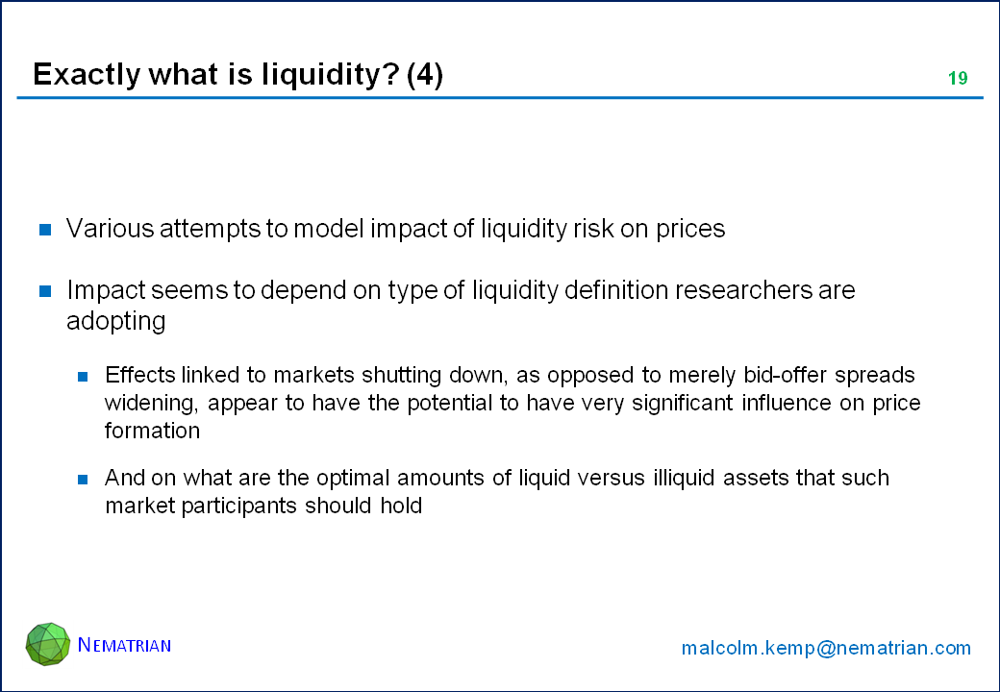

Algorithmic trading, often referred to as algo trading, employs complex algorithms to execute trades at high speeds and frequencies. It has transformed modern financial markets by enhancing market efficiency, reducing transaction costs, and providing liquidity. These algorithms analyze vast amounts of market data and make trading decisions based on predefined criteria, significantly increasing the speed and accuracy of trading.

Liquidity, a fundamental aspect of financial markets, refers to the ease with which an asset can be bought or sold without causing a significant change in its price. It is critical for market stability, allowing traders to enter or exit positions without incurring substantial costs. Liquidity is typically measured by bid-ask spreads, trading volume, and market depth. In environments with high liquidity, markets tend to be more efficient, and price discovery processes are smoother.



Liquidity-driven price impact models are crucial in algorithmic trading as they help in predicting the price shifts that occur due to trading activities. The price impact of a trade is characterized by the change in an asset's price as a result of the trade itself. In algorithmic trading, understanding the price impact is vital for developing strategies that minimize transaction costs and mitigate market impact. These models use liquidity measures to estimate the potential price movement that a trade might cause, allowing traders to optimize their orders. By integrating liquidity-driven price impact models, algorithmic traders can enhance their strategies, achieve better execution quality, and maintain market equilibrium.

## Table of Contents

## Understanding Liquidity in Financial Markets

Market liquidity refers to the ability of an asset to be bought or sold in the market without causing a significant change in its price. It is a critical aspect of financial markets, as it facilitates smooth trading operations and enhances market efficiency. Liquidity is typically gauged by several indicators, including bid-ask spreads, trading volume, and market depth. A narrow bid-ask spread, high trading volume, and substantial market depth generally signify a liquid market.

Liquidity plays a pivotal role in market stability and trading efficiency. It ensures that prices reflect all available information, which helps in the accurate pricing of assets. High liquidity reduces transaction costs, allowing traders to execute large orders with minimal impact on prices. This, in turn, fosters investor confidence and participation, contributing to a stable and efficient market. Moreover, liquid markets are less susceptible to manipulation due to the sheer volume of transactions that dilute the effect of any single trade.

However, measuring liquidity poses several challenges. The dynamic nature of financial markets means that liquidity can vary over time and across different market conditions. While traditional indicators like bid-ask spreads and trading volume provide some insights, they might not capture liquidity's full complexity. For example, during periods of market stress, liquidity can evaporate quickly, leading to wide spreads and reduced trading volumes. Moreover, liquidity is multidimensional; factors such as market resiliency and impact costs must also be considered to obtain a comprehensive measure.

To address these challenges, advanced models and algorithms are being developed to better assess and predict market [liquidity](/wiki/liquidity-risk-premium). These models often incorporate various elements, such as [order book](/wiki/order-book-trading-strategies) dynamics, market microstructure, and the behaviors of different market participants. Through the use of sophisticated analytical techniques, traders and analysts aim to enhance their understanding of liquidity dynamics, thereby improving trading strategies and risk management frameworks.

## Price Impact Models in Algorithmic Trading

Price impact models are fundamental tools in [algorithmic trading](/wiki/algorithmic-trading), designed to quantify the effect that trades have on asset prices. These models are pivotal in understanding how market dynamics respond to large orders, particularly in environments characterized by sophisticated trading algorithms.

**Definition and Overview of Price Impact Models**

At their core, price impact models aim to predict the changes in asset prices that result from execution of buy or sell orders. The basic premise is that large trades move prices in a direction that is unfavorable to the trader, due to liquidity constraints and market reactions. The price impact can be decomposed into two main components: temporary and permanent.

- **Temporary Impact:** Represents the immediate price change caused by executing a large order, which often reverses as the market absorbs the trade.
- **Permanent Impact:** Refers to the long-term change in price due to the information inferred by other market participants from the trade, reflecting the new equilibrium.

One classic formula representing a simple linear price impact model is:

$$
P = P_0 + \lambda \cdot Q
$$

where $P$ is the impacted price, $P_0$ is the initial price, $\lambda$ represents the price impact coefficient, and $Q$ is the quantity traded. Alternatively, nonlinear models, such as those incorporating square root functions, are commonly used to better capture the complex nature of price impacts in real markets.

**Application in Algorithmic Trading**

Algorithmic trading leverages price impact models to optimize order execution, reducing market impact costs, and improving trading efficiency. These models enable algorithms to fragment large orders into smaller slices, executing them incrementally to minimize price slippage and adverse impacts on execution costs. Algorithms like Volume Weighted Average Price (VWAP) and Time Weighted Average Price (TWAP) often incorporate price impact predictions to strategically time and size trades.

Python, frequently used for developing and testing trading algorithms, can implement price impact models as shown below:

```python
def price_impact(initial_price, quantity, impact_coefficient):
    return initial_price + impact_coefficient * quantity

# Example usage
initial_price = 100
quantity = 500
impact_coefficient = 0.02
impacted_price = price_impact(initial_price, quantity, impact_coefficient)
print("Impacted Price:", impacted_price)
```

**Impact on Market Orders and Trading Strategies**

Price impact models significantly influence trading strategies, primarily dictating how trades are executed in the market. Market orders, which aim for immediate execution, are particularly sensitive to price impact, as they may incur higher costs due to large instantaneous price changes. Conversely, limit orders can be strategically placed using insights from impact models to capitalize on expected price movements without exposing the trader to excessive market impact.

For trading strategies, awareness and management of price impact are crucial in ensuring that the actual execution price aligns closely with the theoretical price targets set by the trading strategy. Furthermore, sophisticated algorithms might use predictive analytics, informed by historical impact data, to anticipate market conditions and adjust their approaches dynamically.

Overall, price impact models are integral to the efficient functioning of algorithmic trading systems, enabling traders to manage execution risks, optimize order placement, and enhance overall profitability. As markets continue to evolve with technological advancements, the refinement of these models remains a pivotal area of research and development in finance.

## Types of Liquidity-Driven Price Impact Models

### Types of Liquidity-Driven Price Impact Models

Liquidity-driven price impact models are essential tools in understanding how trades influence market prices. These models help quantify how much a trade is likely to move the market price, allowing traders to predict and mitigate adverse price movements due to large orders. Various models have been developed to assess price impact, each with specific applications and limitations.

#### Overview of Various Models Used to Assess Price Impact

The primary objective of liquidity-driven price impact models is to estimate the cost associated with executing trades of different sizes. Common models include the temporary and permanent impact models, the Kyle model, and the Almgren-Chriss framework. These models account for factors such as order size, market [volatility](/wiki/volatility-trading-strategies), and prevailing liquidity conditions, providing traders with estimates of slippage and market impact costs.

Temporary impact models focus on short-term price movements resulting from the execution of a trade, while permanent impact models consider the lasting change in price after the trade is completed. The Kyle model, introduced by Albert Kyle in 1985, describes the impact of private information and market depth on price movements. The Almgren-Chriss framework provides a quantitative approach to optimizing trade execution by balancing market impact and volatility risk.

#### In-depth Look at Amihud’s Illiquidity Measure

Amihud's Illiquidity Measure is one of the most recognized tools for assessing liquidity in financial markets. Developed by Yakov Amihud in 2002, this measure evaluates the price impact per unit of trading [volume](/wiki/volume-trading-strategy) and is particularly useful for assessing the illiquidity of individual stocks. It is calculated as follows:

$$
\text{ILLIQ}_i = \frac{1}{D} \sum_{d=1}^{D} \frac{|R_{i,d}|}{V_{i,d}}
$$

Where:
- $\text{ILLIQ}_i$ is the illiquidity measure for stock $i$,
- $D$ denotes the number of days in the sample,
- $R_{i,d}$ is the return on stock $i$ on day $d$,
- $V_{i,d}$ represents the trading volume of stock $i$ on day $d$.

The Amihud measure captures the sensitivity of stock returns to trading volume, with higher values indicating higher illiquidity and a more significant price impact for trades.

#### Comparison of Different Price Impact Models and Their Applications

Each liquidity-driven price impact model has its strengths and weaknesses, and their applicability can vary based on market conditions and trading objectives. The Kyle model is particularly effective in scenarios where insider trading or informational asymmetries are present, offering insights into the role of market information. The Almgren-Chriss framework is preferred for optimizing trade execution strategies under the constraints of market impact and risk.

Amihud's Illiquidity Measure, in contrast, provides a straightforward approach to understanding the broader market's liquidity conditions without delving into the specific dynamics of individual trades. It is widely used in academic research to explore the relationship between liquidity and asset pricing.

In practice, traders and financial institutions often employ a combination of these models, tailoring their strategies to balance the trade-off between minimizing market impact and achieving efficient trade execution in different liquidity environments. Understanding these models enhances decision-making processes in algorithmic trading and contributes to the development of more sophisticated and adaptive trading algorithms.

## Case Studies and Market Examples

Empirical data from markets with significant algorithmic trading activity provide valuable insights into the mechanics and efficacy of liquidity-driven price impact models. Algorithmic trading, which involves the use of pre-programmed instructions to execute trades, often depends heavily on these models to optimize their execution strategies and minimize trading costs.

A notable case study is the examination of the NASDAQ stock market, where algorithmic trading constitutes a large percentage of daily trading volume. Empirical data demonstrate that liquidity-driven models play a critical role in affecting price formation and market dynamics. For instance, in scenarios with high-frequency trading, liquidity impacts become more pronounced, influencing bid-ask spreads and the volatility of asset prices.

Consider the application of Amihud’s Illiquidity measure, which assesses the price impact of trades relative to their size. This measure employs the formula:

$$
\text{ILLIQ}_i = \frac{1}{T} \sum_{t=1}^{T} \frac{|R_{i,t}|}{V_{i,t}}
$$

where $R_{i,t}$ is the return of stock $i$ on day $t$, and $V_{i,t}$ is the traded volume of stock $i$ on day $t$. Studies utilizing this model have highlighted that stocks with higher illiquidity tend to experience larger price impacts from trades, which can be particularly influential for high-capitalization stocks frequently traded by algorithms.

Another example is the London Stock Exchange, where extensive research has been conducted on the impact of algorithmic orders. Data analysis indicates that algorithmic orders can significantly contribute to market depth, providing liquidity during different trading phases. This depth is vital during periods of market stress when human traders might withdraw. Liquidity-driven models can predict such withdrawal and adjust algorithmic strategies accordingly, thereby stabilizing the market.

Insights from these studies also reveal the intricate relationship between market capitalization and algorithmic orders. Large-cap stocks typically exhibit lower price impacts due to higher liquidity levels and broader market participation. Conversely, small-cap stocks are more susceptible to substantial price swings from algorithmic trades, emphasizing the necessity for adaptive liquidity-driven models to mitigate adverse effects.

In summary, empirical analyses from markets such as NASDAQ and the London Stock Exchange underscore the importance of liquidity-driven models in shaping trading strategies and maintaining market equilibrium. These studies provide a foundation for further advancements and adaptation of price impact models, ensuring they remain effective in increasingly automated and complex trading environments.

## Advancements and Future Directions

Recent advancements in liquidity-driven price impact models have been largely shaped by the integration of [artificial intelligence](/wiki/ai-artificial-intelligence) (AI) and [machine learning](/wiki/machine-learning) (ML) technologies. These tools provide enhanced capabilities for predicting market movements and understanding the complex dynamics of liquidity in financial markets.

AI and ML contribute to liquidity-driven price impact models by enabling the processing of large datasets to identify patterns that are not immediately discernible through traditional analytical methods. Machine learning algorithms can adapt to new data inputs and revise their predictions accordingly, allowing for dynamic and responsive trading strategies that adjust to fluctuating market conditions.

For example, neural networks, a subset of machine learning, can model nonlinear relationships between input variables related to liquidity and their price impacts. These models are beneficial in creating simulations to test various trading strategies under different market conditions without exposing actual capital to risk. Python libraries such as TensorFlow or PyTorch are commonly employed for developing these neural networks that are capable of handling large-scale data inputs and can be used to refine liquidity assessments.

Recent advancements include the utilization of [reinforcement learning](/wiki/reinforcement-learning), where algorithmic [agents](/wiki/agents) learn optimal trading strategies by interacting with simulated market environments. This technique helps traders understand and predict how different actions impact price and liquidity across time. The reinforcement learning model can iterate through numerous scenarios, effectively "learning" the best approaches in various liquidity conditions.

Moreover, the incorporation of sentiment analysis through natural language processing (NLP) enables algorithmic traders to gauge market sentiment by analyzing news articles, social media, and other text sources. This information helps refine models by providing insights into potential market shifts driven by trader sentiments, complementing quantitative liquidity data.

Looking to future trends, the continued evolution of AI and ML points towards the development of more sophisticated ensemble models that combine various algorithms to improve predictive accuracy and model robustness. These models will likely leverage cloud computing and real-time data feeds to continuously update liquidity assessments and trading strategies.

Furthermore, quantum computing holds potential for fundamentally transforming the field by providing unprecedented processing power, which could handle complex algorithms that traditional computers struggle to compute efficiently. This could lead to breakthroughs in solving liquidity-related problems and optimizing price impact models beyond current capabilities.

In summary, the integration of AI and ML methodologies stands at the forefront of advancements in liquidity-driven price impact models, offering improved precision and adaptability. As these technologies continue to develop, they will likely drive significant innovations in algorithmic trading, leading to more efficient and stable financial markets.

## Conclusion

In conclusion, this article has explored the integral role of liquidity-driven price impact models in algorithmic trading within modern financial markets. These models are crucial for understanding how liquidity, or the lack thereof, influences asset prices and trading strategies. They provide essential insights into market dynamics, ensuring that participants can effectively gauge the potential costs and risks associated with executing trades.

Liquidity-driven models serve as vital tools for predicting and mitigating the effects of large or frequent trades on market prices. As algorithmic trading continues to dominate market activities, these models become increasingly significant. They enable traders to navigate complex market conditions, optimize order execution, and minimize market impact costs.

In future market developments, the importance of liquidity-driven models is expected to escalate further. With financial markets continuously evolving, incorporating more sophisticated trading strategies and technologies, these models will play a key role in maintaining market efficiency and stability. The integration of artificial intelligence and machine learning presents opportunities for refining these models, enhancing their predictive accuracy, and adapting to ever-changing market dynamics.

However, the rapid advancement of algorithmic trading and liquidity assessment technologies underscores the need for a balanced approach to market regulation. While technological innovation offers numerous benefits, it also poses challenges to market integrity and fairness. Regulators and market participants must work collaboratively to ensure that advancements in trading technologies do not compromise market stability or equitable access.

In summary, liquidity-driven price impact models are indispensable to the future of financial markets. They offer critical insights, support efficient trading strategies, and help maintain market stability. As we progress further into an era driven by technological innovation, careful consideration of the interplay between advancements in trading technologies and regulatory frameworks will be essential to preserving the integrity and efficiency of global financial markets.

## References

1. Amihud, Y. (2002). Illiquidity and stock returns: cross-section and time-series effects. *Journal of Financial Markets*, 5(1), 31-56.

2. Foucault, T., Kadan, O., & Kandel, E. (2005). Limit order book as a market for liquidity. *The Review of Financial Studies*, 18(4), 1171-1217.

3. Hasbrouck, J. (2009). Trading costs and returns for U.S. equities: Evidence from daily data. *The Journal of Finance*, 64(1), 29-73.

4. Almgren, R., & Chriss, N. (2000). Optimal execution of portfolio transactions. *Journal of Risk*, 3(2), 5-39.

5. Kempf, A., & Mayston, D. (2008). Incorporating price impact into portfolio optimization. *Journal of Banking & Finance*, 32(8), 1515-1525.

6. Engle, R. F., & Lange, J. (2001). Predicting VNET: A model of the dynamics of market depth. *Journal of Financial Markets*, 4(2), 113-142.

7. Almgren, R. (2003). Optimal execution with nonlinear impact functions and trading-enhanced risk. *Applied Mathematical Finance*, 10(1), 1-18.

8. Plerou, V., Gopikrishnan, P., Gabaix, X., & Stanley, H. E. (2004). On the origin of power-law fluctuations in stock prices. *Quantitative Finance*, 4(1), C11-C15.

9. Kyle, A. S. (1985). Continuous auctions and insider trading. *Econometrica: Journal of the Econometric Society*, 53(6), 1315-1335.

## References & Further Reading

[1]: Amihud, Y. (2002). ["Illiquidity and stock returns: cross-section and time-series effects."](https://www.sciencedirect.com/science/article/pii/S1386418101000246) Journal of Financial Markets, 5(1), 31-56.

[2]: Almgren, R., & Chriss, N. (2000). ["Optimal execution of portfolio transactions."](https://smallake.kr/wp-content/uploads/2016/03/optliq.pdf) Journal of Risk, 3(2), 5-39.

[3]: Kyle, A. S. (1985). ["Continuous auctions and insider trading."](https://www.econometricsociety.org/publications/econometrica/1985/11/01/continuous-auctions-and-insider-trading) Econometrica: Journal of the Econometric Society, 53(6), 1315-1335.

[4]: Foucault, T., Kadan, O., & Kandel, E. (2005). ["Limit order book as a market for liquidity."](https://papers.ssrn.com/sol3/papers.cfm?abstract_id=269908) The Review of Financial Studies, 18(4), 1171-1217.

[5]: Hasbrouck, J. (2009). ["Trading costs and returns for U.S. equities: Evidence from daily data."](https://pages.stern.nyu.edu/~jhasbrou/Research/GibbsCurrent/HasbrouckJF.pdf) The Journal of Finance, 64(1), 29-73.

[6]: Almgren, R. (2003). ["Optimal execution with nonlinear impact functions and trading-enhanced risk."](https://www.tandfonline.com/doi/abs/10.1080/135048602100056) Applied Mathematical Finance, 10(1), 1-18.

[7]: Kempf, A., & Mayston, D. (2008). ["Incorporating price impact into portfolio optimization."](https://www.cfr-cologne.de/download/workingpaper/cfr-15-04.pdf) Journal of Banking & Finance, 32(8), 1515-1525.

[8]: Engle, R. F., & Lange, J. (2001). ["Predicting VNET: A model of the dynamics of market depth."](https://cdn.preterhuman.net/texts/finance_and_marketing/stock_market/Engle%20And%20Lange-Predicting%20Vnet%20-%20A%20Model%20Of%20The%20Dynamics%20Of%20Market%20Depth.pdf) Journal of Financial Markets, 4(2), 113-142.