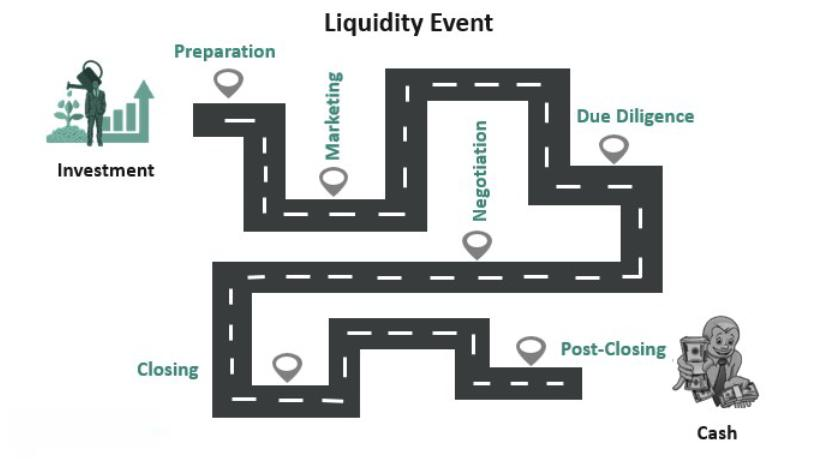

## Table of Contents

## What is a liquidity event?

A liquidity event is when someone who owns part of a company can turn that ownership into cash. This often happens when a company is sold, goes public, or does something else that lets owners sell their shares.

These events are important because they give owners a chance to get money from their investment. For startup founders or early investors, a liquidity event can be the moment they've been waiting for to see a big return on what they put in.

## What are the common types of liquidity events?

There are a few common types of liquidity events that people talk about. One of them is an Initial Public Offering, or IPO. This is when a company starts selling its shares to the public for the first time. When a company goes public, people who own shares in the company can sell them on the stock market and turn their shares into cash. Another type of liquidity event is when a company gets bought by another company, which is called an acquisition. In an acquisition, the people who own shares in the company that got bought can get money for their shares from the company that did the buying.

Another type of [liquidity](/wiki/liquidity-risk-premium) event is a merger, which is kind of like an acquisition but involves two companies joining together to form a new one. When this happens, the owners of the original companies can get cash or shares in the new company. Lastly, there's also something called a secondary market sale, where shareholders sell their shares to other private investors or investment firms. This can happen before a company goes public or gets acquired, giving owners a chance to get some money out of their investment earlier.

## Why are liquidity events important for companies and investors?

Liquidity events are really important for companies because they can help the company grow or change. When a company goes public or gets bought, it can get a lot of money. This money can be used to make the company bigger, start new projects, or pay off debts. For the people who run the company, a liquidity event can also mean they get to see their hard work pay off, which can be a big motivator.

For investors, liquidity events are a big deal too. They give investors a chance to turn their shares into cash. This is important because it lets them get back the money they put into the company, and maybe even make a profit. For people who invested early, like startup founders or angel investors, a liquidity event can be the moment they've been waiting for to see if their investment was worth it. It's like a reward for taking the risk of investing in the company in the first place.

## How does an IPO function as a liquidity event?

An IPO, or Initial Public Offering, is when a company decides to sell its shares to the public for the first time. This is a big step for a company because it means anyone can buy a piece of the company. When a company does an IPO, it sets a price for its shares and then sells them on a stock market. People who already own shares in the company, like founders or early investors, can then sell their shares to other people who want to buy them. This is how an IPO becomes a liquidity event – it gives these owners a chance to turn their shares into cash.

For the people who own shares before the IPO, this can be a big deal. They might have put a lot of money and time into the company, and now they can finally get some of that back. If the company is doing well and people want to buy its shares, the owners can make a good profit. This is why an IPO can be exciting for investors – it's their chance to see if their investment paid off. So, an IPO not only helps the company grow by raising money, but it also helps the people who believed in the company from the start.

## What is the process of a merger or acquisition as a liquidity event?

When a company gets bought by another company, this is called an acquisition. It's a way for the owners of the company being bought to turn their shares into cash. Here's how it works: a bigger company decides it wants to buy the smaller one. They talk about a price, and if they agree, the bigger company pays that price to buy all the shares of the smaller company. The people who owned shares in the smaller company now have cash instead of shares. This is a liquidity event because it gives them a way to get money from their investment.

A merger is a bit different but works in a similar way. It's when two companies decide to join together to form a new company. Both companies talk about how they want to combine and what the new company will look like. Once they agree, they create the new company, and the owners of the old companies get either cash or shares in the new one. This also counts as a liquidity event because it lets the owners turn their old shares into something they can use – either cash or shares in the new company that they can sell later.

Both mergers and acquisitions can be really important for the people who own shares in the companies. It's their chance to see if their investment was worth it. If the price is good, they can make a lot of money. This is why these events are exciting for investors – it's like getting a reward for believing in the company.

## Can you explain how a buyout works in the context of a liquidity event?

A buyout is when someone or a group of people buy all the shares of a company. This can be a way for the people who own the company to turn their shares into cash, which makes it a liquidity event. In a buyout, the buyer might be another company, a group of investors, or even the company's own management team. They offer to buy all the shares at a certain price, and if the shareholders agree, they get paid that price for their shares. This gives them a chance to get money from their investment, which is why buyouts are important for investors.

For example, if a private equity firm wants to buy a company, they'll make an offer to buy all the shares. If the shareholders think the offer is good, they'll sell their shares to the private equity firm. Once the deal is done, the shareholders have cash instead of shares, and the private equity firm owns the company. This can be a big moment for the shareholders because it's their chance to see if their investment paid off. Buyouts can be exciting because they give investors a way to get money out of their investment, which is what a liquidity event is all about.

## What role do secondary market sales play in liquidity events?

Secondary market sales are a way for people who own shares in a company to sell them to other investors before the company goes public or gets bought. This is important because it lets owners get some money from their investment earlier, without waiting for a big event like an IPO or acquisition. For example, if a startup founder wants to get some cash without selling the whole company, they can sell some of their shares to a private investor or an investment firm. This gives them liquidity, or the ability to turn their shares into cash, which can be really helpful.

These sales can also be good for the company because they show that other people believe in it and are willing to invest. When shares are sold on the secondary market, it can make the company look more valuable and attract more investors. This can help the company grow and maybe even lead to a bigger liquidity event later on, like an IPO. So, secondary market sales are an important part of the bigger picture of liquidity events, helping both the people who own shares and the company itself.

## How do liquidity events affect the valuation of a company?

Liquidity events can really change how much a company is worth. When a company goes public or gets bought, it can show everyone how much people think the company is worth. If a lot of people want to buy the company's shares during an IPO, the price of the shares can go up, making the company seem more valuable. The same thing can happen if another company wants to buy it for a high price. This can make the company's value go up a lot, which is good for the people who own shares because they can get more money for them.

But liquidity events can also make a company's value go down if things don't go well. If not many people want to buy the company's shares during an IPO, the price might drop, making the company seem less valuable. Or if another company offers a low price to buy it, that can also make the company's value go down. So, liquidity events are important because they can show what people really think a company is worth, and that can affect how much money the owners get from their shares.

## What are the tax implications of different types of liquidity events?

When you get money from a liquidity event, you have to think about taxes. If you sell your shares in an IPO or through a secondary market sale, you might have to pay capital gains tax. This tax is on the profit you make from selling your shares. If you owned the shares for less than a year, you'll pay a higher short-term capital gains tax rate. If you owned them for more than a year, you'll pay a lower long-term capital gains tax rate. The exact amount you pay depends on how much money you made and where you live.

In an acquisition or merger, the tax situation can be a bit different. If you get cash for your shares, you'll also pay capital gains tax on the profit. But if you get shares in the new company instead of cash, you might not have to pay taxes right away. You'll only pay taxes when you sell those new shares. Sometimes, if the company gives you a special kind of stock called qualified small business stock, you might get a big tax break. It's always a good idea to talk to a tax expert to understand exactly what you'll owe and how to make the best choices for your situation.

## How do shareholders prepare for a liquidity event?

Shareholders can get ready for a liquidity event by first understanding what kind of event is happening, like an IPO, acquisition, or merger. They should learn about the process and what it means for their shares. It's a good idea to talk to a financial advisor or lawyer to understand the details and make sure they know what to expect. They should also look at their shares and see how much they might get when they sell them. This can help them plan for the future and decide what to do with the money they get.

Another important thing for shareholders to do is think about taxes. Different types of liquidity events can have different tax rules, so it's smart to talk to a tax expert. They can help figure out how much tax shareholders might have to pay and find ways to save money on taxes. Shareholders should also think about their personal money goals and how the liquidity event fits into their plans. This can help them decide if they want to sell all their shares, some of their shares, or keep them for a while longer.

## What are the potential risks and challenges associated with liquidity events?

Liquidity events can be exciting, but they also come with some risks and challenges. One big risk is that the price of the shares might not be as high as shareholders hoped. If the company doesn't do well or if people aren't interested in buying the shares, the price can drop. This means shareholders might not get as much money as they expected. Another challenge is that the process can take a long time and be complicated. There are a lot of steps and paperwork involved, and sometimes things can go wrong or take longer than planned. This can be stressful for everyone involved.

Another risk is that shareholders might have to pay a lot in taxes. Depending on the type of liquidity event and how long they owned their shares, they could owe a big tax bill. This can eat into the money they get from selling their shares. Also, if the company is not ready for a liquidity event, it might not go smoothly. The company needs to have good financial records and be able to show that it's doing well. If it can't do that, it might be hard to find buyers or investors, which can make the event fail. So, it's important for both the company and the shareholders to be prepared and understand the risks.

## How can a company optimize its strategy for a successful liquidity event?

A company can optimize its strategy for a successful liquidity event by first making sure its financials are in good shape. This means having clear and accurate records that show the company is doing well. It's also important to have a strong business plan that shows how the company will grow in the future. This can make the company more attractive to buyers or investors. Another key part of the strategy is to talk to the right people, like investment bankers or lawyers, who can help guide the company through the process. They can help the company get the best price and make sure everything goes smoothly.

Another way to optimize the strategy is to think about the timing of the liquidity event. The company should try to do it when the market is doing well and people are more likely to buy shares. It's also important to communicate clearly with shareholders about what's happening and what they can expect. This can help keep everyone on the same page and make the event go more smoothly. By focusing on these things, a company can increase its chances of having a successful liquidity event and getting the best possible outcome for everyone involved.

## References & Further Reading

[1]: Bergstra, J., Bardenet, R., Bengio, Y., & Kégl, B. (2011). ["Algorithms for Hyper-Parameter Optimization."](https://papers.nips.cc/paper/4443-algorithms-for-hyper-parameter-optimization) Advances in Neural Information Processing Systems 24.

[2]: ["Advances in Financial Machine Learning"](https://www.amazon.com/Advances-Financial-Machine-Learning-Marcos/dp/1119482089) by Marcos Lopez de Prado

[3]: ["Evidence-Based Technical Analysis: Applying the Scientific Method and Statistical Inference to Trading Signals"](https://www.amazon.com/Evidence-Based-Technical-Analysis-Scientific-Statistical/dp/0470008741) by David Aronson

[4]: ["Machine Learning for Algorithmic Trading"](https://github.com/stefan-jansen/machine-learning-for-trading) by Stefan Jansen

[5]: ["Quantitative Trading: How to Build Your Own Algorithmic Trading Business"](https://www.amazon.com/Quantitative-Trading-Build-Algorithmic-Business/dp/1119800064) by Ernest P. Chan