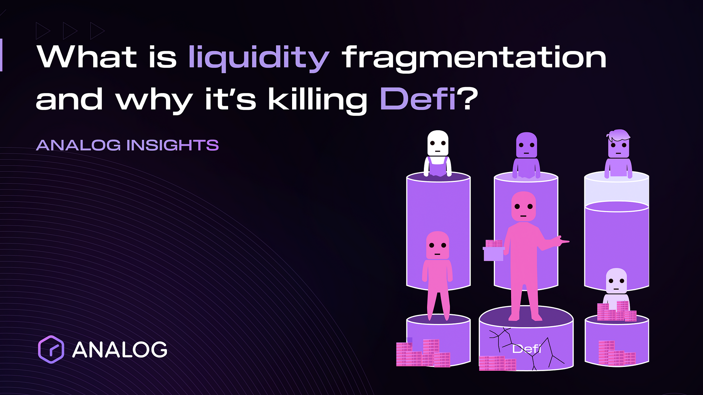

## Table of Contents

## What is liquidity fragmentation?

Liquidity fragmentation happens when the trading of a financial asset, like stocks or bonds, is spread out across many different places instead of being in one main place. This can happen because of new technology and rules that let people trade in more places, like different stock exchanges or electronic trading platforms. When trading is spread out, it can be harder for buyers and sellers to find each other easily, which can make trading less efficient.

Even though liquidity fragmentation can make trading more complex, it also has some good points. For example, it can lead to more competition among trading places, which might lower the costs for traders. Also, having more places to trade can give investors more choices and might help them get better prices. But, it's important for traders to understand how to navigate this spread-out market to make the best use of it.

## Why does liquidity fragmentation occur?

Liquidity fragmentation happens because of changes in technology and rules that let people trade in more places. Before, most trading happened in one main place, like a big stock exchange. But now, with new technology, people can trade on different electronic platforms and smaller exchanges too. This means that the total amount of trading, or liquidity, gets split up across these different places instead of staying in one spot.

This splitting up of trading can be good and bad. On the good side, it can make trading cheaper because different places compete with each other. It also gives traders more choices and can help them get better prices. But, it can also make trading more complicated. When trading is spread out, it can be harder for buyers and sellers to find each other, which can slow things down and make trading less smooth. So, traders need to learn how to use these different places to their advantage.

## What are the main causes of liquidity fragmentation in financial markets?

Liquidity fragmentation in financial markets happens because of new technology and changes in rules. Before, most trading happened in one main place, like a big stock exchange. But now, with computers and the internet, people can trade on different electronic platforms and smaller exchanges too. This means that the total amount of trading, or [liquidity](/wiki/liquidity-risk-premium), gets split up across these different places instead of staying in one spot. The rules have also changed to allow more places to offer trading, which spreads out where people can buy and sell.

This splitting up of trading can have both good and bad effects. On the good side, it can make trading cheaper because different places compete with each other. It also gives traders more choices and can help them get better prices. But, it can also make trading more complicated. When trading is spread out, it can be harder for buyers and sellers to find each other, which can slow things down and make trading less smooth. So, traders need to learn how to use these different places to their advantage and navigate the more complex market.

## How does liquidity fragmentation affect market participants?

Liquidity fragmentation can make things harder for people who trade in the market. When trading is spread out across many places, it can be tough for buyers and sellers to find each other quickly. This can slow down trading and make it less smooth. People who trade a lot, like big investors, might need to use special tools and spend more time figuring out where to trade to get the best deals. This can be more work and might cost more money.

On the other hand, liquidity fragmentation can also be good for market participants. It can make trading cheaper because different places compete with each other. This competition can lead to lower fees for traders. Also, having more places to trade gives people more choices and can help them find better prices for what they want to buy or sell. So, while it can be more complicated, it can also offer some big benefits if traders learn how to use the different places well.

## What are the potential benefits of liquidity fragmentation?

Liquidity fragmentation can help make trading cheaper for everyone. When trading is spread out across many places, these places have to compete with each other. This competition can lead to lower fees and costs for traders. Instead of one big place controlling everything, different places try to offer the best deals to attract more people to trade there. This can save money for people who buy and sell a lot.

Having more places to trade also gives people more choices. Traders can look at different places to find the best prices for what they want to buy or sell. This can help them get better deals and make more money. Even though it can be more complicated to trade in many places, the extra choices can be a big help if traders learn how to use them well.

## What are the drawbacks of liquidity fragmentation for investors?

Liquidity fragmentation can make things harder for investors. When trading is spread out across many places, it can be tough for buyers and sellers to find each other quickly. This can slow down trading and make it less smooth. Investors might need to use special tools and spend more time figuring out where to trade to get the best deals. This extra work can be tiring and might cost more money in the long run.

On top of that, having to check many different places to trade can be confusing. Investors might miss out on good deals if they don't look everywhere. This can lead to less money made from their investments. Even though there are more choices, it can be hard to keep track of everything and make the best decisions. So, while liquidity fragmentation can offer some benefits, it also comes with challenges that investors need to handle carefully.

## How can liquidity fragmentation be measured?

Liquidity fragmentation can be measured by looking at how much trading happens in different places compared to the total amount of trading. For example, if a stock is traded on several exchanges and electronic platforms, you can see what percentage of the total trading [volume](/wiki/volume-trading-strategy) is happening at each place. If one exchange has 30% of the trades and another has 20%, and so on, you can add these up to see how spread out the trading is.

To get a clearer picture, people often use a measure called the Herfindahl-Hirschman Index (HHI). This index adds up the squares of the market shares of each trading place. A higher HHI means that trading is more concentrated in fewer places, while a lower HHI means it's more spread out. By using these measures, investors and market watchers can understand how fragmented the liquidity is and make better decisions about where to trade.

## What strategies can traders use to navigate liquidity fragmentation?

Traders can navigate liquidity fragmentation by using smart tools and strategies. One good way is to use special software that can look at many different trading places at the same time. This software helps traders see where the best prices are and where they can buy or sell quickly. It's like having a map that shows all the roads to get to your destination, so you can pick the best one. Traders can also use algorithms, which are like automatic helpers, to do the trading for them. These algorithms can split up big orders into smaller pieces and send them to different places to get the best overall price.

Another strategy is to focus on the places where trading is most active. Traders can look at the data to see which exchanges or platforms have the most trading going on. By focusing on these busy places, traders can find more buyers and sellers, which can make trading easier and faster. It's like going to a busy market instead of a quiet one – you're more likely to find what you need. Also, traders can use their own knowledge and experience to decide where to trade based on what they know about the market and the different places they can trade at.

## How do regulatory frameworks address liquidity fragmentation?

Regulatory frameworks try to manage liquidity fragmentation by making rules that keep markets fair and clear. They want to make sure that even though trading is spread out across many places, everyone can still get good information about prices and trades. For example, some rules say that big trades have to be reported to everyone, so no one is left in the dark. Also, regulators might set up rules to make sure that different trading places work well together, so that trading stays smooth and efficient.

These rules can help, but they also have to balance letting the market grow and change with keeping things safe and fair. Regulators might let new trading places open up to encourage competition and give traders more choices. But they also watch closely to make sure these new places follow the rules and don't cause problems. By doing this, they try to make sure that liquidity fragmentation doesn't hurt the market too much, while still letting it benefit from more competition and better prices.

## What role does technology play in managing liquidity fragmentation?

Technology helps a lot in managing liquidity fragmentation. It does this by giving traders tools that can look at many different places where trading happens all at once. These tools show traders where they can find the best prices and where they can buy or sell quickly. It's like having a big map that shows all the roads so you can pick the best way to go. Traders can also use special computer programs, called algorithms, that help them split up big orders into smaller pieces and send them to different places to get the best overall price. This makes trading easier and can help traders save money.

On top of that, technology helps keep everyone in the loop. It does this by making sure that information about trades and prices is shared quickly across all the different trading places. This way, no one is left out and everyone can make good decisions based on the same information. Technology also helps regulators watch over the market to make sure everything is fair and follows the rules. By using technology, traders and regulators can handle the challenges of liquidity fragmentation better and make the most of the opportunities it brings.

## How does liquidity fragmentation impact market efficiency and price discovery?

Liquidity fragmentation can make the market less efficient and slow down how quickly prices are found. When trading is spread out across many places, it can be harder for buyers and sellers to find each other. This can lead to slower trading and less smooth deals. It can also make it tough for everyone to see the best prices because the information is split up. This can cause the market to work less well overall, as people might miss out on good deals or pay more than they need to.

On the other hand, liquidity fragmentation can also help the market work better in some ways. When there are more places to trade, these places have to compete with each other. This competition can lead to lower costs for traders and more choices. More choices can help people find better prices, which can make the market more efficient. So, while liquidity fragmentation can make things more complicated, it can also lead to better price discovery if traders use the different places well.

## What future trends might influence the evolution of liquidity fragmentation?

In the future, new technology might change how liquidity fragmentation works. As computers and the internet keep getting better, it could be easier for people to trade on more and more places. This could make trading even more spread out. But, new tools might also help traders manage this better. For example, smarter software could look at all the different places at the same time and help traders find the best deals quickly. This could make trading easier even if it's spread out.

Rules and laws might also change how liquidity fragmentation happens. Governments and regulators might make new rules to keep the market fair and safe, even as trading spreads out more. They might also let more new trading places open up to give people more choices. This could lead to more competition and better prices for everyone. But, it's important that these rules help keep the market working well and don't make things too complicated for traders.

## References & Further Reading

[1]: Buterin, V. (2013). ["A Next-Generation Smart Contract and Decentralized Application Platform."](https://www.blockchainlab.com/pdf/Ethereum_white_paper-a_next_generation_smart_contract_and_decentralized_application_platform-vitalik-buterin.pdf) Ethereum White Paper.

[2]: Deeper Network. (2021). ["Liquidity Fragmentation in DeFi: Causes, Effects, and Mitigation."](https://cryptopragmatist.com/p/liquidity-fragmentation-silent-killer-defi)

[3]: Antonopolous, A. M., & Wood, G. (2018). ["Mastering Ethereum: Building Smart Contracts and DApps."](https://www.amazon.com/Mastering-Ethereum-Building-Smart-Contracts/dp/1491971940) O'Reilly Media.

[4]: Binance Academy. (n.d.). ["What is DeFi? A Beginner's Guide to Decentralized Finance."](https://academy.binance.com/en)

[5]: Kyber Network. (2020). ["Addressing Liquidity Fragmentation in DeFi."](https://medium.com/kybernetwork/kyber-reserve-innovation-program-new-liquidity-models-for-defi-345feed9e3a5) 

[6]: Rosu, I. (2019). ["Liquidity and Information in Fragmented Markets."](https://papers.ssrn.com/sol3/papers.cfm?abstract_id=1286193) CFA Institute.

[7]: Lhabitant, F. S. (2008). ["Handbook of Hedge Funds."](https://openlibrary.org/books/OL24276852M/Handbook_of_Hedge_Funds) Wiley Finance.

[8]: CHAINLINK, S. (2020). ["Overcoming Blockchain Interoperability Challenges: Increasing DeFi’s Potential."](https://chain.link/education-hub/blockchain-interoperability-challenges)