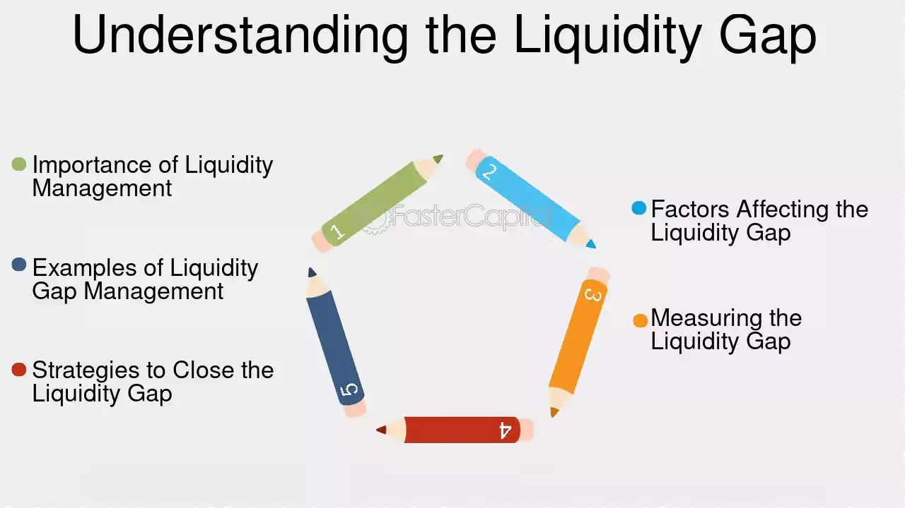

## Table of Contents

## What is a liquidity gap?

A liquidity gap is when a bank or a financial institution does not have enough cash or easily convertible assets to meet its immediate financial obligations. This situation can happen when more people want to withdraw their money than the bank has available in liquid form. For example, if many depositors suddenly want their money back at the same time, the bank might struggle to give everyone their cash because it has invested a lot of the money in loans or other assets that can't be turned into cash quickly.

This problem can be dangerous because it can lead to a bank run, where even more people rush to withdraw their money out of fear that the bank will run out of cash. To avoid a liquidity gap, banks keep some money in reserve and have access to emergency funds from central banks. They also try to predict how much cash they will need based on past behavior of their customers. By managing their liquidity carefully, banks can prevent a gap from forming and keep their operations running smoothly.

## Why is understanding liquidity gaps important for businesses?

Understanding liquidity gaps is important for businesses because it helps them make sure they have enough cash to pay their bills and keep running smoothly. If a business doesn't have enough liquid money, it might not be able to pay its employees, buy supplies, or pay back loans on time. This can lead to big problems like not being able to operate or even going bankrupt. By knowing about liquidity gaps, a business can plan better and make sure it always has enough cash on hand.

It's also important because it helps businesses avoid surprises. If a company knows it might face a [liquidity](/wiki/liquidity-risk-premium) gap in the future, it can take steps to prevent it. For example, it might borrow money, sell some assets, or cut back on spending. This way, the business can keep going without any sudden problems. Understanding liquidity gaps helps businesses stay healthy and ready for anything that might come their way.

## How does a liquidity gap occur?

A liquidity gap happens when a business or a bank doesn't have enough cash to pay for things it needs right away. This can happen if a lot of people suddenly want their money back, like when many depositors try to take their money out of a bank at the same time. It can also happen if the business made big investments or loans that can't be turned into cash quickly. When the money coming in is less than the money going out, a liquidity gap forms.

Businesses and banks try to avoid liquidity gaps by keeping some money in reserve and planning ahead. They look at how much money they usually need and try to have a little extra just in case. But sometimes, unexpected things happen, like a sudden drop in sales or an economic crisis, which can cause more money to go out than come in. If a business or bank doesn't manage its money well, a liquidity gap can grow and become a big problem, making it hard to pay bills or keep running.

## What are the common causes of liquidity gaps?

Liquidity gaps happen when a business or bank doesn't have enough cash to pay for things right away. One common cause is when a lot of people suddenly want their money back. For example, if many depositors try to take their money out of a bank all at once, the bank might not have enough cash on hand. This can happen if people get worried about the bank's health or if there's a big economic problem. Another reason is if a business has made big investments or loans that can't be turned into cash quickly. If the money coming in from sales or other sources is less than what's needed to pay bills or debts, a liquidity gap forms.

Another cause of liquidity gaps is poor planning or unexpected events. Businesses and banks usually try to keep some money in reserve and plan ahead to make sure they have enough cash. But sometimes, they might not plan well enough or something unexpected happens, like a sudden drop in sales or an economic crisis. These events can make the money going out more than the money coming in, leading to a liquidity gap. If a business or bank doesn't manage its money well, these gaps can grow and become big problems, making it hard to pay bills or keep running.

## Can you explain the difference between a liquidity gap and a funding gap?

A liquidity gap happens when a business or bank doesn't have enough cash right away to pay for things it needs. It's like when you want to buy something but you don't have the money in your wallet. This can happen if a lot of people want their money back from a bank all at once, or if a business made big investments that can't be turned into cash quickly. The problem is about not having enough cash on hand to meet immediate needs.

A funding gap, on the other hand, is when a business or project doesn't have enough money to do what it plans to do. It's like wanting to start a new project but not having enough money to buy all the things you need. This can happen if a business can't get a loan or if investors don't want to give money. The problem here is about not having enough money to reach long-term goals or start new things, not just about paying for things right now.

## What are the potential impacts of a liquidity gap on a company?

A liquidity gap can cause big problems for a company. If a company doesn't have enough cash to pay its bills, it might not be able to buy the things it needs to keep working. This can mean not being able to pay employees on time or buy supplies, which can make the company stop working properly. If the company can't pay back loans, the people it borrowed money from might take legal action, which can make things even worse.

Over time, a liquidity gap can hurt a company's reputation. If customers and suppliers hear that the company is having money problems, they might not want to do business with it anymore. This can lead to fewer sales and make it even harder for the company to get the cash it needs. If the problem keeps going, the company might have to declare bankruptcy, which is when it can't pay its debts and has to close down.

## How can companies measure their liquidity gaps?

Companies can measure their liquidity gaps by looking at how much cash they have and how much they need to pay their bills right away. One way to do this is by using something called the "current ratio," which compares the company's current assets (like cash and things that can be turned into cash quickly) to its current liabilities (like bills that need to be paid soon). If the current ratio is less than 1, it means the company might not have enough cash to pay its bills, showing a possible liquidity gap.

Another way is to use the "cash flow forecast," which is a plan that shows how much money the company expects to get and spend over a certain time. By looking at this forecast, the company can see if it will have enough cash coming in to cover what's going out. If the forecast shows more money going out than coming in, that's a sign of a liquidity gap. By keeping an eye on these measures, a company can spot a liquidity gap early and take steps to fix it before it becomes a big problem.

## What are some strategies to manage or mitigate liquidity gaps?

One way to manage or mitigate liquidity gaps is to keep a cash reserve. This means having some extra money set aside that can be used when there's a sudden need for cash. Companies can also use lines of credit, which are like loans they can take out quickly if they need money. Another strategy is to manage their cash flow better by making sure they get paid by customers on time and by delaying payments to suppliers if possible. This helps make sure there's always enough money coming in to cover what's going out.

Another strategy is to sell assets that can be turned into cash quickly. For example, a company might sell some of its inventory or equipment if it needs money right away. It's also important for companies to plan ahead by making a cash flow forecast, which shows how much money they expect to have coming in and going out. If the forecast shows a possible liquidity gap, the company can take action early, like cutting back on spending or finding new ways to bring in money. By using these strategies, companies can avoid or fix liquidity gaps before they become big problems.

## Can you provide examples of liquidity gaps in different industries?

In the banking industry, a liquidity gap can happen when many people want to take their money out of the bank at the same time. This happened during the 2008 financial crisis when people got worried about banks failing. Banks usually keep some money in reserve, but if too many people want their money back, the bank might not have enough cash on hand. This can lead to a bank run, where even more people rush to take out their money, making the liquidity gap even bigger.

In the retail industry, a liquidity gap can happen if a store has a lot of products but not enough cash to pay its bills. For example, a clothing store might have a lot of clothes on the shelves, but if people aren't buying them, the store won't have enough money coming in to pay for things like rent and employee salaries. If the store can't turn those clothes into cash quickly enough, it might not be able to keep running and could face big problems.

In the manufacturing industry, a liquidity gap can occur if a company spends a lot of money on new equipment or materials but then faces a sudden drop in orders. For instance, a car manufacturer might invest in new machinery to make more cars, but if fewer people want to buy cars, the company won't have enough money coming in to pay for the new equipment and keep the factory running. This can lead to a situation where the company struggles to pay its bills and might need to find quick ways to get more cash.

## How do regulatory requirements affect liquidity gap management?

Regulatory requirements can help banks and businesses manage liquidity gaps by making them keep some money in reserve. This means that banks have to hold onto a certain amount of cash or easily convertible assets, which they can use if a lot of people suddenly want their money back. These rules are set by government agencies to make sure that banks and businesses can pay their bills even during tough times. By following these rules, banks and businesses can avoid running out of cash and keep running smoothly.

However, these requirements can also make it harder for banks and businesses to use their money in other ways. For example, if a bank has to keep a lot of money in reserve, it might not be able to lend as much money to people or invest in new projects. This can slow down the bank's growth and make it harder to make money. So, while regulatory requirements help prevent liquidity gaps, they can also limit what banks and businesses can do with their money.

## What role do financial instruments play in addressing liquidity gaps?

Financial instruments like lines of credit and short-term loans can help businesses and banks deal with liquidity gaps. A line of credit is like a safety net that lets a business borrow money quickly when it needs cash. This can help the business pay its bills on time and avoid running out of money. Short-term loans are another way to get cash fast. They can be used to cover sudden expenses or to make sure the business has enough money to keep running until more cash comes in.

Another financial instrument that can help with liquidity gaps is selling assets. If a business has things like inventory or equipment that it can sell quickly, it can turn those into cash to fill a liquidity gap. This can be a good way to get money fast without having to borrow. By using these financial instruments wisely, businesses and banks can manage their cash better and avoid big problems caused by not having enough money when they need it.

## How can advanced analytics and forecasting help in predicting and managing liquidity gaps?

Advanced analytics and forecasting can help businesses and banks predict when they might run into liquidity gaps. By using special computer programs, they can look at past data to see how much money usually comes in and goes out. These programs can also help them guess what might happen in the future based on things like sales trends or economic news. If the forecast shows that more money will be going out than coming in, the business or bank can see a liquidity gap coming before it happens. This early warning gives them time to plan and take action to avoid the problem.

Once a potential liquidity gap is spotted, advanced analytics can help figure out the best way to deal with it. For example, the programs can show which bills can be paid later or which assets can be sold quickly to get more cash. They can also help decide if it's a good idea to borrow money or use a line of credit. By using these tools, businesses and banks can make smart choices about how to use their money and keep enough cash on hand to pay their bills. This way, they can manage their money better and avoid big problems from not having enough cash when they need it.

## What are examples of liquidity gaps?

A liquidity gap arises when the liquidity available in the market does not match the demand, leading to potential financial instability and challenges. This mismatch can be observed across various financial scenarios, impacting institutions' ability to meet obligations and execute trades efficiently. In banking, liquidity gaps can manifest when banks have short-term liabilities exceeding short-term assets. During periods of economic stress, such as the 2008 financial crisis, this gap can widen significantly. Banks holding mortgage-backed securities faced difficulties as the market for these assets dried up, leaving them unable to sell the assets quickly or without significant losses.

The 2008 financial crisis provides a stark example of liquidity gaps escalating during economic downturns. The widespread issuance of mortgage-backed securities (MBS) and the subsequent housing market collapse led to a sharp decline in the liquidity of these assets. As market confidence eroded, the demand for MBS plummeted, creating a liquidity gap as holders of these securities struggled to offload them without incurring massive losses. This scenario forced many financial institutions to write down significant parts of their portfolios, impacting their balance sheets and leading to a cascade of liquidity-focused challenges.

In corporate finance, liquidity gaps can occur when companies face a sudden need for cash that cannot be met by their liquid assets. For instance, a firm might experience a funding shortfall if it relies heavily on short-term debt, which needs refinancing during a credit crunch. In such cases, access to liquid markets becomes restricted, and companies may need to employ strategies such as renegotiating terms with creditors, selling non-core assets, or securing emergency financing to bridge the gap.

To manage liquidity gaps and maintain financial stability, companies and banks might adopt several strategies. These include maintaining a diversified portfolio of assets, ensuring a strong liquidity coverage ratio, and implementing robust risk management frameworks. Banks can engage in stress testing to evaluate their resilience under various economic scenarios, preparing contingency funding plans to assure coverage of unexpected outflows.

In summary, liquidity gaps present significant risks, especially during economic downturns, and require proactive management strategies to prevent adverse outcomes. By understanding and anticipating potential liquidity shortfalls, financial entities can better navigate periods of financial distress, ensuring operational continuity and financial stability.

 to Algorithmic Trading

Algorithmic trading, often referred to as algo trading, is a process of executing trades in financial markets using algorithms and automation, following pre-established rules and strategies. It leverages advanced mathematical models and software to make fast, efficient trading decisions. The automation allows traders to execute large volumes of trades instantaneously, mitigating the delay associated with manual decision-making.

### Basic Methods of Algorithmic Trading

1. **Trend-Following Strategies**: 
   One of the most common strategies, trend-following strategies aim to capitalize on [momentum](/wiki/momentum) in the market. These algorithms identify and react to market trends, buying when the market is rising and selling short when the market is falling. A simple moving average (SMA) crossover is an example of a trend-following strategy, where buy or sell signals are generated when a short-term average crosses a long-term average.

   ```python
   def sma_crossover(prices, short_window, long_window):
       # Calculate short and long simple moving averages
       short_sma = prices.rolling(window=short_window, min_periods=1).mean()
       long_sma = prices.rolling(window=long_window, min_periods=1).mean()

       # Generate buy/sell signals
       signals = (short_sma > long_sma).astype(int)
       return signals
   ```

2. **Arbitrage Opportunities**:
   Arbitrage involves the simultaneous purchase and sale of an asset to exploit price discrepancies in different markets. These opportunities are often fleeting, requiring rapid execution, making them well-suited for [algorithmic trading](/wiki/algorithmic-trading). By automatically detecting price misalignments, algorithms can execute trades quickly to profit from the small price differences.

   Consider a situation where an asset is being traded in two different markets:
$$
   \text{Profit} = \sum (\text{Price}_{MarketA} - \text{Price}_{MarketB}) \times \text{Volume}

$$

3. **Market Making**:
   Market making algorithms facilitate liquidity in the markets by simultaneously quoting a buy and a sell price. The goal is to profit from the spread between the buy (bid) and sell (ask) price. High-frequency traders often utilize [market making](/wiki/market-making) strategies to earn profits on a large [volume](/wiki/volume-trading-strategy) of small, incremental transactions.

### Role of Technology

Modern technology plays a pivotal role in algorithmic trading, enabling the processing of vast amounts of market data in real-time. With the evolution of computing power, algorithms can employ [machine learning](/wiki/machine-learning) techniques to improve decision-making. Machine learning models can be trained to predict price movements or identify lucrative trading opportunities by analyzing historical data patterns.

Moreover, co-location of servers near exchange facilities reduces latency, allowing algorithms to receive and act on information faster than competitors, often measured in microseconds.

Overall, algorithmic trading enhances market efficiency by ensuring constant liquidity, reducing transaction costs, and enabling precise trade execution. Its ability to parse through complex datasets and execute trades at optimal prices has transformed the landscape of modern financial markets.

## References & Further Reading

[1]: Cartea, Á., Jaimungal, S., & Penalva, J. (2015). ["Algorithmic and High-Frequency Trading."](https://assets.cambridge.org/97811070/91146/frontmatter/9781107091146_frontmatter.pdf) Cambridge University Press.

[2]: Engle, R., & Ruan, T. (2019). ["Liquidity and Volatility in the U.S. Treasury Market."](https://www.sciencedirect.com/science/article/pii/S0304407619302465) National Bureau of Economic Research Working Paper No. 25368.

[3]: López de Prado, M. (2018). ["Advances in Financial Machine Learning."](https://www.amazon.com/Advances-Financial-Machine-Learning-Marcos/dp/1119482089) Wiley.

[4]: Chan, E. P. (2008). ["Quantitative Trading: How to Build Your Own Algorithmic Trading Business."](https://github.com/egorpe/EPChan-QuantitativeTrading/blob/master/example7_6.m) Wiley.

[5]: Brunnermeier, M. K., & Pedersen, L. H. (2009). ["Market Liquidity and Funding Liquidity."](https://www.nber.org/papers/w12939) Review of Financial Studies, 22(6), 2201-2238.