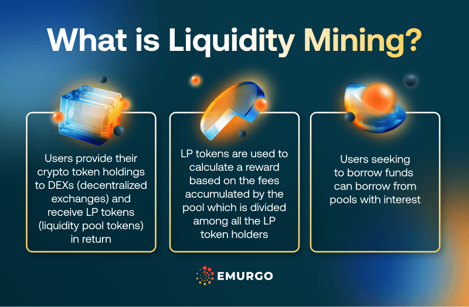

Liquidity mining is a decentralized finance (DeFi) mechanism where users provide liquidity to a trading platform's liquidity pool in exchange for incentives, typically in the form of additional cryptocurrency tokens. This process allows decentralized exchanges (DEXs) to facilitate trades without needing a central order book, driven instead by the liquidity supplied by users and governed by automated market makers (AMMs). In recent years, liquidity mining has gained substantial traction within the sphere of algorithmic trading, where automated trading strategies execute transactions based on a set of programmed instructions or mathematical models.

The synergy between DeFi and algorithmic trading emerges from the seamless integration of liquidity mining into automated trading strategies. In this context, liquidity mining becomes integral due to its ability to ensure that algorithmic trades can be executed efficiently without significant price slippage. The passive income opportunities provided by liquidity mining enhance the profitability of trading strategies by enabling liquidity providers to earn rewards. This, in turn, encourages more participants to offer liquidity, thus improving market efficiency and price discovery.



This article focuses on three main objectives. First, it analyzes the processes involved in liquidity mining, elucidating the frameworks and mechanisms through which liquidity is sourced and rewarded in DeFi ecosystems. Second, it explores the algorithmic strategies that leverage liquidity mining to maximize trading performance. This includes an examination of how automated trading systems selectively engage with liquidity pools to enhance their profitability. Lastly, the article discusses future trends, highlighting innovations and potential evolutions within the liquidity mining landscape. Such trends encompass technological advancements like machine learning applications and regulatory shifts that may impact the structure and operation of these systems.

## Table of Contents

## Understanding Liquidity Mining in Algorithmic Trading

Liquidity mining is a crucial component of decentralized finance (DeFi) ecosystems, designed to incentivize participants to provide liquidity to various platforms. This process is facilitated by liquidity pools, automated market makers (AMMs), and smart contracts, each playing a pivotal role in the functioning and efficiency of DeFi.

Liquidity pools are collections of funds locked in a smart contract, which are used to facilitate trading by providing liquidity to decentralized exchanges (DEXs). Users, often referred to as liquidity providers (LPs), contribute funds to these pools and, in return, earn rewards or trading fees generated from the transactions within the pool. The value of liquidity pools lies in their ability to reduce slippage and enhance the trading experience by ensuring sufficient liquidity is available for asset swaps.

AMMs are protocols that use mathematical algorithms to determine the pricing of assets within a liquidity pool. Unlike traditional [order book](/wiki/order-book-trading-strategies) exchanges, where buyers and sellers create bids and asks, AMMs automate the process of pricing through formulas such as the constant product AMM, represented by $x \cdot y = k$, where $x$ and $y$ denote the reserve quantities of two assets, and $k$ is a constant. These protocols ensure that the price adjusts seamlessly with each trade, thus maintaining market balance and liquidity.

Smart contracts are self-executing contracts with the terms of the agreement directly written into code. They are integral to [liquidity](/wiki/liquidity-risk-premium) mining as they automate the distribution of rewards, management of funds, and the execution of trades without the need for intermediaries. Their transparency and immutability provide security and trust within DeFi operations.

Algorithmic trading, when applied to liquidity mining, enhances both efficiency and profitability through automated processes and strategic decision-making. Advanced algorithms are designed to optimize the placement of assets within liquidity pools, adjusting for market conditions and maximizing yield. By deploying rule-based or model-driven strategies, [algorithmic trading](/wiki/algorithmic-trading) can capitalize on market inefficiencies and execute trades with speed and precision that surpasses human capabilities.

For instance, algorithmic strategies can monitor price discrepancies across DEXs and employ [arbitrage](/wiki/arbitrage) trades to profit from these differences while simultaneously providing liquidity. Additionally, algorithms can dynamically rebalance portfolios in response to market changes, ensuring optimal asset allocation within the pools.

In summary, the synergy of liquidity mining and algorithmic trading fosters a more efficient, profitable, and accessible financial ecosystem. By leveraging liquidity pools, AMMs, and smart contracts in tandem with sophisticated trading algorithms, participants can better navigate and extract value from DeFi markets.

## Types of Liquidity Mining Strategies

Liquidity mining strategies can be broadly categorized into passive and aggressive approaches, each offering different levels of risk and reward. 

**Passive Liquidity Mining Strategies:** These strategies involve providing liquidity to decentralized finance (DeFi) protocols with minimal active management. Participants primarily focus on stable, predictable returns by supplying their assets to liquidity pools in exchange for liquidity provider (LP) tokens. These tokens often grant holders a share of transaction fees generated within the pool. Passive strategies generally involve less risk and are relatively straightforward, making them appealing to investors looking for steady returns without the need for constant monitoring or intervention. Liquidity farming and staking are common forms of passive strategies, where users deposit their tokens into DeFi platforms to earn rewards over time. For instance, staking might involve locking up a cryptocurrency to support network operations, earning rewards for this contribution.

**Aggressive Liquidity Mining Strategies:** In contrast, aggressive strategies require active management and a higher risk tolerance, utilizing a more dynamic approach to maximizing returns. Participants frequently adjust their positions in response to market conditions, often leveraging advanced algorithmic trading techniques to optimize profitability. These strategies might involve frequent reallocation of assets between various liquidity pools or employing arbitrage opportunities arising from price discrepancies across different platforms. This active management necessitates a robust understanding of market behaviors and sophisticated tools to analyze and react to price movements in real-time.

The integration of algorithmic trading into liquidity farming and staking enhances the efficacy of these strategies. Algorithmic systems can execute trades rapidly based on predefined criteria, enabling faster reaction times to market changes, which is essential in capturing fleeting opportunities in aggressive strategies. In liquidity farming, algorithms may be configured to automatically shift funds between pools offering the best returns, while in staking, they can manage smart contracts to optimize staking rewards.

The impact of liquidity mining strategies on financial markets is substantial. By incentivizing participants to provide liquidity, these strategies enhance market efficiency and depth, reducing slippage and fostering a more competitive trading environment. The influx of liquidity facilitated by these strategies can lead to tighter bid-ask spreads, benefiting all market participants. However, the complexity and fast-paced nature of aggressive strategies can also introduce [volatility](/wiki/volatility-trading-strategies), particularly in nascent markets where liquidity may not be as robust. Such volatility can be exacerbated if market participants execute large trades or shift funds rapidly, prompting broader price swings.

In summary, liquidity mining strategies play a crucial role in the ecosystem of DeFi and algorithmic trading, offering varying levels of risk and opportunity. The choice between passive and aggressive strategies depends largely on an individual's risk appetite and their ability to actively manage their investments. As the landscape of DeFi continues to evolve, the interplay between these strategies and algorithmic trading is likely to shape the future of digital asset markets.

## Algorithmic Trading Techniques for Liquidity Mining

Algorithmic trading, integral to modern liquidity mining, encompasses a range of strategies that leverage computational power to enhance trading efficiency. Two prominent categories are rule-based and model-based strategies.

Rule-based strategies operate on a set of predefined criteria or rules. These strategies are straightforward and involve executing trades when specific market conditions are met. For example, a rule-based liquidity-taking strategy might specify that a trade should be executed when the asset price falls below a certain threshold. This approach relies heavily on historical data analysis and technical indicators.

Model-based strategies, in contrast, employ mathematical models to interpret complex market data, identifying trading opportunities by predicting price movements. These models can be statistical, such as regression models, or [machine learning](/wiki/machine-learning)-based, like neural networks. Model-based strategies are dynamic and adapt to changing market conditions, often providing a competitive edge in the fast-paced world of algorithmic trading.

Data retrieval is crucial in both strategies, as it provides the foundation for decision-making. Access to real-time and historical market data allows traders to backtest strategies and assess their potential profitability. Efficient trade execution logic is essential to minimize slippage and ensure that trades occur at the desired price. This involves selecting the optimal execution venues and employing smart order routing.

Position management is another critical aspect, involving the systematic control of trading positions to optimize returns and manage risk. Effective position management ensures that traders maintain the desired market exposure while adhering to risk limits set by their trading algorithms.

Python is often used to implement these strategies due to its rich ecosystem of libraries for data analysis, machine learning, and trading. A simple liquidity-taking strategy in Python might involve the use of the 'pandas' library for data manipulation, the 'numpy' library for numerical computations, and the 'ccxt' library to interact with [cryptocurrency](/wiki/cryptocurrency) exchanges.

```python
import ccxt
import pandas as pd

# Example of a simple rule-based strategy in Python
def get_market_data(exchange, symbol):
    ohlcv = exchange.fetch_ohlcv(symbol, timeframe='1m', limit=100)
    df = pd.DataFrame(ohlcv, columns=['time', 'open', 'high', 'low', 'close', 'volume'])
    return df

def liquidity_taking_strategy(exchange, symbol):
    data = get_market_data(exchange, symbol)
    latest_price = data['close'].iloc[-1]

    # Define a simple rule: Buy if the latest price is less than a predefined threshold
    if latest_price < 1000:
        order = exchange.create_market_buy_order(symbol, 1)
        print(f"Executed buy order at price: {latest_price}")

exchange = ccxt.binance()
symbol = 'BTC/USDT'
liquidity_taking_strategy(exchange, symbol)
```

In this code, the strategy retrieves market data for the BTC/USDT trading pair and executes a buy order if the latest closing price falls below a specified threshold. This basic example highlights the importance of automated data retrieval, trade execution, and position management in algorithmic trading for liquidity mining.

Algorithmic trading techniques enhance the potential for profitability in liquidity mining by enabling traders to react swiftly to market changes, thus offering a strategic advantage in decentralized finance ecosystems.

## Handling Risks and Costs in Liquidity Mining

In liquidity mining, the profitability is significantly influenced by transaction costs, fees, and commissions, all of which can erode gains if not properly managed. Transaction costs are incurred with each operation within a liquidity pool, encompassing both the gas fees associated with executing smart contracts and the fees imposed by decentralized exchanges (DEXs). These costs can accumulate rapidly, especially in high-frequency trading environments, necessitating strategies to optimize transactions and reduce overheads.

Risk management in liquidity mining is crucial to curtail potential losses arising from market volatility and impermanent loss. Impermanent loss occurs when the price ratio of assets in a liquidity pool changes, adversely affecting liquidity providers' returns compared to holding the assets separately. Strategies to mitigate this risk include dynamic allocation, where the proportions of assets in a pool are adjusted according to market conditions, and choosing pools with low volatility pairs.

Volatility management involves using algorithmic strategies to predict and react to market movements, utilizing techniques such as [statistical arbitrage](/wiki/statistical-arbitrage) or mean reversion strategies. For example, Python libraries like NumPy and Pandas can help in analyzing historical price data to forecast trends and optimize trading strategies:

```python
import numpy as np
import pandas as pd

# Load historical price data
price_data = pd.read_csv('price_data.csv')

# Calculate moving average as a simple volatility measure
price_data['Moving_Average'] = price_data['Price'].rolling(window=20).mean()
```

Defining risk limits, such as position and market exposure limits, is another fundamental aspect of risk management. Position limits prevent overexposure to a particular asset, while market exposure limits ensure that the overall risk aligns with the investor's risk tolerance and market expectations. Implementing stop-loss orders and using derivatives like futures or options can further safeguard against adverse market moves.

Effective management of these aspects requires thorough monitoring and analysis, often with automated systems that ensure timely and informed decision-making. The ever-evolving nature of DeFi and algorithmic trading necessitates continuous assessment and adaptation of risk management practices to sustain profitability in liquidity mining.

## Innovations and Future Trends in Liquidity Mining

The evolving landscape of liquidity mining is witnessing significant enhancements through the adoption of machine learning and big data analytics. Machine learning algorithms are being employed to analyze vast datasets efficiently, identifying patterns and trends that human traders might overlook. By deploying predictive models, traders can optimize their strategies to maximize returns, leveraging historical data to make informed decisions about when and where to allocate liquidity.

Big data plays a crucial role in this context by facilitating the aggregation of diverse datasets, including transaction history, market sentiment, and macroeconomic indicators. This comprehensive data assimilation allows traders to construct sophisticated models that improve accuracy in forecasting price movements and optimizing liquidity positions. The integration of machine learning and big data thus offers a competitive edge in meticulously analyzing liquidity mining strategies.

Cross-chain liquidity pools present another notable innovation, addressing the limitations of current single-chain liquidity solutions. By enabling liquidity to flow seamlessly across multiple blockchain networks, these pools enhance the capital efficiency and availability within decentralized finance (DeFi) ecosystems. Cross-chain pools offer a robust mechanism for distributing risk and increasing market accessibility, allowing assets to move between different chains without the constraints of traditional bridges.

Governance tokens are also emerging as critical components of future liquidity mining frameworks. These tokens grant holders the ability to influence protocol decisions, promoting decentralized control and community participation. Their introduction encourages a more democratic way of managing liquidity pools, allowing stakeholders to propose and vote on changes that directly impact the ecosystem's functioning and sustainability.

The potential regulatory landscape surrounding liquidity mining is evolving, with implications that could significantly influence its development. As regulators look to address concerns over security, fraud, and market manipulation, the establishment of a clear regulatory framework could provide legitimacy and stability to liquidity mining activities. However, regulations may also introduce compliance costs and operational constraints, necessitating strategic adjustments by market participants.

Overall, innovations such as machine learning, big data, cross-chain liquidity pools, and governance tokens are driving the evolution of liquidity mining. These advancements, coupled with a shifting regulatory environment, underscore the need for adaptability and vigilance among participants in this dynamic financial landscape.

## Conclusion

Liquidity mining has emerged as a crucial component in the domain of algorithmic trading and decentralized finance (DeFi). This article has explored the multifaceted nature of liquidity mining, underscoring its role in enhancing the efficiency and profitability of trading operations. By leveraging liquidity pools, automated market makers (AMMs), and smart contracts, liquidity mining facilitates a dynamic market environment conducive to both liquidity providers and traders. The strategic integration of algorithmic trading techniques has bolstered the effectiveness of liquidity mining, enabling the execution of complex trading strategies with precision and speed.

The exploration of various liquidity mining strategies, including passive and aggressive approaches, has illustrated their significant impact on financial markets. Liquidity farming and staking, when combined with algorithmic strategies, offer a robust framework for optimizing returns while managing risk. Algorithmic trading techniques, particularly rule-based and model-based strategies, enhance liquidity mining performance by focusing on data retrieval, trade execution logic, and position management.

Risk management remains a critical component, with emphasis on transaction costs, fees, and techniques to mitigate volatility and impermanent loss. The ability to establish risk limits and monitor market exposure is essential for sustaining profitability amid fluctuating market conditions. Moreover, the innovations and future trends, such as machine learning, big data, and cross-chain liquidity pools, present opportunities for advancing liquidity mining practices. As the regulatory landscape around blockchain and DeFi evolves, it is vital for participants to remain vigilant and adaptable.

Given the rapid pace of development in technology and markets, continuous adaptation is essential for success in liquidity mining. Individuals and entities engaged in this field must consistently update their strategies and tools to capitalize on new opportunities and navigate challenges. Readers are encouraged to actively seek out further resources and remain well-informed about the innovations and shifts that shape the landscape of liquidity mining in algorithmic trading. Through persistent learning and adaptation, participants can harness the full potential of this dynamic aspect of modern financial markets.

## References & Further Reading

[1]: ["A Beginner's Guide to Liquidity Mining"](https://academy.shrimpy.io/lesson/what-is-liquidity-mining) by Decrypt

[2]: Adams, H. et al. (2020). ["Uniswap V2 Core"](https://app.uniswap.org/whitepaper.pdf). Uniswap Whitepaper Version 2.

[3]: Foucault, T., Pagnotta, E. (2020). ["Market Making in the Age of Machine Learning"](https://rauli.cbs.dk/index.php/foucault-studies/article/view/6939). SSRN Electronic Journal.

[4]: Lopez de Prado, M. (2018). ["Advances in Financial Machine Learning"](https://www.amazon.com/Advances-Financial-Machine-Learning-Marcos/dp/1119482089). Wiley.

[5]: Stoll, H.R. (2006). ["Electronic Trading in Stock Markets"](https://www.jstor.org/stable/pdf/30033638.pdf). The Journal of Economic Perspectives, 20(1), 153-174.

[6]: Moussa, A. (2021). ["Liquidity Providers and Market Efficiency"](https://www.eonline.com/news/1413396/christina-haack-and-christopher-larocca-enjoy-double-date-with-tarek-and-heather-el-moussa). Journal of Financial Markets.

[7]: ["Curve Finance: DeFi’s Elite AMM for Stablecoin Trading"](https://curuve.fi/) by Crypto Briefing

[8]: Jansen, S. (2020). ["Machine Learning for Algorithmic Trading"](https://github.com/stefan-jansen/machine-learning-for-trading). Packt Publishing.

[9]: Antonopoulos, A. M., & Wood, G. (2018). ["Mastering Ethereum: Building Smart Contracts and DApps"](https://github.com/ethereumbook/ethereumbook). O'Reilly Media.