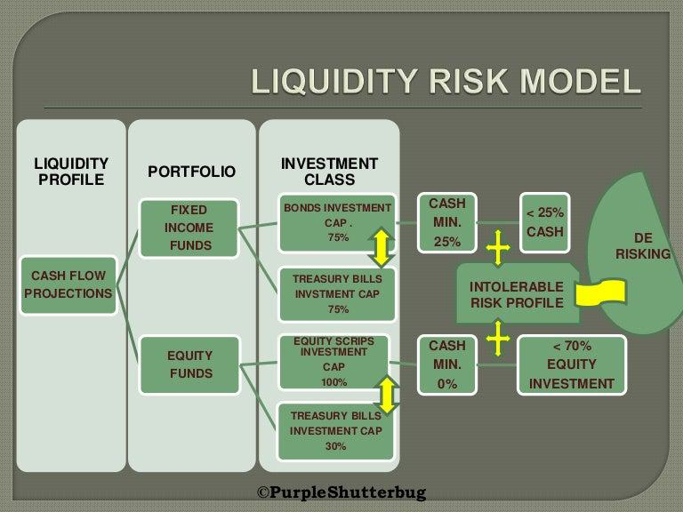

Liquidity modeling is a fundamental aspect of algorithmic trading, playing a vital role in the seamless execution of trades, effective risk management, and maximizing profitability. This article explores the significance of liquidity modeling within algorithmic trading, emphasizing its relevance and strategies for implementation. Key concepts, methodologies, and practical applications will be examined to equip traders and developers with the necessary tools to leverage liquidity modeling effectively. By understanding liquidity dynamics and incorporating them into trading algorithms, participants can significantly improve decision-making processes and achieve better trading outcomes.

Liquidity, the ease with which an asset can be bought or sold in a market without significantly impacting its price, is crucial in algorithmic trading. It influences trading strategy by affecting transaction costs and market efficiency. Accurate liquidity modeling empowers traders to assess market conditions, optimize asset management, and mitigate risks effectively. Consequently, integrating liquidity considerations into algorithmic processes is essential for enhancing trading performance and ensuring successful execution.



Developers and traders can utilize a range of mathematical and computational tools to model liquidity. The use of liquidity metrics such as liquidity ratios assists in evaluating financial health and stability, thereby guiding informed trading decisions. Moreover, incorporating machine learning techniques can further enhance liquidity forecasting, facilitating proactive strategy adjustments to adapt to fluctuations in market liquidity.

Through the integration of liquidity modeling, algorithmic trading systems can achieve improved adaptability, precision, and resilience. This article aims to provide comprehensive insights into how understanding and applying liquidity concepts can transform trading strategies, leading to optimized performance in dynamic financial markets.

## Table of Contents

## Understanding Liquidity in Algorithmic Trading

Liquidity refers to the ease with which an asset can be bought or sold in a market without causing a significant impact on its price. In the context of algorithmic trading, liquidity is a fundamental factor as it directly influences trading strategies, transaction costs, and overall market efficiency. High liquidity generally implies that an asset can be traded quickly and with minimal price change, reducing the risk of slippage and enabling more precise execution of trades. Conversely, low liquidity might lead to significant price shifts, higher transaction costs, and challenges in executing trading strategies efficiently.

In algorithmic trading, understanding liquidity dynamics is crucial for the development and implementation of effective trading algorithms. Algorithms need to be designed with liquidity considerations in mind to optimize performance and risk management. For instance, an algorithm trading in a highly liquid market may execute high-frequency trades with minimal cost implications. On the other hand, in markets with lower liquidity, algorithms might need to incorporate advanced execution strategies such as order slicing or time-weighted average price (TWAP) to mitigate the impact on market prices and manage potential risks.

Liquidity ratios and metrics serve as essential tools for traders and algorithm developers to evaluate current market conditions. These ratios provide insights into the depth and robustness of the market, allowing traders to make informed decisions regarding asset management and risk mitigation. Commonly used [liquidity](/wiki/liquidity-risk-premium) metrics include the bid-ask spread, market depth, and trading [volume](/wiki/volume-trading-strategy). The bid-ask spread indicates the difference between the highest price a buyer is willing to pay and the lowest price a seller is willing to accept, serving as a direct measure of market liquidity. Narrow spreads typically indicate high liquidity, whereas wider spreads suggest lower liquidity.

Additionally, market depth refers to the market's ability to sustain relatively large orders without significant changes in price, while trading volume measures the total quantity of an asset traded over a specific period. High trading volumes often signal a liquid market. Moreover, algorithms that analyze liquidity can help identify periods of varying liquidity, enabling better timing and sizing of trades.

Overall, an in-depth understanding of liquidity, including the application of liquidity metrics, is pivotal in formulating [algorithmic trading](/wiki/algorithmic-trading) strategies. This understanding not only enhances the execution efficiency but also aids in optimizing asset allocation and risk management, ultimately improving the profitability and sustainability of trading operations.

## Liquidity Ratios and Their Role

Liquidity ratios play a vital role in assessing a company's financial health, particularly their capacity to satisfy short-term obligations. These ratios provide a quantitative measure of a firm's liquidity position, making them indispensable tools in algorithmic trading for evaluating assets' underlying financial robustness. The three primary liquidity ratios used are the current ratio, quick ratio, and cash ratio.

The **current ratio** is calculated by dividing a company's current assets by its current liabilities. It serves as a broad indicator of a firm's capability to cover its short-term debts with assets that are expected to be converted to cash within a year. Mathematically, it is expressed as:

$$
\text{Current Ratio} = \frac{\text{Current Assets}}{\text{Current Liabilities}}
$$

A higher current ratio suggests a stronger liquidity position, although extremely high values might indicate inefficient capital use.

The **quick ratio**, also known as the acid-test ratio, refines assessment by excluding inventories from current assets, focusing on more liquid assets such as cash and receivables. This is particularly relevant in scenarios where inventory turnover is slow. The quick ratio is defined as:

$$
\text{Quick Ratio} = \frac{\text{Current Assets} - \text{Inventories}}{\text{Current Liabilities}}
$$

The quick ratio provides a more conservative view of liquidity by assessing the ability to settle liabilities with the most liquid assets.

Lastly, the **cash ratio** is the most stringent liquidity measure, considering only cash and cash equivalents against current liabilities. It highlights a company's immediate liquidity position, calculated as follows:

$$
\text{Cash Ratio} = \frac{\text{Cash and Cash Equivalents}}{\text{Current Liabilities}}
$$

In algorithmic trading, these ratios are crucial for formulating strategies that align with financial health evaluations of trading assets. By analyzing these liquidity metrics, traders can fine-tune strategies to optimize their portfolios, selecting stocks not only for immediate prospects but also for their long-term viability. This approach helps in mitigating risks associated with market [volatility](/wiki/volatility-trading-strategies) and economic downturns.

Incorporating liquidity ratios into trading algorithms allows for the dynamic adjustment of portfolios based on real-time financial health assessments, enhancing decision-making and risk management. This integration forms the backbone of sustainable trading strategies that offer both profitability and resilience in the fast-paced trading environment.

## Algorithmic Trading Strategies Using Liquidity Metrics

Algorithmic trading strategies leverage liquidity metrics to enhance decision-making processes and optimize trading performance. Liquidity ratios are integral to risk management, stock selection criteria, and valuation models within algorithmic trading systems.

1. **Risk Management**: Liquidity ratios, such as the current ratio and quick ratio, provide insights into the financial stability of assets. In volatile markets, these metrics help assess an asset's ability to meet short-term obligations, thereby allowing traders to mitigate risks associated with liquidity constraints. For instance, a higher quick ratio indicates a substantial buffer against financial distress, offering traders a risk management tool to avoid investments in assets with potential liquidity issues during market swings.

2. **Stock Selection Criteria**: Utilizing liquidity metrics in algorithmic trading assists in identifying stocks with solid financial health, promoting long-term strategic investments. Algorithms evaluate liquidity ratios to shortlist stocks that display financial resilience and stability, ensuring that trades are executed in assets with a reduced likelihood of sudden liquidity shortages. This not only aids in maintaining a robust portfolio but also aligns with strategies oriented towards market stability and sustainable growth.

3. **Valuation Models**: Liquidity ratios improve the precision of financial models employed in stock valuation by identifying trading opportunities. For instance, the incorporation of liquidity metrics into the discounted cash flow (DCF) model can refine the valuation accuracy by adjusting projected cash flows for liquidity constraints. This adjustment can be expressed mathematically as:
$$
   \text{DCF adjusted for liquidity} = \sum \left( \frac{CF_t}{(1 + r + L)^t} \right)

$$

   where $CF_t$ is the cash flow at time $t$, $r$ the discount rate, and $L$ the liquidity premium reflecting the asset's liquidity characteristics. By factoring in liquidity, traders can make more informed valuation assessments and identify undervalued or overvalued stocks based on a comprehensive analysis.

Overall, the integration of liquidity metrics within algorithmic trading strategies offers a systematic approach to managing risks, refining stock selection, and enhancing the accuracy of valuation models, ultimately driving more informed trading decisions and optimizing financial outcomes.

## Implementing Liquidity Modeling in Trading Algorithms

To effectively implement liquidity modeling in trading algorithms, securing accurate and comprehensive financial data stands as a foundational requirement. This data forms the basis upon which automated systems calculate liquidity ratios in real-time, facilitating prompt and informed decision-making in trading activities.

Automated systems are integral in modern trading settings, where speed and accuracy are paramount. These systems can swiftly compute key liquidity ratios such as the current ratio, quick ratio, and cash ratio, providing traders with up-to-the-minute insights into the financial health and liquidity status of assets under consideration. The real-time aspect is crucial as it aligns with the volatile nature of financial markets, enabling traders to act on the latest available data.

A practical way to understand the integration of liquidity metrics in trading algorithms is through Python programming, a language widely used for financial modeling due to its rich ecosystem of libraries and tools. Below is a basic example of using Python to calculate liquidity ratios, which can be incorporated into a broader trading strategy:

```python
import pandas as pd

# Sample financial data for a company
financial_data = {
    'current_assets': [100000],
    'current_liabilities': [50000],
    'inventory': [20000],
    'cash': [30000]
}

# Convert the financial data into a DataFrame
df = pd.DataFrame(financial_data)

# Calculate current ratio
df['current_ratio'] = df['current_assets'] / df['current_liabilities']

# Calculate quick ratio
# Quick assets = current assets - inventory
df['quick_ratio'] = (df['current_assets'] - df['inventory']) / df['current_liabilities']

# Calculate cash ratio
df['cash_ratio'] = df['cash'] / df['current_liabilities']

# Display liquidity ratios
print(df[['current_ratio', 'quick_ratio', 'cash_ratio']])
```

This code snippet illustrates a simplified approach to computing liquidity ratios using Python. By automating such calculations, traders can seamlessly incorporate these metrics into their algorithms, enhancing decision-making accuracy. Additionally, the implementation of such systems can be scaled to process vast amounts of data, supporting various asset types and trading volumes.

For instance, an algorithm may use the calculated liquidity ratios to adjust trading positions dynamically, opting for companies with robust liquidity in precarious market conditions. Moreover, these ratios can serve as filters within the algorithm to select or exclude securities based on predefined liquidity thresholds.

In summary, integrating liquidity modeling in trading algorithms not only demands precise financial data but also requires robust computational systems capable of delivering real-time analyses. By leveraging the computational power of programming languages like Python, traders can implement sophisticated liquidity-driven strategies, ultimately optimizing their trading performance in dynamic markets.

## Machine Learning in Liquidity Modeling

Machine learning algorithms have increasingly become pivotal in refining and enhancing liquidity modeling by predicting changes in liquidity conditions. By leveraging historical and real-time data, these algorithms can detect subtle patterns that are often imperceptible to traditional methods. Machine learning models, such as regression analysis, neural networks, and decision trees, facilitate the anticipation of market liquidity fluctuations, thereby allowing traders to adjust their strategies proactively.

One prevalent approach involves supervised learning techniques, where historical liquidity data is used to train models. These models can then forecast future liquidity conditions based on identified patterns and trends. For instance, regression models could predict how changes in trading volume or market orders affect liquidity. The formula for a simple linear regression model, which predicts liquidity as a dependent variable ($y$) based on one independent variable ($x$), is given by:

$$

y = \beta_0 + \beta_1 x + \epsilon 
$$

where $\beta_0$ is the intercept, $\beta_1$ is the coefficient of the independent variable, and $\epsilon$ is the error term.

Machine learning not only enhances prediction accuracy but also automates the adaptation of trading strategies to dynamic liquidity conditions. Algorithms can be programmed to modify their behavior based on predictions, such as altering trade sizes or timing to minimize impact cost and optimize execution. This adaptability is vital in volatile markets, where liquidity can rapidly thin or thicken.

Furthermore, the integration of AI and [machine learning](/wiki/machine-learning) with liquidity metrics introduces an advanced layer of intelligence to trading algorithms. For example, [deep learning](/wiki/deep-learning) models such as recurrent neural networks (RNNs) can capture complex temporal dependencies in liquidity data, making them suitable for time-series forecasting. These models continuously learn and improve from new data inputs, enhancing their predictive capabilities over time.

Consider a simple implementation using Python and the popular machine learning library scikit-learn:

```python
from sklearn.linear_model import LinearRegression
import numpy as np

# Sample data: trading volumes (independent variable) and corresponding liquidity measures (dependent variable)
trading_volumes = np.array([1000, 1500, 2000, 2500, 3000]).reshape(-1, 1)
liquidity_measures = np.array([0.5, 0.8, 1.1, 1.4, 1.7])

# Initializing and training the linear regression model
model = LinearRegression()
model.fit(trading_volumes, liquidity_measures)

# Predict liquidity for a new trading volume
new_volume = np.array([[3500]])
predicted_liquidity = model.predict(new_volume)

print("Predicted Liquidity:", predicted_liquidity[0])
```

In this code snippet, a linear regression model is trained on a dataset comprising trading volumes and corresponding liquidity measures. With this trained model, traders can predict liquidity conditions for future trading volumes, allowing for strategic adjustments in trading activities.

The application of machine learning in liquidity modeling represents a significant advancement in algorithmic trading, offering traders enhanced tools for managing risks and improving performance. As AI technologies continue to evolve, their integration with trading algorithms is expected to become even more sophisticated, leading to smarter, data-driven decision-making in financial markets.

## Practical Applications and Case Studies

Case studies reveal the tangible benefits and diverse applications of liquidity modeling in algorithmic trading. These real-world examples highlight how integrating liquidity metrics can significantly impact trading outcomes across various market environments.

In a volatile market scenario, a trading firm implemented a liquidity modeling strategy to mitigate portfolio risks. By utilizing liquidity ratios, the firm was able to assess the underlying financial stability of stocks more accurately. For instance, during sudden market downturns, stocks with unfavorable liquidity conditions tended to experience more significant price swings. The firm's algorithm incorporated liquidity metrics such as the current ratio and quick ratio to refine stock selections. This strategic adjustment allowed the firm to prioritize assets with robust liquidity, minimizing exposure to erratic price movements.

In a different scenario, a quantitative [hedge fund](/wiki/hedge-fund-trading-strategies) applied liquidity metrics to enhance its long-term investment strategy. By analyzing liquidity conditions, the fund identified stocks with strong financial health, improving the overall quality of its portfolio choices. The fund's algorithm prioritized stocks demonstrating consistent liquidity, indicating better financial stability and lower default risk. As a result, the fund achieved improved portfolio performance, evidenced by reduced volatility and enhanced returns.

Another practical application involved integrating liquidity modeling into valuation models used for stock analysis. By incorporating liquidity ratios, such as the cash ratio, the models achieved greater precision in evaluating fair market values and identifying trading opportunities. This enhanced accuracy in stock valuation allowed trading algorithms to execute trades with improved timing and reduced transaction costs, translating to higher profitability.

A key insight from these case studies is the adaptability of algorithmic trading strategies in different market conditions. Liquidity modeling enables traders to proactively respond to liquidity shifts, optimizing their strategies to either capitalize on favorable market trends or cushion against adverse conditions. By examining past market scenarios and analyzing how liquidity metrics influenced trading decisions, traders gain a comprehensive understanding of the practical benefits and challenges.

In conclusion, these examples underscore the importance of liquidity modeling within algorithmic trading frameworks. By systematically integrating liquidity metrics, traders can refine portfolio construction, manage risks effectively, and capitalize on market opportunities, ultimately driving profitability and long-term success.

## Conclusion

Liquidity modeling stands as a crucial component in algorithmic trading, offering vital insights into both market conditions and asset valuation. The utility of liquidity metrics in trading strategies lies in their capacity to enhance portfolio performance and inform sound investment decisions. As traders harness these metrics, they can better navigate the complexities of financial markets, mitigate risk, and seize potential opportunities for gains.

The continuous advancements in financial technology and data analytics are playing a pivotal role in augmenting the applicability and precision of liquidity modeling. These innovations drive more robust models that can process vast data sets with greater accuracy and speed. For example, integration with high-frequency trading systems allows for the real-time computation of liquidity ratios, thereby enabling instant decision-making capabilities. 

Furthermore, the application of [artificial intelligence](/wiki/ai-artificial-intelligence) and machine learning is redefining liquidity modeling by enhancing predictive capabilities, recognizing intricate patterns, and optimizing trading strategies. These technologies contribute an added layer of intelligence, which is crucial for adapting to the dynamic nature of financial markets.

In conclusion, liquidity modeling not only helps in understanding the current state of the market but also serves as a strategic tool that traders can use to make well-informed, data-driven decisions. This positions liquidity modeling as a fundamental aspect of algorithmic trading, and with technological advancements, its impact is set to become even more significant in shaping the future of finance.

## References & Further Reading

[1]: Almgren, R., & Chriss, N. (2000). ["Optimal execution of portfolio transactions."](https://smallake.kr/wp-content/uploads/2016/03/optliq.pdf) Journal of Risk, 3(2), 5-40.

[2]: Bouchaud, J. P., Farmer, J. D., & Lillo, F. (2009). ["How Markets Slowly Digest Changes in Supply and Demand."](https://arxiv.org/abs/0809.0822) In Handbook of Financial Markets: Dynamics and Evolution.

[3]: Hasbrouck, J. (2007). ["Empirical Market Microstructure: The Institutions, Economics, and Econometrics of Securities Trading."](https://academic.oup.com/book/52241) Oxford University Press.

[4]: Lopez de Prado, M. (2018). ["Advances in Financial Machine Learning."](https://books.google.com/books/about/Advances_in_Financial_Machine_Learning.html?id=oU9KDwAAQBAJ) Wiley.

[5]: Cartea, Á., Jaimungal, S., & Penalva, J. (2015). ["Algorithmic and High-Frequency Trading."](https://assets.cambridge.org/97811070/91146/frontmatter/9781107091146_frontmatter.pdf) Cambridge University Press.