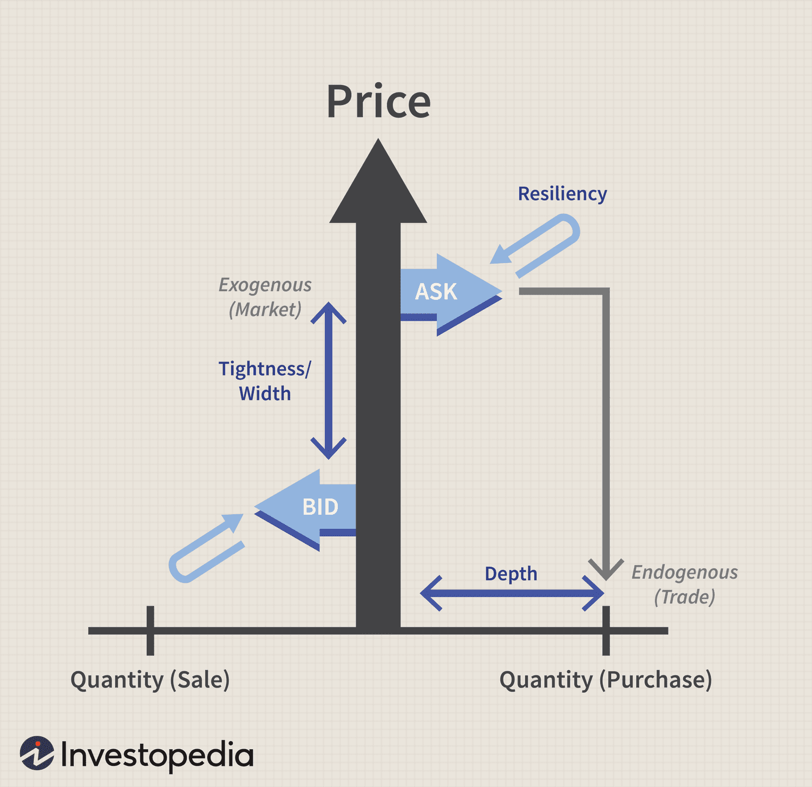

## Table of Contents

## What is liquidity in financial markets?

Liquidity in financial markets refers to how easily you can buy or sell an asset without causing a big change in its price. Think of it like a busy market where lots of people are buying and selling. If there are many buyers and sellers, you can quickly trade your goods at a fair price. But if there are only a few people, it might be hard to find someone to trade with, and you might have to accept a lower price or wait a long time.

In the context of stocks, bonds, or currencies, high liquidity means there are many active traders, so you can quickly buy or sell these assets. This is important because it helps keep the market stable and makes it easier for investors to get in and out of their investments. On the other hand, low liquidity can lead to bigger price swings and make it harder to trade, which can be riskier for investors.

## Why is liquidity important in trading and investing?

Liquidity is really important in trading and investing because it makes it easier to buy and sell things quickly. Imagine you want to sell your stock fast. If the market is liquid, there are lots of people ready to buy it from you at a fair price. This means you can get your money out of the investment without waiting a long time or having to lower your price a lot. It's like having a busy marketplace where you can always find someone to trade with.

On the other hand, if the market isn't liquid, it can be tough to find someone to buy your stock. You might have to wait a long time or sell it for less than you wanted. This can be risky because it might force you to keep your money tied up in the investment longer than you planned, or you might lose money if you have to sell at a lower price. So, [liquidity](/wiki/liquidity-risk-premium) helps keep the market smooth and makes it easier for everyone to trade without big problems.

## What are the basic components of liquidity?

Liquidity is made up of a few key parts. The first part is the number of buyers and sellers in the market. When there are lots of people ready to buy and sell, it's easier to trade quickly. This means you can sell your stuff without waiting a long time or lowering your price too much. The more people there are, the easier it is to find someone to trade with.

Another part of liquidity is how quickly trades can happen. If you can buy or sell something right away, that's a sign of high liquidity. This is important because it means you can get your money out of an investment fast if you need to. If it takes a long time to find someone to trade with, that's a sign of low liquidity, which can be risky.

The last part is the size of the trades that can happen without changing the price much. In a liquid market, you can buy or sell a lot without making the price go up or down a lot. But in a less liquid market, even small trades can cause big price changes. This makes it harder to trade without affecting the market, which is why liquidity is so important.

## How do market makers contribute to liquidity?

Market makers are like the helpers in a busy marketplace. They make sure there are always people ready to buy and sell things. Imagine you want to sell your stock, but there's no one to buy it right away. A market maker steps in and says, "I'll buy it from you," so you don't have to wait. They do the same thing when you want to buy something, offering to sell it to you even if no one else is selling at that moment. By doing this, market makers keep the market moving smoothly and make it easier for everyone to trade.

Because market makers are always ready to buy and sell, they help keep the market liquid. This means you can trade quickly without big changes in price. When the market is liquid, it's easier for everyone to get in and out of their investments without waiting a long time or losing money. So, market makers play a big role in making sure the market stays busy and easy to use for all traders and investors.

## What are the common measures of liquidity?

Liquidity can be measured in different ways, but two common measures are trading [volume](/wiki/volume-trading-strategy) and bid-ask spread. Trading volume is simply how many shares or units of an asset are bought and sold in a day. When a lot of trading happens, it means the market is liquid because there are many people ready to buy and sell. This makes it easier to trade without waiting a long time or changing the price a lot. On the other hand, if trading volume is low, it can be harder to find someone to trade with, which means lower liquidity.

The bid-ask spread is another way to measure liquidity. It's the difference between the highest price someone is willing to pay for an asset (the bid) and the lowest price someone is willing to sell it for (the ask). In a liquid market, the bid-ask spread is small because there are many buyers and sellers, so the prices they offer are close to each other. A small spread means you can buy or sell without losing much money on the difference between these prices. But if the spread is big, it's a sign of low liquidity, which can make trading more expensive and riskier.

## How can liquidity be modeled using statistical methods?

Liquidity can be modeled using statistical methods by looking at things like trading volume and bid-ask spread over time. For example, you can use time series analysis to study how these measures change from day to day or even minute to minute. By doing this, you can see patterns and predict how liquid the market might be in the future. Another way is to use regression models to see how different factors, like the number of traders or economic news, affect liquidity. These models help you understand what makes the market more or less liquid, so you can make better trading decisions.

Another statistical approach is to use simulations, like Monte Carlo methods, to model how liquidity might behave under different scenarios. For instance, you can simulate what would happen if there's a sudden drop in trading volume or if the bid-ask spread widens. This helps you prepare for different situations and understand how liquidity might change. By combining these different statistical methods, you get a clearer picture of liquidity and can better manage the risks that come with trading in markets that might be more or less liquid at different times.

## What are the differences between liquidity in stock markets and forex markets?

Liquidity in stock markets and [forex](/wiki/forex-system) markets works a bit differently because they are different kinds of markets. In stock markets, liquidity comes from the number of people buying and selling stocks. If a stock is popular and lots of people want to trade it, it's easy to buy or sell without changing the price much. But some stocks might not be as popular, so it can be harder to find someone to trade with, making them less liquid. Also, stock markets have set trading hours, which can affect liquidity because trading stops when the market closes.

Forex markets, on the other hand, are all about trading different currencies. These markets are open 24 hours a day, five days a week, which means there's always someone somewhere in the world ready to trade. This makes forex markets very liquid, especially for major currency pairs like the US dollar and the Euro. Because so many people and big banks trade currencies all the time, you can usually buy or sell quickly without big price changes. But some less common currency pairs might not be as liquid, making them harder to trade.

In both markets, liquidity can change. In stock markets, it might change because of news about a company or the economy. In forex markets, it might change because of economic reports or big events in different countries. Understanding these differences helps traders and investors know when it's easier or harder to trade in each market.

## How do high-frequency trading strategies impact liquidity?

High-frequency trading ([HFT](/wiki/high-frequency-trading-strategies)) strategies can make markets more liquid. HFT uses computers to trade very quickly, often in milliseconds. These traders buy and sell a lot, which means there are always people ready to trade. This can make it easier for everyone to buy or sell things without waiting a long time or changing the price a lot. Imagine a busy marketplace where there are always people ready to trade with you. That's what HFT can do to the market.

But HFT can also make things tricky. Sometimes, these fast traders can cause big price changes very quickly. If they all decide to sell at the same time, it can make the market less liquid because there might not be enough people ready to buy. This can lead to what's called "flash crashes," where prices drop suddenly and then go back up. So while HFT can help keep the market busy and liquid most of the time, it can also make it harder to trade if something goes wrong.

## What role do liquidity models play in risk management?

Liquidity models help with risk management by giving traders and investors a way to predict how easy or hard it will be to buy or sell things in the market. These models look at things like how many people are trading and how quickly prices can change. By understanding these things, traders can plan better and know when it might be risky to trade. For example, if a model shows that the market might not be very liquid soon, a trader might decide to wait before making a big trade, so they don't get stuck with something they can't sell easily.

These models also help traders see how different things can affect the market's liquidity. For instance, they can show how news or economic reports might make it harder to trade. By using these models, traders can be ready for times when the market might not be as busy, and they can make plans to protect their money. This way, liquidity models are a big help in managing the risks that come with trading in markets that can change from liquid to less liquid at different times.

## How can machine learning enhance liquidity modeling?

Machine learning can make liquidity modeling better by looking at a lot of data and finding patterns that people might miss. Imagine you're trying to guess if it will rain by looking out the window. You might see some clouds, but machine learning can look at weather data from the last ten years and see what usually happens when those clouds show up. In the same way, machine learning can look at lots of past trading data to predict how liquid the market will be in the future. It can find out what makes the market busy or slow and use that to make better guesses about liquidity.

Using machine learning also helps because it can learn and get better over time. As new data comes in, the machine learning model can change and improve its predictions. This is important because markets can change a lot, and what worked yesterday might not work today. By always learning from new data, machine learning can keep up with these changes and give traders and investors more accurate information about liquidity. This way, they can make smarter decisions and manage their risks better.

## What are the challenges in predicting liquidity during market stress?

Predicting liquidity during market stress is hard because things change a lot and quickly. When the market is stressed, like during a big economic event or a sudden drop in prices, people can start trading in ways that are hard to predict. They might all want to sell at the same time, which makes it really hard to find someone to buy. This can make the market less liquid very fast. Also, the usual patterns that help predict liquidity might not work during these times because everyone is acting differently than normal.

Another challenge is that the data we use to predict liquidity can be less reliable during market stress. Normally, we look at things like how many people are trading and how quickly prices are changing. But when the market is stressed, this data can be all over the place. It's like trying to guess the weather when a big storm is coming – the usual signs might not be there. So, even the best models and machine learning tools can struggle to give accurate predictions because the market is behaving in unexpected ways.

## How do regulatory changes affect liquidity modeling and market behavior?

Regulatory changes can really shake up how liquid a market is and how traders behave. When rules change, like making it harder or easier to trade, it can change how many people want to buy and sell things. For example, if new rules make it tougher to trade, some people might decide not to trade as much, which can make the market less liquid. On the other hand, if rules make trading easier, more people might jump in, making the market busier and more liquid. These changes can mess with the models we use to predict liquidity because the usual patterns might not work anymore.

Also, regulatory changes can make traders act differently. If there's a new rule that makes trading riskier, people might be more careful and trade less. This can make the market less liquid because there are fewer people ready to buy and sell. But if a new rule makes trading safer or more rewarding, more people might start trading, which can make the market more liquid. Because of this, the models we use to predict liquidity need to keep up with these changes. They have to be smart enough to learn from new data and adjust to how people are trading under the new rules.

## What are liquidity ratios and what is their role?

Liquidity ratios play a vital role in assessing a company's financial health, particularly their capacity to satisfy short-term obligations. These ratios provide a quantitative measure of a firm's liquidity position, making them indispensable tools in [algorithmic trading](/wiki/algorithmic-trading) for evaluating assets' underlying financial robustness. The three primary liquidity ratios used are the current ratio, quick ratio, and cash ratio.

The **current ratio** is calculated by dividing a company's current assets by its current liabilities. It serves as a broad indicator of a firm's capability to cover its short-term debts with assets that are expected to be converted to cash within a year. Mathematically, it is expressed as:

$$
\text{Current Ratio} = \frac{\text{Current Assets}}{\text{Current Liabilities}}
$$

A higher current ratio suggests a stronger liquidity position, although extremely high values might indicate inefficient capital use.

The **quick ratio**, also known as the acid-test ratio, refines assessment by excluding inventories from current assets, focusing on more liquid assets such as cash and receivables. This is particularly relevant in scenarios where inventory turnover is slow. The quick ratio is defined as:

$$
\text{Quick Ratio} = \frac{\text{Current Assets} - \text{Inventories}}{\text{Current Liabilities}}
$$

The quick ratio provides a more conservative view of liquidity by assessing the ability to settle liabilities with the most liquid assets.

Lastly, the **cash ratio** is the most stringent liquidity measure, considering only cash and cash equivalents against current liabilities. It highlights a company's immediate liquidity position, calculated as follows:

$$
\text{Cash Ratio} = \frac{\text{Cash and Cash Equivalents}}{\text{Current Liabilities}}
$$

In algorithmic trading, these ratios are crucial for formulating strategies that align with financial health evaluations of trading assets. By analyzing these liquidity metrics, traders can fine-tune strategies to optimize their portfolios, selecting stocks not only for immediate prospects but also for their long-term viability. This approach helps in mitigating risks associated with market [volatility](/wiki/volatility-trading-strategies) and economic downturns.

Incorporating liquidity ratios into trading algorithms allows for the dynamic adjustment of portfolios based on real-time financial health assessments, enhancing decision-making and risk management. This integration forms the backbone of sustainable trading strategies that offer both profitability and resilience in the fast-paced trading environment.

## What are Algorithmic Trading Strategies Using Liquidity Metrics?

Algorithmic trading strategies leverage liquidity metrics to enhance decision-making processes and optimize trading performance. Liquidity ratios are integral to risk management, stock selection criteria, and valuation models within algorithmic trading systems.

1. **Risk Management**: Liquidity ratios, such as the current ratio and quick ratio, provide insights into the financial stability of assets. In volatile markets, these metrics help assess an asset's ability to meet short-term obligations, thereby allowing traders to mitigate risks associated with liquidity constraints. For instance, a higher quick ratio indicates a substantial buffer against financial distress, offering traders a risk management tool to avoid investments in assets with potential liquidity issues during market swings.

2. **Stock Selection Criteria**: Utilizing liquidity metrics in algorithmic trading assists in identifying stocks with solid financial health, promoting long-term strategic investments. Algorithms evaluate liquidity ratios to shortlist stocks that display financial resilience and stability, ensuring that trades are executed in assets with a reduced likelihood of sudden liquidity shortages. This not only aids in maintaining a robust portfolio but also aligns with strategies oriented towards market stability and sustainable growth.

3. **Valuation Models**: Liquidity ratios improve the precision of financial models employed in stock valuation by identifying trading opportunities. For instance, the incorporation of liquidity metrics into the discounted cash flow (DCF) model can refine the valuation accuracy by adjusting projected cash flows for liquidity constraints. This adjustment can be expressed mathematically as:
$$
   \text{DCF adjusted for liquidity} = \sum \left( \frac{CF_t}{(1 + r + L)^t} \right)

$$

   where $CF_t$ is the cash flow at time $t$, $r$ the discount rate, and $L$ the liquidity premium reflecting the asset's liquidity characteristics. By factoring in liquidity, traders can make more informed valuation assessments and identify undervalued or overvalued stocks based on a comprehensive analysis.

Overall, the integration of liquidity metrics within algorithmic trading strategies offers a systematic approach to managing risks, refining stock selection, and enhancing the accuracy of valuation models, ultimately driving more informed trading decisions and optimizing financial outcomes.

## How is Machine Learning applied in Liquidity Modeling?

Machine learning algorithms have increasingly become pivotal in refining and enhancing liquidity modeling by predicting changes in liquidity conditions. By leveraging historical and real-time data, these algorithms can detect subtle patterns that are often imperceptible to traditional methods. Machine learning models, such as regression analysis, neural networks, and decision trees, facilitate the anticipation of market liquidity fluctuations, thereby allowing traders to adjust their strategies proactively.

One prevalent approach involves supervised learning techniques, where historical liquidity data is used to train models. These models can then forecast future liquidity conditions based on identified patterns and trends. For instance, regression models could predict how changes in trading volume or market orders affect liquidity. The formula for a simple linear regression model, which predicts liquidity as a dependent variable ($y$) based on one independent variable ($x$), is given by:

$$

y = \beta_0 + \beta_1 x + \epsilon 
$$

where $\beta_0$ is the intercept, $\beta_1$ is the coefficient of the independent variable, and $\epsilon$ is the error term.

Machine learning not only enhances prediction accuracy but also automates the adaptation of trading strategies to dynamic liquidity conditions. Algorithms can be programmed to modify their behavior based on predictions, such as altering trade sizes or timing to minimize impact cost and optimize execution. This adaptability is vital in volatile markets, where liquidity can rapidly thin or thicken.

Furthermore, the integration of AI and [machine learning](/wiki/machine-learning) with liquidity metrics introduces an advanced layer of intelligence to trading algorithms. For example, [deep learning](/wiki/deep-learning) models such as recurrent neural networks (RNNs) can capture complex temporal dependencies in liquidity data, making them suitable for time-series forecasting. These models continuously learn and improve from new data inputs, enhancing their predictive capabilities over time.

Consider a simple implementation using Python and the popular machine learning library scikit-learn:

```python
from sklearn.linear_model import LinearRegression
import numpy as np

# Sample data: trading volumes (independent variable) and corresponding liquidity measures (dependent variable)
trading_volumes = np.array([1000, 1500, 2000, 2500, 3000]).reshape(-1, 1)
liquidity_measures = np.array([0.5, 0.8, 1.1, 1.4, 1.7])

# Initializing and training the linear regression model
model = LinearRegression()
model.fit(trading_volumes, liquidity_measures)

# Predict liquidity for a new trading volume
new_volume = np.array([[3500]])
predicted_liquidity = model.predict(new_volume)

print("Predicted Liquidity:", predicted_liquidity[0])
```

In this code snippet, a linear regression model is trained on a dataset comprising trading volumes and corresponding liquidity measures. With this trained model, traders can predict liquidity conditions for future trading volumes, allowing for strategic adjustments in trading activities.

The application of machine learning in liquidity modeling represents a significant advancement in algorithmic trading, offering traders enhanced tools for managing risks and improving performance. As AI technologies continue to evolve, their integration with trading algorithms is expected to become even more sophisticated, leading to smarter, data-driven decision-making in financial markets.

## References & Further Reading

[1]: Almgren, R., & Chriss, N. (2000). ["Optimal execution of portfolio transactions."](https://smallake.kr/wp-content/uploads/2016/03/optliq.pdf) Journal of Risk, 3(2), 5-40.

[2]: Bouchaud, J. P., Farmer, J. D., & Lillo, F. (2009). ["How Markets Slowly Digest Changes in Supply and Demand."](https://arxiv.org/abs/0809.0822) In Handbook of Financial Markets: Dynamics and Evolution.

[3]: Hasbrouck, J. (2007). ["Empirical Market Microstructure: The Institutions, Economics, and Econometrics of Securities Trading."](https://academic.oup.com/book/52241) Oxford University Press.

[4]: Lopez de Prado, M. (2018). ["Advances in Financial Machine Learning."](https://books.google.com/books/about/Advances_in_Financial_Machine_Learning.html?id=oU9KDwAAQBAJ) Wiley.

[5]: Cartea, Á., Jaimungal, S., & Penalva, J. (2015). ["Algorithmic and High-Frequency Trading."](https://assets.cambridge.org/97811070/91146/frontmatter/9781107091146_frontmatter.pdf) Cambridge University Press.