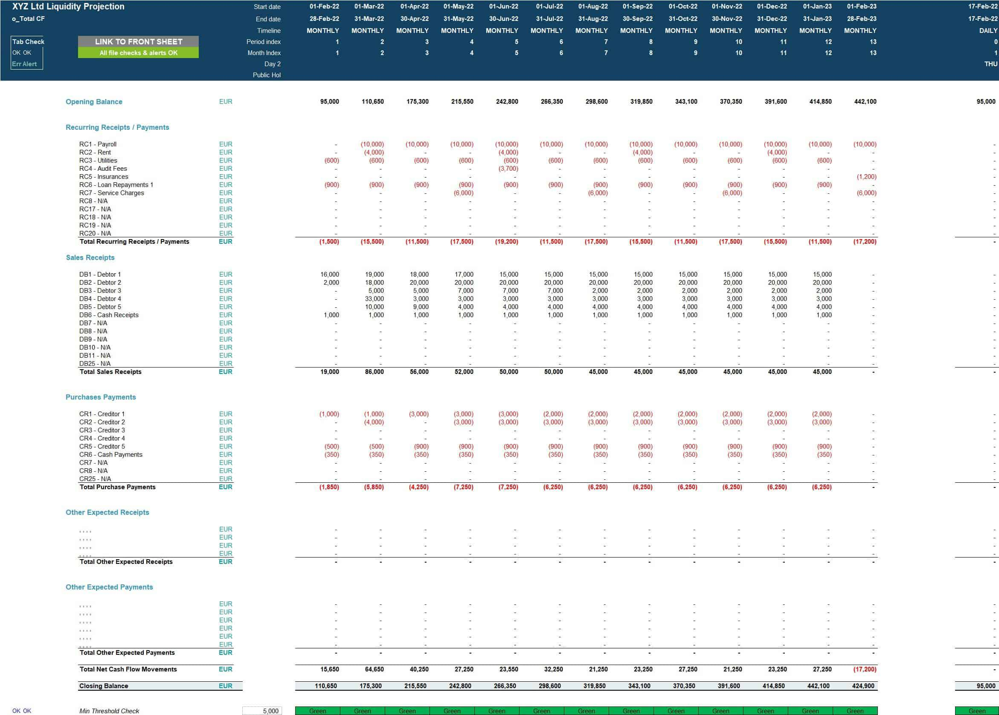

Liquidity modeling in algorithmic trading is a crucial aspect that ensures traders efficiently handle execute orders without substantial impact on the market. The primary aim is to understand and manage the flow of liquidity, which is essential for maintaining market stability and efficiency. Liquidity modeling involves analyzing market dynamics, predicting liquidity shortages, and optimizing trading strategies to minimize slippage and market impact.

This article focuses on liquidity modeling within the algorithmic trading paradigm, placing particular emphasis on advanced strategies and their practical implementation. As algorithmic trading becomes more prevalent, the need for sophisticated liquidity models that can forecast and adapt to changing market conditions has grown significantly. Techniques for ensuring optimal asset allocation are vital for traders to effectively manage liquidity risk, enhance execution quality, and improve overall trading performance.



The integration of machine learning and artificial intelligence within liquidity modeling represents a significant innovation in the field. These technologies enable traders to analyze large datasets, identify complex patterns, and make real-time decisions. The application of algorithms such as neural networks and support vector machines is becoming increasingly common in predicting market liquidity, allowing for more precise and adaptive trading strategies.

This guide is specifically designed for researchers, students, and practitioners with an interest in financial trading and portfolio management. By exploring a range of liquidity modeling techniques and their applications, this article provides valuable insights into the complexities of modern algorithmic trading and underscores the importance of continuous innovation in the development of liquidity models. Through the strategic implementation of these models, traders can achieve enhanced trading efficiency and better risk management.

## Table of Contents

## Understanding Liquidity in Algorithmic Trading

Liquidity in trading pertains to the capacity to swiftly buy or sell assets without eliciting considerable price fluctuations. This concept is foundational in financial markets, as it influences transaction costs, pricing efficiency, and the overall market stability. High liquidity suggests that an asset can be traded easily and in significant volumes without causing a drastic price change, whereas low liquidity can lead to increased volatility and larger spreads between buying and selling prices.

Algorithmic trading, characterized by the use of sophisticated algorithms to execute trades at enhanced speeds, critically depends on liquidity to perform optimally. The effectiveness of algorithmic trading is significantly enhanced in liquid markets where the execution of large volumes can occur with minimal price impact. Liquidity facilitates the swift execution of orders, vital for high-frequency trading strategies that capitalize on small price movements.

A comprehensive understanding of market [liquidity](/wiki/liquidity-risk-premium) entails an in-depth examination of order [books](/wiki/algo-trading-books), which list all buy and sell orders for a particular financial instrument, facilitating an understanding of market depth and spread dynamics. Market depth refers to the orders' [volume](/wiki/volume-trading-strategy) available at each price level, indicating the liquidity at different price points. Spread dynamics, the difference between bid and ask prices, are inherently linked to liquidity levels; tighter spreads generally denote higher liquidity.

In the context of [algorithmic trading](/wiki/algorithmic-trading), market participants are categorized as liquidity takers and liquidity providers, based on their interaction with market liquidity. Liquidity takers execute market orders that immediately match with existing orders in the [order book](/wiki/order-book-trading-strategies), thereby consuming available liquidity. These participants prioritize order execution speed over the cost, often leading to crossing the spread to consummate their trades rapidly. Liquidity providers, on the other hand, place limit orders that contribute to the order book's depth, offering liquidity to the market. By setting specific price points for buying or selling assets, they provide options for liquidity takers to trade against. This symbiotic relationship between takers and providers is crucial for maintaining market equilibrium and is pivotal in algorithmic trading strategies.

In summary, understanding liquidity in algorithmic trading involves recognizing its pivotal role in enabling efficient transaction execution and appreciating the intricacies of market structures such as order books and spread. This knowledge is essential for developing trading strategies that effectively leverage market conditions.

## Liquidity Risk Management Strategies

Liquidity risk is a significant concern in algorithmic trading as it relates to the inability to transact orders without causing significant market disruptions. Effective liquidity risk management is essential to prevent substantial financial losses and ensure smooth trading operations. This section focuses on various strategies to manage liquidity risk, emphasizing the use of liquidity-adjusted value-at-risk (L-VaR) models, integrating risk management frameworks within trading algorithms, and discussing case studies of successful liquidity management under adverse market conditions.

One primary strategy involves utilizing liquidity-adjusted value-at-risk (L-VaR) models. These models extend the traditional value-at-risk (VaR) approach by incorporating liquidity factors, allowing traders to assess potential losses more accurately when markets are less liquid. The L-VaR models consider the spread, market depth, and price impact of trading large volumes, enhancing the precision of risk assessments. A general formula for liquidity-adjusted VaR can be represented as:

$$
\text{L-VaR} = \text{VaR} + f(L)
$$

where $\text{VaR}$ is the standard value-at-risk measure, and $f(L)$ is a function of liquidity factors such as spreads and market impact.

As part of effective liquidity risk management, integrating robust risk management frameworks within trading algorithms is crucial. This integration ensures that trading systems are capable of dynamically adjusting to changing market conditions, thereby minimizing potential losses. Algorithms can be programmed to monitor liquidity indicators in real time and adjust trading strategies accordingly. For instance, algorithms might reduce the size of trades or postpone execution in response to low liquidity signals, thereby mitigating the risk of adverse price movements.

Additionally, case studies provide valuable insights into effective liquidity risk management in challenging market environments. For example, during periods of economic uncertainty or market [volatility](/wiki/volatility-trading-strategies), successful trading firms have employed adaptive algorithms that prioritize liquidity factors. Such algorithms often use [machine learning](/wiki/machine-learning) techniques to predict liquidity conditions and adjust trading parameters in real time. By maintaining a focus on liquidity risk control, these firms can execute trades without causing significant market disruptions, even during periods of limited market liquidity.

In summary, managing liquidity risk is pivotal for maintaining the stability and efficiency of algorithmic trading systems. By incorporating advanced models like liquidity-adjusted VaR, embedding comprehensive risk management frameworks within trading algorithms, and learning from real-world case studies, traders can better navigate the complexities of liquidity risk and safeguard against potential market impacts.

## Machine Learning in Liquidity Modeling

Machine learning algorithms have become integral to liquidity modeling, offering enhanced capabilities for predicting market conditions and optimizing trading strategies. These algorithms analyze vast amounts of market data, allowing traders to identify patterns that support more informed decision-making processes. Key techniques in machine learning for liquidity modeling include neural networks and support vector machines (SVMs), each providing unique advantages.

Neural networks, particularly [deep learning](/wiki/deep-learning) models, are well-suited for capturing nonlinear relationships in market data. They consist of multiple layers of nodes, or neurons, that transform input data through weighted connections to predict outcomes. A basic [neural network](/wiki/neural-network) model for predicting liquidity levels might be structured as follows:

```python
import numpy as np
from keras.models import Sequential
from keras.layers import Dense

# Generate some example data
X_train = np.random.rand(1000, 10)  # 1000 samples, 10 features
y_train = np.random.rand(1000, 1)   # 1000 samples, 1 target

# Define the neural network model
model = Sequential()
model.add(Dense(64, input_dim=10, activation='relu'))
model.add(Dense(32, activation='relu'))
model.add(Dense(1, activation='linear'))

# Compile the model
model.compile(optimizer='adam', loss='mean_squared_error')

# Train the model
model.fit(X_train, y_train, epochs=50, batch_size=10, verbose=1)
```

In this example, the neural network consists of three layers, with the final layer outputting a single value representing a liquidity metric. This model's flexibility allows it to adapt to various inputs, thus offering valuable insight into liquidity dynamics.

Support vector machines (SVMs) are another powerful tool in liquidity modeling. SVMs work by finding the hyperplane that best separates the classes of data in a high-dimensional space. This characteristic enables SVMs to perform well with smaller and cleaner datasets, where they can effectively identify boundaries between different liquidity states.

In real-time trading scenarios, the efficacy of machine learning models is maximized when they are integrated with high-frequency data feeds and advanced computational frameworks. This setup allows for swift adaptation to market fluctuations, providing traders with timely insights and reducing the latency of decision-making processes. Implementing these models often involves continuous training on new data, reinforcing their predictive capabilities and ensuring they remain relevant in ever-changing market conditions.

Ultimately, the application of machine learning in liquidity modeling represents a significant enhancement to traditional methods. By leveraging the pattern-recognition capabilities of neural networks and SVMs, traders can achieve more precise and dynamic liquidity management, translating to improved performance in algorithmic trading environments.

## Practical Applications of Liquidity Models in Trading

Liquidity models play a crucial role in optimizing asset allocation and improving trading efficiency. These models are instrumental in assessing the market's capacity to absorb large orders without significant price disruptions. By employing sophisticated liquidity models, traders can precisely determine the optimal execution strategy for different market conditions, thereby enhancing overall trading performance.

### Real-World Applications and Case Studies

1. **Order Execution Optimization**: Liquidity models are leveraged to determine the best order execution strategies, whether using market orders, limit orders, or a combination of both. These strategies minimize market impact costs while ensuring timely execution. For instance, algorithms such as the Volume-Weighted Average Price (VWAP) or Implementation Shortfall target minimized deviation from benchmark prices, aided by liquidity model insights.

2. **Risk Mitigation**: Incorporating liquidity models assists in managing exposure to liquidity risk, especially during volatile market periods. For example, during the 2008 financial crisis, firms utilizing advanced liquidity risk assessment models managed to maintain execution efficiency and reduced potential losses compared to their peers.

3. **Market Making**: Liquidity models contribute significantly to market-making activities by assessing the bid-ask spread effectively. By modeling market depth and order book dynamics, traders adjust quotes dynamically to balance risk and reward, thus improving profitability.

4. **Portfolio Rebalancing**: For asset managers, liquidity models can optimize the rebalancing of large portfolios, ensuring minimal transaction costs while maintaining desired asset allocation. This is especially critical for index-tracking funds that frequently need to adjust holdings in response to index changes.

### Developing and Deploying Liquidity Models Using Python

Python provides the tools necessary to develop and deploy liquidity models effectively. Below is a basic guide illustrating the process:

```python
import numpy as np
import pandas as pd
from sklearn.model_selection import train_test_split
from sklearn.ensemble import RandomForestRegressor

# Load market data
data = pd.read_csv("market_data.csv")

# Feature extraction
features = data[['price', 'volume', 'bid_ask_spread']]
target = data['liquidity_index']

# Train-test split
X_train, X_test, y_train, y_test = train_test_split(features, target, test_size=0.2, random_state=42)

# Model training
model = RandomForestRegressor(n_estimators=100, random_state=42)
model.fit(X_train, y_train)

# Predict liquidity
liquidity_predictions = model.predict(X_test)
print("Predicted Liquidity Index:", liquidity_predictions)
```

### Implementation Steps

1. **Data Collection**: Collect and preprocess market data, including prices, volumes, and order book details. This data serves as the foundation for feature extraction and model training.

2. **Feature Engineering**: Create features that capture essential market conditions. These may include price movements, trading volume, and bid-ask spreads, which influence liquidity levels.

3. **Model Selection and Training**: Choose an appropriate machine learning model, such as a RandomForestRegressor, known for handling non-linear relationships effectively. Train the model using a clean and representative dataset split into training and testing subsets.

4. **Evaluation and Deployment**: Evaluate the model's performance using metrics like Mean Squared Error (MSE) to ascertain its accuracy. Deploy the model to a production environment where it can process real-time data for predictive analytics.

The methodologies and techniques outlined demonstrate practical applications of liquidity models in trading. By integrating these models into trading systems, traders can enhance execution strategies, mitigate risks, and improve overall market operation efficiencies.

## Conclusion

Liquidity modeling is a pivotal aspect of algorithmic trading, crucial for executing transactions smoothly without significant market impact. Advanced risk management strategies and the integration of machine learning technologies are increasingly important for enhancing the performance of liquidity models. These methodologies not only facilitate the development of sophisticated trading algorithms but also allow for more precise prediction and analysis of market conditions.

The dynamic nature of financial markets demands constant evolution and adaptation of liquidity models. This is necessary to address emerging challenges and opportunities presented by the fast-paced changes in these environments. Models must be regularly updated and refined to incorporate the latest market data and trends. This ongoing refinement process ensures that liquidity modeling remains relevant and effective.

Continuous exploration of emerging technologies and algorithms can substantially improve liquidity management frameworks. Techniques such as deep learning, [reinforcement learning](/wiki/reinforcement-learning), and advanced data analytics have the potential to revolutionize the way liquidity is modeled and managed. By adopting these cutting-edge technologies, market participants can develop more robust liquidity models that anticipate market fluctuations and optimize trading strategies.

In conclusion, the integration of advanced technologies and continuous adaptation are fundamental for achieving robust liquidity management in algorithmic trading. By leveraging emerging tools and methodologies, traders and financial institutions can ensure that their liquidity models remain efficient and effective, ultimately supporting more seamless and impactful transactions.

## Additional Resources

For further learning on liquidity modeling, consider exploring a variety of academic resources that encompass the domains of financial engineering and machine learning. Academic journals are essential reading material, offering peer-reviewed articles that keep you informed on the latest methodologies and discoveries in these fields. Publications such as the "Journal of Financial Economics" and the "Quantitative Finance" journal frequently contain studies related to liquidity modeling and algorithmic trading.

Books play a pivotal role in offering a comprehensive understanding of complex topics. A recommended read is "Liquidity and Risk Modeling" by Mazin A. M. Al Janabi. This book is significant because it combines theoretical insights with practical case studies, making complex subjects accessible through real-world applications.

Engagement with online platforms and forums that focus on quantitative finance and algorithmic trading can be invaluable for practical insights and peer support. Websites such as Quantitative Finance Stack Exchange provide a community-driven space where you can ask questions, share knowledge, and exchange ideas on liquidity modeling challenges and innovations. Additionally, participating in online courses or webinars hosted by financial data analytics companies can provide hands-on experience with state-of-the-art tools and techniques.

For those interested in implementing and testing liquidity models, open-source platforms like GitHub offer repositories where developers share code, allowing others to learn from practical implementations. Engaging with these resources can significantly enhance your understanding and execution of liquidity modeling strategies.

## References & Further Reading

[1]: Almgren, R., & Chriss, N. (2001). ["Optimal execution of portfolio transactions."](https://smallake.kr/wp-content/uploads/2016/03/optliq.pdf)00018-6) Journal of Risk, 3(2), 5-39.

[2]: Bouchaud, J-P., Farmer, J.D., & Lillo, F. (2009). ["How markets slowly digest changes in supply and demand."](https://arxiv.org/abs/0809.0822) In Hens, T., Schenk-Hoppe, K.R. (eds) Handbook of Financial Markets: Dynamics and Evolution, 57-160.

[3]: Gatheral, J. (2010). ["No-dynamic-arbitrage and market impact."](https://papers.ssrn.com/sol3/papers.cfm?abstract_id=1292353) Quantitative Finance, 10(7), 749-759.

[4]: ["Advances in Financial Machine Learning"](https://www.amazon.com/Advances-Financial-Machine-Learning-Marcos/dp/1119482089) by Marcos Lopez de Prado

[5]: Hasbrouck, J. (2007). ["Empirical Market Microstructure: The Institutions, Economics, and Econometrics of Securities Trading."](https://academic.oup.com/book/52241) Oxford University Press.

[6]: Lehalle, C. A., & Laruelle, S. (2013). ["Market Microstructure in Practice."](https://www.semanticscholar.org/paper/Market-Microstructure-in-Practice-Lehalle-Laruelle/2df52569ee044db799cc9ae865de4689847d6f83) World Scientific Publishing Company.

[7]: ["Machine Learning for Algorithmic Trading"](https://github.com/stefan-jansen/machine-learning-for-trading) by Stefan Jansen

[8]: Abernethy, J., Chen, Y., Pan, X., & Wibisono, A. (2013). ["Interior-point methods for full-information and bandit convex optimization."](https://papers.neurips.cc/paper_files/paper/2024/file/b125999bde7e80910cbdbd323087df8f-Paper-Conference.pdf) Advances in Neural Information Processing Systems 26.