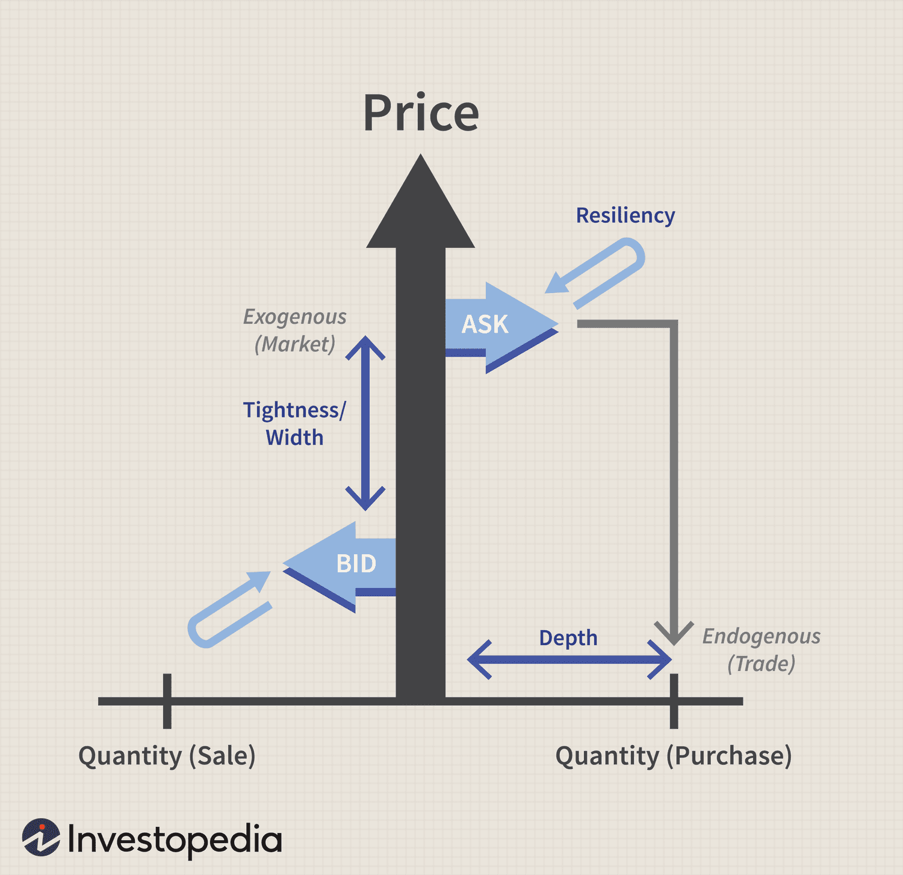

## Table of Contents

## What is liquidity and why is it important in financial markets?

Liquidity refers to how easily you can buy or sell something in the market without affecting its price too much. Imagine you want to sell your car quickly. If there are lots of people wanting to buy cars like yours, you can sell it fast and at a good price. That's high liquidity. But if hardly anyone wants to buy cars like yours, you might have to wait a long time or lower your price a lot. That's low liquidity. In financial markets, liquidity is about how easily you can trade stocks, bonds, or other financial products.

Liquidity is important in financial markets because it helps everything run smoothly. When markets are liquid, it's easier for people to buy and sell things quickly and at fair prices. This makes people feel more confident about investing because they know they can get their money out if they need to. If markets are not liquid, it can be hard to sell things, and prices can swing wildly. This can make people nervous and less likely to invest, which can slow down the whole economy. So, liquidity is a big deal for keeping financial markets healthy and working well.

## What are the basic components of liquidity?

The first basic component of liquidity is the volume of trading. This means how many people are buying and selling something. If lots of people are trading, it's easier to find someone to buy or sell to, making it more liquid. The second component is the bid-ask spread. This is the difference between the highest price someone is willing to pay (the bid) and the lowest price someone is willing to sell for (the ask). A smaller spread means it's easier and cheaper to trade, which increases liquidity.

Another important component is market depth. This refers to how many buy and sell orders are waiting in the market at different price levels. If there are lots of orders at many different prices, it's easier to trade without moving the price much, which means more liquidity. The last component is the speed of transactions. If you can buy or sell quickly, without waiting a long time, the market is more liquid. Together, these components help determine how liquid a market is, making it easier or harder for people to trade.

## How do you measure liquidity in a market?

To measure liquidity in a market, you look at a few key things. One is the trading volume, which is just how many shares or contracts are being bought and sold every day. If lots of people are trading, it's easier to find someone to buy from or sell to, so the market is more liquid. Another thing to check is the bid-ask spread. This is the difference between the highest price someone is willing to pay and the lowest price someone is willing to sell for. A small spread means it's easier and cheaper to trade, which makes the market more liquid.

Another way to measure liquidity is by looking at market depth. This means checking how many buy and sell orders are waiting in the market at different price levels. If there are lots of orders at many different prices, you can trade without moving the price much, which means more liquidity. Finally, you can also think about how quickly trades happen. If you can buy or sell something fast, without waiting a long time, the market is more liquid. By looking at these things, you can get a good idea of how easy it is to trade in a market.

## What are the common liquidity metrics used by financial analysts?

Financial analysts use several common metrics to measure liquidity in markets. One key metric is trading volume, which shows how many shares or contracts are traded in a day. High trading volume means more people are buying and selling, making it easier to find someone to trade with. Another important metric is the bid-ask spread. This is the difference between the highest price someone is willing to pay and the lowest price someone is willing to sell for. A smaller spread means it's cheaper and easier to trade, which indicates higher liquidity.

Another metric used by analysts is market depth. This looks at how many buy and sell orders are waiting in the market at different price levels. If there are lots of orders at many different prices, it's easier to trade without moving the price much, which means the market is more liquid. Additionally, analysts consider the speed of transactions. If you can buy or sell quickly, without waiting a long time, this also suggests higher liquidity. By looking at these metrics, analysts can understand how easy it is to trade in a market and make better investment decisions.

## What is liquidity risk and how does it affect trading strategies?

Liquidity risk is the chance that you won't be able to buy or sell something quickly enough, or at a good price. Imagine you need to sell your car fast, but no one wants to buy it right away. You might have to wait a long time or sell it for less money than you wanted. In the stock market, this means if you want to sell your stocks quickly, you might not find anyone to buy them right away, or you might have to sell them for a lower price than you hoped.

This risk can change how people trade. If someone knows it might be hard to sell their stocks quickly, they might be more careful about what they buy. They might choose stocks that are easier to sell, even if they don't offer the best returns. Or, they might decide to hold onto their stocks for a longer time, waiting for the right moment to sell. This can make their trading strategy more conservative, focusing on safety and being able to get out of a trade when they need to, rather than chasing big gains.

## How can liquidity be modeled in financial markets?

Liquidity in financial markets can be modeled using different methods that help us understand how easy it is to buy or sell things. One way is to use mathematical formulas that look at things like trading volume and the difference between buying and selling prices. These formulas help predict how quickly you can trade and at what price. For example, a model might use data on how many stocks are being traded each day and the gap between the highest price someone is willing to pay and the lowest price someone is willing to sell for. By putting these numbers into the model, it can tell us how liquid the market is.

Another way to model liquidity is by using computer simulations. These simulations create a pretend market where you can see how things might work in real life. In these simulations, you can change things like how many people are buying and selling or how quickly they want to trade. This helps us see how different situations might affect liquidity. For example, if lots of people suddenly want to sell their stocks, the simulation can show us how this might make it harder for everyone to trade. By using these models, financial experts can better understand and predict how easy or hard it will be to trade in the market.

## What are the different types of liquidity models and their applications?

Liquidity models help us understand how easy or hard it is to buy and sell things in financial markets. One type of liquidity model is the order book model. This model looks at all the buy and sell orders waiting in the market at different prices. It helps us see how many people want to buy or sell at different price levels, which tells us how liquid the market is. Another type is the market microstructure model. This model focuses on how trading works, like how quickly trades happen and the costs of trading. It helps us understand how the rules and systems of trading affect how easy it is to buy and sell.

Another important type of liquidity model is the inventory model. This model looks at how much of a stock or other financial product a trader or market maker has. It helps us understand how their need to buy or sell affects the market's liquidity. For example, if a market maker has a lot of a stock, they might need to sell it quickly, which can make the market less liquid. Lastly, there are agent-based models. These models use computer simulations to create a pretend market with lots of different traders. They help us see how different people's trading choices affect the overall liquidity of the market. Each of these models has its own way of helping us understand and predict how easy it will be to trade in the market.

## How do market microstructure theories influence liquidity modeling?

Market microstructure theories help us understand how trading works in a market, and they play a big role in how we model liquidity. These theories look at things like how quickly trades happen, the costs of trading, and the rules and systems that affect buying and selling. By studying these things, market microstructure theories help us build models that show how easy or hard it is to trade. For example, if a market has a lot of rules that slow down trading, a model based on market microstructure might show that the market is less liquid because it takes longer to buy and sell.

These theories also help us understand how different people in the market, like traders and market makers, affect liquidity. Market makers are people who buy and sell things to keep the market running smoothly. If they have a lot of a stock and need to sell it quickly, this can make the market less liquid. Market microstructure models can show us how these actions change the market's liquidity. By using these theories, we can make better models that help us predict how easy it will be to trade and make smarter decisions about buying and selling.

## What are the challenges in modeling liquidity for high-frequency trading?

Modeling liquidity for high-frequency trading is really tough because everything happens so fast. High-frequency traders use computers to buy and sell things in the blink of an eye, sometimes thousands of times a second. This means that the models need to keep up with these super quick trades and be able to predict what will happen next. But it's hard to do that because the market can change in a split second, and small changes can make a big difference. So, the models need to be super accurate and fast, which is a big challenge.

Another problem is that high-frequency trading can make the market less predictable. These traders often use complex strategies that can change the market's liquidity really quickly. For example, if a lot of high-frequency traders decide to sell at the same time, it can make it harder for everyone else to trade. This means the models need to take into account not just the current state of the market, but also how high-frequency traders might change it. It's like trying to predict the weather when you know a storm might suddenly change everything. So, making models that work well for high-frequency trading is really hard and needs a lot of smart thinking and fast computers.

## How do liquidity models incorporate the impact of market events and news?

Liquidity models try to include the effects of market events and news by looking at how these things change how people trade. When big news comes out, like a company doing better than expected or a new law being passed, it can make more people want to buy or sell. This can change how easy or hard it is to trade. So, the models use data from past events to guess how the market might react to new news. They look at things like how much trading goes up or down and how the prices change when news happens. By doing this, the models can try to predict how the market's liquidity might change when new events happen.

But it's not easy to get this right because news can be surprising and hard to predict. Sometimes, news can make the market go crazy, with lots of people buying and selling all at once. This can make the market less liquid because it's harder to find someone to trade with at a good price. So, the models need to be smart and flexible, using lots of data and quick computers to keep up with the fast changes. Even then, it's tough to be perfect because the market can be unpredictable, and new events can change everything in a flash.

## What advanced statistical techniques are used in liquidity modeling?

Advanced statistical techniques used in liquidity modeling help us understand and predict how easy it is to buy and sell things in the market. One common technique is time series analysis. This method looks at how things like trading volume and prices change over time. By studying these patterns, we can guess how liquid the market will be in the future. Another technique is regression analysis, which helps us see how different factors, like news or economic reports, affect liquidity. It's like trying to figure out how much rain affects the price of umbrellas. These techniques use lots of data to make smart guesses about what will happen next.

Another important technique is machine learning. This is where computers learn from past data to make predictions. For example, machine learning can help us understand how different trading strategies affect liquidity. It's like teaching a computer to play chess by showing it lots of past games. By using these advanced methods, we can build better models that help us understand how the market works and make better decisions about buying and selling. But it's still hard to predict everything perfectly because the market can change in unexpected ways.

## How can machine learning and AI enhance liquidity modeling and prediction?

Machine learning and AI can make liquidity modeling and prediction better by looking at huge amounts of data really fast. They can find patterns and connections that people might miss. For example, they can learn how things like news, trading volume, and price changes all work together to affect how easy it is to buy and sell things in the market. By using this information, machine learning models can make smarter guesses about how liquid the market will be in the future. This helps traders and investors make better decisions because they can see what might happen next.

Another way machine learning and AI help is by being able to change and learn over time. The market is always changing, and what worked yesterday might not work today. Machine learning models can keep learning from new data, so they get better at predicting liquidity as time goes on. This means they can adapt to new situations and surprises in the market. By using these smart tools, people in the financial world can understand and predict how easy it will be to trade, which makes everything run smoother and helps them make more money.

## What are Liquidity Risk Management Strategies?

Liquidity risk is a significant concern in algorithmic trading as it relates to the inability to transact orders without causing significant market disruptions. Effective liquidity risk management is essential to prevent substantial financial losses and ensure smooth trading operations. This section focuses on various strategies to manage liquidity risk, emphasizing the use of liquidity-adjusted value-at-risk (L-VaR) models, integrating risk management frameworks within trading algorithms, and discussing case studies of successful liquidity management under adverse market conditions.

One primary strategy involves utilizing liquidity-adjusted value-at-risk (L-VaR) models. These models extend the traditional value-at-risk (VaR) approach by incorporating liquidity factors, allowing traders to assess potential losses more accurately when markets are less liquid. The L-VaR models consider the spread, market depth, and price impact of trading large volumes, enhancing the precision of risk assessments. A general formula for liquidity-adjusted VaR can be represented as:

$$
\text{L-VaR} = \text{VaR} + f(L)
$$

where $\text{VaR}$ is the standard value-at-risk measure, and $f(L)$ is a function of liquidity factors such as spreads and market impact.

As part of effective liquidity risk management, integrating robust risk management frameworks within trading algorithms is crucial. This integration ensures that trading systems are capable of dynamically adjusting to changing market conditions, thereby minimizing potential losses. Algorithms can be programmed to monitor liquidity indicators in real time and adjust trading strategies accordingly. For instance, algorithms might reduce the size of trades or postpone execution in response to low liquidity signals, thereby mitigating the risk of adverse price movements.

Additionally, case studies provide valuable insights into effective liquidity risk management in challenging market environments. For example, during periods of economic uncertainty or market [volatility](/wiki/volatility-trading-strategies), successful trading firms have employed adaptive algorithms that prioritize liquidity factors. Such algorithms often use [machine learning](/wiki/machine-learning) techniques to predict liquidity conditions and adjust trading parameters in real time. By maintaining a focus on liquidity risk control, these firms can execute trades without causing significant market disruptions, even during periods of limited market liquidity.

In summary, managing liquidity risk is pivotal for maintaining the stability and efficiency of algorithmic trading systems. By incorporating advanced models like liquidity-adjusted VaR, embedding comprehensive risk management frameworks within trading algorithms, and learning from real-world case studies, traders can better navigate the complexities of liquidity risk and safeguard against potential market impacts.

## References & Further Reading

[1]: Almgren, R., & Chriss, N. (2001). ["Optimal execution of portfolio transactions."](https://smallake.kr/wp-content/uploads/2016/03/optliq.pdf)00018-6) Journal of Risk, 3(2), 5-39.

[2]: Bouchaud, J-P., Farmer, J.D., & Lillo, F. (2009). ["How markets slowly digest changes in supply and demand."](https://arxiv.org/abs/0809.0822) In Hens, T., Schenk-Hoppe, K.R. (eds) Handbook of Financial Markets: Dynamics and Evolution, 57-160.

[3]: Gatheral, J. (2010). ["No-dynamic-arbitrage and market impact."](https://papers.ssrn.com/sol3/papers.cfm?abstract_id=1292353) Quantitative Finance, 10(7), 749-759.

[4]: ["Advances in Financial Machine Learning"](https://www.amazon.com/Advances-Financial-Machine-Learning-Marcos/dp/1119482089) by Marcos Lopez de Prado

[5]: Hasbrouck, J. (2007). ["Empirical Market Microstructure: The Institutions, Economics, and Econometrics of Securities Trading."](https://academic.oup.com/book/52241) Oxford University Press.

[6]: Lehalle, C. A., & Laruelle, S. (2013). ["Market Microstructure in Practice."](https://www.semanticscholar.org/paper/Market-Microstructure-in-Practice-Lehalle-Laruelle/2df52569ee044db799cc9ae865de4689847d6f83) World Scientific Publishing Company.

[7]: ["Machine Learning for Algorithmic Trading"](https://github.com/stefan-jansen/machine-learning-for-trading) by Stefan Jansen

[8]: Abernethy, J., Chen, Y., Pan, X., & Wibisono, A. (2013). ["Interior-point methods for full-information and bandit convex optimization."](https://papers.neurips.cc/paper_files/paper/2024/file/b125999bde7e80910cbdbd323087df8f-Paper-Conference.pdf) Advances in Neural Information Processing Systems 26.