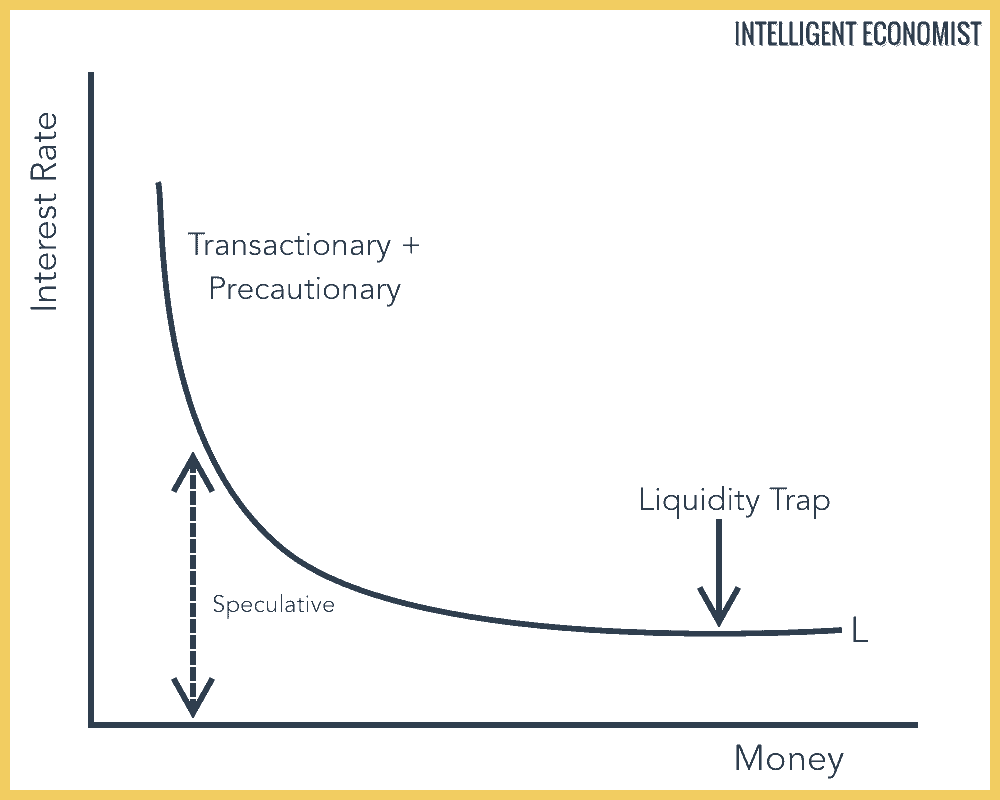

## Table of Contents

## What is Liquidity Preference Theory?

Liquidity Preference Theory is an economic idea that explains why people want to hold onto money instead of investing it or spending it. It was first explained by John Maynard Keynes, a famous economist. The theory says that people prefer to keep their money liquid, which means they can use it whenever they want, rather than putting it into things like stocks or bonds where they might not be able to get it back quickly.

There are three main reasons why people prefer liquidity according to Keynes. The first reason is the transaction motive, which means people need money to buy things every day. The second reason is the precautionary motive, which means people want to have money saved up just in case something unexpected happens. The third reason is the speculative motive, where people hold onto money because they think they might be able to make more money later by investing it at a better time.

In summary, Liquidity Preference Theory helps us understand why people choose to keep their money in a form that's easy to spend or save, rather than locking it away in investments. This preference for liquidity affects how much interest rates need to be to encourage people to save or invest their money, which in turn impacts the overall economy.

## Who developed the Liquidity Preference Theory?

The Liquidity Preference Theory was developed by John Maynard Keynes, a famous economist. He came up with this idea to explain why people choose to hold onto money instead of spending it or investing it right away. Keynes thought that people like to keep their money in a form that they can easily use, which he called "liquidity."

Keynes explained that there are three main reasons why people prefer to keep their money liquid. First, people need money for everyday purchases, which he called the transaction motive. Second, people want to have some money saved up for unexpected situations, which is the precautionary motive. Third, some people hold onto money because they think they can make more money later by investing at the right time, which is the speculative motive. These reasons help us understand why people might choose to keep their money rather than putting it into investments.

## What are the three motives for holding money according to the Liquidity Preference Theory?

According to the Liquidity Preference Theory, people hold money for three main reasons. The first reason is called the transaction motive. This means people need money to buy things they use every day, like food or clothes. It's important to have money ready to use for these regular purchases.

The second reason is the precautionary motive. This means people want to have some money saved up just in case something unexpected happens, like a sudden car repair or a medical bill. Having money set aside for emergencies makes people feel more secure.

The third reason is the speculative motive. This is when people hold onto money because they think they might be able to make more money later. They wait for the right time to invest their money, hoping to get a better deal or higher return in the future. These three motives explain why people prefer to keep their money liquid, or easy to use, instead of putting it into investments right away.

## How does the Liquidity Preference Theory explain the demand for money?

The Liquidity Preference Theory, developed by John Maynard Keynes, helps us understand why people want to hold onto money instead of spending it or investing it right away. According to this theory, people prefer to keep their money in a form that's easy to use, which Keynes called "liquidity." There are three main reasons why people like to have liquid money. The first reason is the transaction motive, which means people need money to buy things they use every day, like groceries or gas. The second reason is the precautionary motive, where people keep some money saved up just in case something unexpected happens, like a sudden car repair. 

The third reason is the speculative motive, which is a bit different. Some people hold onto money because they think they can make more money later by investing it at the right time. They wait for a good opportunity to invest, hoping to get a better deal or higher return in the future. All these reasons show why people want to keep their money liquid. By understanding these motives, we can see that the demand for money isn't just about buying things today; it's also about feeling secure and trying to make more money in the future.

## What is the relationship between interest rates and liquidity preference?

The Liquidity Preference Theory explains how interest rates and the desire to hold money are connected. According to John Maynard Keynes, people want to keep their money in a form that's easy to use, which is called liquidity. When interest rates are low, people are less likely to put their money into savings accounts or bonds because they won't earn much money from them. Instead, they prefer to hold onto their money, waiting for a better time to invest or spend it. This means that when interest rates are low, the demand for money, or liquidity preference, goes up.

On the other hand, when interest rates are high, people are more likely to put their money into savings accounts or bonds because they can earn more money from them. This makes people less interested in holding onto cash. So, when interest rates are high, the demand for money, or liquidity preference, goes down. In simple terms, the relationship between interest rates and liquidity preference is like a seesaw: when interest rates go up, the desire to hold money goes down, and when interest rates go down, the desire to hold money goes up.

## Can you explain the concept of liquidity trap in the context of Liquidity Preference Theory?

A liquidity trap happens when people prefer to keep their money instead of spending or investing it, even when interest rates are very low. This is a problem because, according to the Liquidity Preference Theory, people usually want to hold onto money for three reasons: to buy things they need every day, to have money for emergencies, and to wait for a good time to invest. But in a liquidity trap, even if banks offer low interest rates to encourage people to save their money in banks, people still choose to keep their money at home or in cash. They think that prices might fall in the future, so they want to wait and spend their money later when things are cheaper.

This situation makes it hard for the government or central bank to boost the economy. When interest rates are low, normally people would borrow more money and spend it, which helps the economy grow. But in a liquidity trap, people are too worried about the future to do this. So, even if the government tries to help by lowering interest rates, it doesn't work because people still prefer to hold onto their money. This can lead to a situation where the economy stays stuck and doesn't grow, which is a big challenge for policymakers trying to fix things.

## How does Liquidity Preference Theory influence monetary policy?

Liquidity Preference Theory helps people who make monetary policy, like central bankers, understand why people want to keep their money. The theory says that people like to have money that's easy to use, or "liquid," for three reasons: to buy things every day, to be ready for emergencies, and to wait for a good time to invest. When central bankers know why people hold onto money, they can better decide what to do with interest rates. If people are holding a lot of money because they're waiting for better investment opportunities, central bankers might lower interest rates to encourage spending and investment.

But sometimes, even if interest rates are low, people still want to keep their money. This is called a liquidity trap, and it's a big problem for monetary policy. In a liquidity trap, lowering interest rates doesn't work because people are too worried about the future to spend or invest. Central bankers might then try other things, like buying government bonds or finding new ways to put more money into the economy. Understanding liquidity preference helps policymakers know when these different strategies might be needed to help the economy grow.

## What criticisms have been leveled against the Liquidity Preference Theory?

Some people have criticized the Liquidity Preference Theory because they think it's too simple. They say that the theory focuses too much on why people want to hold money and doesn't explain well how other things, like how much money is in the economy or how people expect prices to change, affect people's choices. Critics also argue that the theory assumes that interest rates can always be used to control how much money people want to hold, but this isn't always true, especially in a liquidity trap where lowering interest rates doesn't make people spend more.

Another criticism is that the theory doesn't consider how different people might have different reasons for holding money. For example, a rich person might hold money for different reasons than a poor person. Some critics think that the theory should look at how different groups of people behave, not just everyone as a whole. They believe that understanding these differences could help explain why the theory doesn't always match what happens in the real world.

## How does the Liquidity Preference Theory integrate with Keynesian economics?

Liquidity Preference Theory is a big part of Keynesian economics, which was created by John Maynard Keynes. Keynesian economics focuses on how the government can help the economy when it's not doing well. Liquidity Preference Theory helps explain one way the government can do this by looking at why people want to hold onto money. Keynes said people hold money for three reasons: to buy things they need every day, to be ready for emergencies, and to wait for a good time to invest. This idea is important because it helps us understand why people might not spend their money, even when the economy needs them to.

In Keynesian economics, the government can use things like interest rates to try to get people to spend more money. If interest rates are low, people might put their money into savings accounts or bonds, but if they're too low, people might just hold onto their money. This is where Liquidity Preference Theory comes in. It helps the government see when people are holding onto money because they're worried about the future, and then the government can try different ways to get the economy moving again. So, Liquidity Preference Theory is a key part of Keynesian economics because it helps explain how people's choices about money can affect the whole economy.

## What are the empirical challenges in testing the Liquidity Preference Theory?

Testing the Liquidity Preference Theory is hard because it's tough to measure why people hold onto money. The theory says people want money to buy things every day, for emergencies, and to wait for good times to invest. But figuring out which of these reasons is most important for each person is not easy. Surveys can help, but people might not always tell the truth or might not know their own reasons well. Also, the economy is always changing, so it's hard to see clear patterns that match what the theory says.

Another challenge is that the theory talks a lot about interest rates. It says when interest rates are low, people should hold more money. But in real life, there are many other things that can affect what people do with their money, like how much they trust the economy or what they think will happen to prices. These other factors can make it hard to see if changes in interest rates really make people hold more or less money the way the theory predicts. So, even though the theory sounds good, it's tricky to prove it with numbers and data from the real world.

## How have modern economic theories modified or extended the original Liquidity Preference Theory?

Modern economic theories have built on the Liquidity Preference Theory by adding new ideas and making it more detailed. One big change is that economists now look at more than just why people want to hold money. They also think about how people expect prices to change in the future and how much money is in the economy. These new ideas help explain why people might hold onto money even when interest rates are low. For example, if people think prices will go down, they might wait to spend their money, which is something the original theory didn't talk about much.

Another way modern theories have changed the Liquidity Preference Theory is by looking at different groups of people. The original theory treated everyone the same, but now economists know that rich people and poor people might hold money for different reasons. Rich people might be more interested in waiting for good investment opportunities, while poor people might need money for everyday things or emergencies. By understanding these differences, modern theories can better explain why people do what they do with their money and help policymakers make better decisions about the economy.

## What are the implications of Liquidity Preference Theory for financial market behavior during economic crises?

During economic crises, the Liquidity Preference Theory helps explain why people might hold onto their money instead of spending or investing it. When people are worried about the future, like during a recession, they might want to keep their money liquid so they can use it if something bad happens. This is called the precautionary motive. People might also think that prices will go down, so they wait to spend their money later when things are cheaper. This can make the economy even worse because if everyone holds onto their money, businesses don't get the money they need to keep going, and the economy can stay stuck.

The theory also helps us understand why interest rates might not work as well during a crisis. Usually, when the economy is slow, the central bank might lower interest rates to encourage people to borrow and spend money. But if people are too worried about the future, they might not want to borrow even if interest rates are low. This situation is called a liquidity trap, and it's a big problem for policymakers. In a liquidity trap, the central bank might need to try other things, like buying government bonds, to put more money into the economy and get people to start spending again.

## What is the Understanding of Liquidity Preference Theory?

John Maynard Keynes introduced the liquidity preference theory in his groundbreaking work, *The General Theory of Employment, Interest, and Money*. This theory fundamentally reshaped the understanding of how interest rates are determined by emphasizing the role of money demand and supply. 

### Motivations Behind Liquidity Preference
Keynes posited that individuals and institutions demand [liquidity](/wiki/liquidity-risk-premium) for three primary reasons. First, the transactions motive refers to the need for cash to [carry](/wiki/carry-trading) out everyday transactions. For example, households require money to purchase goods and services on a regular basis. Second, the precautionary motive encapsulates the desire to hold cash to guard against unforeseen circumstances or emergencies. Maintaining a reserve for unexpected expenses enables individuals to react to sudden events without financial distress. Third, the speculative motive relates to holding cash to take advantage of future investment opportunities, particularly when individuals anticipate changes in interest rates or bond prices (Keynes, 1936).

### Determination of Interest Rates
Keynes' theory explains [interest rate](/wiki/interest-rate-trading-strategies) determination through the interaction of money demand and money supply. He proposed that individuals allocate their wealth between cash (a liquid asset) and bonds (a less liquid asset), based on the interest rate. When the interest rate is high, people tend to prefer bonds since they offer a better return compared to holding cash. Conversely, when interest rates are low, the opportunity cost of holding cash diminishes, leading to higher cash preferences. This shifting dynamic between money held for liquidity purposes and investments in bonds directly influences the interest rate equilibrium.

To represent this relationship, consider the following simplified equation:

$$
M_d = L(T, P, S)
$$

Where:
- $M_d$ is the demand for money
- $L$ represents the liquidity preference function based on transactions ($T$), precautionary needs ($P$), and speculative motives ($S$).

The supply of money ($M_s$) is determined by the central bank's policy. The equilibrium interest rate is achieved when $M_d = M_s$.

### Relevance to Everyday Financial Decision-Making
The concept of liquidity preference is observable in various everyday financial scenarios. For instance, during periods of economic uncertainty, individuals are more likely to increase their cash holdings due to heightened precautionary motives. Similarly, in fluctuating markets, investors might choose to hold cash instead of bonds if they expect interest rate hikes, which would lower bond prices.

### Implications on Broader Macroeconomic Policy
Keynesian liquidity preference theory fundamentally impacts macroeconomic policy, particularly in the context of central banking and monetary policy. By adjusting money supply levels, central banks can influence liquidity conditions and thereby indirectly control interest rates. This ability to modulate interest rates is critical for managing economic cycles, ensuring economic stability, and targeting inflation.

Moreover, understanding liquidity preference can aid policymakers in crafting fiscal measures during financial crises. By recognizing the motivations behind increased liquidity preference, governments and central banks can tailor interventions to alleviate liquidity shortages and restore market confidence.

Keynes' insights into liquidity preference continue to exert significant influence on modern economic thought, highlighting the persistent relevance of his theories in understanding financial behavior and shaping economic policy.

## References & Further Reading

[1]: Keynes, J. M. (1936). ["The General Theory of Employment, Interest, and Money."](https://www.files.ethz.ch/isn/125515/1366_KeynesTheoryofEmployment.pdf) Palgrave Macmillan.

[2]: Bergstra, J., Bardenet, R., Bengio, Y., & Kégl, B. (2011). ["Algorithms for Hyper-Parameter Optimization."](https://dl.acm.org/doi/10.5555/2986459.2986743) Advances in Neural Information Processing Systems 24.

[3]: ["Advances in Financial Machine Learning"](https://www.amazon.com/Advances-Financial-Machine-Learning-Marcos/dp/1119482089) by Marcos Lopez de Prado

[4]: Tsay, R. S. (2010). ["Analysis of Financial Time Series."](https://onlinelibrary.wiley.com/doi/book/10.1002/9780470644560) Wiley Series in Probability and Statistics.

[5]: ["Quantitative Trading: How to Build Your Own Algorithmic Trading Business"](https://www.amazon.com/Quantitative-Trading-Build-Algorithmic-Business/dp/0470284889) by Ernest P. Chan

[6]: ["Evidence-Based Technical Analysis: Applying the Scientific Method and Statistical Inference to Trading Signals"](https://www.amazon.com/Evidence-Based-Technical-Analysis-Scientific-Statistical/dp/0470008741) by David Aronson

[7]: ["Machine Learning for Algorithmic Trading"](https://github.com/PacktPublishing/Machine-Learning-for-Algorithmic-Trading-Second-Edition) by Stefan Jansen