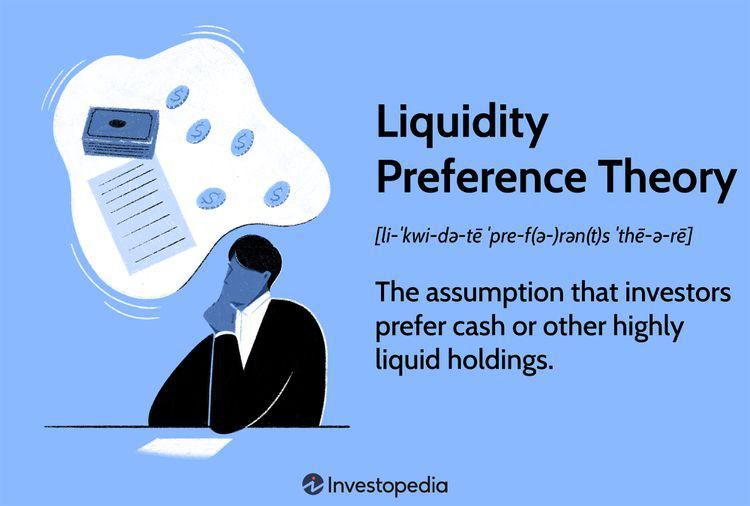

John Maynard Keynes stands as a towering figure in the landscape of 20th-century economics. His groundbreaking work reshaped economic thought and policy, most notably through his development of liquidity preference theory. Introduced in his seminal work, "The General Theory of Employment, Interest, and Money," liquidity preference theory addresses the demand for money based on the motives of transactions, precaution, and speculation. This theory fundamentally altered how economists and policymakers understand interest rate determination, intertwining preferences for liquidity with broader economic conditions.

Keynes' ideas have transcended traditional economics, influencing a plethora of domains from political policies to financial strategies. His perspectives on the interplay between fiscal policy, government intervention, and market dynamics have been crucial in shaping modern economic policy across the globe. Such ideas have also found relevance in numerous interdisciplinary contexts, stretching far beyond the confines of conventional economic discourse.



One of the intriguing modern applications of Keynesian economics is its intersection with the rapidly evolving domain of algorithmic trading. This technology-driven approach to financial trading leverages complex algorithms, often utilizing high-frequency data and automated decision-making processes. The fusion of liquidity preference theory with algorithmic trading represents a fascinating synthesis of classical economic principles with cutting-edge financial technology.

The purpose of this article is to explore the enduring relevance of Keynesian economics within today's financial markets, with a particular focus on algorithmic trading. By examining how liquidity preference theory can inform algorithmic trading strategies, this article aims to illuminate the continuous dialogue between traditional economic thought and contemporary financial innovation.

## Table of Contents

## Understanding Liquidity Preference Theory

John Maynard Keynes introduced the liquidity preference theory in his groundbreaking work, *The General Theory of Employment, Interest, and Money*. This theory fundamentally reshaped the understanding of how interest rates are determined by emphasizing the role of money demand and supply. 

### Motivations Behind Liquidity Preference
Keynes posited that individuals and institutions demand [liquidity](/wiki/liquidity-risk-premium) for three primary reasons. First, the transactions motive refers to the need for cash to [carry](/wiki/carry-trading) out everyday transactions. For example, households require money to purchase goods and services on a regular basis. Second, the precautionary motive encapsulates the desire to hold cash to guard against unforeseen circumstances or emergencies. Maintaining a reserve for unexpected expenses enables individuals to react to sudden events without financial distress. Third, the speculative motive relates to holding cash to take advantage of future investment opportunities, particularly when individuals anticipate changes in interest rates or bond prices (Keynes, 1936).

### Determination of Interest Rates
Keynes' theory explains [interest rate](/wiki/interest-rate-trading-strategies) determination through the interaction of money demand and money supply. He proposed that individuals allocate their wealth between cash (a liquid asset) and bonds (a less liquid asset), based on the interest rate. When the interest rate is high, people tend to prefer bonds since they offer a better return compared to holding cash. Conversely, when interest rates are low, the opportunity cost of holding cash diminishes, leading to higher cash preferences. This shifting dynamic between money held for liquidity purposes and investments in bonds directly influences the interest rate equilibrium.

To represent this relationship, consider the following simplified equation:

$$
M_d = L(T, P, S)
$$

Where:
- $M_d$ is the demand for money
- $L$ represents the liquidity preference function based on transactions ($T$), precautionary needs ($P$), and speculative motives ($S$).

The supply of money ($M_s$) is determined by the central bank's policy. The equilibrium interest rate is achieved when $M_d = M_s$.

### Relevance to Everyday Financial Decision-Making
The concept of liquidity preference is observable in various everyday financial scenarios. For instance, during periods of economic uncertainty, individuals are more likely to increase their cash holdings due to heightened precautionary motives. Similarly, in fluctuating markets, investors might choose to hold cash instead of bonds if they expect interest rate hikes, which would lower bond prices.

### Implications on Broader Macroeconomic Policy
Keynesian liquidity preference theory fundamentally impacts macroeconomic policy, particularly in the context of central banking and monetary policy. By adjusting money supply levels, central banks can influence liquidity conditions and thereby indirectly control interest rates. This ability to modulate interest rates is critical for managing economic cycles, ensuring economic stability, and targeting inflation.

Moreover, understanding liquidity preference can aid policymakers in crafting fiscal measures during financial crises. By recognizing the motivations behind increased liquidity preference, governments and central banks can tailor interventions to alleviate liquidity shortages and restore market confidence.

Keynes' insights into liquidity preference continue to exert significant influence on modern economic thought, highlighting the persistent relevance of his theories in understanding financial behavior and shaping economic policy.

## Liquidity Preference in Modern Financial Markets

John Maynard Keynes' liquidity preference theory remains relevant in contemporary financial markets as it provides fundamental insights into the behavior of interest rates and the role of central banks. Liquidity preference emphasizes the demand for liquidity, primarily driven by transaction needs, precautionary motives, and speculative considerations, as a crucial determinant of interest rates. This perspective still informs our understanding of how monetary policies and central bank interventions impact market dynamics.

Central banks play a critical role in influencing liquidity conditions and interest rates through monetary policy tools such as open market operations, setting reserve requirements, and adjusting policy rates. When a central bank increases the money supply, the short-term interest rates typically decrease since more liquidity reduces the need for higher compensation for parties willing to lend. On the contrary, a contractionary policy might lead to higher interest rates as liquidity is withdrawn from the market. The relationship between policy interventions and liquidity aligns with Keynes' view where an increase in liquidity supply lowers the interest rate, ceteris paribus.

The differentiation between short-term and long-term interest rates also reflects the principles of liquidity preference. Short-term rates are more directly influenced by central bank actions and immediate liquidity conditions. Long-term interest rates, however, are more reflective of expectations around future liquidity and economic conditions, incorporating inflation and risk premiums. Keynesian principles help explain this yield curve framework, where the liquidity preference for shorter-maturity assets influences the term structure of interest rates.

Historical examples illustrate liquidity preference theory's impact on market behaviors. For instance, during the global financial crisis of 2008, central banks worldwide took unprecedented steps to inject liquidity into financial markets. The U.S. Federal Reserve's quantitative easing programs significantly influenced short-term interest rates, aligning with Keynesian prediction that increasing liquidity supply reduces rates. Similarly, during the European sovereign debt crisis, different liquidity conditions across countries led to variances in interest rates, showcasing the liquidity preference influence.

Financial market [volatility](/wiki/volatility-trading-strategies) further interacts with liquidity preference, as uncertainty often increases the demand for liquidity for precautionary reasons. This can lead to interest rate fluctuations as markets react to periods of stress or calm. For example, during times of market turbulence, the heightened demand for safe and liquid assets can drive down yields on government securities, exemplifying how flight-to-liquidity impacts rates and reinforcing liquidity preference dynamics.

In conclusion, liquidity preference theory continues to offer valuable insights into the mechanics of interest rate determination and market behavior in modern financial systems. By examining the ongoing influence of central bank policies, historical incidents, and market volatility, we appreciate the enduring relevance of Keynesian liquidity preference in shaping economic outcomes.

## Algorithmic Trading: An Overview

Algorithmic trading, often referred to as algo trading, is a method of executing trades using pre-programmed instructions accounting for variables such as time, price, and [volume](/wiki/volume-trading-strategy). This form of trading leverages complex algorithms to make high-speed decisions and is increasingly significant in contemporary financial markets due to its ability to enhance market efficiency and liquidity.

At its core, [algorithmic trading](/wiki/algorithmic-trading) relies on computer algorithms, mathematical models, and comprehensive analyses to initiate trading decisions autonomously. Key principles include the use of statistical and quantitative analysis, technical analysis, and patterns recognition. Technologies such as high-frequency trading ([HFT](/wiki/high-frequency-trading-strategies)) platforms, [artificial intelligence](/wiki/ai-artificial-intelligence) (AI), and [machine learning](/wiki/machine-learning) (ML) have further enhanced its capabilities by processing vast amounts of market data at unprecedented speeds.

The benefits of algorithmic trading are multifaceted. Speed is perhaps the most compelling, as algorithms can scrutinize and execute trades in milliseconds, far faster than any human trader. This efficiency not only reduces transaction times but also optimizes costs by taking advantage of small price discrepancies that occur due to market inefficiencies. Additionally, algorithmic trading reduces human error; executing trades based on predefined criteria eliminates emotional and cognitive biases that often lead to sub-optimal decision-making.

However, algorithmic trading is not without its risks. One of the primary concerns is market manipulation, sometimes inadvertently facilitated by high-frequency trading. There is also the potential for 'flash crashes,' where markets experience extremely rapid declines in asset prices within a very short timeframe due to automated systems reacting to erroneous or unanticipated market conditions. Such events raise concerns over market stability and the ethical implications of speed-based trading advantages.

The prevalence and growth of algorithmic trading have been substantial over recent years. Reports suggest that algorithmic trades account for approximately 60% to 73% of all equity trading in the United States as of the latest data available. In the global market context, algorithmic trading is expanding rapidly, driven by developments in trading platforms and the growing inclusion of AI and ML. This expansion illustrates the transformative impact of technology on modern financial systems, reshaping how market transactions are conducted.

In summary, algorithmic trading stands at the forefront of technological advancement in financial markets. Its ability to enhance trade execution by leveraging advanced computing and analytic techniques underscores its growing importance, necessitating ongoing assessment of its implications for market stability and regulation.

## Integrating Liquidity Preference with Algorithmic Trading Strategies

John Maynard Keynes' liquidity preference theory, a cornerstone of macroeconomic thought, can provide a unique dimension to algorithmic trading strategies. Integrating this theory involves understanding and utilizing liquidity signals that can be crucial in formulating effective algorithmic models.

Liquidity signals are indicators that suggest the ease with which an asset can be bought or sold without affecting its price. In algorithmic trading, these signals help in assessing market depth and the demand-supply dynamics that influence interest rates. By analyzing liquidity signals, algorithms can be designed to make informed predictions and decisions, optimizing the timing and volume of trades. For example, during periods of high liquidity, an algorithm might execute trades more aggressively, while in low liquidity phases, it might adopt a more conservative approach to minimize price impact.

Market liquidity significantly affects the performance of algorithmic trading systems and their optimization strategies. High liquidity levels generally enhance the efficiency and effectiveness of trading algorithms by reducing transaction costs and slippage—whereas low liquidity can lead to increased price volatility and execution risks. Understanding these dynamics is essential for the development of robust trading strategies that adapt to varying market conditions.

To incorporate liquidity preferences into trading algorithms, strategies can be developed that consider observed and predicted liquidity metrics. For instance, an algorithm might use [order book](/wiki/order-book-trading-strategies) data to estimate liquidity levels and adjust trading speeds accordingly. Additionally, machine learning techniques can be employed to analyze historical data, identifying patterns and correlations between liquidity changes and market movements, leading to more nuanced decision-making processes.

However, incorporating classical economic theories such as liquidity preference into modern trading systems presents several challenges. One significant challenge is the complexity of financial markets, where numerous factors and rapid changes can obscure the influence of liquidity preference. Algorithms must therefore be sophisticated enough to differentiate between noise and meaningful liquidity signals. Moreover, the assumptions underlying liquidity preference theory, developed in a different economic context, might not fully align with today's high-frequency trading environments, necessitating adjustments and innovations in its application.

Technical implementation also poses barriers. Integrating liquidity preference requires a seamless fusion of economic theory, quantitative finance, and computer science expertise. Continuous testing, refinement, and adaptation of algorithms are necessary to ensure they remain effective amidst evolving market landscapes.

In summary, while the integration of liquidity preference theory into algorithmic trading strategies presents certain challenges, it offers an opportunity to enhance trading models by incorporating deeper insights into market liquidity dynamics. Through the development of sophisticated algorithms that account for liquidity signals, financial market participants can optimize their trading strategies, aligning them more closely with fundamental economic theories such as those proposed by John Maynard Keynes.

## The Future of Keynesian Economics in Algo Trading

The future of Keynesian economics, particularly its liquidity preference theory, in the world of algorithmic trading seems promising as trading technologies continue to advance. Emerging trends in financial technology (fintech) are creating new opportunities for the interaction between Keynesian theories and modern trading strategies. The integration of liquidity preference into trading algorithms can offer enhanced insights into market behavior and capitalize on liquidity signals.

The rapid growth of artificial intelligence (AI) and machine learning (ML) in trading systems presents significant potential for refining applications of economic theory such as liquidity preference. AI and ML algorithms can analyze vast datasets to identify patterns and predictors that traditional models might overlook. By leveraging machine learning techniques, one can incorporate Keynesian aspects into models that dynamically adapt to changes in liquidity, potentially optimizing trading strategies with greater precision.

For instance, an algorithm that integrates liquidity preference could use real-time data to adjust the weightage of asset holdings, modifying positions based on the prevailing liquidity conditions. The following Python pseudo-code illustrates a simple approach to implementing such a model:

```python
import numpy as np

# Example function to determine asset weight based on liquidity preference
def liquidity_adjusted_weights(prices, liquidity_levels):
    weights = np.zeros(len(prices))
    for i in range(len(prices)):
        # Example adjustment based on liquidity preference
        if liquidity_levels[i] > threshold:
            weights[i] = 1/prices[i]  # More allocation due to high liquidity
        else:
            weights[i] = 0.5/prices[i]  # Less allocation due to low liquidity
    return weights / np.sum(weights)

# Assume prices and liquidity_levels are given as lists of values
prices = [100, 200, 150]
liquidity_levels = [0.8, 0.6, 0.9]
threshold = 0.7

print(liquidity_adjusted_weights(prices, liquidity_levels))
```

Regulatory changes pose both challenges and opportunities for the integration of liquidity preference with algorithmic trading. Policymakers might enact laws to ensure algorithmic transparency and minimize systemic risks, which could shape how liquidity preference is utilized in trading algorithms. By requiring greater disclosure of algorithmic strategies, regulators may foster a better understanding of how classical economic theories apply to contemporary trading.

As fintech continues to evolve, Keynesian economics may play a more significant role in this dynamic landscape. Innovations in data processing and analytics could result in more sophisticated models that incorporate fundamental economic principles to inform trading decisions. The ongoing dialogue between traditional economic theories and technological advancements underscores the need for continuous adaptation and exploration, as these interactions present both challenges and immense opportunities for the future of finance.

## Conclusion

John Maynard Keynes' liquidity preference theory continues to hold significant relevance in modern financial markets. By offering insights into the determinants of interest rates through the demand for and supply of money, Keynes' theory provides a foundational understanding that extends into various aspects of economic policy and market behavior. This remains particularly pertinent in the context of algorithmic trading, where sophisticated models can benefit from the dynamic consideration of liquidity preferences.

The integration of liquidity preference theory with algorithmic trading strategies presents numerous advantages. By incorporating signals of market liquidity, algorithmic models can optimize trading performances, potentially enhancing speed and precision while minimizing risks related to market volatility. This integration not only leverages the theoretical insights of Keynes but also aligns them with cutting-edge technological advancements in trading algorithms.

The financial markets are constantly evolving, necessitating ongoing research and adaptation of economic theories. The application of traditional concepts such as liquidity preference in contemporary settings underscores the importance of revisiting classical economic ideas to accommodate the complexities and innovations introduced by modern technology. As financial markets grow more sophisticated, continual evaluation and adaptation of these theories will be paramount.

Further exploration of economic theories in response to advances in trading technology is encouraged. This endeavor offers the potential to refine trading strategies, enhancing their effectiveness amidst rapidly changing market environments. By doing so, the intersection of established economic thought and innovative technology can drive the development of more robust and adaptive financial systems.

John Maynard Keynes' work remains profoundly impactful, not only within the sphere of economics but also extending its influence across the broader landscape of finance. His insights into liquidity preference continue to inspire new applications, underscoring the enduring legacy of Keynesian thought in steering economic and financial development well into the future.

## References & Further Reading

[1]: Keynes, J. M. (1936). ["The General Theory of Employment, Interest, and Money."](https://www.files.ethz.ch/isn/125515/1366_KeynesTheoryofEmployment.pdf) Palgrave Macmillan.

[2]: Bergstra, J., Bardenet, R., Bengio, Y., & Kégl, B. (2011). ["Algorithms for Hyper-Parameter Optimization."](https://dl.acm.org/doi/10.5555/2986459.2986743) Advances in Neural Information Processing Systems 24.

[3]: ["Advances in Financial Machine Learning"](https://www.amazon.com/Advances-Financial-Machine-Learning-Marcos/dp/1119482089) by Marcos Lopez de Prado

[4]: Tsay, R. S. (2010). ["Analysis of Financial Time Series."](https://onlinelibrary.wiley.com/doi/book/10.1002/9780470644560) Wiley Series in Probability and Statistics.

[5]: ["Quantitative Trading: How to Build Your Own Algorithmic Trading Business"](https://www.amazon.com/Quantitative-Trading-Build-Algorithmic-Business/dp/0470284889) by Ernest P. Chan

[6]: ["Evidence-Based Technical Analysis: Applying the Scientific Method and Statistical Inference to Trading Signals"](https://www.amazon.com/Evidence-Based-Technical-Analysis-Scientific-Statistical/dp/0470008741) by David Aronson

[7]: ["Machine Learning for Algorithmic Trading"](https://github.com/PacktPublishing/Machine-Learning-for-Algorithmic-Trading-Second-Edition) by Stefan Jansen