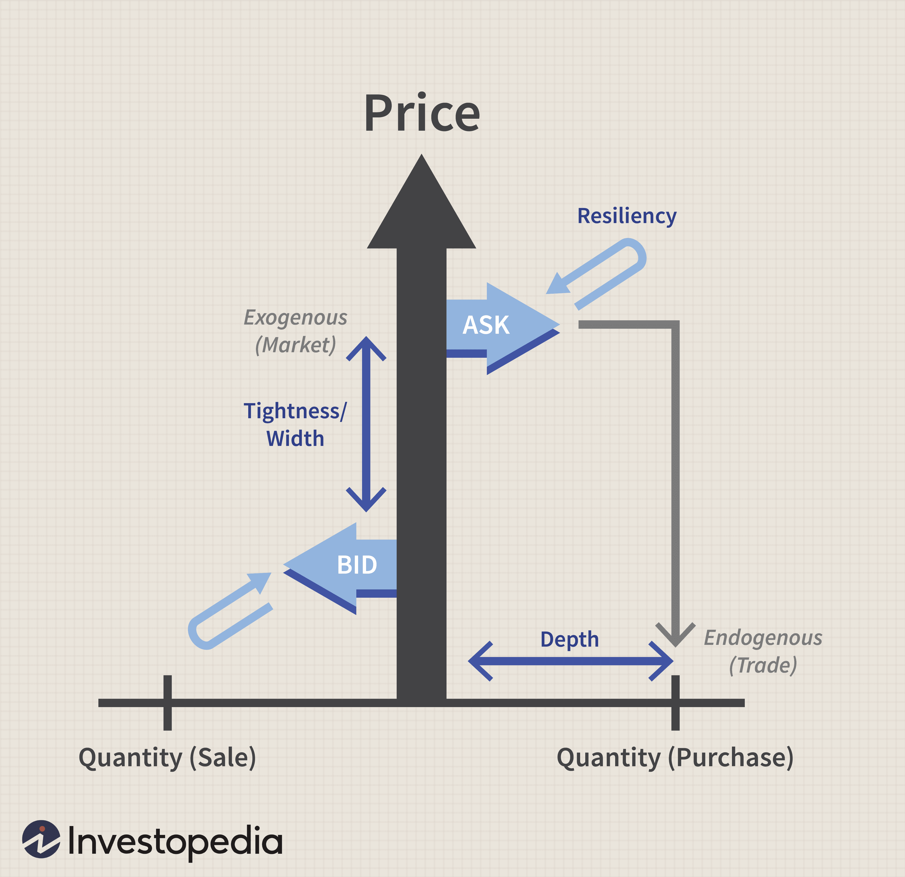

The financial market landscape is characterized by continuous change and adaptation, driven by a myriad of factors that collectively influence its complexity and behavior. Among these influential elements are the liquidity premium, financial risk, and algorithmic trading, each playing a pivotal role in shaping investment strategies and outcomes. The liquidity premium refers to the additional return demanded by investors as compensation for the risk associated with holding less liquid assets. Understanding this concept is vital as it affects the yields of long-term investments, influencing decisions around portfolio composition.

Simultaneously, financial risk, which arises from uncertainties and market condition fluctuations impacting asset values, remains a constant consideration for investors. Illiquid assets, for instance, pose heightened financial risks due to the challenges in converting them into cash amidst adverse market conditions. Assessing these risks is crucial in weighing potential returns against liquidity-related uncertainties.

Algorithmic trading, particularly high-frequency trading (HFT), has introduced a technological revolution in financial markets by facilitating rapid execution of trades based on pre-defined instructions. The efficiency and speed provided by algorithmic trading have significantly increased market dynamics but have also brought about potential challenges such as market distortion and volatility.

This article seeks to provide a comprehensive examination of these components and their interplay within the investment landscape. For investors and market participants, a robust understanding of liquidity premiums, financial risks, and algorithmic trading is essential for optimizing portfolios and effectively navigating modern financial markets. By understanding these critical components, investors can tailor strategies that align with their risk tolerance and financial objectives, ultimately enhancing their ability to manage the complexities inherent in today’s markets.

## Table of Contents

## Understanding Liquidity Premium

Liquidity premium refers to the additional return that investors demand to compensate for the risk associated with holding illiquid assets. The concept of liquidity premium arises from the fact that certain investments cannot be readily converted into cash without incurring significant costs or losses in value. An illiquid asset typically requires either lower pricing to attract buyers or extended time periods to execute a sale, both of which increase the risk and potential cost for an investor.

Investments such as real estate, private equity, and collectibles are often considered illiquid due to the lack of a readily available market to facilitate quick sales at fair market prices. For instance, selling a real estate property can involve lengthy processes, including finding a buyer, negotiating terms, and completing legal documentation, all of which contribute to its illiquidity.

Investors seeking long-term yields must [factor](/wiki/factor-investing) in the [liquidity](/wiki/liquidity-risk-premium) premium, as it directly affects the expected return from such investments. For example, consider a bond with a yield of $R_L$, where $R_L$ includes a portion representing the liquidity premium. If two bonds have similar risk profiles apart from their liquidity, the illiquid bond will typically offer a higher yield to compensate for its lower liquidity relative to the liquid bond.

Mathematically, the liquidity premium can be expressed as part of the yield spread:

$$
R_L = R_R + LP
$$

where $R_L$ is the total yield on the illiquid asset, $R_R$ is the risk-free rate or the yield on a liquid comparable, and $LP$ is the liquidity premium itself. Thus, understanding and accurately estimating this component is crucial for investors making decisions about how to allocate assets in their portfolios, particularly when dealing with long-term or high-value investments where liquidity risks are more pronounced.

## Financial Risk and Liquidity Premium

Financial risk is inherently tied to the unpredictabilities in the market that can influence asset valuations. This risk is especially pronounced in investments involving illiquid assets. Illiquidity refers to the difficulty or inability to quickly sell or convert an asset into cash without a substantial price reduction. Illiquid assets, such as real estate, private equity, and fine art, often face intensified financial risks, particularly under adverse market conditions, when buyers may be scarce and sell pressures might lead to steep discounts.

The concept of the liquidity premium becomes central to compensating for these heightened risks. The liquidity premium is essentially an additional expected return that investors demand as compensation for holding assets that may not be easily liquidated. The logic underpinning this premium is straightforward: investors require compensation for the possibility of being unable to sell their assets swiftly or at a fair market price when needed. Therefore, the less liquid an asset is, the higher the liquidity premium investors typically seek.

To illustrate mathematically, consider an investor weighing the expected return $R$ of a liquid asset against an illiquid asset. The expected return for the illiquid asset should account for the liquidity premium $P_L$:

$$
R_{\text{illiquid}} = R_{\text{liquid}} + P_L.
$$

This equation highlights that the expected return on an illiquid asset should exceed that of a liquid asset by the amount $P_L$, ensuring the investor is adequately compensated for the liquidity risks incurred.

Investors, therefore, must carefully assess the potential returns of investing in illiquid assets against these liquidity risks. The fundamental question becomes: is the added yield from the liquidity premium sufficient to justify the risk of potentially delayed or costly asset liquidation? Answering this question requires a sound understanding of both the market environment and individual investment objectives.

Investors often employ advanced risk assessment and portfolio optimization techniques to strike a balance between risk and return, factoring in liquidity considerations. Tools such as Monte Carlo simulations, scenario analysis, and stress testing are frequently used to estimate the potential impacts of illiquidity on portfolio performance. By simulating various market conditions and their effects on asset prices, investors can better gauge whether the liquidity premium accurately compensates for the risks at hand.

In conclusion, understanding the interplay between financial risk and liquidity premium is crucial for informed investment decisions. By appropriately valuing the liquidity premium and assessing financial risks, investors can optimize their portfolios to achieve their financial objectives while managing potential downsides associated with illiquid investments.

## Algorithmic Trading: An Overview

Algorithmic trading employs computer programs to execute trades rapidly based on pre-defined criteria, transforming how financial markets operate. This method leverages complex algorithms to analyze market data and execute orders precisely and efficiently, leading to seamless trading experiences. By automating decision-making processes, [algorithmic trading](/wiki/algorithmic-trading) eliminates human errors and emotional biases, ensuring decisions are made based solely on data and set parameters.

High-frequency trading ([HFT](/wiki/high-frequency-trading-strategies)) is a subset of algorithmic trading characterized by the execution of orders at extremely fast speeds. The goal of HFT is to capitalize on small price discrepancies available for brief moments in the market. This requires advanced technology and connectivity to financial exchanges, enabling traders to gain advantages in transactional speed and precision. The speed at which HFT algorithms operate often involves time increments as short as milliseconds or even microseconds, offering significant profit potential through high turnover rates of trades.

The implementation of algorithmic trading has significantly improved market efficiency and speed. It enhances liquidity, reduces transaction costs, and narrows bid-ask spreads, contributing to better price discovery and overall market stability. However, this technology also brings certain risks. One of the concerns is market distortion caused by algorithmic trades that may lead to unexpected price movements, particularly if multiple algorithms execute similar strategies concurrently. An infamous example of such risk is the "Flash Crash" of May 2010, where rapid selling by algorithms contributed to a dramatic, albeit brief, market drop.

Moreover, the use of algorithms can exacerbate market [volatility](/wiki/volatility-trading-strategies). By trading at incredibly high speeds, algorithmic systems can amplify market trends resulting in substantial price swings, which may not reflect underlying asset values. This increased volatility poses risks not just to algorithmic traders but to market participants overall. Hence, while algorithmic trading represents a leap forward in trading technology, it necessitates careful oversight and regulation to mitigate these potential downsides and ensure market integrity.

## Interplay Between Liquidity Premium, Financial Risk, and Algo Trading

Algorithmic trading, also known as algo trading, has transformed the landscape of financial markets by extensively influencing liquidity and consequently, liquidity premiums. Its ability to execute large volumes of trades at high speed contributes to market liquidity, affecting liquidity premiums on various assets. Liquidity premiums reflect the additional return demanded by investors for holding assets that are not easily liquidated. Algo trading enhances liquidity by consistently increasing the turnover of otherwise illiquid assets, potentially leading to a narrowing of liquidity premiums. This is because the increased trading agility and efficiency fostered by algorithms help investors to enter and [exit](/wiki/exit-strategy) positions more seamlessly, reducing the liquidity risk associated with certain investments.

The speed and precision of algo trading can lead to more effective price discovery in the market, as price discrepancies are quickly identified and arbitraged away. This mechanism helps in the alignment of market prices with intrinsic values, ensuring that liquidity conditions improve, albeit sometimes at the cost of introducing systemic risks. One notable aspect of algo trading is high-frequency trading (HFT), which focuses on executing trades in fractions of a second and often capitalizes on tiny price inefficiencies.

However, the rapid execution of trades through algorithms can introduce or exacerbate financial risks, such as those observed during flash crashes. Flash crashes are typified by extreme and sudden market price declines, followed by quick recoveries, often attributable to automated trading activity that lacks human oversight. For instance, the May 6, 2010, Flash Crash saw the Dow Jones Industrial Average plummet about 1,000 points within minutes, raising concerns about the vulnerabilities introduced by algorithmic trading systems.

Traders and firms utilizing algo strategies must be vigilant about liquidity conditions to optimize their algorithms effectively and manage the associated financial risks. This involves not only implementing robust risk management protocols but also constantly updating algorithms to function appropriately in varying market conditions. An essential aspect of managing such risks includes setting appropriate circuit breakers and thresholds to halt trading when markets exhibit abnormal volatility or liquidity drops.

Moreover, algorithms should be designed to take account of real-time market conditions, such as [order book](/wiki/order-book-trading-strategies) dynamics and trading volumes, to adjust execution strategies accordingly. This might involve using [machine learning](/wiki/machine-learning) techniques to predict liquidity changes or employing statistical methods to assess market impact and slippage costs. The ultimate goal is to strike a balance between leveraging the speed and efficiency of algo trading and mitigating the financial risks that can be amplified by its improper or unchecked application.

## Examples and Case Studies

Examining historical events such as the Flash Crash of May 6, 2010, provides valuable insights into the systemic risks associated with high-frequency algorithmic trading. During this event, the Dow Jones Industrial Average dropped nearly 1,000 points within minutes, only to recover most of the losses shortly thereafter. The crash was primarily attributed to the rapid execution of automated trading algorithms that overwhelmed the market's liquidity, leading to a dramatic, albeit temporary, loss of value in key stocks and indices. This incident underscores the potential for algorithmic trading to amplify market volatility, which can have severe implications for liquidity premiums as investors demand higher compensation for assuming additional risks.

Liquidity premium variations in different asset classes further illustrate the necessity of understanding liquidity in investment strategies. For instance, real estate often involves a higher liquidity premium compared to easily tradable financial instruments such as stocks or bonds. Real estate transactions are typically time-consuming and costly, reflecting the illiquid nature of these assets. Conversely, financial instruments traded on public exchanges benefit from high liquidity, leading to relatively lower liquidity premiums. This distinction highlights the importance for investors to assess liquidity characteristics when constructing portfolios and to adjust their required returns to reflect the varying degrees of liquidity across different asset classes.

Recent market events also provide practical lessons on the interplay between liquidity premiums and financial risks. For example, during the market disruptions caused by the COVID-19 pandemic in early 2020, many investors faced challenges stemming from heightened volatility and liquidity constraints. The rapid shift in market conditions prompted reevaluations of liquidity needs and risk management strategies. Investors who had incorporated a thorough understanding of liquidity premiums and risks into their strategies were better positioned to navigate these turbulent times. They recognized, for instance, the importance of maintaining a portion of their portfolios in liquid assets, enabling them to capitalize on market opportunities or meet cash flow requirements without incurring significant losses.

Collectively, these examples and case studies highlight the critical need for investors to balance liquidity premiums and financial risks. A comprehensive understanding of market dynamics, coupled with a robust risk management framework, equips investors to effectively respond to the complexities and uncertainties inherent in financial markets. As such, historical and recent events serve as invaluable learning experiences, guiding future strategies that aim to optimize returns while managing the potential downsides associated with illiquidity and market volatility.

## Conclusion: Navigating Investments in a Complex Market

Incorporating considerations of liquidity premium, financial risk, and algorithmic trading is crucial for making informed investment decisions. The liquidity premium accounts for the additional return demanded by investors to compensate for the risk of investing in illiquid assets. Investors are faced with the challenge of balancing potential returns against the risks posed by illiquidity and volatile trading environments. To achieve this balance, they must integrate comprehensive risk management strategies, which may include diversifying portfolios to mitigate financial risks associated with illiquid investments.

Algorithmic trading, with its high-speed execution and ability to process vast market data, introduces both opportunities and risks. While it can improve market liquidity and reduce transaction costs, it also poses potential risks such as increased volatility and market anomalies. Understanding how algo trading interacts with market conditions, particularly during periods of stress, is essential.

Continuous learning and adaptation are vital for success in today's financial markets. Investors must stay abreast of technological advancements and policy changes that influence market dynamics. Developing robust risk management frameworks helps in mitigating the impact of unforeseen market events. For instance, stress testing and scenario analysis can be employed to assess potential vulnerabilities in investment portfolios under various market conditions.

Understanding the interactions between liquidity premium, financial risk, and algorithmic trading enables investors to tailor their strategies according to their risk tolerance and financial goals. Risk assessment models and predictive analytics can aid in evaluating the potential impact of these factors on investment outcomes. By aligning investment strategies with individual risk preferences and market realities, investors can better position themselves to achieve their financial objectives in a complex market landscape.

## References & Further Reading

[1]: Amihud, Y., & Mendelson, H. (1986). ["Asset Pricing and the Bid-Ask Spread."](https://www.sciencedirect.com/science/article/pii/0304405X86900656) Journal of Financial Economics, 17(2), 223-249.

[2]: Brunnermeier, M. K., & Pedersen, L. H. (2009). ["Market Liquidity and Funding Liquidity."](https://www.jstor.org/stable/30225714) The Review of Financial Studies, 22(6), 2201-2238.

[3]: Menkveld, A. J. (2013). ["High Frequency Trading and the New Market Makers."](https://www.sciencedirect.com/science/article/pii/S1386418113000281) Journal of Financial Markets, 16(4), 712-740.

[4]: Gomber, P., Arndt, B., Lutat, M., & Uhle, T. (2011). ["High-Frequency Trading."](https://papers.ssrn.com/sol3/papers.cfm?abstract_id=1858626) Journal of European Trading, 52(1), 39-51.

[5]: Duffie, D. (2010). ["Asset Price Dynamics with Slow-Moving Capital."](https://web.stanford.edu/~duffie/PresidentialAddressApril15NormalFormat.pdf) Journal of Finance, 65(4), 1237-1267.

[6]: Hendershott, T., Jones, C. M., & Menkveld, A. J. (2011). ["Does Algorithmic Trading Improve Liquidity?"](https://onlinelibrary.wiley.com/doi/full/10.1111/j.1540-6261.2010.01624.x) The Journal of Finance, 66(1), 1-33.