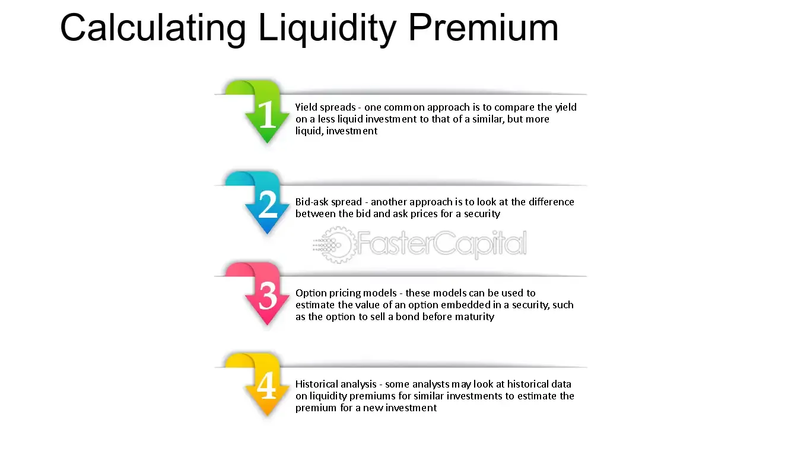

## Table of Contents

## What is liquidity and why is it important in financial markets?

Liquidity refers to how easily an asset can be bought or sold in the market without affecting its price. In simpler terms, it's about how quickly you can turn something into cash. For example, cash itself is very liquid because you can use it immediately, while a house is less liquid because it takes time to sell and convert into cash.

Liquidity is important in financial markets because it helps keep things running smoothly. When markets are liquid, it's easier for people to buy and sell assets at fair prices. This means investors can get in and out of investments quickly, which reduces risk and makes the market more attractive. If a market isn't liquid, it can be hard to sell assets, and prices can swing wildly, which can scare investors away and make the market less stable.

## What is a liquidity premium and how does it affect investment decisions?

A liquidity premium is extra money that investors want for buying assets that are hard to sell quickly. Think of it like a reward for taking on the risk of not being able to turn the asset into cash fast. If you have a choice between a stock you can sell anytime and a piece of real estate that might take months to sell, you might need a bit more return from the real estate to make it worth the wait.

This premium can change how people decide to invest. If the [liquidity](/wiki/liquidity-risk-premium) premium is high, it might make investors think twice about putting their money into less liquid assets, even if they could make more money in the long run. On the other hand, if the premium is low, investors might be more willing to take on the risk of less liquid investments, hoping for a bigger payoff later. So, understanding the liquidity premium helps investors weigh the trade-offs between quick access to their money and potential higher returns.

## How can liquidity be measured in different financial assets?

Liquidity can be measured differently depending on the type of financial asset. For stocks, one common way to measure liquidity is by looking at the trading [volume](/wiki/volume-trading-strategy), which is the number of shares traded in a day. If a stock has a high trading volume, it's easier to buy or sell without moving the price too much. Another measure is the bid-ask spread, which is the difference between the highest price a buyer is willing to pay and the lowest price a seller is willing to accept. A smaller spread means the stock is more liquid.

For bonds, liquidity can be trickier to measure because they don't trade as often as stocks. One way to gauge bond liquidity is by looking at the size of the market and how often the bond changes hands. If a bond is traded frequently and in large amounts, it's considered more liquid. Another way is to check the yield spread, which is the difference between the bond's yield and a benchmark like a government bond. A smaller yield spread often means the bond is more liquid.

In the case of real estate, liquidity is usually measured by how long it takes to sell a property and how close the final sale price is to the asking price. If houses in an area sell quickly and for prices close to what sellers are asking, that area is considered to have good liquidity. On the other hand, if properties sit on the market for a long time or have to be sold at a big discount, the real estate market in that area is less liquid.

## What are the basic methods used to estimate liquidity premiums?

Estimating liquidity premiums can be done in a few different ways. One common method is to look at the difference in returns between liquid and less liquid assets. For example, if you compare the returns of stocks that trade a lot with those that don't, the difference in their average returns can give you an idea of the liquidity premium. Another way is to use surveys where investors are asked how much extra return they would need to hold onto a less liquid asset. This can help figure out what kind of premium they expect for the risk of not being able to sell quickly.

Another approach involves looking at how much it costs to borrow against an asset. If it's hard to borrow against a less liquid asset, that could mean a higher liquidity premium is needed to make up for the extra risk. Financial models can also be used to estimate liquidity premiums. These models take into account things like how often an asset trades, how big the bid-ask spread is, and other market factors to come up with an estimate of the premium. By understanding these methods, investors can better gauge the extra return they might need for holding onto less liquid investments.

## Can you explain the concept of bid-ask spread and its relation to liquidity premium?

The bid-ask spread is the difference between the highest price a buyer is willing to pay for an asset (the bid) and the lowest price a seller is willing to accept (the ask). Imagine you're at a market trying to sell an item. The bid is what people are offering to buy it from you, and the ask is the price you're asking for it. If the difference between these two prices is small, it means the item is easy to buy and sell, so it's liquid. But if the difference is big, it's harder to make a deal, and the item is less liquid.

The bid-ask spread is closely related to the liquidity premium. The liquidity premium is the extra return investors want for holding onto an asset that's hard to sell quickly. If an asset has a big bid-ask spread, it's less liquid, and investors might need a higher return to be willing to buy it. So, a larger bid-ask spread can mean a higher liquidity premium. This is because investors want to be rewarded for the risk of not being able to turn their investment into cash fast.

## How do market depth and trading volume influence liquidity premium estimation?

Market depth and trading volume are important when figuring out how much of a liquidity premium to expect. Market depth is about how many buy and sell orders are waiting in the market at different prices. If there are lots of orders, it's easier to buy or sell without moving the price too much, which makes the asset more liquid. On the other hand, if there are only a few orders, it's harder to trade without affecting the price, making the asset less liquid. So, when there's good market depth, the liquidity premium might be lower because the risk of not being able to sell quickly is smaller.

Trading volume also plays a big role in estimating the liquidity premium. It's the total number of shares or contracts traded in a day. High trading volume means there are a lot of people buying and selling, which makes it easier to trade the asset without moving its price much. This high activity suggests the asset is liquid, so investors might not need as big a liquidity premium. But if trading volume is low, it's harder to buy or sell without impacting the price, making the asset less liquid. In this case, investors might want a bigger liquidity premium to make up for the risk of being stuck with the asset.

## What role do transaction costs play in the estimation of liquidity premiums?

Transaction costs are the fees and expenses you pay when you buy or sell an asset. They can make a big difference in how much of a liquidity premium investors want. If it costs a lot to trade an asset, it's like adding extra risk because you lose more money just to get in and out of the investment. So, if an asset is hard to sell and also has high transaction costs, investors will likely want a bigger liquidity premium to make up for these extra costs and risks.

Think of it this way: if you're trying to sell something and you have to pay a big fee just to make the sale, you'll want a higher price to cover that fee. The same goes for investments. If the costs to trade are high, investors will look for a higher return to make the investment worth it. That's why transaction costs are a key part of figuring out the liquidity premium – they add to the overall risk and cost of holding onto less liquid assets.

## How do different models, such as the CAPM, incorporate liquidity premiums?

The Capital Asset Pricing Model (CAPM) is a way to figure out how much return an investment should give you based on how risky it is. Normally, CAPM looks at something called "market risk," which is how much an investment moves with the whole market. But some newer versions of CAPM try to add in a liquidity premium too. They do this by adding a special part to the model that thinks about how easy or hard it is to sell the investment. If it's hard to sell, the model says you should get a bit more return to make up for that risk.

These updated CAPM models use different ways to measure how liquid an investment is. They might look at things like how often the investment trades, how big the difference is between what buyers and sellers want to pay, or how long it takes to sell. By adding these measures into the model, it tries to give a better guess of the total return you should expect, including a little extra for the risk of not being able to sell quickly. This helps investors understand if the extra return they're getting is worth the trouble of holding onto a less liquid investment.

## What advanced statistical techniques are used to estimate liquidity premiums more accurately?

To estimate liquidity premiums more accurately, researchers use advanced statistical techniques like regression analysis. This method helps them figure out how much of the return on an investment comes from its liquidity. They look at a bunch of data, like how often an asset trades and how big the difference is between what buyers and sellers want to pay. By using regression, they can see how these factors affect returns and come up with a better guess of the liquidity premium.

Another technique is called time-series analysis. This involves looking at how an asset's liquidity changes over time and how those changes affect its returns. Researchers use this to see if there are patterns in how liquidity and returns move together. For example, they might find that when an asset becomes harder to sell, its return goes up a bit to make up for that risk. This helps them estimate the liquidity premium more precisely by understanding how it changes over time.

## How does the liquidity premium vary across different asset classes and market conditions?

The liquidity premium can be different for different types of investments, like stocks, bonds, and real estate. Stocks that trade a lot and are easy to buy and sell usually have a smaller liquidity premium because they are more liquid. On the other hand, stocks that don't trade much might have a bigger liquidity premium because they are harder to sell quickly. Bonds can also have different liquidity premiums depending on how often they trade and how easy they are to sell. For example, government bonds are usually more liquid than corporate bonds, so they might have a smaller liquidity premium. Real estate is often less liquid than stocks or bonds, so the liquidity premium for real estate can be much bigger, especially if it takes a long time to sell a property.

Market conditions also play a big role in how the liquidity premium changes. During times when the market is doing well and lots of people are buying and selling, the liquidity premium might be smaller because it's easier to trade. But when the market is shaky or there's a big crisis, like a financial crash, the liquidity premium can go up a lot. This is because people get scared and don't want to buy things that are hard to sell, so they want a bigger reward for taking that risk. So, the liquidity premium isn't just about the type of investment; it also depends on what's happening in the market at the time.

## What are the challenges and limitations in accurately estimating liquidity premiums?

Estimating liquidity premiums can be tricky because there are many things that can change how easy it is to sell an investment. One big challenge is that liquidity can change a lot over time. What's easy to sell one day might be hard to sell the next, depending on what's happening in the market. This makes it hard to come up with a number that works all the time. Another problem is that different people might have different ideas about how much they want to be paid for holding onto something that's hard to sell. What one investor thinks is a fair reward might be too small for another investor.

Also, the data we use to estimate liquidity premiums isn't always perfect. Sometimes, we don't have enough information about how often an investment trades or how big the difference is between what buyers and sellers want to pay. And even when we do have good data, it can be hard to figure out how much of an investment's return comes from its liquidity and how much comes from other risks. This means our estimates of the liquidity premium can be off, and we might not know if we're getting a good deal or not when we invest in something that's hard to sell.

## How can investors use liquidity premium estimates to optimize their portfolio strategies?

Investors can use liquidity premium estimates to make smarter choices about what to put in their investment portfolios. If they know that less liquid investments, like real estate or certain stocks, come with a higher liquidity premium, they can decide if the extra return is worth the risk of not being able to sell quickly. For example, if an investor is planning to hold onto their investments for a long time, they might be okay with adding some less liquid assets to their portfolio to get that extra return. But if they need to be able to get their money out fast, they might stick with more liquid investments, even if it means a smaller return.

Understanding how liquidity premiums change with market conditions can also help investors adjust their strategies. During good times when the market is doing well, the liquidity premium might be smaller, so it could be a good time to take on less liquid investments. But in tough times, when the market is shaky, the liquidity premium might go up, and investors might want to be more careful and stick with more liquid assets. By keeping an eye on these changes, investors can make better decisions about when to buy or sell different types of investments to balance risk and reward in their portfolios.

## References & Further Reading

#