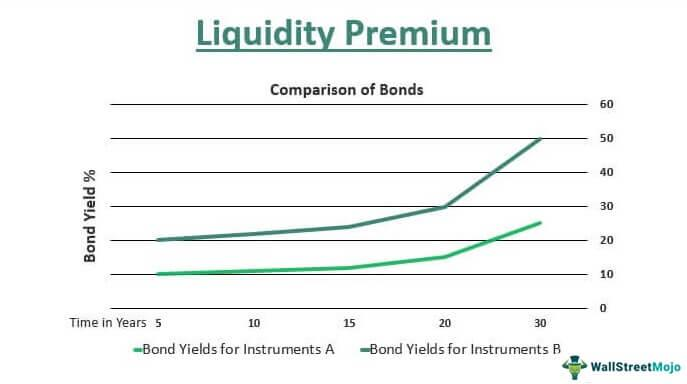

Financial markets play a pivotal role in the global economy by serving as platforms for investment and risk management. They allow individuals, corporations, and governments to allocate resources efficiently, facilitating capital formation and economic growth. Over recent decades, the landscape of financial markets has been transformed by the rise of algorithmic trading, a method of executing trades using pre-programmed instructions or algorithms. This approach leverages high-frequency trading (HFT), which allows for extremely rapid execution of orders, capitalizing on speed and the exploitation of market inefficiencies. 

Algorithmic trading has revolutionized market operations by significantly enhancing the speed and precision with which trades are executed. It enables market participants to analyze large datasets quickly and implement trading strategies much faster than traditional methods. By identifying and exploiting small price discrepancies, algorithmic trading optimizes outcomes by maximizing profits and minimizing costs. This efficiency brings substantial benefits, such as increased liquidity and reduced trading costs, contributing to smoother market operations.



Despite these advantages, algorithmic trading also presents several challenges, notably liquidity risk. Liquidity risk refers to the difficulty of executing large orders without causing significant changes in asset prices. In markets where liquidity is low, even minor trades can lead to substantial price shifts, increasing the transaction costs and impacting the overall strategy's effectiveness. This risk is particularly pronounced in less liquid markets where fewer market participants exist, leading to larger bid-ask spreads and higher volatility.

In this context, the liquidity risk premium emerges as a critical factor. This premium represents the additional return that investors demand for holding less liquid assets to compensate for the increased risk. It is an essential component of investment decisions and is particularly significant in the development of algorithmic trading strategies. Liquidity risk premium estimation involves understanding the dynamics of liquidity and adjusting trading algorithms to account for the additional returns required by investors for assuming liquidity-related risks.

This article focuses on the concept of the liquidity risk premium within the context of algorithmic trading, exploring how it is estimated and its implications on trading strategies. Furthermore, it examines future trends and challenges associated with managing liquidity risk in increasingly automated and technologically advanced market environments. Through this exploration, we aim to provide insights into the intersection of liquidity risk and algorithmic trading, highlighting the importance of integrating liquidity considerations into modern trading approaches.

## Table of Contents

## Understanding Liquidity Risk

Liquidity risk refers to the challenge of executing asset trades without inducing significant price fluctuations. High liquidity allows for seamless transactions, characterized by low costs and minimal price impact. Conversely, low liquidity is marked by elevated transaction costs and increased volatility, making trading less predictable and potentially more expensive.

Several factors contribute to [liquidity](/wiki/liquidity-risk-premium) fluctuations and thus influence liquidity risk:

1. **Market Conditions**: Fluctuations in the stock market or economic conditions can impact liquidity. In bull markets, liquidity generally increases due to heightened investor confidence and activity. Bear markets, on the other hand, tend to see reduced liquidity as investors retreat.

2. **Trading Volume**: The quantity of asset transactions in a given timeframe directly impacts liquidity. Higher trading volumes typically correlate with greater liquidity, facilitating smoother trades. Lower volumes can lead to illiquidity, resulting in difficulty executing large trades without affecting market prices.

3. **Market Depth**: This refers to the market's capacity to sustain sizable orders without major price changes. A market with substantial depth can absorb large orders thanks to a strong presence of buy and sell orders at diverse price levels. Shallow markets lack this robustness, heightening liquidity risk.

4. **Investor Behavior**: The collective actions of market participants shape liquidity. Herd behavior, where investors follow the majority, can exacerbate liquidity issues during market panics. Similarly, strategic moves by significant players, or "whales", can disrupt liquidity by exerting disproportionate influence on market conditions.

5. **External Events**: Factors such as political instability, economic sanctions, or natural disasters can swiftly alter liquidity conditions. These events may trigger uncertainty, leading investors to withdraw from the market, thereby reducing liquidity and heightening risk.

Liquidity risk significantly affects both trading strategies and asset valuation. Its presence can increase transaction costs due to the need for larger bid-ask spreads to compensate for potential trading difficulties. Furthermore, illiquid assets may be subject to valuation discounts as they are perceived as riskier or costlier to trade. 

Effectively managing liquidity risk is crucial for traders and investors seeking to optimize their strategies and preserve financial stability. This involves deploying methods to assess and accommodate potential liquidity constraints, ensuring that assets can be traded at minimal cost and [volatility](/wiki/volatility-trading-strategies) while maintaining the desired portfolio structure. Measures such as stress testing trading algorithms, diversifying asset holdings, and maintaining flexibility in executing trades are common practices to mitigate the effects of liquidity risk.

## What is Liquidity Risk Premium?

Liquidity risk premium represents the additional return that investors require for holding assets with lower liquidity. This concept is significant in [algorithmic trading](/wiki/algorithmic-trading), where efficient execution of trades is crucial. The liquidity risk premium quantifies the compensation for potential difficulties in buying or selling such assets without inducing significant price changes.

The premium is primarily calculated using metrics such as the bid-ask spread and trading [volume](/wiki/volume-trading-strategy). The bid-ask spread is the difference between the price a buyer is willing to pay and the price a seller is willing to accept. A wider spread often indicates lower liquidity. Trading volume, or the number of shares or contracts traded for a security, also plays a key role; lower volumes can suggest higher liquidity risk and, consequently, a higher liquidity risk premium. The formula for calculating the liquidity risk premium, although not standardized, typically considers these variables and could be represented through a risk-adjusted return model or a more complex econometric approach.

Incorporating liquidity risk premium into asset pricing and investment decision-making is critical. In less liquid markets, the premium tends to be higher, reflecting the increased challenge of executing trades without affecting prices. This consideration is crucial for algorithmic strategies that aim to optimize return while managing risk. Higher liquidity risk premiums can lead to adjusted valuations and the recalibration of expected returns on investments.

Understanding the liquidity risk premium is essential for traders and investors to differentiate it from other financial premiums, such as the risk premium associated with the uncertainty of receiving returns, or the time premium, which accounts for the value of money over time. This distinction is vital for developing comprehensive strategies that consider various market conditions and risk factors. By grasping these nuances, algorithmic trading systems can be more effectively designed, enabling better risk management and aligning with the dynamic nature of financial markets.

## Algorithmic Trading and Its Impact on Liquidity

Algorithmic trading has revolutionized the manner in which trades are conducted on financial markets, fundamentally altering liquidity dynamics. By employing algorithms, trading decisions are automated and executed with remarkable speed, which enhances market efficiency. These algorithms are capable of processing vast amounts of data and executing numerous orders simultaneously. This capability generally contributes to increased liquidity as it matches buyers with sellers swiftly and reduces bid-ask spreads.

Despite these advantages, algorithmic trading is not without its challenges, particularly concerning liquidity during periods of market stress. When markets experience volatility, the usual liquidity provided by algorithmic trading might diminish, posing liquidity challenges. Such situations can exacerbate price swings, as algorithms that rapidly execute trades might also retract from the market to manage risk, thereby reducing liquidity.

To mitigate these risks, it is crucial for algorithms to take prevailing market conditions into account. Specifically, algorithms need to be adept at recognizing illiquid markets and adjusting strategies to avoid placing large trades that could adversely impact prices. This requires algorithms to be dynamic and flexible in their execution protocols.

Advanced technological tools such as real-time analytics and [machine learning](/wiki/machine-learning) offer solutions to these challenges. By leveraging real-time data, algorithms can quickly adapt to changes in market liquidity, allowing them to mitigate the risks associated with sudden liquidity dries. Machine learning techniques enable algorithms to predict liquidity shifts and adjust trading strategies accordingly, minimizing negative impacts on pricing and execution costs.

For example, real-time data feeds can be used to dynamically adjust the size of orders or the timing of executions based on current market liquidity. Python code, utilizing libraries such as NumPy and Pandas, can assist traders in developing models that simulate market conditions and optimize trading strategies to align with liquidity changes:

```python
import numpy as np
import pandas as pd

# Simulate market conditions
def simulate_market_conditions(data):
    # Example: Generate a rolling average to assess market liquidity
    return data.rolling(window=10).mean()

# Adjust trade size based on market liquidity
def adjust_trade(orders, market_liquidity):
    adjusted_orders = []
    for order in orders:
        size_adjustment = market_liquidity / (market_liquidity + abs(order['size']))
        adjusted_order = order.copy()
        adjusted_order['size'] *= size_adjustment
        adjusted_orders.append(adjusted_order)
    return adjusted_orders

# Example usage
market_data = pd.DataFrame({'price': np.random.randn(100)})
orders = [{'size': 10, 'price': 100}, {'size': 20, 'price': 200}]

market_liquidity = simulate_market_conditions(market_data['price'])
adjusted_orders = adjust_trade(orders, market_liquidity[-1])

print("Adjusted Orders:", adjusted_orders)
```

This Python code demonstrates a simplistic approach for adjusting trade sizes based on a simulated assessment of market liquidity, highlighting how market participants can incorporate technology to enhance liquidity management in algorithmic trading. Through sophisticated analyzation and prediction models, traders can better navigate the complexities of liquidity risk in automated markets, thus enhancing both execution and performance outcomes.

## Incorporating Liquidity Risk Premium into Algo Trading Strategies

Incorporating the liquidity risk premium into algorithmic trading strategies is integral for optimizing trading performance. Adaptive algorithms, which modify their behavior in response to changes in market conditions, play a crucial role in integrating this premium. These algorithms can leverage historical data to predict future liquidity conditions, allowing traders to adjust their strategies accordingly. For instance, in volatile or less liquid markets, algorithms might execute trades in smaller batches to minimize market impact costs.

Liquidity proxies, indicators that estimate current and future liquidity conditions, are essential for these algorithms. Common liquidity proxies include the bid-ask spread, [order book](/wiki/order-book-trading-strategies) depth, and the volume-to-trade ratio. By monitoring these metrics, trading algorithms can assess the liquidity of a market and adjust their trading tactics to accommodate expected changes. 

Risk-adjusted performance metrics are used to evaluate the effectiveness of trading strategies concerning their liquidity risk exposure. Metrics such as risk-adjusted return on capital (RAROC) or [value at risk](/wiki/var-value-at-risk) (VaR) may be employed to assess the additional return generated for assuming liquidity risk. 

Implementing strategies like Volume Weighted Average Price (VWAP) helps in optimizing trade execution by targeting an average price level that accounts for market volume variations. VWAP strategies are especially effective during times of normal market conditions, but require adjustment in illiquid situations. Market-making algorithms, which provide continuous buy and sell quotes, are enhanced by adjusting spreads based on predicted liquidity shortages, thus compensating for additional risk undertaken.

Data analytics and machine learning technologies significantly enhance the assessment and prediction of liquidity risks. Predictive analytics can model future market conditions and potential liquidity crises by analyzing historical and real-time data. Machine learning techniques, such as clustering and sentiment analysis, help in identifying patterns and anomalies in trading data that traditional techniques might overlook. 

For instance, Python can be used to perform such tasks through libraries like scikit-learn for machine learning, pandas for data manipulation, and statsmodels for statistical analysis. A simple example would be using a clustering algorithm to classify assets based on their liquidity characteristics:

```python
from sklearn.cluster import KMeans
import pandas as pd

# Sample dataset
data = {'BidAskSpread': [0.01, 0.015, 0.02, 0.025],
        'TradeVolume': [1000, 1500, 2000, 1000]}

# Convert to DataFrame
df = pd.DataFrame(data)

# Define number of clusters
kmeans = KMeans(n_clusters=2)

# Fit and predict clusters
df['LiquidityCluster'] = kmeans.fit_predict(df[['BidAskSpread', 'TradeVolume']])

print(df)
```

In this example, assets are grouped into clusters based on their bid-ask spread and trading volume, aiding in the liquidity assessment process. By incorporating these advanced techniques, algorithmic trading strategies can better navigate the complexities of liquidity risk, enhancing both risk management practices and profitability outcomes.

## Case Studies and Real-World Examples

A strategic implementation of liquidity risk premium in trading can be observed through the practices of AQR Capital Management. AQR employs multi-[factor](/wiki/factor-investing) models to assess and incorporate liquidity risk into their investment strategies, thus optimizing returns while managing associated risks. These models help to dissect the various premiums embedded in asset prices, including the liquidity risk premium, by evaluating market data such as bid-ask spreads, trading volumes, and other indicators of market depth. By analyzing these elements, AQR enhances its understanding of liquidity dynamics and subsequently adjusts its trading strategies to align with the anticipated liquidity conditions.

The 2008 financial crisis serves as a significant case study demonstrating the necessity of robust liquidity risk management in algorithmic trading. JPMorgan, like many financial institutions, faced severe challenges due to liquidity shocks during this period. Stress-testing their algorithms for liquidity scenarios became pivotal after this crisis, highlighting areas where the algorithms were susceptible to swift market changes. These stress tests involved simulating various liquidity conditions to ensure that trading strategies could withstand periods of extreme market turbulence. The crisis thus emphasized the importance of preparing for liquidity constraints, showcasing a vital lesson in the integration of comprehensive risk management frameworks within trading algorithms.

Another notable incident is the 2010 flash crash, which further underscored the need for efficient algorithm adaptability and liquidity risk management. During this event, automated trading systems contributed to a rapid and severe market downturn, leading to significant financial losses. The flash crash highlighted how high-frequency trading, while typically beneficial to market liquidity, could also exacerbate volatility when not managed correctly, particularly during periods of stress. The incident underscored the importance of implementing safeguards within trading algorithms to enhance their adaptability to sudden changes in market liquidity. Mechanisms such as circuit breakers, which temporarily halt trading during extreme volatility, were consequently evaluated and improved to prevent similar occurrences in the future.

Overall, these case studies illustrate the critical role of liquidity risk premium in shaping trading strategies and managing risks associated with algorithmic trading. Adapting to the lessons learned from these events enables financial entities to fortify their trading algorithms against future liquidity challenges, thereby fostering a more resilient financial environment.

## Future Trends and Challenges

The future of liquidity risk management in algorithmic trading is poised for transformative changes, driven by technological advancements and evolving regulatory landscapes. AI and machine learning are set to play a crucial role in enhancing the analysis and management of liquidity risks. These technologies enable the development of algorithms capable of processing vast amounts of market data in real-time, identifying patterns, forecasting liquidity trends, and making informed trading decisions.

The integration of blockchain technology and decentralized finance (DeFi) into traditional finance systems presents unique opportunities for improving transparency and reducing transaction costs. Blockchain offers a secure and transparent ledger for financial transactions, potentially enhancing the efficiency of liquidity transfers and settlements. However, the adoption of these technologies faces regulatory challenges. Ensuring compliance with financial regulations while harnessing the benefits of blockchain requires a delicate balance, as regulators scrutinize the impact of these innovations on market stability.

Evolving regulations are shaping the landscape of high-frequency trading ([HFT](/wiki/high-frequency-trading-strategies)), with a focus on mitigating systemic risks. Regulatory bodies are increasingly implementing measures to ensure that HFT firms adopt best practices in risk management and trading strategies. These measures include stress-testing algorithms against liquidity shocks and ensuring systems are robust against rapid market changes. As regulations continue to evolve, algorithmic trading strategies must adapt to remain compliant while effectively managing liquidity risks.

In conclusion, the future of liquidity risk management in algorithmic trading hinges on the integration of advanced technologies and adherence to regulatory frameworks. Staying ahead in this dynamic environment requires continuous innovation and adaptation to leverage new tools and methods for effective risk management and strategy optimization.

## Conclusion

The liquidity risk premium is a critical element in algorithmic trading, allowing for the optimization of returns while managing inherent risks associated with trading strategies. Its role is to compensate investors for the increased risk of holding assets that are less liquid, thereby shaping the decisions of traders and investors in constructing profitable and resilient portfolios. By incorporating liquidity considerations into algorithms, traders can better navigate market conditions, ensuring that financial positions are executed efficiently without undue price impact.

Understanding liquidity premiums and associated risks is fundamental for incorporating them effectively into trading algorithms. This knowledge allows for the development of adaptive trading strategies that are responsive to changing market dynamics, enhancing both risk management and profitability. For instance, traders can employ adaptive algorithms that adjust trading parameters in response to real-time liquidity metrics, thus minimizing execution costs and potential slippage.

Staying informed about ongoing trends and advancements in financial technology and market regulation is crucial for continuously adapting trading strategies in increasingly dynamic financial markets. The integration of [artificial intelligence](/wiki/ai-artificial-intelligence) and machine learning technologies promises to further refine the estimation of liquidity risk premiums, providing more accurate prediction models and risk assessments. Monitoring developments in market structure, such as the rise of decentralized finance, will also be key to adapting strategies that effectively manage liquidity risks while capitalizing on emerging opportunities.

In conclusion, a comprehensive understanding and application of liquidity risk premiums enable traders to optimize algorithmic trading strategies, safeguard against potential losses, and capitalize on market inefficiencies. Maintaining a keen awareness of market evolution and technological advancements will be pivotal for traders seeking sustained success in the rapidly advancing landscape of financial markets.

## References & Further Reading

### References & Further Reading

A comprehensive understanding of liquidity risk and algorithmic trading can be gained through an array of academic and practical resources. Key literature includes:

1. **"Market Liquidity: Theory, Evidence, and Policy" by Thierry Foucault, Marco Pagano, and Ailsa Röell**  
   This book provides an in-depth examination of market liquidity, offering theoretical insights and empirical analysis. It explores how liquidity affects asset pricing and trading strategies, relevant for grasping the liquidity risk premium.

2. **"High-Frequency Trading: New Realities for Traders, Markets, and Regulators" by Irene Aldridge**  
   Aldridge's work covers the technical aspects of high-frequency trading (HFT), including the algorithms used and their market impact. It is essential for understanding the role of algorithmic trading in liquidity provision and risks.

3. **"Liquidity Risk Measurement and Management: Basel III and Beyond" by E.A. Dermine and Y. Neto**  
   This publication delves into liquidity risk assessment methods, providing practical tools for evaluating and managing liquidity risk in financial institutions, a critical aspect when considering the liquidity risk premium in trading.

4. **"Understanding the Risk of Trading: Trade and Market Liquidity Dynamics" by Robert Engle and Robert V. Rich**  
   Engle and Rich explore how trading strategies can be optimized by understanding market liquidity dynamics, vital for algorithmic traders focusing on liquidity risk premiums.

5. **Research Papers and Journal Articles**  
   - *Campbell, J. Y., Grossman, S. J., & Wang, J. (1993). Trading Volume and Serial Correlation in Stock Returns.* Journal of Finance, which discusses the relationship between liquidity and stock volatility.
   - *Pastor, L., & Stambaugh, R. F. (2003). Liquidity Risk and Expected Stock Returns.* Journal of Political Economy, examining liquidity's direct impact on expected asset returns.

6. **Online Resources and Databases**  
   - Financial databases such as Bloomberg and Reuters provide real-time data valuable for algorithmic trading. They offer insights into liquidity conditions and help in modeling liquidity risk premiums.
   - Websites and platforms like SSRN and JSTOR offer access to a wide range of research publications related to liquidity and algorithmic trading.

By consulting these resources, readers can gain a deeper understanding of the complexity of liquidity premiums and their significant impact on trading strategies within financial markets.

