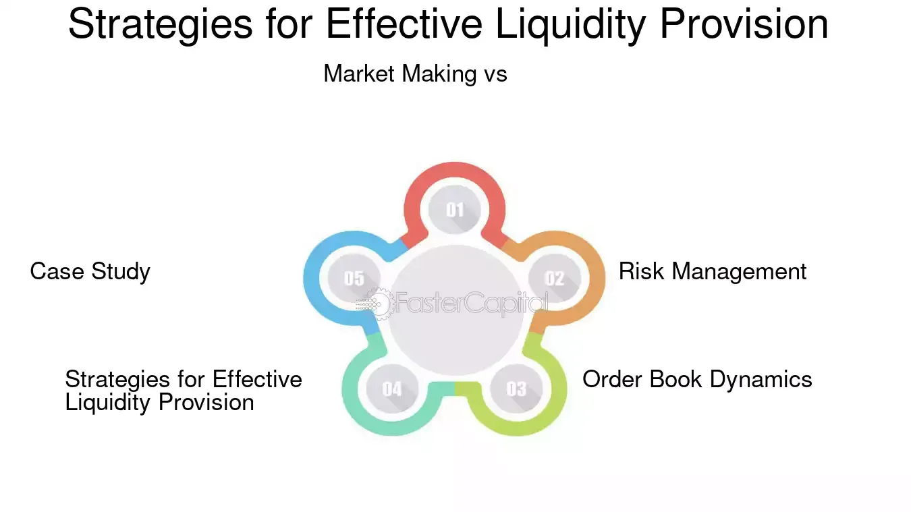

## Table of Contents

## What is a liquidity provider?

A liquidity provider is someone or a company that helps make it easier to buy and sell things on a trading platform. They do this by always being ready to buy or sell certain items, like stocks or cryptocurrencies, at any time. This makes the market more active and helps people trade faster and more easily.

Think of a liquidity provider like a store that always has products in stock. If you want to buy something, you can go to the store and get it right away because they have it available. This is similar to how a liquidity provider works in trading; they keep items available so that traders can buy or sell them without waiting.

## Why are liquidity providers important in financial markets?

Liquidity providers are important in financial markets because they make it easier for people to buy and sell things quickly. Imagine you want to sell your stock, but no one wants to buy it right away. It could take a long time to find a buyer, and you might have to sell it for less money. Liquidity providers step in and are always ready to buy or sell, so you can trade your stock faster and at a better price.

They also help keep the market stable. When lots of people want to buy or sell at the same time, prices can go up and down a lot. Liquidity providers help balance this out by always being there to trade. This makes the market calmer and more predictable, which is good for everyone who trades.

## What are the basic strategies used by liquidity providers?

Liquidity providers use a few main strategies to do their job. One strategy is called market making. They put up both buy and sell prices for a certain item, like a stock or a cryptocurrency, and they make a small profit from the difference between these prices. This helps keep the market active because there's always someone ready to trade.

Another strategy is called arbitrage. Liquidity providers look for price differences for the same item on different trading platforms. They buy the item where it's cheaper and sell it where it's more expensive, making a profit from the difference. This helps keep prices more similar across different platforms, which makes the overall market more stable.

Some liquidity providers also use automated systems, like algorithms, to quickly adjust their buy and sell prices based on what's happening in the market. These systems help them stay competitive and make sure they can always provide liquidity even when the market is changing fast.

## How do liquidity providers manage risk?

Liquidity providers manage risk by being careful about how much they buy and sell. They don't want to have too much of one thing because if its price goes down, they could lose a lot of money. So, they spread out their trades across many different items. This way, if one item loses value, they still have other items that might do well and help balance out their losses.

They also use special tools and computer programs to watch the market closely. These tools help them see when prices might change and adjust their buy and sell prices quickly. By doing this, they can avoid big losses and keep making small profits. It's like always having a safety net that helps them stay safe in the fast-moving world of trading.

## What is the role of technology in liquidity provision?

Technology plays a big role in helping liquidity providers do their job better. They use computer programs and special tools to watch the market all the time. These tools help them see when prices are changing and let them adjust their buy and sell prices very quickly. This means they can always offer good prices to people who want to trade, making the market more active and easier to use.

Another way technology helps is by using algorithms. These are like smart math formulas that can make decisions on their own. Liquidity providers use these algorithms to find the best times to buy and sell, and to make sure they are always ready to trade. This makes their work faster and more accurate, which is important in a market that changes quickly.

## How do liquidity providers earn profits?

Liquidity providers earn profits by being the middleman in trades. They set a price at which they are willing to buy an item, and a slightly higher price at which they are willing to sell it. The difference between these two prices is called the "bid-ask spread." When someone wants to buy or sell, the liquidity provider makes a small profit from this spread. For example, if they buy a stock for $10 and sell it for $10.05, they earn a profit of $0.05 per share.

They also make money through a strategy called arbitrage. This happens when the same item is being sold at different prices on different trading platforms. Liquidity providers buy the item where it's cheaper and sell it where it's more expensive, making a profit from the price difference. This helps keep prices more similar across markets and also adds to their earnings. By using these strategies, liquidity providers can keep the market active while earning a steady income.

## What are the differences between market making and liquidity provision?

Market making and liquidity provision are closely related but have some key differences. Market making is a specific type of liquidity provision where a person or company, called a market maker, always offers to buy and sell certain items at set prices. They do this to help make trading easier and faster. The market maker makes money from the small difference between the price they buy at and the price they sell at, which is called the bid-ask spread.

Liquidity provision is a broader term that includes market making but also covers other ways to help keep the market active. Liquidity providers might use strategies like arbitrage, where they buy something cheap in one place and sell it for more in another place. They also use technology to keep the market running smoothly. So, while all market makers are liquidity providers, not all liquidity providers are market makers because they might use different strategies to help the market.

## How do regulatory environments affect liquidity providers' strategies?

Regulatory environments can change how liquidity providers do their job. Rules from governments and financial watchdogs can set limits on what liquidity providers can do. For example, some rules might say they can't trade too much of one thing or they have to show their prices in a certain way. These rules are there to make sure the market is fair and safe for everyone. Liquidity providers have to follow these rules, so they might need to change their strategies to stay within the law. This can make their work harder but helps keep the market honest.

Sometimes, the rules can also affect how much money liquidity providers can make. If the rules make it harder to use certain strategies, like arbitrage, liquidity providers might earn less profit. They might need to find new ways to make money while still following the rules. This can lead to more creative strategies or using more technology to keep up with the changes. Overall, regulatory environments shape how liquidity providers operate and can push them to adapt and innovate.

## What advanced techniques do liquidity providers use to optimize their operations?

Liquidity providers use smart computer programs called algorithms to make their work better. These algorithms can look at lots of information really fast and help decide when to buy and sell things. They can change prices quickly based on what's happening in the market, so liquidity providers can always offer good prices to people who want to trade. This makes the market more active and helps liquidity providers make more money because they can trade more often.

Another advanced technique is using something called high-frequency trading. This means using very fast computers to buy and sell things in just a few seconds. Liquidity providers can see tiny changes in prices and make trades before anyone else. This helps them make small profits from many quick trades. They also use special data tools to predict what might happen next in the market, so they can be ready to act fast and make the best decisions.

## How do liquidity providers adapt to high-frequency trading environments?

Liquidity providers adapt to high-frequency trading environments by using very fast computers. These computers help them see small changes in prices and make trades quickly. This is important because in high-frequency trading, things happen in just a few seconds. By using these fast computers, liquidity providers can buy and sell things before anyone else, making small profits from many quick trades. This helps them stay competitive and keep the market active.

They also use special tools to predict what might happen next in the market. These tools look at a lot of information very fast and help liquidity providers make the best decisions. By knowing what might happen, they can adjust their prices quickly and be ready to trade at the right time. This way, they can make more money and keep the market running smoothly even when things change fast.

## What are the challenges faced by liquidity providers in volatile markets?

In volatile markets, liquidity providers face big challenges because prices can change a lot very quickly. They have to be ready to buy and sell at any moment, but when the market is moving fast, it's hard to keep up. If they set their prices too high or too low, they might lose money. So, they need to use very fast computers and smart programs to watch the market all the time and change their prices quickly. This can be stressful and expensive because they need to spend a lot on technology to stay ahead.

Another challenge is managing risk. In a volatile market, the value of what they're trading can go up and down a lot. Liquidity providers have to be careful not to have too much of one thing because if its price drops suddenly, they could lose a lot of money. They use special tools to spread out their trades across many different items. This way, if one item loses value, they still have other items that might do well and help balance out their losses. But even with these tools, it's hard to predict everything, and they always have to be ready for surprises.

## How can liquidity providers leverage data analytics for strategic decision-making?

Liquidity providers can use data analytics to make better decisions by looking at a lot of information about the market. They use special tools to see patterns and trends in how prices are changing. This helps them know when to buy and sell things at the best times. For example, if the data shows that a certain stock usually goes up on Mondays, they can be ready to buy it on that day. By using data analytics, they can make smarter choices and make more money.

Another way data analytics helps is by managing risk. Liquidity providers can use data to see which items are more likely to lose value and avoid having too much of those. They can also see how different items are related to each other, so if one item goes down, they know which other items might go up and balance out their losses. This makes their work safer and more predictable. By using data analytics, liquidity providers can keep the market active and make good decisions even when things are changing fast.

## What are the key terminologies to understand?

To fully grasp the complexities of strategies in algorithmic trading, it is essential to become familiar with certain key terminologies. Among these, market orders, book skew, and execution algorithms are fundamental concepts.

Market orders are a primary tool used in trading to take liquidity from the market. The primary function of a market order is its ability to fill instantly at the best available prices. This immediacy suits traders looking to enter or exit positions without delay, trading off potential price slippage for speed. Market orders do not offer price guarantees, but they ensure execution, which is crucial in fast-moving markets where liquidity can rapidly shift.

Book skew, another critical concept, refers to an imbalance in the [order book](/wiki/order-book-trading-strategies). It indicates a disparity between the bid and ask sides, offering a strategic advantage to astute traders. By analyzing book skew, a trader can infer the underlying supply and demand dynamics, leading to more informed trading decisions. A pronounced skew might suggest imminent price movements, allowing traders to capitalize on inefficiencies or anticipate short-term market shifts.

Execution algorithms are designed to optimize trade execution and minimize market impact. Among the most widely utilized are Time-Weighted Average Price (TWAP) and Volume-Weighted Average Price (VWAP). These algorithms serve different purposes but share common objectives of reducing visibility to the market and achieving better average pricing. 

TWAP spreads out large orders evenly over time, mitigating the risk of sudden price shifts due to large [volume](/wiki/volume-trading-strategy) trades. This algorithm is particularly advantageous for orders expected to have a significant market impact if executed all at once. 

VWAP, on the other hand, focuses on executing orders in proportion to market volume. By aligning executions with market flow, VWAP reduces the likelihood of deviating markedly from the market's average price. This is achieved through the formula:

$$
VWAP = \frac{\sum_{i=1}^{n} P_i \times Q_i}{\sum_{i=1}^{n} Q_i}
$$

where $P_i$ represents the price of each trade, and $Q_i$ is the corresponding trade volume. The VWAP calculation enables optimization relative to the market's prevailing activity.

Understanding these terminologies not only lays the groundwork for advanced strategies but also equips traders with the knowledge necessary to navigate and strategize effectively in the fast-paced environment of [algorithmic trading](/wiki/algorithmic-trading).

## What are the considerations in risk management and commissions?

Risk management is a critical component of high-frequency trading (HFT), primarily due to the significant volume and frequency at which trades are executed. The inherent volatility and rapid price movements in the markets necessitate a robust risk management framework to mitigate potential financial losses. Effective risk management involves various strategies, including the management of position sizes, leverage control, and diversification of trading strategies to spread risk.

Commissions and fees are crucial factors in the profitability of HFT operations. Given the large number of trades executed in HFT, even minimal costs per trade can accumulate significantly, affecting overall profitability. Therefore, liquidity providers need to meticulously calculate these costs and account for them in their trading algorithms. This necessitates a careful selection of trading venues that offer competitive fee structures, as well as negotiating favorable terms with brokers or exchanges.

Pre-trade cost estimation is vital to maintaining an optimal edge in HFT. This involves forecasting the potential costs associated with executing a trade before its execution, considering aspects such as the bid-ask spread, price impact, and probable slippage. Accurate pre-trade cost estimation enables traders to make informed decisions, ensuring that trades are executed when they are likely to be profitable after accounting for costs. 

Mathematically, the expected cost of a trade can be expressed as:

$$

\text{Total Cost} = (\text{Bid-Ask Spread} + \text{Price Impact} + \text{Slippage}) \times \text{Volume} 
$$

The ability to accurately estimate and manage these costs ensures that liquidity providers maintain a competitive edge and sustain profitability in the long term. As the trading environment evolves, continuous refinement of risk management strategies and cost estimation methodologies remains essential for success in algorithmic trading.

## References & Further Reading

[1]: Hasbrouck, J., & Saar, G. (2013). ["Low-Latency Trading."](https://www.sciencedirect.com/science/article/abs/pii/S1386418113000165) The Review of Financial Studies, 26(9), 2093-2136.

[2]: Aldridge, I. (2013). ["High-Frequency Trading: A Practical Guide to Algorithmic Strategies and Trading Systems"](https://www.wiley.com/en-us/High+Frequency+Trading%3A+A+Practical+Guide+to+Algorithmic+Strategies+and+Trading+Systems%2C+2nd+Edition-p-9781118343500) (2nd Edition). Wiley.

[3]: Lopez de Prado, M. (2018). ["Advances in Financial Machine Learning"](https://www.amazon.com/Advances-Financial-Machine-Learning-Marcos/dp/1119482089). Wiley.

[4]: Jansen, S. (2020). ["Machine Learning for Algorithmic Trading: Second Edition"](https://github.com/stefan-jansen/machine-learning-for-trading). Packt.

[5]: Kissell, R. (2013). ["The Science of Algorithmic Trading and Portfolio Management"](https://www.sciencedirect.com/book/9780124016897/the-science-of-algorithmic-trading-and-portfolio-management). Academic Press.