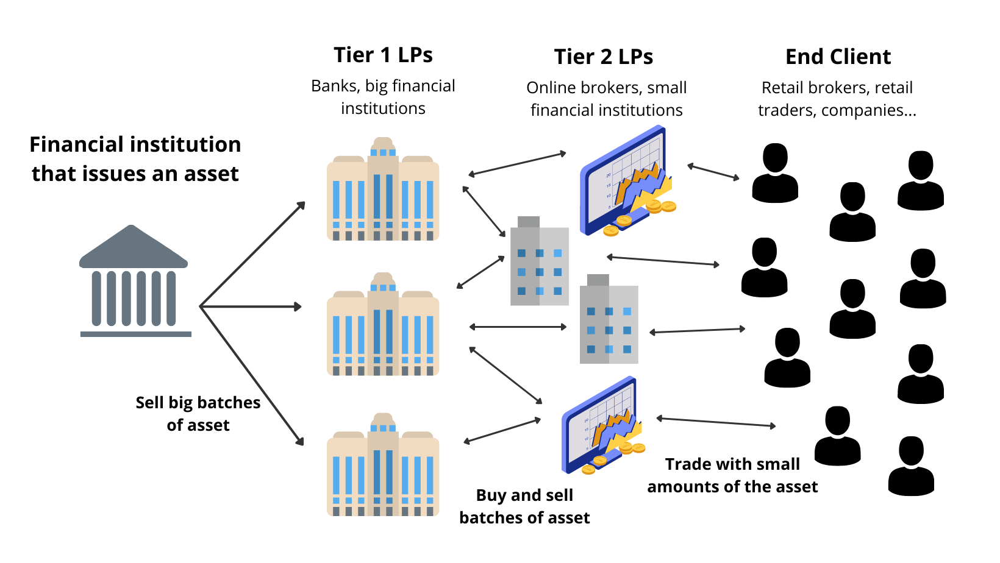

## Table of Contents

## What is a liquidity provider?

A liquidity provider is someone or a company that helps make it easier to buy and sell things on a trading platform. They do this by always being ready to buy or sell certain items, like stocks or cryptocurrencies, at any time. This makes the market more stable and helps traders because they can always find someone to trade with.

Liquidity providers are important because they help keep the market running smoothly. Without them, it might be hard to find someone to buy or sell to, which can make trading slow and prices can change a lot. By providing liquidity, they make sure that there is always enough activity in the market, which helps everyone who wants to trade.

## Why are liquidity providers important in financial markets?

Liquidity providers are very important in financial markets because they make it easier for people to buy and sell things like stocks, bonds, or cryptocurrencies. They do this by always being ready to trade, so if you want to sell something, you can find someone to buy it from you quickly. This is good because it means you don't have to wait a long time to make a trade, and it helps keep the market moving smoothly.

Without [liquidity](/wiki/liquidity-risk-premium) providers, the market could become slow and prices could change a lot. Imagine trying to sell something, but no one wants to buy it right away. This can make it hard to trade and can make prices go up and down a lot. Liquidity providers help prevent this by making sure there are always people ready to buy and sell, which keeps the market stable and helps everyone who wants to trade.

## How do liquidity providers make money?

Liquidity providers make money by taking advantage of the difference between the price they buy something at and the price they sell it for. This difference is called the bid-ask spread. For example, if a liquidity provider buys a stock for $10 and then sells it for $10.05, they make a small profit of 5 cents per share. By doing this many times with lots of different items, they can earn a lot of money overall.

They also sometimes make money from fees that trading platforms pay them. These platforms want to make sure there are always people ready to buy and sell, so they might pay liquidity providers to keep the market active. This can add up to a significant amount of money, especially if the liquidity provider is working with a busy trading platform.

## What is the difference between a market maker and a liquidity provider?

A market maker and a liquidity provider both help make it easier to buy and sell things on a trading platform, but they do it in slightly different ways. A market maker is a specific type of liquidity provider that works directly with a trading platform. They have to follow certain rules set by the platform, like always showing how much they are willing to buy or sell something for. This makes them a big part of keeping the market stable and active.

On the other hand, a liquidity provider can be anyone or any company that adds more chances to buy and sell on a trading platform. They don't always have to follow strict rules like market makers do. Liquidity providers might work with different platforms and can choose when and what they want to trade. Both are important for keeping the market running smoothly, but market makers have a more formal role.

## Can anyone become a liquidity provider?

Yes, anyone can become a liquidity provider, but it depends on the rules of the trading platform they want to work with. Some platforms have strict rules and you might need to have a lot of money or special permission to start. Others might be easier to join, but you still need to understand how trading works and be ready to buy and sell things all the time.

Being a liquidity provider can be a good way to make money, but it's not easy. You have to be good at figuring out prices and be ready to take some risks. It's important to learn a lot about the market and maybe even get some advice from people who have done it before. If you're willing to put in the time and effort, you can become a liquidity provider and help keep the market running smoothly.

## What are the risks associated with being a liquidity provider?

Being a liquidity provider comes with some risks. One big risk is that you might lose money if the prices of what you're buying and selling change a lot. For example, if you buy something at a high price and then the price goes down before you can sell it, you could lose money. This is called market risk, and it's something all liquidity providers have to watch out for.

Another risk is that you might not always be able to find someone to trade with. If the market becomes quiet or if there's a big event that makes people stop trading, you could be stuck with things you can't sell. This can tie up your money and make it hard to keep doing your job as a liquidity provider. It's important to be ready for times when the market might not be as active as usual.

Lastly, there's the risk of making mistakes. As a liquidity provider, you have to keep track of a lot of information and make quick decisions. If you make a mistake, like buying or selling at the wrong price, it could cost you money. It's important to stay focused and have good systems in place to help you manage your trades carefully.

## How does liquidity provision work in decentralized finance (DeFi)?

In decentralized finance (DeFi), liquidity provision works a bit differently than in traditional markets. In DeFi, people can become liquidity providers by adding their money to special pools on platforms like Uniswap or SushiSwap. These pools are used to help other people trade cryptocurrencies without needing a middleman like a bank or a broker. When you add your money to a pool, you help make it easier for others to trade, and in return, you get a share of the fees that come from those trades. It's like helping to run a marketplace and getting paid for it.

The way it works is pretty simple. Let's say you add some Ethereum and a stablecoin like USDC to a pool. Other people can then use that pool to trade between Ethereum and USDC. The price of the trade is figured out automatically by the platform, based on how much of each [cryptocurrency](/wiki/cryptocurrency) is in the pool. As a liquidity provider, you earn a part of the trading fees every time someone uses the pool to make a trade. But there's a risk too. If the price of the cryptocurrencies in the pool changes a lot, you might lose some of your money. So, it's important to understand these risks before you start providing liquidity in DeFi.

## What are liquidity pools and how do they relate to liquidity providers?

Liquidity pools are like big pots of money that people can use to trade cryptocurrencies without needing a middleman. They are used in decentralized finance (DeFi) platforms like Uniswap or SushiSwap. When someone wants to trade, they take money from the pool to make the trade happen. The price of the trade is decided automatically by the platform, based on how much of each cryptocurrency is in the pool. This makes it easy for anyone to trade anytime they want, without waiting for someone else to trade with them.

Liquidity providers are the people who put their money into these pools. By adding their money, they help make sure there's always enough in the pool for others to trade. In return, liquidity providers get a share of the fees that come from the trades people make using the pool. This is how they make money. But there's a risk too. If the price of the cryptocurrencies in the pool goes up or down a lot, the value of what they put in the pool can change, and they might lose some money. So, it's important for liquidity providers to understand these risks before they start.

## How do regulatory requirements affect liquidity providers?

Regulatory requirements can make things harder for liquidity providers. They have to follow rules set by governments or financial watchdogs. These rules can be about how much money they need to have, how they should keep their money safe, and what information they need to share with others. Sometimes, these rules can make it more expensive or complicated to be a liquidity provider. For example, they might need to spend more money on keeping track of their trades or making sure they follow all the laws.

On the other hand, these rules can also help keep the market fair and safe for everyone. By making sure liquidity providers follow certain standards, regulators can help stop bad things from happening, like fraud or big losses. This can make people trust the market more, which is good for everyone. So, while regulatory requirements can be a challenge for liquidity providers, they also play an important role in keeping the market running smoothly and safely.

## What strategies do liquidity providers use to manage their inventory?

Liquidity providers use different strategies to manage their inventory. One common strategy is called hedging. This means they buy or sell other things to help protect themselves from big price changes. For example, if a liquidity provider has a lot of one stock, they might buy something else that goes up when that stock goes down. This way, if the stock price falls, they don't lose as much money because the other thing they bought goes up in value.

Another strategy is called rebalancing. This means they keep an eye on what they have and make changes to keep it balanced. If they notice they have too much of one thing, they might sell some of it and buy more of something else. This helps them keep their inventory in good shape and ready for trading. It's like making sure they have the right mix of things to keep the market running smoothly.

Lastly, liquidity providers might use algorithms to help them manage their inventory. These are like special computer programs that can make quick decisions based on a lot of information. The algorithms can look at prices, how much people are trading, and other things to figure out the best way to buy and sell. This helps liquidity providers keep their inventory in order and make sure they are ready to trade at any time.

## How do liquidity providers impact market efficiency and price discovery?

Liquidity providers help make markets work better by making it easier for people to buy and sell things. When there are lots of liquidity providers, it's easier for traders to find someone to trade with. This means trades can happen faster and with less waiting around. When markets are more active like this, they are more efficient. That's because people can trade whenever they want, and they don't have to worry about not finding someone to trade with. This helps the market run smoothly and makes it easier for everyone to do business.

Liquidity providers also help with figuring out the right prices for things. When they're always ready to buy and sell, it helps set prices that make sense. If lots of people want to buy something, the price goes up. If lots of people want to sell something, the price goes down. Liquidity providers help make sure these price changes happen smoothly and fairly. By being there to trade all the time, they help the market find the right price for things, which is called price discovery. This makes the market more fair and helps everyone know what things are really worth.

## What future trends are expected to influence the role of liquidity providers?

In the future, technology is going to play a bigger role in how liquidity providers do their job. More and more, they will use smart computer programs called algorithms to help them make quick decisions about buying and selling. These programs can look at a lot of information at once and figure out the best prices to trade at. This can help liquidity providers do their job better and faster. Also, with more people using digital money like cryptocurrencies, liquidity providers might have to start working with these new kinds of money more often. This could mean they need to learn new ways to manage their money and keep it safe.

Another trend that could change things for liquidity providers is new rules from governments and financial watchdogs. As more people start trading in different ways, like through decentralized finance (DeFi) platforms, regulators might make new rules to keep everything fair and safe. Liquidity providers will need to keep up with these new rules and make sure they follow them. This might make their job harder, but it can also help make the market safer for everyone. Overall, the future for liquidity providers looks like it will be full of new technology and new rules, and they will need to be ready to adapt to these changes.

## References & Further Reading

[1]: Harris, L. (2002). ["Trading and Exchanges: Market Microstructure for Practitioners."](https://academic.oup.com/book/52292) Oxford University Press.

[2]: Lopez de Prado, M. (2018). ["Advances in Financial Machine Learning."](https://books.google.com/books/about/Advances_in_Financial_Machine_Learning.html?id=oU9KDwAAQBAJ) Wiley.

[3]: Narang, R. (2013). ["Inside the Black Box: A Simple Guide to Quantitative and High-Frequency Trading."](https://onlinelibrary.wiley.com/doi/book/10.1002/9781118662717) Wiley.

[4]: Aldridge, I. (2013). ["High-Frequency Trading: A Practical Guide to Algorithmic Strategies and Trading Systems."](https://www.amazon.com/High-Frequency-Trading-Practical-Algorithmic-Strategies/dp/1118343506) Wiley.

[5]: Oberlechner, T. (2005). ["The Psychology of the Foreign Exchange Market."](https://openlibrary.org/books/OL24258588M/The_Psychology_of_the_Foreign_Exchange_Market) Wiley.

[6]: Hasbrouck, J. (2007). ["Empirical Market Microstructure: The Institutions, Economics, and Econometrics of Securities Trading."](https://academic.oup.com/book/52241) Oxford University Press.