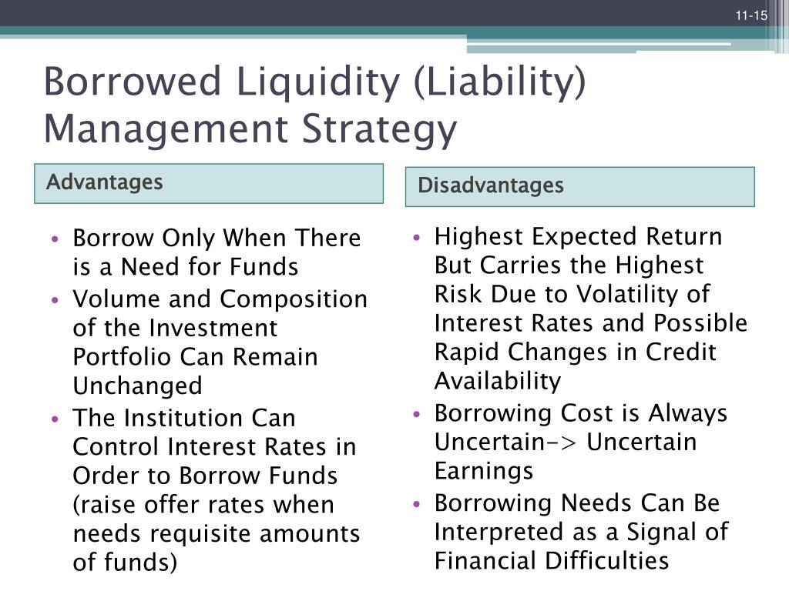

Liquidity provision strategies are crucial for ensuring smooth operations in financial markets. These strategies are designed to enhance market efficiency and stability by facilitating trade execution and reducing transaction costs. At the core of these strategies is the concept of liquidity, which refers to the ease with which assets can be bought or sold in the market without affecting their price. High liquidity is indicative of a well-functioning market where assets are readily available for trading, resulting in minimized transaction costs and reduced market impact.

Algorithmic trading, which utilizes sophisticated mathematical models and high-speed data processing, plays a significant role in implementing these liquidity provision strategies. By using algorithms to automate trading decisions, traders can execute orders rapidly and efficiently, ensuring that liquidity is available at all times. This ability to execute high-frequency trades based on predefined criteria such as timing, price, and volume enables market participants to manage their positions effectively, thus contributing to overall market liquidity.

The importance of liquidity in reducing transaction costs and managing market impact cannot be overstated. When a market is highly liquid, the bid-ask spread—the difference between the buying and selling price—tends to be narrow, allowing for cost-effective transactions. Moreover, sufficient liquidity ensures that large orders can be absorbed by the market without causing significant price fluctuations, which is particularly critical during periods of high volatility.

This article explores the various strategies within algorithmic trading that contribute to liquidity provision, offering insights into how these techniques enhance market stability and efficiency. Understanding these strategies is essential for market participants, as it enables them to navigate complex financial environments and optimize their trading activities. By examining the interplay between algorithmic trading and liquidity provision, this article aims to highlight the integral role of advanced trading strategies in sustaining the health and vitality of financial markets.

## Table of Contents

## Market Making

Market making is a fundamental activity in financial markets that involves continuously quoting both buy and sell prices for specific instruments. This strategy aims to provide liquidity, ensuring that market participants can trade without significant delays or price shifts. By maintaining an inventory of securities, market makers facilitate transactions and enable smoother market operations. 

The primary revenue stream for market makers is the bid-ask spread, which represents the difference between the price at which they buy an asset and the price at which they sell it. This spread compensates market makers for the risk they assume while holding assets that may fluctuate in value. Additionally, market makers earn profits from rapid transaction turnovers, leveraging high-frequency trading technology to process trades efficiently.

Market makers play a crucial role, particularly during periods of high [volatility](/wiki/volatility-trading-strategies). Increased market turbulence often leads to wider spreads and decreased [liquidity](/wiki/liquidity-risk-premium). By maintaining consistent order [books](/wiki/algo-trading-books) and absorbing excess volatility, market makers help stabilize prices and ensure continuous market operations. Their participation mitigates the risk of price disruptions that could deter investor confidence and lead to liquidity crises.

Responsibilities of market makers extend beyond mere profitability. They are obligated to provide liquidity in all market conditions, maintaining set quotes for defined quantities. This responsibility ensures that market stability is preserved even when external shocks induce rapid market movements. Market makers are also required to adhere to regulatory standards, balancing their profit motives with mandatory obligations to uphold fair market practices.

The profit mechanisms for market makers hinge on adept risk management and strategic inventory control. They must hedge against unfavorable price movements while ensuring an ample supply of securities to fulfill trade orders. Sophisticated algorithms and real-time data analytics are employed to predict market trends and adjust quoting strategies accordingly. This technology-driven approach allows market makers to remain competitive and optimize their bid-ask spreads.

In summary, [market making](/wiki/market-making) is a pivotal component of efficient financial markets, contributing significantly to liquidity and stability. The strategic deployment of technology and adherence to regulatory responsibilities highlight the nuanced balance market makers maintain between profit generation and market integrity support.

## High-Frequency Trading (HFT)

High-Frequency Trading ([HFT](/wiki/high-frequency-trading-strategies)) is a sophisticated trading methodology that relies on advanced algorithms and ultra-fast data connections to execute large volumes of trades within milliseconds. This technological advancement enables traders to exploit minute price differences across various markets, contributing to increased market efficiency and liquidity. The primary objective of HFT is to capitalize on fleeting opportunities that arise due to price discrepancies, often involving numerous small, rapid trades that aggregate into significant profits.

The infrastructure supporting HFT is centered around low-latency networks and high-performance computing systems. Traders employ intricate algorithms capable of analyzing vast datasets in real-time, making split-second decisions that human traders cannot match. The success of HFT largely depends on the speed of execution, where the slightest delay can negate the potential for profit. Therefore, firms invest heavily in state-of-the-art hardware and proximity to exchange servers to minimize latency.

HFT strategies often involve market-making, [arbitrage](/wiki/arbitrage), and statistical analysis to predict short-term price movements. Market-making strategies involve continuously quoting buy and sell prices for specific instruments, benefiting from the bid-ask spread. Arbitrage strategies exploit price differences for the same asset across different markets, ensuring prices remain balanced and contributing to overall market liquidity.

While HFT enhances liquidity and narrows bid-ask spreads, it can also lead to market instability, especially during volatile periods. The rapid execution of trades can amplify price movements, leading to significant market fluctuations. An infamous example is the "Flash Crash" of May 6, 2010, when an abrupt market decline was exacerbated by HFT algorithms reacting to broad market conditions.

The impact of HFT on market liquidity is multifaceted. On one hand, it provides continuous market participation, reducing transaction costs and improving price discovery. On the other hand, it raises concerns about market manipulation and fairness, as only participants with the necessary technological resources can fully engage in HFT.

In summary, High-Frequency Trading plays a crucial role in modern financial markets, facilitating liquidity and efficient price formation. However, its potential to destabilize markets during periods of high volatility necessitates robust regulatory frameworks to ensure a fair and orderly trading environment for all market participants.

## Arbitrage Strategies

Arbitrage is a fundamental concept in financial markets, exploiting price discrepancies of identical or similar financial instruments across different markets or forms. By executing simultaneous purchase and sale transactions, traders can earn risk-free profits. This practice not only ensures price uniformity but also enhances overall market liquidity.

There are various types of arbitrage strategies, each contributing differently to market efficiency. Spatial arbitrage involves buying and selling the same asset in different locations or exchanges where the asset is priced differently. Suppose Asset X is priced at $100 on Exchange A and $102 on Exchange B. A trader can buy on Exchange A and simultaneously sell on Exchange B, pocketing the $2 price difference as profit. Such activities bring asset prices across exchanges closer, thereby maintaining price balance and enhancing liquidity.

Statistical arbitrage, on the other hand, relies on quantitative models to identify and exploit price differentials. It is a form of mean reversion strategy, betting that the price spread between two correlated assets will converge over time. This requires sophisticated statistical techniques and powerful computational tools to analyze vast datasets rapidly.

#!python
import numpy as np
import pandas as pd
import statsmodels.api as sm

# Sample code for a simple statistical arbitrage example using linear regression

# Generate synthetic price data
np.random.seed(42)
times = pd.date_range('20210101', periods=100)
prices_A = np.cumsum(np.random.randn(100)) + 100
prices_B = 1.05 * prices_A + np.random.randn(100)

# Create a DataFrame
df = pd.DataFrame({'Asset_A': prices_A, 'Asset_B': prices_B}, index=times)

# Run a linear regression 
X = sm.add_constant(df['Asset_B'])
model = sm.OLS(df['Asset_A'], X).fit()
df['Spread'] = df['Asset_A'] - (model.params[0] + model.params[1] * df['Asset_B'])

# Mean and standard deviation of spread
spread_mean = df['Spread'].mean()
spread_std = df['Spread'].std()

# Signal to trade
df['Signal'] = np.where(df['Spread'] > spread_mean + 2 * spread_std, -1, 
                        np.where(df['Spread'] < spread_mean - 2 * spread_std, 1, 0))

print(df.head())

This Python code outlines a basic [statistical arbitrage](/wiki/statistical-arbitrage) strategy by regressing Asset A's price on Asset B's price, calculating the spread, and generating signals based on deviations of the spread from its mean.

Modern arbitrage is heavily reliant on technology. With financial markets operating globally and dynamically, technology ensures that arbitrage opportunities can be identified and acted upon within milliseconds. High-frequency trading platforms and state-of-the-art algorithms facilitate instant data analysis and transaction execution, thus preserving the efficiency and liquidity of financial markets.

By exploiting price inefficiencies, arbitrage serves a crucial role in smoothing out price discrepancies, which, in turn, provides liquidity by ensuring that capital is continuously circulating throughout the market. While arbitrageurs pursue profit, their actions inherently stabilize market prices, benefiting the entire financial ecosystem.

## Algorithmic Trading Overview

Algorithmic trading employs computer algorithms to automatically execute trades based on pre-defined criteria such as timing, price, and [volume](/wiki/volume-trading-strategy). This method has revolutionized the trading landscape, enabling market participants to execute large orders efficiently while mitigating the risks associated with market impact and price fluctuations.

Execution algorithms, namely Time-Weighted Average Price (TWAP) and Volume-Weighted Average Price (VWAP), are pivotal in optimizing order execution and enhancing liquidity. TWAP divides an order into smaller, equally spaced segments over a specified time period to minimize the impact on the market price. Mathematically, the TWAP formula can be expressed as:

$$
\text{TWAP} = \frac{\sum_{i=1}^{N} P_i}{N}
$$

where $P_i$ represents the price at each interval, and $N$ is the total number of intervals.

Conversely, VWAP focuses on ensuring that the execution price is close to the weighted average price of the security over the given time frame, factoring in volume. The formula for VWAP is:

$$
\text{VWAP} = \frac{\sum_{i=1}^{N} P_i \times V_i}{\sum_{i=1}^{N} V_i}
$$

where $V_i$ is the volume at each interval. VWAP is often preferred to TWAP in highly liquid markets where volume data is abundant, as it aligns the execution with prevailing market conditions.

Algorithmic trading significantly reduces market impact by automating the division and timing of large orders. This precision prevents abrupt price movements that typically occur with large manual trades. By distributing trades over time and aligning with market liquidity, these algorithms decrease the likelihood of slippage—a discrepancy between the expected price and the execution price—and help maintain stable market conditions.

The advancement in [algorithmic trading](/wiki/algorithmic-trading) technology has also contributed to improved market functioning. Algorithms can react swiftly to real-time data, adjusting execution strategies to accommodate changing market dynamics. This agility not only aids in liquidity provision but also tightens bid-ask spreads, reducing overall transaction costs.

In conclusion, algorithmic trading enhances the efficiency of trade executions through the strategic use of TWAP, VWAP, and other execution algorithms, ultimately supporting market stability and liquidity.

## Dark Pools

Dark pools are private trading venues that allow large orders to be executed with a degree of anonymity, thereby minimizing the potential market impact. This anonymity is particularly beneficial for large institutional investors seeking to execute significant trades without causing substantial shifts in market prices. By obscuring order details such as size and price, dark pools help in maintaining the [order book](/wiki/order-book-trading-strategies) equilibrium in broader public markets, reducing the likelihood of adverse price movements.

One of the primary advantages of dark pool trading is the enhancement of liquidity provision for sizable transactions. In traditional exchanges, large trades typically result in increased volatility and significant price slippage due to the visible demand-supply imbalance. Dark pools mitigate these issues by facilitating block trades without broadcasting transaction details to the public market. This can lead to more stable price levels and reduces the potential for front-running—where other market participants trade ahead of the order, exploiting the anticipated movement.

However, the use of dark pools presents notable challenges, particularly concerning market transparency. The confidential nature of dark pools may lead to information asymmetry, where public market participants do not have complete visibility into trading activities. This can distort price discovery mechanisms and create a less informed trading environment. Additionally, the aggregated impact of dark pools can diminish the quality of price signals in the broader market, potentially leading to inefficiencies.

Regulatory bodies have expressed concerns regarding the opacity of dark pool operations. Efforts to enhance transparency include mandatory trade reporting and stricter oversight to ensure that dark pool practices do not compromise market integrity. Despite these challenges, dark pools play a critical role in liquidity provision for institutional investors, balancing the need for confidentiality with the demands of market transparency.

## Liquidity Mining

Liquidity mining is a decentralized finance (DeFi) strategy rooted in enhancing liquidity on decentralized exchanges (DEXs). It involves users, known as liquidity providers, depositing cryptocurrencies into a liquidity pool. In return, participants receive incentives, typically in the form of tokens or a share of transaction fees.

The operational paradigm of liquidity mining is straightforward yet effective in augmenting market liquidity. Liquidity providers contribute their assets to a smart contract-based liquidity pool. This pool facilitates trades by ensuring there is sufficient asset availability for users wishing to exchange one [cryptocurrency](/wiki/cryptocurrency) for another on the DEX. In exchange for their contribution, liquidity providers earn incentives, commonly denominated in the governance tokens of the platform or a portion of the transaction fees generated by trades executed within the pool.

These incentives serve dual purposes: they compensate liquidity providers for the capital opportunity cost and potential impermanent loss while also encouraging more users to contribute liquidity. Impermanent loss represents the temporary loss of value that liquidity providers might incur when the price ratio of deposited tokens changes after a trade completes, a fundamental risk in liquidity mining.

The formula for calculating the impermanent loss can be expressed mathematically. Let $P_0$ and $P_1$ be the initial and new prices of an asset, respectively. The impermanent loss can be represented by:

$$
\text{Impermanent Loss (\%)} = \left(2 \sqrt{\frac{P_1}{P_0}} / \left(\frac{P_1}{P_0} + 1\right) - 1\right) \times 100
$$

Liquidity mining presents significant benefits, such as enhancing liquidity, reducing bid-ask spreads, and fostering a more robust and efficient trading ecosystem. However, it also carries potential risks. Aside from impermanent loss, these risks include smart contract vulnerabilities, market volatility, and sudden regulatory shifts which might impact DeFi ecosystems.

Furthermore, tokens offered as rewards can be subject to high volatility. Their value may diminish over time, impacting the overall profitability of liquidity mining.

In summary, while liquidity mining offers opportunities for significant rewards through enhanced liquidity and incentives, participants must carefully evaluate the associated risks and maintain vigilance regarding market conditions and technological sophistication inherent in DeFi platforms.

## Central Bank Liquidity Provision

Central banks play a crucial role in maintaining financial stability by providing liquidity, especially during times of economic turmoil. Through mechanisms like open market operations and quantitative easing, central banks manage the liquidity levels within an economy to prevent financial crises and ensure smooth market functioning.

Open market operations involve the buying and selling of government securities in the market to regulate the money supply. When a central bank purchases securities, it injects liquidity into the financial system, increasing the cash reserves of banks, which in turn allows them to extend more credit. Conversely, selling securities absorbs excess liquidity, effectively reducing the money supply. This process helps central banks achieve their primary objectives, such as controlling inflation and ensuring the overall stability of the financial system.

Quantitative easing (QE) is another tool used by central banks, particularly when traditional monetary policy tools, like adjusting interest rates, become ineffective, usually in a low-interest-rate environment. QE involves the large-scale purchase of financial assets, including government bonds and other securities, to increase the money supply further and encourage lending and investment. By purchasing these assets, central banks aim to lower interest rates on a broad range of securities, spur economic activity, and avoid deflationary spirals.

These liquidity-providing strategies have a significant impact on financial stability. By managing liquidity, central banks influence interest rates, control inflation, and stabilize currency values. During financial crises, such interventions are critical in preventing bank runs and maintaining public confidence in the banking system. For instance, during the 2008 financial crisis, central banks worldwide implemented extensive liquidity measures, including QE, to stabilize financial markets and prevent a more severe economic downturn.

However, while central bank interventions are essential in maintaining liquidity, they also come with potential risks. Prolonged periods of low interest rates and excessive liquidity can lead to asset bubbles and increased risk-taking by financial institutions. Therefore, central banks must carefully balance their liquidity provision strategies to minimize these risks while supporting economic growth and stability.

## Conclusion

Liquidity provision is crucial to the stability and efficiency of financial markets, serving as a foundational element that ensures smooth trading operations and mitigates the risk of price volatility. A diverse array of strategies are employed to maintain adequate liquidity, each playing a vital role. From market making activities, which support continuous price quoting, to the sophisticated mechanisms employed by central banks during financial fluctuations, these strategies serve as the backbone of well-functioning markets. 

Algorithmic trading strategies have emerged as powerful tools in executing liquidity-providing activities. By utilizing predefined criteria, such as timing, price, and volume, these algorithms facilitate efficient trade execution, reducing transaction costs and minimizing market impact. Advanced algorithms employed in high-frequency trading (HFT) and arbitrage strategies illustrate the blend of technology and finance, enhancing market liquidity while ensuring that price discrepancies are efficiently corrected. 

Moreover, strategies like dark pools and liquidity mining contribute to unique aspects of liquidity provision, addressing the needs of large institutional orders and decentralized finance (DeFi) ecosystems, respectively. While dark pools offer anonymity, encouraging significant trades with minimal market disturbance, liquidity mining incentivizes participation in DeFi, expanding the liquidity available across decentralized exchanges.

The role of central banks in liquidity provision cannot be understated. Through instruments such as open market operations and quantitative easing, central banks influence economic liquidity levels, thus playing a significant role during periods of financial distress to bolster stability.

Understanding these liquidity provision strategies is essential for market participants at all levels. Likewise, staying informed about technological advancements and regulatory changes can aid in navigating the complexities of modern financial markets. In conclusion, the symbiotic relationship between liquidity provision strategies and market stability underscores their indispensable role in the financial industry.

## References & Further Reading

[1]: Aldridge, I. (2013). ["High-Frequency Trading: A Practical Guide to Algorithmic Strategies and Trading Systems."](https://www.amazon.com/High-Frequency-Trading-Practical-Algorithmic-Strategies/dp/1118343506) John Wiley & Sons.

[2]: Narang, R. (2013). ["Inside the Black Box: A Simple Guide to Quantitative and High Frequency Trading."](https://onlinelibrary.wiley.com/doi/book/10.1002/9781118662717) John Wiley & Sons.

[3]: Harris, L. (2003). ["Trading and Exchanges: Market Microstructure for Practitioners."](https://www.amazon.com/Trading-Exchanges-Market-Microstructure-Practitioners/dp/0195144708) Oxford University Press.

[4]: Lopez de Prado, M. (2018). ["Advances in Financial Machine Learning."](https://www.amazon.com/Advances-Financial-Machine-Learning-Marcos/dp/1119482089) John Wiley & Sons.

[5]: Menkveld, A. J. (2013). ["High Frequency Trading and the New Market Makers."](https://papers.ssrn.com/sol3/papers.cfm?abstract_id=1722924) Journal of Financial Markets. 

[6]: Chlistalla, M. (2011). ["High-Frequency Trading: Better than its Reputation?"](https://c.mql5.com/forextsd/forum/168/high-frequency_trading_-_better_than_its_reputation.pdf) Deutsche Bank Research. 

[7]: Vayanos, D., & Wang, J. (2012). ["Theories of Liquidity."](https://www.semanticscholar.org/paper/Theories-of-Liquidity-Vayanos-Wang/dd571fc86999f2def76af3994fd97380a21a9913) National Bureau of Economic Research. 

[8]: Easley, D., López de Prado, M. M., & O'Hara, M. (2012). ["The Volume Clock: Insights into the High-Frequency Paradigm."](https://papers.ssrn.com/sol3/papers.cfm?abstract_id=2034858) The Review of Financial Studies.