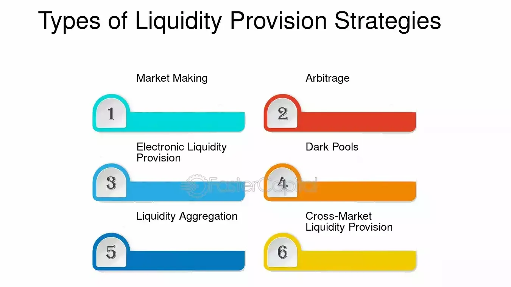

## Table of Contents

## What is liquidity in financial markets?

Liquidity in financial markets refers to how easily you can buy or sell an asset without affecting its price too much. Imagine you want to sell your car quickly. If there are lots of buyers interested in your car, you can sell it fast and at a good price. This means your car has high liquidity. But if there are few buyers, you might have to wait a long time or lower your price to sell it. This means your car has low liquidity. In financial markets, assets like stocks or bonds work the same way. High liquidity means there are many buyers and sellers, so trades can happen quickly and easily.

Liquidity is important because it affects how smoothly the market works. When markets are liquid, it's easier for people to get in and out of investments. This can make people feel more confident about investing because they know they can sell their assets when they need to. On the other hand, if a market is not liquid, it can be hard to sell assets quickly, which can make people nervous. This can lead to bigger price swings and more risk. So, liquidity is a key part of how stable and efficient financial markets are.

## Why is liquidity important for traders and investors?

Liquidity is really important for traders and investors because it makes it easier for them to buy and sell things quickly. When a market is liquid, there are lots of people buying and selling, so you can get in and out of your investments without waiting too long. This is great for traders who like to move their money around a lot, because they can do it fast without losing much money. If you're an investor who needs to sell something in a hurry, like if you need cash for an emergency, high liquidity means you can do that without having to lower your price too much.

On the other hand, if a market isn't very liquid, it can be hard to sell things quickly. This can be a big problem if you need money right away. Low [liquidity](/wiki/liquidity-risk-premium) can also make prices go up and down a lot, which can be risky. If you try to sell something when there aren't many buyers, you might have to sell it for a lot less than you wanted. So, traders and investors really care about liquidity because it helps them manage their money better and feel more confident in their investments.

## What are the basic strategies for providing liquidity?

One basic strategy for providing liquidity is [market making](/wiki/market-making). Market makers are people or companies that always offer to buy and sell a certain asset. They put up prices at which they are willing to buy (the bid) and sell (the ask). By doing this, they help create a market where other people can easily trade. Market makers make money from the difference between the bid and ask prices, which is called the spread. They take on the risk that the price might move against them, but they help keep the market liquid by always being ready to trade.

Another strategy is high-frequency trading ([HFT](/wiki/high-frequency-trading-strategies)). High-frequency traders use computers to buy and sell assets very quickly, often in fractions of a second. They use special software to look for small price differences and trade on them. By doing lots of trades, they add liquidity to the market. HFT can help make the market more efficient, but it can also lead to quick price changes. This strategy needs a lot of technology and can be risky, but it's a way to provide liquidity by being active in the market all the time.

## How does market making work as a liquidity provision strategy?

Market making is a way to help make buying and selling easier in a market. People or companies called market makers offer to buy and sell a certain thing, like a stock, all the time. They put up two prices: one price they will buy at, called the bid, and one price they will sell at, called the ask. The difference between these two prices is called the spread. Market makers make money from this spread. By always being ready to trade, they help make the market more liquid, which means other people can buy and sell more easily.

Market makers take on some risk because the price of what they are buying and selling can go up or down. If the price goes down after they buy something, they might lose money when they sell it. But if they do it right, they can make money from the spread and help keep the market working smoothly. This is important because when there are more market makers, it's easier for everyone to trade, and the market stays stable and efficient.

## What are the risks associated with providing liquidity?

Providing liquidity, like being a market maker or doing high-frequency trading, comes with some risks. One big risk is that prices can move against you. If you're a market maker and you buy something at the bid price, but then the market price goes down before you can sell it at the ask price, you might lose money. This is called market risk. It's hard to predict what prices will do, so there's always a chance that you could end up losing more than you expected.

Another risk is what's called operational risk. This has to do with the technology and systems you use to trade. If you're doing high-frequency trading, your computers and software need to work perfectly. If there's a glitch or if the internet goes down, you might not be able to trade when you need to. This can lead to big losses because you can't react quickly enough to changes in the market. Keeping everything running smoothly can be a big challenge and a risk you have to manage carefully.

Lastly, there's also regulatory risk. The rules about trading and providing liquidity can change. Governments and financial regulators might decide to put new rules in place that affect how you can trade. If you're not ready for these changes, it could make it harder for you to do your job or even cost you money. Staying on top of all the rules and being ready to adapt is important but can be tough.

## How can technology be used to enhance liquidity provision?

Technology can help make markets more liquid by making it easier and faster for people to buy and sell things. For example, high-frequency trading uses computers to do lots of trades very quickly. These computers can look at lots of information and make trades in just a few seconds. This means there are always people ready to buy and sell, which makes the market more liquid. Also, technology can help market makers do their job better. They can use special software to keep track of prices and make sure they are always offering good prices to buy and sell. This helps keep the market running smoothly and makes it easier for everyone to trade.

Another way technology helps is by making it easier for more people to join the market. With the internet, people from all over the world can trade without having to be in the same place. This means there are more buyers and sellers, which makes the market more liquid. Plus, technology can help with things like electronic trading platforms and apps that let people trade anytime, anywhere. All these things together make the market more active and easier to use, which is good for liquidity.

## What role do high-frequency trading strategies play in liquidity provision?

High-frequency trading (HFT) strategies help make markets more liquid by doing lots of trades very quickly. These traders use computers that can buy and sell things in just a few seconds. By always being ready to trade, they make sure there are always people willing to buy and sell, which makes it easier for everyone else to trade too. This is good for the market because it means prices don't move around as much, and people can get in and out of their investments more easily.

But HFT can also make the market a bit tricky. Because these traders move so fast, they can sometimes cause prices to change very quickly. This can be a problem if it makes the market feel unstable. Even though HFT adds a lot of liquidity, it's important for everyone to keep an eye on how it affects the market to make sure it stays fair and works well for all traders and investors.

## How do liquidity providers manage their inventory and risk?

Liquidity providers like market makers have to be careful about how much of an asset they keep in their inventory. They want to have enough of an asset to buy and sell it easily, but not so much that if the price goes down, they lose a lot of money. To manage this, they watch the market all the time and try to keep their inventory balanced. They might buy more of something if they think the price will go up, or sell some if they think it will go down. This way, they can keep making money from the difference between the buying and selling prices without taking too much risk.

To manage risk, liquidity providers use different strategies. One way is to use something called hedging. This means they buy or sell other things that will go up in value if the price of their inventory goes down. This can help them lose less money if things don't go as planned. They also use computer systems to watch the market and make quick decisions. By keeping an eye on everything and being ready to act fast, they can manage their risk better and keep the market running smoothly.

## What are the regulatory considerations for liquidity providers?

Liquidity providers have to follow rules set by governments and financial regulators. These rules are there to make sure that trading is fair and that the market works well for everyone. For example, regulators might set rules about how much money liquidity providers need to have, or how quickly they need to be able to buy and sell things. They might also have rules about how much they can charge for their services. These rules can change, so liquidity providers need to stay up to date and make sure they are always following them.

One big thing regulators worry about is making sure that liquidity providers don't do anything that could hurt the market. They want to stop things like market manipulation, where someone tries to change prices on purpose. Regulators also look at how much risk liquidity providers are taking and make sure it's not too much. This helps keep the market stable and safe for everyone. So, liquidity providers have to be careful and make sure they are always following the rules to avoid getting in trouble.

## How do different market structures affect liquidity provision strategies?

Different market structures can change how liquidity providers do their job. In a centralized market, like a stock exchange, there are lots of rules and everyone trades in one place. This can make it easier for liquidity providers to offer to buy and sell things because they know everyone is playing by the same rules. They can use their computers to watch the market and make trades quickly. But in a decentralized market, like some cryptocurrency markets, there are fewer rules and trading happens in lots of different places. This can make it harder for liquidity providers to keep track of everything and make sure they are always ready to trade.

In an electronic market, where trading happens over the internet, liquidity providers can use technology to do lots of trades very fast. This can make the market more liquid because there are always people ready to buy and sell. But in a traditional market, where people might trade over the phone or in person, it can be slower and harder to provide liquidity. Liquidity providers have to think about the kind of market they are working in and use different strategies to make sure they can keep the market liquid and make money at the same time.

## What advanced techniques can be used to optimize liquidity provision?

One advanced technique to optimize liquidity provision is using smart order routing. This means using computer programs to send trade orders to the place where they will get the best price. By doing this, liquidity providers can make sure they are always getting the best deal for their trades. This helps them make more money from the difference between the buying and selling prices. It also makes the market more liquid because it's easier for everyone to trade.

Another technique is using [machine learning](/wiki/machine-learning) to predict how the market will move. Liquidity providers can use computers to look at lots of data and figure out what might happen next. This helps them decide when to buy and sell things to make the most money and keep their inventory balanced. By using these predictions, they can be ready to trade at the right times and make the market more liquid.

Lastly, liquidity providers can use something called algorithmic trading to do lots of trades very quickly. These algorithms can watch the market all the time and make trades in just a few seconds. This helps keep the market liquid because there are always people ready to buy and sell. It also helps liquidity providers manage their risk better because they can react to changes in the market very fast.

## How do liquidity provision strategies evolve with changes in market conditions?

Liquidity provision strategies change as the market changes. If the market gets busier with more people buying and selling, liquidity providers might need to trade more often and use faster computers to keep up. They might also need to adjust the prices they offer to buy and sell things to make sure they are still making money. On the other hand, if the market gets quieter with fewer people trading, liquidity providers might need to be more careful about how much they buy and sell. They might need to hold onto their inventory longer and be ready to take more risk to keep the market liquid.

Technology also plays a big role in how liquidity provision strategies change. As new technology comes out, liquidity providers can use it to do their job better. For example, if there are new computer programs that can predict market moves more accurately, liquidity providers can use these to make smarter trades. They might also use new ways to connect with different markets around the world to find the best prices for their trades. By staying up to date with technology, liquidity providers can keep the market liquid even when conditions change.

## What is an Overview of Algorithmic Trading?

Algorithmic trading employs computer algorithms to automatically execute trades based on pre-defined criteria such as timing, price, and [volume](/wiki/volume-trading-strategy). This method has revolutionized the trading landscape, enabling market participants to execute large orders efficiently while mitigating the risks associated with market impact and price fluctuations.

Execution algorithms, namely Time-Weighted Average Price (TWAP) and Volume-Weighted Average Price (VWAP), are pivotal in optimizing order execution and enhancing liquidity. TWAP divides an order into smaller, equally spaced segments over a specified time period to minimize the impact on the market price. Mathematically, the TWAP formula can be expressed as:

$$
\text{TWAP} = \frac{\sum_{i=1}^{N} P_i}{N}
$$

where $P_i$ represents the price at each interval, and $N$ is the total number of intervals.

Conversely, VWAP focuses on ensuring that the execution price is close to the weighted average price of the security over the given time frame, factoring in volume. The formula for VWAP is:

$$
\text{VWAP} = \frac{\sum_{i=1}^{N} P_i \times V_i}{\sum_{i=1}^{N} V_i}
$$

where $V_i$ is the volume at each interval. VWAP is often preferred to TWAP in highly liquid markets where volume data is abundant, as it aligns the execution with prevailing market conditions.

Algorithmic trading significantly reduces market impact by automating the division and timing of large orders. This precision prevents abrupt price movements that typically occur with large manual trades. By distributing trades over time and aligning with market liquidity, these algorithms decrease the likelihood of slippage—a discrepancy between the expected price and the execution price—and help maintain stable market conditions.

The advancement in [algorithmic trading](/wiki/algorithmic-trading) technology has also contributed to improved market functioning. Algorithms can react swiftly to real-time data, adjusting execution strategies to accommodate changing market dynamics. This agility not only aids in liquidity provision but also tightens bid-ask spreads, reducing overall transaction costs.

In conclusion, algorithmic trading enhances the efficiency of trade executions through the strategic use of TWAP, VWAP, and other execution algorithms, ultimately supporting market stability and liquidity.

## What is Liquidity Mining?

Liquidity mining is a decentralized finance (DeFi) strategy rooted in enhancing liquidity on decentralized exchanges (DEXs). It involves users, known as liquidity providers, depositing cryptocurrencies into a liquidity pool. In return, participants receive incentives, typically in the form of tokens or a share of transaction fees.

The operational paradigm of liquidity mining is straightforward yet effective in augmenting market liquidity. Liquidity providers contribute their assets to a smart contract-based liquidity pool. This pool facilitates trades by ensuring there is sufficient asset availability for users wishing to exchange one [cryptocurrency](/wiki/cryptocurrency) for another on the DEX. In exchange for their contribution, liquidity providers earn incentives, commonly denominated in the governance tokens of the platform or a portion of the transaction fees generated by trades executed within the pool.

These incentives serve dual purposes: they compensate liquidity providers for the capital opportunity cost and potential impermanent loss while also encouraging more users to contribute liquidity. Impermanent loss represents the temporary loss of value that liquidity providers might incur when the price ratio of deposited tokens changes after a trade completes, a fundamental risk in liquidity mining.

The formula for calculating the impermanent loss can be expressed mathematically. Let $P_0$ and $P_1$ be the initial and new prices of an asset, respectively. The impermanent loss can be represented by:

$$
\text{Impermanent Loss (\%)} = \left(2 \sqrt{\frac{P_1}{P_0}} / \left(\frac{P_1}{P_0} + 1\right) - 1\right) \times 100
$$

Liquidity mining presents significant benefits, such as enhancing liquidity, reducing bid-ask spreads, and fostering a more robust and efficient trading ecosystem. However, it also carries potential risks. Aside from impermanent loss, these risks include smart contract vulnerabilities, market [volatility](/wiki/volatility-trading-strategies), and sudden regulatory shifts which might impact DeFi ecosystems.

Furthermore, tokens offered as rewards can be subject to high volatility. Their value may diminish over time, impacting the overall profitability of liquidity mining.

In summary, while liquidity mining offers opportunities for significant rewards through enhanced liquidity and incentives, participants must carefully evaluate the associated risks and maintain vigilance regarding market conditions and technological sophistication inherent in DeFi platforms.

## References & Further Reading

[1]: Aldridge, I. (2013). ["High-Frequency Trading: A Practical Guide to Algorithmic Strategies and Trading Systems."](https://www.amazon.com/High-Frequency-Trading-Practical-Algorithmic-Strategies/dp/1118343506) John Wiley & Sons.

[2]: Narang, R. (2013). ["Inside the Black Box: A Simple Guide to Quantitative and High Frequency Trading."](https://onlinelibrary.wiley.com/doi/book/10.1002/9781118662717) John Wiley & Sons.

[3]: Harris, L. (2003). ["Trading and Exchanges: Market Microstructure for Practitioners."](https://www.amazon.com/Trading-Exchanges-Market-Microstructure-Practitioners/dp/0195144708) Oxford University Press.

[4]: Lopez de Prado, M. (2018). ["Advances in Financial Machine Learning."](https://www.amazon.com/Advances-Financial-Machine-Learning-Marcos/dp/1119482089) John Wiley & Sons.

[5]: Menkveld, A. J. (2013). ["High Frequency Trading and the New Market Makers."](https://papers.ssrn.com/sol3/papers.cfm?abstract_id=1722924) Journal of Financial Markets. 

[6]: Chlistalla, M. (2011). ["High-Frequency Trading: Better than its Reputation?"](https://c.mql5.com/forextsd/forum/168/high-frequency_trading_-_better_than_its_reputation.pdf) Deutsche Bank Research. 

[7]: Vayanos, D., & Wang, J. (2012). ["Theories of Liquidity."](https://www.semanticscholar.org/paper/Theories-of-Liquidity-Vayanos-Wang/dd571fc86999f2def76af3994fd97380a21a9913) National Bureau of Economic Research. 

[8]: Easley, D., López de Prado, M. M., & O'Hara, M. (2012). ["The Volume Clock: Insights into the High-Frequency Paradigm."](https://papers.ssrn.com/sol3/papers.cfm?abstract_id=2034858) The Review of Financial Studies.