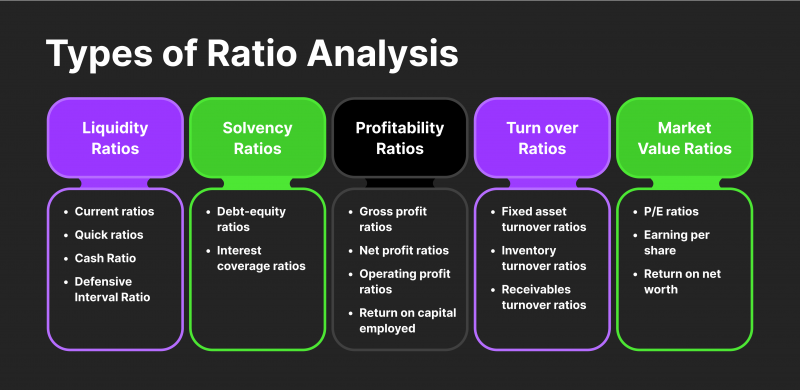

## Table of Contents

## What are liquidity ratios?

Liquidity ratios are financial measurements that show how easily a company can pay its short-term debts. They help to see if a company has enough liquid assets, like cash, to cover what it owes in the near future. One common liquidity ratio is the current ratio, which compares a company's current assets to its current liabilities. If the current ratio is more than 1, it means the company has more assets than liabilities, which is good.

Another important liquidity ratio is the quick ratio, also known as the acid-test ratio. This ratio is stricter because it only includes the most liquid assets, like cash and accounts receivable, and leaves out inventory. The quick ratio gives a better idea of a company's ability to pay its debts quickly, without relying on selling inventory. A quick ratio above 1 is generally seen as a sign of good financial health.

These ratios are important for investors and creditors because they show how financially stable a company is. If a company has low liquidity ratios, it might struggle to pay its bills, which could lead to financial trouble. On the other hand, high liquidity ratios suggest that a company is in a good position to handle its short-term obligations, making it a safer bet for investment or lending.

## Why are liquidity ratios important for businesses?

Liquidity ratios are important for businesses because they show how well a company can pay its short-term bills. These ratios help business owners and managers see if they have enough cash or assets that can be quickly turned into cash to cover what they owe. If a company has good liquidity ratios, it means they are in a strong position and less likely to run into money problems. This is important because it helps keep the business running smoothly and avoids the stress of not being able to pay bills on time.

Investors and lenders also look at liquidity ratios when deciding whether to invest in or loan money to a business. If a company's liquidity ratios are high, it tells investors and lenders that the business is financially healthy and can manage its debts well. This makes the company a safer choice for investment or loans. On the other hand, if the liquidity ratios are low, it might scare away investors and lenders because it suggests the business could struggle to pay back what it owes, increasing the risk for them.

## Can you name the most common types of liquidity ratios?

The most common types of liquidity ratios are the current ratio and the quick ratio. The current ratio is simple to understand. It compares a company's current assets, like cash and things that can be turned into cash quickly, to its current liabilities, which are the bills it needs to pay soon. If the current ratio is more than 1, it means the company has more assets than liabilities, which is good because it can pay its bills.

The quick ratio, also called the acid-test ratio, is a bit stricter. It only counts the most liquid assets, like cash and money owed by customers, but it doesn't include inventory. The quick ratio shows if a company can pay its short-term debts without selling its inventory. A quick ratio over 1 is usually a sign that the company is in good financial shape and can handle its debts well.

## How is the Current Ratio calculated and what does it indicate?

The Current Ratio is calculated by dividing a company's current assets by its current liabilities. Current assets are things like cash, money that customers owe the company (accounts receivable), and inventory. Current liabilities are the bills the company needs to pay soon, like money owed to suppliers or short-term loans. If you take all the current assets and divide them by all the current liabilities, you get the Current Ratio.

The Current Ratio tells you if a company can pay its short-term bills. If the ratio is more than 1, it means the company has more assets than liabilities, which is good. It shows that the company should be able to pay what it owes without problems. If the ratio is less than 1, it means the company might have trouble paying its bills because it doesn't have enough assets to cover its liabilities. So, a higher Current Ratio is usually better because it shows the company is in a stronger financial position.

## What is the Quick Ratio and how does it differ from the Current Ratio?

The Quick Ratio, also called the acid-test ratio, is a way to see how well a company can pay its short-term bills without selling its inventory. To find the Quick Ratio, you take the company's most liquid assets, like cash and money that customers owe the company, and divide them by the company's current liabilities, which are the bills it needs to pay soon. If the Quick Ratio is more than 1, it means the company has enough of these quick assets to pay its bills, which is a good sign.

The Quick Ratio is different from the Current Ratio because it's stricter. The Current Ratio includes all current assets, like cash, money owed by customers, and inventory, and then divides them by current liabilities. So, the Current Ratio gives a broader view of a company's ability to pay its bills. But the Quick Ratio leaves out inventory because selling inventory can take time, and the Quick Ratio wants to see if the company can pay its bills right away with its most liquid assets. This makes the Quick Ratio a better test of a company's immediate financial health.

## How do you calculate the Cash Ratio and what is its significance?

The Cash Ratio is a way to see if a company can pay its short-term bills using only its cash and cash equivalents, like money in the bank or investments that can be turned into cash very quickly. To calculate the Cash Ratio, you take the company's cash and cash equivalents and divide them by its current liabilities, which are the bills it needs to pay soon. If the Cash Ratio is more than 1, it means the company has enough cash on hand to pay all its short-term debts, which is a good sign.

The Cash Ratio is important because it shows the most conservative view of a company's ability to pay its bills. It's stricter than the Current Ratio and the Quick Ratio because it doesn't include any other assets like inventory or money owed by customers. A high Cash Ratio means the company is very liquid and can handle its debts easily, but it might also mean the company is not using its cash effectively to grow or invest. On the other hand, a low Cash Ratio might be a warning sign that the company could struggle to pay its bills if it doesn't have other assets to sell quickly.

## What is the Operating Cash Flow Ratio and how is it used?

The Operating Cash Flow Ratio tells you if a company can pay its short-term bills using the money it makes from its regular business activities. To find this ratio, you take the company's cash flow from operations and divide it by its current liabilities. Cash flow from operations is the money a company gets from selling its products or services, after paying for things like making the products or running the business. Current liabilities are the bills the company needs to pay soon. If the Operating Cash Flow Ratio is more than 1, it means the company is making enough money from its business to cover its short-term debts, which is good.

This ratio is useful because it shows how well a company can manage its debts using the money it earns, not just from selling assets or borrowing more money. It's a good sign if a company has a high Operating Cash Flow Ratio because it means the business is healthy and can handle its bills without struggling. But if the ratio is low, it might mean the company is having trouble making enough money to pay what it owes, which could be a warning sign for investors and creditors.

## How can liquidity ratios help in assessing a company's short-term financial health?

Liquidity ratios help people understand if a company can pay its short-term bills easily. These ratios look at the company's assets, like cash and things that can be turned into cash quickly, and compare them to the bills the company needs to pay soon. If the ratios are high, it means the company has enough money or assets to cover its debts, which is a good sign. This is important for business owners, investors, and lenders because it shows if the company is in a strong financial position and can keep running smoothly without money problems.

Different liquidity ratios give different views of a company's financial health. The Current Ratio looks at all current assets, including inventory, to see if the company can pay its bills. The Quick Ratio is stricter because it doesn't count inventory, showing if the company can pay its debts right away without selling things. The Cash Ratio is even stricter, only looking at cash and cash equivalents to see if the company can pay its bills with the money it has on hand. By using these ratios, people can get a clear picture of how well a company can handle its short-term financial needs.

## What are the limitations of using liquidity ratios for financial analysis?

Liquidity ratios can give a good idea of how well a company can pay its short-term bills, but they have some limits. One problem is that these ratios don't tell the whole story about a company's financial health. For example, a company might have a high Current Ratio because it has a lot of inventory, but if that inventory is hard to sell, the company might still struggle to pay its bills. Also, liquidity ratios don't show if a company is making money or losing money; they just show if it has enough assets to cover its debts.

Another limitation is that liquidity ratios can be affected by how a company manages its money. A company might look good on paper because it has a lot of cash, but if it's not using that cash to grow or invest, it might not be doing well in the long run. Plus, different industries have different standards for what is a good liquidity ratio. What might be a healthy ratio for one industry might not be enough for another. So, while liquidity ratios are helpful, they need to be used with other financial measures to get a full picture of a company's health.

## How do liquidity ratios vary across different industries?

Liquidity ratios can be different for different industries because each industry has its own way of working and needs. For example, a retail store might have a lot of inventory, which can make its Current Ratio look good. But if that inventory doesn't sell quickly, the store might still have trouble paying its bills. On the other hand, a tech company might not have much inventory but could have a lot of cash from selling software or services. This means their Quick Ratio and Cash Ratio might be higher, showing they can pay their bills easily without selling things.

Because of these differences, what is considered a good liquidity ratio can change from one industry to another. A manufacturing company might need a higher Current Ratio because it has to keep a lot of raw materials on hand. But a service company, like a consulting firm, might not need as high a ratio because it doesn't have a lot of inventory. So, when looking at liquidity ratios, it's important to compare a company to others in the same industry to really understand if its ratios are good or not.

## Can you explain how liquidity ratios are used in investment decisions?

Liquidity ratios help investors decide if a company is a good choice to invest in. These ratios show how easily a company can pay its short-term bills. If a company has high liquidity ratios, like a Current Ratio or Quick Ratio over 1, it means they have enough cash or assets to cover what they owe. This makes the company look safer to invest in because it's less likely to run into money problems. Investors want to see that a company can handle its debts well, so they use these ratios to check if the company is financially healthy.

But, investors don't just look at liquidity ratios alone. They use them along with other financial measures to get a full picture of a company's health. For example, a company might have good liquidity ratios but be losing money overall. Or, it might have low liquidity ratios but be in an industry where that's normal. So, investors compare a company's liquidity ratios to others in the same industry to see if they're good or not. This helps them make smarter choices about where to put their money.

## What advanced techniques can be used to analyze liquidity ratios for forecasting purposes?

Advanced techniques for analyzing liquidity ratios for forecasting purposes include using trend analysis and ratio analysis over time. Trend analysis means looking at how a company's liquidity ratios have changed over several years or quarters. By doing this, investors and analysts can see if the company's ability to pay its short-term bills is getting better or worse. For example, if the Current Ratio has been steadily increasing, it could mean the company is becoming more financially stable. This helps in making predictions about the company's future liquidity and overall financial health.

Another technique is to use financial models like cash flow forecasting. This involves creating models that predict how much cash a company will have coming in and going out in the future. By combining these forecasts with current liquidity ratios, analysts can get a better idea of how well a company will be able to meet its short-term obligations in the future. For instance, if the cash flow forecast shows that the company will have more cash coming in, it might suggest that the liquidity ratios will improve, making the company a safer investment. These advanced techniques help investors make more informed decisions by looking beyond just the current numbers to see what might happen next.

## What are Liquidity Ratios and How Can We Understand Them?

Liquidity ratios are crucial financial metrics used to evaluate a company's ability to meet its short-term obligations with its current assets. These ratios are integral in analyzing a company's financial health and provide key insights to investors, creditors, and financial analysts.

The primary liquidity ratios include the Current Ratio, Quick Ratio, and Cash Ratio. Each serves a distinct function in understanding a company's capacity to manage its short-term debts:

1. **Current Ratio:** This ratio measures a company's ability to cover its current liabilities with its current assets. It is calculated as:
$$
   \text{Current Ratio} = \frac{\text{Current Assets}}{\text{Current Liabilities}}

$$

   A higher current ratio suggests a stronger capability to pay off short-term liabilities, which is generally favorable in financial analysis. It indicates to investors and creditors that the company can fulfill its financial commitments without facing [liquidity](/wiki/liquidity-risk-premium) issues.

2. **Quick Ratio:** Also known as the acid-test ratio, the quick ratio provides a more stringent assessment of liquidity by excluding inventory from current assets. It is calculated as:
$$
   \text{Quick Ratio} = \frac{\text{Current Assets} - \text{Inventory}}{\text{Current Liabilities}}

$$

   This ratio is useful for evaluating companies operating in industries where inventory is not easily converted into cash. A higher quick ratio highlights a better position to manage short-term obligations without the need to sell inventory.

3. **Cash Ratio:** The cash ratio offers the most conservative approach to liquidity analysis by focusing solely on cash and cash equivalents relative to current liabilities. It is calculated as:
$$
   \text{Cash Ratio} = \frac{\text{Cash and Cash Equivalents}}{\text{Current Liabilities}}

$$

   This ratio is particularly important in situations where immediate liquidity is necessary, as it examines whether a company can pay off its short-term liabilities from its cash reserves alone.

Understanding these liquidity ratios is fundamental for assessing financial stability. A high liquidity ratio generally indicates that a company is in a strong position to meet its short-term debts, enhancing its attractiveness to investors and creditors. Conversely, low liquidity ratios may raise concerns about a company's ability to remain solvent in the short term. Such assessments guide informed decision-making in financial markets and are essential tools for maintaining organizational financial health.

## What are the types of liquidity ratios?

Liquidity ratios are fundamental metrics used to evaluate a company's capacity to settle its short-term obligations. They provide varying levels of detail in assessing a firm's liquidity position, with each ratio offering a unique perspective on financial health.

**Current Ratio**

The Current Ratio is an initial measure of a company's liquidity, which can be computed as:

$$
\text{Current Ratio} = \frac{\text{Current Assets}}{\text{Current Liabilities}}
$$

This ratio assesses the ability of a company to cover its short-term liabilities with its short-term assets. A higher Current Ratio indicates a more robust liquidity position, suggesting that the company is more capable of meeting its liabilities. Analysts often look for a Current Ratio above 1, which suggests that the company has more assets than liabilities.

**Quick Ratio**

The Quick Ratio, also known as the Acid-Test Ratio, refines the Current Ratio by excluding inventory, which might not be easily convertible to cash. It is defined as:

$$
\text{Quick Ratio} = \frac{\text{Current Assets} - \text{Inventory}}{\text{Current Liabilities}}
$$

This ratio provides a more stringent test of liquidity compared to the Current Ratio as it considers only those assets that can be quickly converted into cash. A Quick Ratio of greater than 1 is generally seen as a positive indication that the company can meet its short-term obligations without relying on the sale of inventory.

**Cash Ratio**

The Cash Ratio takes a conservative approach by focusing exclusively on cash and cash equivalents. It is calculated as:

$$
\text{Cash Ratio} = \frac{\text{Cash and Cash Equivalents}}{\text{Current Liabilities}}
$$

This ratio provides the most stringent measure of liquidity by indicating the extent to which a company can cover its short-term liabilities using only its most liquid assets. A high Cash Ratio may indicate a company is in a strong position to settle its immediate liabilities but could also suggest excessive liquidity, which might be seen as inefficient asset use.

Each ratio serves different analytical purposes. While the Current Ratio offers a broad view, the Quick Ratio sharpens the focus by excluding less liquid assets, and the Cash Ratio provides a look at the company's immediate liquidity. Together, these ratios help stakeholders evaluate the company's financial condition comprehensively.

## References & Further Reading

[1]: ["Financial Statement Analysis: A Practitioner's Guide"](https://www.amazon.com/Financial-Statement-Analysis-Practitioners-Guide/dp/0470635606) by Martin S. Fridson and Fernando Alvarez

[2]: ["Algorithmic Trading: Winning Strategies and Their Rationale"](https://www.wiley.com/en-us/Algorithmic+Trading%3A+Winning+Strategies+and+Their+Rationale-p-9781118460146) by Ernest P. Chan

[3]: ["Advances in Financial Machine Learning"](https://www.amazon.com/Advances-Financial-Machine-Learning-Marcos/dp/1119482089) by Marcos Lopez de Prado

[4]: "Liquidity Ratios and Corporate Earnings in the Film Industry" by R. B. Baliga and V. Srinivasan, Journal of Business Finance & Accounting, 1996.

[5]: ["Machine Learning for Algorithmic Trading"](https://github.com/stefan-jansen/machine-learning-for-trading) by Stefan Jansen

[6]: Harford, J. (1999). "Corporate Cash Reserves and Acquisitions," Journal of Finance, 54(6), 1969-1997.

[7]: "The Journal of Financial Economics," a widely recognized publication for research in the field of finance, often covers topics related to liquidity and financial analysis.