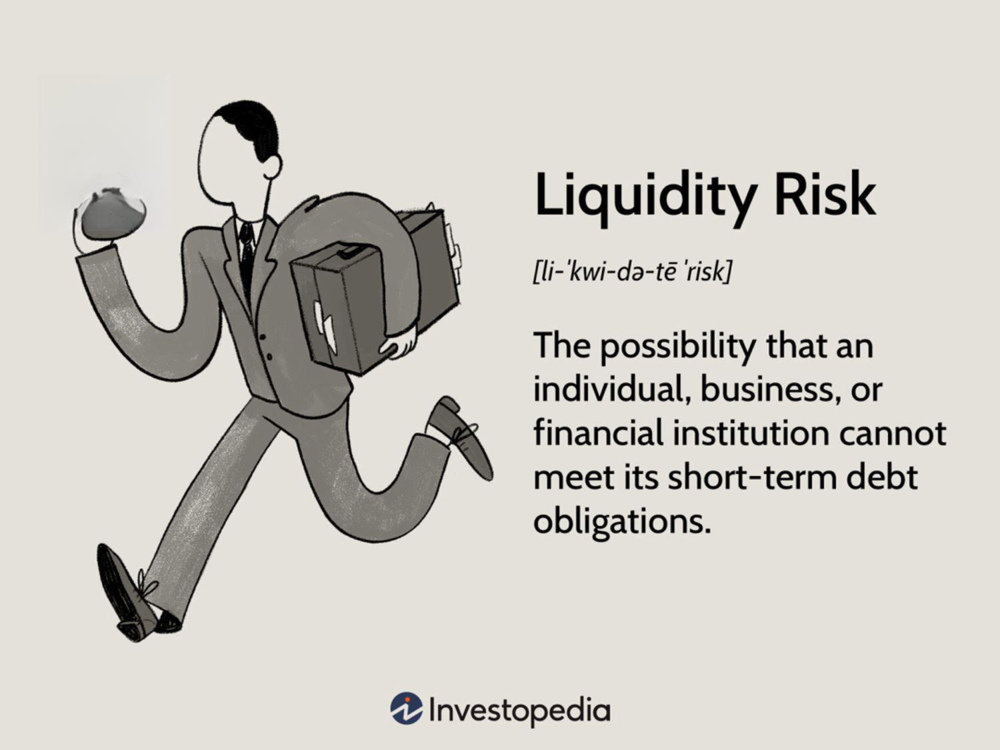

Banking liquidity risk and business risk are critical components of the financial ecosystem, demanding prudent management to prevent potential destabilization of financial institutions and businesses. Liquidity risk, in particular, refers to the inability of an institution to meet its financial obligations without incurring substantial losses, a situation that can lead to operational setbacks and diminished trust among stakeholders. In parallel, business risk encompasses factors that threaten an entity's financial or operational stability, affecting its performance and profitability. These risks are further compounded by the increasing adoption of algorithmic trading, which has introduced new dimensions to risk management and financial stability.

Algorithmic trading employs advanced computer algorithms to execute trades at high speeds and volumes, promoting market efficiency and liquidity. However, it also has the potential to exacerbate systemic risks, particularly during volatile market conditions, as algorithms can magnify rapid price fluctuations and liquidity shortages. This layered complexity of risks underscores the need for comprehensive risk management strategies.



This article explores the intersection of banking liquidity risk, business risk, and algorithmic trading. It analyzes their interconnections and the implications these relationships hold for financial markets. Understanding these interactions is essential for financial professionals, investors, and policymakers who aim to ensure financial stability and optimize risk management strategies. The evolving landscape necessitates a nuanced approach to managing these risks, leveraging regulatory frameworks, technological advancements, and strategic foresight to safeguard the health and integrity of financial systems.

## Table of Contents

## Understanding Liquidity Risk in Banking

Liquidity risk arises for a bank or a financial institution when it is unable to meet short-term obligations due to inadequate cash flow or challenges in liquidating assets quickly without incurring substantial losses. This type of risk fundamentally threatens the operational stability and financial integrity of banking institutions.

Banks encounter two primary forms of liquidity risk: market liquidity risk and funding liquidity risk. Market liquidity risk is encountered when transactions cannot be completed at prevailing market prices, effectively resulting in potential financial losses. This situation can lead to the bank holding assets that cannot be transacted at or near their estimated value, thus posing viability challenges. Funding liquidity risk, on the other hand, arises when a bank is unable to secure sufficient funds to meet its obligations. These obligations could range from daily transactions to securing deposits or financing short-term liabilities. The inability to mobilize adequate funding may force the bank to sell long-term or illiquid assets at unfavorable prices, further exacerbating potential financial instability.

To effectively manage liquidity risk, banks must adopt strategies that ensure they have ready access to liquid resources. This can be achieved through maintaining a robust portfolio of high-quality liquid assets (HQLA) that can be easily liquidated without a significant loss of value. Regulatory frameworks, such as Basel III, play a critical role in enforcing these liquidity standards. Basel III mandates that banks maintain a Liquidity Coverage Ratio (LCR), which ensures that they have an adequate stock of HQLA to survive a 30-day stress scenario. Mathematically, the LCR is expressed as:

$$
LCR = \frac{\text{High-Quality Liquid Assets}}{\text{Total Net Cash Outflows over a 30-day period}} \geq 100\%
$$

Further, stress testing and contingency planning are essential components of [liquidity](/wiki/liquidity-risk-premium) risk management. By simulating adverse financial conditions, banks can assess their vulnerabilities and prepare effective responses to potential liquidity shortfalls. Contingency strategies might include establishing credit lines or harnessing central bank facilities to provide a liquidity cushion during periods of financial stress.

Navigating these risks is pivotal for banks to maintain their operations and uphold their reputation within financial markets. Successfully managing liquidity ensures that banks can continue to honor their commitments, providing a stable financial environment for clients and stakeholders alike. This practice is not only integral to the health of individual institutions but also crucial for the broader financial system's stability.

## Business Risk and Its Implications

Business risk refers to the uncertainty and potential negative impact on a company's financial performance due to various factors. These factors encompass external and internal challenges that can affect the stability and profitability of an organization. Key contributors to business risk include market [volatility](/wiki/volatility-trading-strategies), competition, regulatory changes, and economic fluctuations.

Market volatility leads to unpredictable price movements and demand shifts, posing challenges for businesses in maintaining stable operational performance. Companies exposed to significant market fluctuations may experience erratic revenues, impacting their financial stability. This volatility can be exacerbated by global economic events, trade policies, or geopolitical tensions.

Competition is a constant [factor](/wiki/factor-investing) affecting businesses. The influx of new players, technological advancements, and changing consumer preferences require companies to innovate continuously and adapt their strategies. Failure to remain competitive can lead to market share losses and diminished profitability.

Regulatory changes are another vital component. Companies must navigate varying compliance and legal requirements across different jurisdictions. Changes in regulations can introduce additional costs, necessitate operational adjustments, or even restrict market activities. Maintaining compliance is essential to avoid legal penalties and reputational damage.

Economic fluctuations also significantly impact business risk. Economic cycles, including recessions and expansions, affect consumer behavior, spending patterns, and investment levels. Companies need to manage these fluctuations by strategically adjusting their operations and financial practices to safeguard against downturns.

Unlike banks, which operate within stringent regulatory frameworks, corporations generally exist in less regulated environments. Consequently, they must develop tailored approaches to effectively manage liquidity and operational risks. Key strategies to mitigate business risk include diversifying funding sources, maintaining cash reserves, and implementing robust cash flow management practices.

Diversifying funding sources allows companies to reduce dependency on a single capital stream, thus mitigating the risk associated with financing. This diversification can include equity, debt instruments, and alternative financing options, providing flexibility and stability.

Maintaining cash reserves is a prudent approach to ensuring liquidity. Adequate reserves enable companies to meet short-term obligations and unexpected expenses, thus reducing vulnerability during periods of cash flow stress.

Robust cash flow management practices involve accurate forecasting and monitoring of cash inflows and outflows. Efficient management helps enhance liquidity, ensuring that companies can sustain operations and seize growth opportunities without undue financial strain.

Overall, companies must proactively identify, assess, and manage business risks through strategic planning and informed decision-making. This approach not only safeguards financial health but also enhances operational resilience in an ever-evolving business landscape.

## Algorithmic Trading and Systemic Risks

Algorithmic trading employs sophisticated computer algorithms to execute trades at high velocity and in large volumes, an innovation that significantly enhances market efficiency and liquidity. By processing vast amounts of data quickly, [algorithmic trading](/wiki/algorithmic-trading) can minimize trading costs and improve price discovery. However, this high-speed trading mechanism also brings substantial systemic risks, particularly during volatile market conditions. The rapid, automated reactions of trading algorithms can lead to drastic price adjustments and liquidity shortages, as algorithms can simultaneously act on market signals, amplifying volatility.

A prominent example of the systemic risks posed by high-frequency trading ([HFT](/wiki/high-frequency-trading-strategies)) is the 'Flash Crash' of May 6, 2010. During this event, major U.S. stock indices, including the Dow Jones Industrial Average, suffered a drastic decline within minutes, temporarily loosing about $1 trillion in market value. Investigations revealed that a large sell order executed by an algorithm in combination with traditional traders led to a feedback loop, exacerbated by HFT strategies that withdrew liquidity, causing a cascade of rapid trading actions and price volatility.

In response to such risks, regulatory authorities globally have developed and imposed several controls and mechanisms to safeguard market integrity and stability. Circuit breakers, for instance, are rules that temporarily halt trading on an exchange to curb panic-selling; these were adopted by major exchanges following the Flash Crash to prevent market irregularities. Additionally, 'kill switches' have been introduced as a mandatory failsafe mechanism to shut down a trading firm’s operations in case their algorithms go rogue, further ensuring stability.

These safeguards aim to mitigate the systemic risks of algorithmic trading by providing regulatory oversight and stability to financial markets, preserving both investor confidence and the proper functioning of financial systems. Nonetheless, the evolution of technology in trading continues to necessitate adaptations of these regulations to keep pace with new strategies and potential vulnerabilities.

## Interplay Between Liquidity Risk and Algo Trading

The dynamic interaction between liquidity risk and algorithmic trading involves a complex set of factors. Algorithmic trading has the potential to improve market liquidity by facilitating faster transactions and reducing bid-ask spreads. These algorithms can assess market conditions and execute trades with precision, theoretically enhancing the overall efficiency of financial markets.

However, during periods of market stress, the same algorithms may contribute to volatility. The core issue is that algorithms are designed to react instantaneously to market signals, which can lead to rapid, large-scale trading activities. This reaction may result in significant price swings and liquidity crunches, exacerbating liquidity risk. For instance, when a large number of trading algorithms attempt to sell off assets simultaneously, it can create a feedback loop where the declining asset prices trigger additional sell-offs, further straining liquidity.

Financial institutions must recognize this potential duality of algorithmic trading. While it can provide liquidity under normal circumstances, it can also undermine market stability during stress periods. Institutions need to integrate sophisticated risk management tools that can monitor market conditions and anticipate scenarios where algorithmic trading might pose risks to liquidity. One approach is employing real-time analytics and [artificial intelligence](/wiki/ai-artificial-intelligence) to predict market movements and adjust trading strategies dynamically.

Moreover, the convergence of liquidity risk and algorithmic trading necessitates a comprehensive framework to ensure market stability. This framework should encompass both traditional risk management techniques and innovative technological solutions to monitor algorithmic activities and their impacts on liquidity. Regulatory guidance and technological advancements should work hand-in-hand to establish thresholds and automated controls, such as circuit breakers, that pause trading activities when extreme volatility is detected.

Ultimately, addressing the interplay between liquidity risk and algorithmic trading requires an adaptable and multi-faceted strategy. Staying ahead of technology trends and incorporating predictive analytics and robust risk management practices can help financial institutions safeguard against potential disruptions and maintain stable, liquid markets.

## Strategies for Managing Risks in Algo Trading

### Strategies for Managing Risks in Algo Trading

The effective management of risks in algorithmic trading is crucial for maintaining market stability and institutional integrity. Algorithmic trading, with its rapid execution and high-[volume](/wiki/volume-trading-strategy) transactions, requires robust frameworks to mitigate potential risks. Key strategies encompass pre and post-trade surveillance, stress testing, disaster recovery plans, and regulatory compliance.

#### Pre and Post-Trade Surveillance

Rigorous surveillance systems are essential to monitor trading activities and ensure compliance with market regulations. Pre-trade checks involve assessing trading algorithms for potential market impact and adherence to risk limits. Post-trade analysis focuses on reviewing executed trades to identify any anomalies or market manipulation attempts. These surveillance mechanisms help in early detection and rectification of issues, fostering a secure trading environment.

#### Stress Testing

Stress testing serves as a preventive measure to evaluate a trading algorithm's performance under extreme market conditions. By simulating various market scenarios, traders can identify vulnerabilities within their algorithms. Python, with its robust data handling capabilities, is often employed for developing stress testing models. A simple example of simulating a stressed market condition is given below:

```python
import numpy as np

# Simulate market prices under stress
np.random.seed(0)
initial_price = 100
stress_factor = np.random.uniform(0.8, 1.2, 100)  # Simulating price fluctuation
stressed_prices = initial_price * np.cumprod(stress_factor)

# Evaluate algorithm's performance on this stressed data
# Algorithm logic goes here
```

By employing such tests, traders can optimize their algorithms, reducing the likelihood of adverse outcomes during market turbulence.

#### Disaster Recovery Plans

Having robust disaster recovery and business continuity plans ensures that trading operations can resume quickly in the event of technical disruptions. This involves regular backups of trading systems, clear communication protocols, and redundancy setups for critical infrastructure components.

#### Regulatory Compliance

Compliance with regulatory frameworks is fundamental in algorithmic trading. In the United States, the Securities and Exchange Commission's (SEC) Market Access Rule [17 CFR Parts 240 and 242] mandates that broker-dealers implementing automated trading systems must maintain adequate risk management controls. Likewise, the Commodity Futures Trading Commission's (CFTC) Regulation Automated Trading (Reg AT) outlines requirements for registration, risk controls, and transparency in algorithmic trading systems.

These regulations serve as a guideline for developing robust systems that can withstand and mitigate systemic risks. Adherence to these regulations not only ensures compliance but also enhances the overall reliability of the trading processes. 

In conclusion, a comprehensive approach incorporating surveillance, testing, recovery planning, and regulatory adherence is imperative for effective risk management in algorithmic trading. These strategies help minimize the potential for errant trades and ensure market integrity.

## Conclusion

Banking liquidity risk, business risk, and algorithmic trading are critically intertwined, affecting the stability and functionality of the financial infrastructure. Effective management of these risks is crucial for financial institutions to preserve their financial health and maintain market integrity. The interconnectedness of these elements necessitates a holistic approach to risk management, where each component is not considered in isolation but as part of a complex financial ecosystem.

Technological advancements, particularly the proliferation of algorithmic trading, underscore the need for adaptive risk management strategies. Algorithmic trading, while promoting efficiency and liquidity under normal conditions, introduces potential vulnerabilities during periods of market stress. This underscores the importance of incorporating sophisticated technological solutions and robust regulatory frameworks to counteract these risks. Institutions must adopt a proactive stance, integrating advanced analytics and real-time monitoring systems to anticipate and mitigate potential disruptions before they materialize.

Moreover, the regulatory landscape continues to evolve, reflecting the growing complexity of these interrelated risks. Compliance with frameworks such as Basel III and regulations like the SEC's Market Access Rule is imperative. These regulations not only provide guidance but also enforce discipline in risk management practices, thereby enhancing financial stability.

In conclusion, the synergy between banking liquidity risk, business risk, and algorithmic trading requires continuous attention and innovation in risk management strategies. As financial markets evolve, so too must the methodologies employed to protect them, ensuring resilience against potential systemic shocks.

## References & Further Reading

[1]: Basel Committee on Banking Supervision. (2011). ["Basel III: A global regulatory framework for more resilient banks and banking systems."](https://www.bis.org/publ/bcbs189.htm) Bank for International Settlements.

[2]: Kirilenko, A. A., Kyle, A. S., Samadi, M., & Tuzun, T. (2017). ["The Flash Crash: High-Frequency Trading in an Electronic Market."](https://onlinelibrary.wiley.com/doi/abs/10.1111/jofi.12498) Journal of Finance, 858(3), 1619-1645.

[3]: Aldasoro, I., Fender, I., & Ehlers, E. (2018). ["The changing shape of interest rate risk: Some measurement applications."](https://papers.ssrn.com/sol3/papers.cfm?abstract_id=3288084) Bank for International Settlements Quarterly Review.

[4]: Chaboud, A. P., Chiquoine, B., Hjalmarsson, E., & Vega, C. (2014). ["Rise of the Machines: Algorithmic Trading in the Foreign Exchange Market."](https://papers.ssrn.com/sol3/papers.cfm?abstract_id=1501135) Journal of Finance, 69(5), 2045-2084.

[5]: Jarrow, R. A., & Protter, P. (2012). ["A Unified Theory of Market Impact."](https://onlinelibrary.wiley.com/doi/full/10.1111/j.1467-9965.2011.00497.x) Review of Financial Studies, 25(3), 667-714.