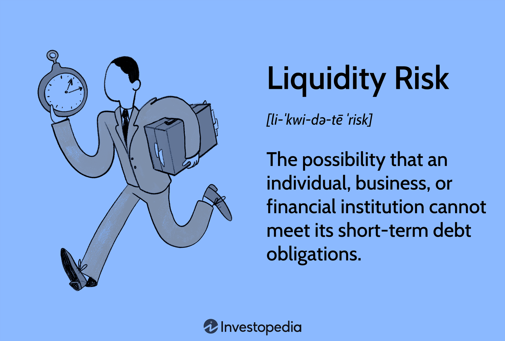

## Table of Contents

## What is liquidity risk?

Liquidity risk is the risk that a person or a company might not be able to quickly turn their assets into cash without losing value. Imagine you need money fast, but your money is tied up in things like a house or stocks. If you try to sell these quickly, you might have to sell them for less than they're worth. This is a problem because you might need that money for important things like paying bills or keeping your business running.

This risk can affect banks and financial institutions too. Banks take in money from customers and lend it out. If too many people want their money back at the same time, the bank might not have enough cash on hand. This can lead to a bank run, where everyone tries to get their money out, causing big problems. To manage this risk, banks and companies keep some cash ready and plan carefully to make sure they can meet their needs.

## How does liquidity risk affect banks?

Liquidity risk can cause big problems for banks. Banks take in money from people and businesses and then lend it out to others. If everyone who put money in the bank wants it back at the same time, the bank might not have enough cash to give back to everyone. This is because a lot of the money they have is tied up in loans or investments that can't be turned into cash quickly. If people start to worry and try to take their money out, it can lead to a bank run, which is very bad for the bank and can even cause it to fail.

To avoid these problems, banks have to be careful and plan ahead. They keep some cash on hand, called reserves, to make sure they can give money back to people when they need it. Banks also have rules they need to follow set by the government to make sure they don't take too many risks with people's money. By managing liquidity risk well, banks can keep running smoothly and keep people's trust.

## What are the common sources of liquidity risk in business?

Liquidity risk in a business can come from many places. One big source is when a business has a lot of its money tied up in things that can't be turned into cash quickly, like buildings, machines, or inventory. If the business suddenly needs cash, it might have to sell these things at a lower price than they're worth, which can hurt the business. Another source is when customers don't pay their bills on time. If a business is counting on that money to come in but it doesn't, the business might not have enough cash to keep running smoothly.

Another common source of liquidity risk is when a business relies too much on short-term loans to keep going. These loans need to be paid back quickly, and if the business can't get more loans or sell enough products to pay them back, it can run into big trouble. Also, if the business is in an industry where things can change quickly, like technology or fashion, it might find it hard to predict how much cash it will need. This uncertainty can make it harder to manage liquidity and keep the business stable.

## What are the differences between funding liquidity risk and market liquidity risk?

Funding liquidity risk is when a business or a bank can't get the money it needs to keep going. Imagine a company needs cash to pay its bills, but it can't borrow money or sell its assets quickly enough. This can happen if lenders don't want to give loans anymore or if the company's credit rating goes down. It's like trying to borrow money from a friend, but they say no because they don't trust you'll pay them back. This type of risk can cause big problems because the business might not be able to keep running if it can't find the cash it needs.

Market liquidity risk is different. It's about how easy it is to buy or sell something without changing its price too much. Think of it like trying to sell your car. If there are a lot of people wanting to buy cars like yours, you can sell it quickly and get a good price. But if no one wants to buy cars like yours, you might have to wait a long time or sell it for less money. This risk affects things like stocks and bonds too. If everyone tries to sell the same thing at the same time, the price can drop a lot, which can be bad for people who need to sell their investments quickly.

## How can businesses measure their liquidity risk?

Businesses can measure their liquidity risk by looking at different numbers that show how much cash they have and how quickly they can get more if they need it. One way is to check their cash flow, which is the money coming in and going out. If a business has more money coming in than going out, it's in a good spot. They can also use ratios like the current ratio, which compares their current assets (things they can turn into cash in a year) to their current liabilities (money they need to pay in a year). A higher ratio means they're in a better position to pay their bills.

Another way to measure liquidity risk is by looking at their quick ratio, which is like the current ratio but only counts the most liquid assets, like cash and money they can get quickly from short-term investments. This gives a clearer picture of how fast a business can get cash if it really needs to. Businesses also need to think about how long it takes to turn their inventory into cash and how long customers take to pay their bills. By keeping an eye on these things, a business can understand its liquidity risk and plan better to avoid running into money problems.

## What are the regulatory requirements for liquidity risk management in banks?

Banks have to follow rules set by the government to manage their liquidity risk. One important rule is the Liquidity Coverage Ratio (LCR). This rule says that banks need to keep enough high-quality liquid assets, like cash and government bonds, to survive a 30-day stress period where people are trying to take their money out. This helps make sure banks can handle a sudden rush of people wanting their money back.

Another rule is the Net Stable Funding Ratio (NSFR). This rule makes sure that banks have enough stable funding, like long-term loans and deposits, to support their activities over a longer time, like a year. It helps stop banks from relying too much on short-term loans that might not be there when they need them. By following these rules, banks can better manage their liquidity risk and keep the financial system safe.

## What strategies can banks use to mitigate liquidity risk?

Banks can use different strategies to lower their liquidity risk. One way is by keeping a good amount of cash and easy-to-sell assets, like government bonds, on hand. This helps them quickly give money back to people who want it. Banks also plan carefully by predicting how much money they will need and making sure they have enough coming in. They might also set up lines of credit with other banks, so they can borrow money if they need it fast.

Another strategy is to spread out where they get their money from. Instead of relying on just a few big sources, banks try to get money from many different places. This way, if one source dries up, they still have others to fall back on. Banks also keep an eye on how long their loans last compared to how long people leave their money in the bank. By making sure they have more long-term money coming in than short-term money going out, banks can better manage their liquidity risk and keep things running smoothly.

## How does liquidity risk impact a company's financial stability?

Liquidity risk can shake up a company's financial stability a lot. If a company doesn't have enough cash or can't turn its assets into cash quickly, it might struggle to pay its bills on time. This can lead to big problems like not being able to buy the things needed to keep the business going or missing payments to suppliers and lenders. If this happens, the company might lose trust from others, making it even harder to get the money it needs in the future. This can push the company into a tough spot where it's always trying to catch up, which isn't good for its overall financial health.

To avoid these issues, a company needs to keep a close watch on its cash flow and make sure it always has enough money to cover its needs. By having a good plan and keeping some cash on hand, a company can be ready for unexpected situations where it needs money fast. If a company can manage its liquidity well, it can keep running smoothly and stay financially stable, even when things get tough. This way, it can keep the trust of its customers, suppliers, and lenders, and keep its business strong.

## Can you explain the role of liquidity coverage ratio (LCR) in managing liquidity risk?

The Liquidity Coverage Ratio (LCR) is a rule that helps banks manage their liquidity risk. It says that banks need to keep enough high-quality liquid assets, like cash and government bonds, to survive a 30-day period where a lot of people are trying to take their money out. This rule is important because it makes sure banks can handle a sudden rush of people wanting their money back, which can happen during tough times. By having these assets ready, banks can give money back to people without running into big problems.

The LCR helps keep the financial system safe by making sure banks are always ready for a crisis. If banks follow this rule, they can avoid situations where they don't have enough cash to meet their needs. This not only protects the bank but also keeps people's trust in the banking system. By having a good LCR, banks can show that they are prepared and can handle unexpected situations, which is key to staying financially stable.

## What are the best practices for liquidity risk management in non-financial corporations?

Non-financial corporations can manage their liquidity risk well by keeping a close eye on their cash flow. This means they need to know how much money is coming in and going out at all times. By planning ahead and making sure they always have enough cash to cover their bills, they can avoid running into money problems. It's also smart for these companies to keep some cash on hand as a safety net. This way, if something unexpected happens and they need money fast, they can use this cash to keep things running smoothly.

Another good practice is for non-financial corporations to spread out where they get their money from. Instead of relying on just a few big sources, they should try to get money from many different places. This helps them avoid big trouble if one source dries up. They should also think about how quickly they can turn their assets into cash if they need to. By selling things like inventory or equipment at a good price, they can get the money they need without losing too much value. By following these practices, non-financial corporations can keep their liquidity risk low and stay financially stable.

## How do central banks influence liquidity risk through monetary policy?

Central banks can affect liquidity risk by using their monetary policy. They do this by changing the interest rates. When central banks lower interest rates, it becomes cheaper for banks and businesses to borrow money. This means they can get more cash easily, which helps lower their liquidity risk. On the other hand, if central banks raise interest rates, borrowing money becomes more expensive. This can make it harder for banks and businesses to get the cash they need, increasing their liquidity risk.

Central banks also use other tools like open market operations. This means they buy or sell government bonds to control how much money is in the economy. When they buy bonds, they put more money into the system, making it easier for everyone to have cash. When they sell bonds, they take money out of the system, which can make it harder for banks and businesses to find the cash they need. By carefully using these tools, central banks can help manage liquidity risk and keep the financial system stable.

## What advanced models are used to predict and manage liquidity risk in complex financial environments?

In complex financial environments, advanced models like the Cash Flow at Risk (CFaR) model are used to predict and manage liquidity risk. CFaR looks at how much a company's cash flow might change over time. It uses past data and different scenarios to guess how much cash a company might have in the future. This helps companies plan better and make sure they have enough money to cover their needs, even if things don't go as planned.

Another model is the Liquidity Adjusted Value at Risk (L-VaR), which takes into account how easy or hard it is to sell assets quickly. L-VaR helps banks and businesses understand the risk of not being able to turn their assets into cash without losing value. By using L-VaR, they can see how their liquidity risk might affect their overall financial risk and take steps to manage it better. These models help companies stay ready for tough times and keep their financial stability strong.

## What is Understanding Liquidity Risk in Banking?

Liquidity risk arises for a bank or a financial institution when it is unable to meet short-term obligations due to inadequate cash flow or challenges in liquidating assets quickly without incurring substantial losses. This type of risk fundamentally threatens the operational stability and financial integrity of banking institutions.

Banks encounter two primary forms of liquidity risk: market liquidity risk and funding liquidity risk. Market liquidity risk is encountered when transactions cannot be completed at prevailing market prices, effectively resulting in potential financial losses. This situation can lead to the bank holding assets that cannot be transacted at or near their estimated value, thus posing viability challenges. Funding liquidity risk, on the other hand, arises when a bank is unable to secure sufficient funds to meet its obligations. These obligations could range from daily transactions to securing deposits or financing short-term liabilities. The inability to mobilize adequate funding may force the bank to sell long-term or illiquid assets at unfavorable prices, further exacerbating potential financial instability.

To effectively manage liquidity risk, banks must adopt strategies that ensure they have ready access to liquid resources. This can be achieved through maintaining a robust portfolio of high-quality liquid assets (HQLA) that can be easily liquidated without a significant loss of value. Regulatory frameworks, such as Basel III, play a critical role in enforcing these liquidity standards. Basel III mandates that banks maintain a Liquidity Coverage Ratio (LCR), which ensures that they have an adequate stock of HQLA to survive a 30-day stress scenario. Mathematically, the LCR is expressed as:

$$
LCR = \frac{\text{High-Quality Liquid Assets}}{\text{Total Net Cash Outflows over a 30-day period}} \geq 100\%
$$

Further, stress testing and contingency planning are essential components of [liquidity](/wiki/liquidity-risk-premium) risk management. By simulating adverse financial conditions, banks can assess their vulnerabilities and prepare effective responses to potential liquidity shortfalls. Contingency strategies might include establishing credit lines or harnessing central bank facilities to provide a liquidity cushion during periods of financial stress.

Navigating these risks is pivotal for banks to maintain their operations and uphold their reputation within financial markets. Successfully managing liquidity ensures that banks can continue to honor their commitments, providing a stable financial environment for clients and stakeholders alike. This practice is not only integral to the health of individual institutions but also crucial for the broader financial system's stability.

## References & Further Reading

[1]: Basel Committee on Banking Supervision. (2011). ["Basel III: A global regulatory framework for more resilient banks and banking systems."](https://www.bis.org/publ/bcbs189.htm) Bank for International Settlements.

[2]: Kirilenko, A. A., Kyle, A. S., Samadi, M., & Tuzun, T. (2017). ["The Flash Crash: High-Frequency Trading in an Electronic Market."](https://onlinelibrary.wiley.com/doi/abs/10.1111/jofi.12498) Journal of Finance, 858(3), 1619-1645.

[3]: Aldasoro, I., Fender, I., & Ehlers, E. (2018). ["The changing shape of interest rate risk: Some measurement applications."](https://papers.ssrn.com/sol3/papers.cfm?abstract_id=3288084) Bank for International Settlements Quarterly Review.

[4]: Chaboud, A. P., Chiquoine, B., Hjalmarsson, E., & Vega, C. (2014). ["Rise of the Machines: Algorithmic Trading in the Foreign Exchange Market."](https://papers.ssrn.com/sol3/papers.cfm?abstract_id=1501135) Journal of Finance, 69(5), 2045-2084.

[5]: Jarrow, R. A., & Protter, P. (2012). ["A Unified Theory of Market Impact."](https://onlinelibrary.wiley.com/doi/full/10.1111/j.1467-9965.2011.00497.x) Review of Financial Studies, 25(3), 667-714.