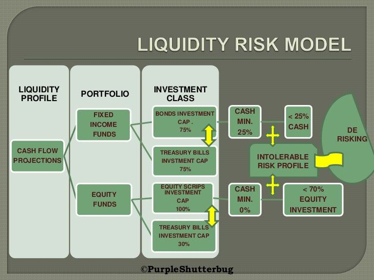

Liquidity risk modeling plays a vital role in algorithmic trading, as it helps in comprehending and managing the challenges posed by market liquidity. By quantifying the difficulty of executing trades without significantly impacting asset prices, this approach aids traders in maintaining profitability and minimizing transaction costs. This article examines the significance of liquidity risk modeling in algorithmic trading, focusing on its essential methodologies and the role of machine learning algorithms in modern financial systems.

The influence of liquidity risk extends to various aspects of trading, including the formulation of trading strategies, asset pricing, and overall market stability. For instance, during periods of low liquidity, even small trades can lead to substantial price movements, affecting asset valuation and potentially destabilizing the market. Understanding these dynamics enables traders to optimize their execution strategies, reducing slippage and improving market efficiency.



The integration of modern financial algorithms is crucial for practical liquidity risk management. These advanced tools can decipher complex market conditions and aid in developing adaptive trading strategies. With the advent of machine learning, risk models have become more sophisticated, allowing for real-time analysis and prediction of market behaviors. Machine learning algorithms, by processing large datasets, can detect subtle patterns and provide insights that were previously unattainable, thereby enhancing decision-making processes.

Through a thorough exploration of liquidity dynamics and the use of advanced modeling techniques, readers will gain a comprehensive understanding of how these tools are applied in trading portfolios. By recognizing the importance of liquidity risk modeling in algorithmic trading, stakeholders can better prepare for market uncertainties and ensure more resilient, profitable trading practices.

## Table of Contents

## Understanding Liquidity Risk in Algo Trading

Liquidity risk in algorithmic trading pertains to the challenges associated with executing trades without causing substantial impacts on the asset's price. This risk is a crucial consideration as it not only affects the execution quality but can also significantly influence the profitability of trading strategies. In environments characterized by high-frequency trading (HFT) and other algorithm-driven activities, liquidity risk emerges prominently, leading to potential slippage and increased transaction costs. Slippage occurs when there is a difference between the expected price of a trade and the actual price at which the trade is executed, often resulting from insufficient market liquidity to absorb large orders without price movement.

Various factors contribute to liquidity risk, with market conditions playing a pivotal role. For instance, during periods of market volatility or economic uncertainty, liquidity can quickly dry up, making it challenging to enter or [exit](/wiki/exit-strategy) positions without affecting prices. Similarly, trading volumes are indicative of liquidity; low trading volumes typically suggest less liquidity, leading to higher risks of slippage. Investor behavior, such as sudden shifts in market sentiment or the concentrated actions of large institutional players, can also exacerbate liquidity constraints.

Assessing [liquidity](/wiki/liquidity-risk-premium) risk is an indispensable part of developing robust trading strategies and ensuring precise asset valuation. Modelling techniques, such as the Liquidity-Adjusted Value-at-Risk (L-VaR), are employed to quantify potential losses resulting from liquidity shortfalls. This assessment allows traders to account for liquidity premiums in asset pricing models and devise strategies that mitigate risks, such as limiting order sizes or utilizing algorithmic strategies that dynamically adjust to real-time liquidity conditions.

Understanding and managing liquidity risks are vital to optimizing trading execution. By accurately estimating transaction costs and potential slippage, traders can better manage order placements and timing, ultimately minimizing adverse financial impacts. This requires continuous monitoring of liquidity indicators and market signals to dynamically adjust trading models and strategies in real-time, ensuring that [algorithmic trading](/wiki/algorithmic-trading) operations remain efficient and profitable, even amidst varying liquidity conditions.

## Liquidity Risk Modeling Techniques

Liquidity risk modeling in algorithmic trading encompasses a variety of methodologies designed to understand and mitigate the risks brought about by market liquidity constraints. One of the primary techniques employed is the Liquidity-Adjusted Value-at-Risk (L-VaR) model. The L-VaR model adapts the traditional Value-at-Risk framework to account for potential liquidity issues, offering a more comprehensive assessment of risk by integrating the costs and impacts associated with executing trades in less liquid markets.

The integration of [machine learning](/wiki/machine-learning) algorithms in L-VaR and other models is transformative, as these technologies can analyze vast datasets to assess market liquidity and predict potential risks with improved accuracy. Machine learning approaches, including decision trees, support vector machines, and ensemble methods, can identify patterns and correlations within market data that are indicative of liquidity dynamics. This capability allows for a more dynamic adjustment of risk models in response to changing market conditions.

Among the tools frequently utilized in liquidity risk quantification is Amihud's illiquidity measure, which calculates the daily price impact of trading volumes and serves as a reliable proxy for market liquidity. This measure, combined with real-time data analytics, enables traders to monitor liquidity conditions continuously and adjust strategies accordingly.

The adoption of nonlinear dynamic asset allocation models further enhances decision-making capabilities under adverse market scenarios. These models accommodate complex market dynamics by allowing for the rebalancing of assets in response to evolving market conditions, thus optimizing the risk-return profile of portfolios. Mathematical formulations, such as stochastic differential equations, often underpin these models, providing a robust framework for simulating and predicting market movements.

Real-world applications demonstrate the effectiveness of these techniques. For instance, by employing sophisticated liquidity risk models, financial institutions can better manage exposure in volatile markets, minimizing the adverse effects of trades on asset prices. Such models have been successfully implemented in both commodity and securities trading, offering clear evidence of their practical utility. Additionally, case studies reveal how these methodologies enable traders to identify and respond to liquidity constraints preemptively, thus avoiding potential losses.

To illustrate, consider a Python implementation that utilizes Amihud's illiquidity measure in conjunction with machine learning:

```python
import numpy as np
import pandas as pd
from sklearn.ensemble import RandomForestRegressor

# Define function to compute Amihud's illiquidity measure
def amihud_illiquidity(price_changes, volumes):
    return np.mean(np.abs(price_changes) / volumes)

# Load data
price_data = pd.read_csv('price_data.csv')
volume_data = pd.read_csv('volume_data.csv')

# Compute illiquidity measures
illiquidity = amihud_illiquidity(price_data['returns'], volume_data['volume'])

# Machine Learning Model
X = price_data[['feature_1', 'feature_2']]
y = illiquidity

model = RandomForestRegressor()
model.fit(X, y)

# Predict liquidity risk
predicted_risk = model.predict(X)
```

In conclusion, contemporary liquidity risk modeling techniques encompass a blend of statistical measures, machine learning innovations, and real-time data analysis, forming a comprehensive toolkit for tackling liquidity challenges in financial markets. These methodologies are instrumental in ensuring robust trading strategies, capable of withstanding the complexities of modern financial environments.

## Machine Learning in Liquidity Risk Management

Machine learning algorithms have become a cornerstone in enhancing liquidity risk modeling and asset allocation within modern financial markets. As these algorithms are capable of processing extensive datasets, they enable the generation of predictive insights crucial for understanding market liquidity and risk dynamics. This capability is pivotal for traders and risk managers who constantly seek to optimize trading strategies and manage risk effectively.

Techniques such as neural networks and regression analysis are particularly influential in the development of adaptive trading models. Neural networks, with their ability to learn complex patterns from data, are adept at capturing nonlinear relationships that are often inherent in financial markets. A standard [neural network](/wiki/neural-network) structure, for instance, can be represented as:

$$
y = f(W \cdot x + b)
$$

where $y$ is the output (e.g., a liquidity risk prediction), $x$ is the input data, $W$ denotes the weight matrices, $b$ represents biases, and $f$ is an activation function introducing non-linearity into the model. This setup is particularly useful when modeling the intricate dynamics of liquidity risk.

Regression analysis, another powerful tool in machine learning, allows for the quantification of the relationship between dependent and independent variables. In liquidity risk, regression models can help forecast how changes in market conditions might affect liquidity levels. An example of a linear regression model used in liquidity prediction might look like:

$$
R_t = \beta_0 + \beta_1 \cdot M_t + \epsilon_t
$$

where $R_t$ is the liquidity measure at time $t$, $M_t$ represents market condition indicators, $\beta_0$ is the intercept, $\beta_1$ is the coefficient for market conditions, and $\epsilon_t$ is the error term.

The application of machine learning extends further to optimize portfolio risk management. As market conditions evolve, these models offer real-time updates and adjustments, enabling portfolios to remain aligned with changing liquidity landscapes. Machine learning frameworks, through algorithms such as [reinforcement learning](/wiki/reinforcement-learning), adapt strategies in an environment by maximizing a defined reward function, which is crucial when aligning asset allocation with liquidity considerations.

Real-world applications of these techniques have demonstrated significant benefits in strategic risk management and trading efficiency. For instance, trading firms utilize machine learning models to anticipate liquidity dry-ups and adapt their selling strategies accordingly to avoid adverse price impacts and increased transaction costs. Such proactive measures, informed by machine learning insights, often lead to improved profitability and reduced risk exposure.

In conclusion, machine learning plays a transformative role in liquidity risk management by improving model precision, adaptability, and efficiency. As financial markets continue to grow in complexity, the integration of these advanced algorithms will remain essential for robust risk management and effective asset allocation.

## Practical Applications and Case Studies

In the financial industry, liquidity risk models are being extensively utilized within trading and investment portfolios to optimize strategies and mitigate risks. These models help in navigating the complexities of market liquidity and structural inefficiencies. Practical applications of liquidity risk modeling in the domain of commodities and securities reveal significant impacts on trading performance and portfolio management. By implementing advanced models, traders can better predict potential liquidity challenges and strategically navigate market conditions.

Several case studies illustrate the profound influence of liquidity models on trading activities. In commodities trading, for example, liquidity models have been employed to monitor the availability of assets, ensuring efficient executions without adverse price impacts. This involves using Amihud's illiquidity measure, which quantifies the level of difficulty in executing large trades in thinly traded markets. By calculating the price impact of trades, these models can dynamically adjust trading strategies to maintain desired exposure levels while controlling for transaction costs and slippage.

In securities trading, liquidity models are crucial for understanding the interplay between liquidity risk and market [volatility](/wiki/volatility-trading-strategies). Empirical data analysis often shows that periods of low liquidity coincide with increased volatility, necessitating the use of more sophisticated risk models. These models typically incorporate Liquidity-Adjusted Value-at-Risk (L-VaR) metrics to provide more accurate assessments of potential downside risks in volatile markets. By factoring in liquidity constraints, L-VaR models enable traders to make informed decisions about asset allocations and hedge potential exposures.

From the perspective of risk management, the application of empirical data in liquidity modeling serves to highlight interactions between liquidity risk and other financial risks, such as credit and operational risks. By applying quantitative techniques like regression analysis, risk managers can explore these relationships and predict potential compounding effects during market downturns. This analysis is beneficial in designing robust risk mitigation strategies and ensuring portfolio stability under adverse conditions.

Strategic integration of liquidity risk models is further exemplified through specific market scenarios and trading examples. For instance, during periods of market stress, such as financial crises, these models provide insights into liquidity supply-demand dynamics, allowing traders to mitigate risks through proactive asset reallocation and diversification strategies. This is often operationalized using machine learning algorithms that continuously adapt to emerging market conditions, offering real-time insights that drive effective liquidity management.

As trading environments become more sophisticated, liquidity risk models continue to evolve, showing their efficacy in real-world applications. The knowledge gained from these practical applications provides invaluable lessons for traders and risk managers, fostering a deeper understanding of market mechanisms and the importance of incorporating advanced liquidity modeling techniques into their strategic toolkit.

## Future Trends and Challenges

As algorithmic trading continues to progress, the intricacy of liquidity risk models advances, driven by increasing market complexity and technological innovation. Emerging technologies, particularly [artificial intelligence](/wiki/ai-artificial-intelligence) (AI) and blockchain, present new opportunities for enhancing liquidity management. AI, through machine learning and data analytics, enables the development of predictive models that can more accurately assess liquidity conditions and risks. These technologies have the potential to transform liquidity risk management by automating processes, improving accuracy, and facilitating real-time analysis.

Blockchain technology offers benefits such as increased transparency and security, which can enhance liquidity management by providing a reliable framework for recording and verifying transactions. Smart contracts executed on blockchain platforms can ensure that trades are settled efficiently and with reduced counterparty risk, thus potentially reducing liquidity risk in trading environments.

Regulatory changes and market shifts present ongoing challenges and opportunities in liquidity risk modeling. Regulators are continually updating frameworks to address the growing complexity of financial markets, requiring adaptation from trading firms. This evolving landscape necessitates robust compliance strategies and innovative approaches to ensure firms remain competitive and compliant. 

The future of liquidity risk management is closely tied to the continued refinement of advanced algorithmic models. Stakeholders need to focus on integrating sophisticated algorithms capable of processing vast amounts of data, which can dynamically adjust to market changes and improve decision-making processes. The implementation of adaptive algorithms that can evolve with market trends is crucial for maintaining an edge in competitive trading environments.

Staying informed and embracing innovative solutions is essential. Trading firms and risk managers must be proactive in adopting new technologies and methodologies that enhance liquidity risk management. These efforts ensure that organizations remain resilient in the face of market volatility and evolving regulatory requirements, ultimately securing a strong position in the dynamic landscape of algorithmic trading.

## Conclusion

Liquidity risk modeling holds a crucial position in algorithmic trading due to its capacity to illuminate complex market dynamics and facilitate effective risk mitigation strategies. As trading environments become more sophisticated, the integration of machine learning and advanced algorithms plays a pivotal role in strengthening liquidity risk management. These technologies enable better assessment of liquidity conditions, thus enhancing trading performance by refining execution strategies and reducing potential slippage.

Continuous innovation is essential for stakeholders seeking to address liquidity challenges in ever-evolving financial markets. By keeping pace with emerging trends and adapting to new methodologies, risk managers and traders can refine their strategies and maintain a competitive edge. The advent of machine learning allows for the processing and analysis of vast datasets to predict changes in market liquidity, providing valuable foresight for risk management and trading decisions.

This article emphasizes the significance of staying informed about the latest developments in liquidity risk management. By leveraging state-of-the-art tools and models, traders and risk managers can build resilience against liquidity shocks, ensuring sustained profitability. As algorithmic trading systems continue to evolve, the ability to anticipate and manage liquidity risk will be central to navigating the complexities of financial markets effectively. Through strategic adoption of advanced modeling techniques, stakeholders can optimize trading outcomes and mitigate risks in the face of increasingly sophisticated market dynamics.

## References & Further Reading

[1]: Amihud, Y. (2002). ["Illiquidity and Stock Returns: Cross-Section and Time-Series Effects."](https://www.sciencedirect.com/science/article/pii/S1386418101000246) Journal of Financial Markets, 5(1), 31-56.

[2]: Lopez de Prado, M. (2018). ["Advances in Financial Machine Learning."](https://www.amazon.com/Advances-Financial-Machine-Learning-Marcos/dp/1119482089) Wiley.

[3]: Garleanu, N. & Pedersen, L. H. (2013). ["Dynamic Trading with Predictable Returns and Transaction Costs."](http://docs.lhpedersen.com/DynamicTrading.pdf) Review of Financial Studies, 26(4), 1186-1233.

[4]: Jansen, S. (2018). ["Machine Learning for Algorithmic Trading."](https://github.com/stefan-jansen/machine-learning-for-trading) Packt Publishing.

[5]: Cont, R., & Kokholm, T. (2013). ["Central Clearing of OTC Derivatives: Bilateral vs Multilateral Netting."](https://papers.ssrn.com/sol3/papers.cfm?abstract_id=2233665) Review of Financial Studies, 27(7), 2127-2164.

[6]: Chan, E. P. (2008). ["Quantitative Trading: How to Build Your Own Algorithmic Trading Business."](https://github.com/egorpe/EPChan-QuantitativeTrading/blob/master/example7_6.m) Wiley.