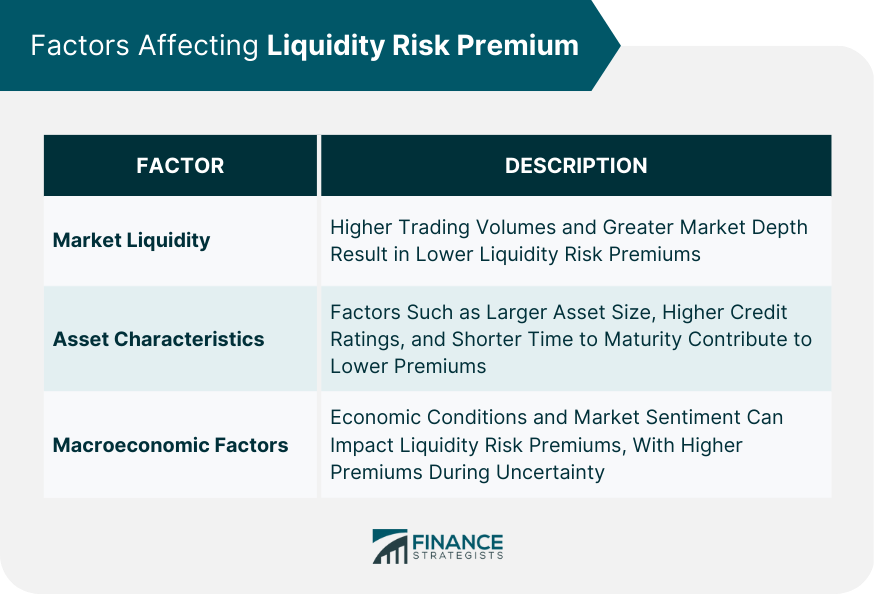

Financial markets serve as the backbone of the global economic infrastructure, facilitating the exchange of financial instruments, raising capital, allocating resources, and managing risks. Within these markets, algorithmic trading has emerged as a dominant force, revolutionizing how trades are executed. Algorithmic trading employs sophisticated mathematical models and algorithms to execute orders rapidly and efficiently, often leveraging high-frequency trading (HFT) techniques. These strategies have become pivotal as they minimize human error, optimize execution speed, and capitalize on market inefficiencies at scales beyond human capability.

However, despite the advancements and benefits algorithmic trading introduces, it is accompanied by inherent risks, one of which is liquidity risk. Liquidity risk refers to the potential difficulty in buying or selling an asset without affecting its price significantly. This risk can arise due to various factors including market conditions, trading volumes, and the inherent nature of the asset itself. In trading, liquidity is crucial; a lack of it can lead to increased transaction costs, slippage, and in extreme cases, market disruption. This poses challenges for traders who rely on precise and timely execution, as the costs and delays associated with liquidity can erode profitability.



The goal of this article is to explore the concept of the liquidity risk premium—an additional expected return that investors demand for holding assets with liquidity risk. This premium plays a significant role in investment decisions and pricing strategies within algorithmic trading. Understanding how to quantify and integrate liquidity risk premium can enhance trading strategies, optimizing for both risk management and return. As financial markets evolve with technological advancements, recognizing the implications of liquidity risk and effectively managing it through algorithmic trading strategies becomes paramount for market participants seeking to maintain competitive edges.

## Table of Contents

## Understanding Liquidity Risk

Liquidity risk is a critical concept in financial markets, defining the ease with which assets can be bought or sold without causing a significant impact on their price. When liquidity is high, traders can execute large transactions quickly and with minimal price influence. Conversely, low liquidity can lead to price volatility and increased transaction costs, as selling or buying a substantial amount of an asset might cause its price to drop or rise significantly.

Several [factor](/wiki/factor-investing)s contribute to [liquidity](/wiki/liquidity-risk-premium) risk:

1. **Market Conditions**: In stable markets, liquidity tends to be higher as there is more confidence in the economic environment. Conversely, in times of uncertainty or economic stress, liquidity can dry up as market participants become risk-averse.

2. **Trading Volume**: Higher trading volumes generally indicate better liquidity as they suggest a stable flow of buyers and sellers in the market. Low trading volumes can exacerbate liquidity risk since finding a counterparty to a trade may become challenging, causing delays or unfavorable price movements.

3. **Market Depth and Breadth**: Market depth refers to the number of buy and sell orders at different price levels. A market with high depth can absorb larger trades without significant price changes. Market breadth indicates the range of instruments available to trade; a narrow market with few instruments may lead to higher liquidity risk.

4. **Investor Behavior**: Herd behavior can amplify liquidity risk. If many investors decide to sell simultaneously, it can overwhelm the market's capacity to absorb those trades, leading to rapid price declines.

5. **Exogenous Events**: Political instability, natural disasters, or sudden economic downturns can lead to abrupt shifts in liquidity, as market participants react to the new information or perceived risks.

The impact of liquidity risk on trading strategies and asset valuation is profound. For trading strategies, liquidity risk can erode returns as the cost of trading rises due to higher spreads and slippage, the difference between the expected price of a trade and the actual price. This necessitates the inclusion of liquidity considerations in the design and execution of trading strategies.

In terms of asset valuation, liquidity risk can lead to discounts on asset prices. Investors demand a premium for holding less liquid assets to compensate for the additional risk of being unable to sell these assets swiftly without sacrificing value. Consequently, incorporating liquidity risk into asset valuation models is essential for accurate pricing and risk management decisions.

Understanding and effectively managing liquidity risk is paramount for traders and asset managers alike, as it significantly influences trading results and financial health. By recognizing the contributing factors and potential impacts, market participants can better navigate the complexities of financial markets and optimize their strategies accordingly.

## What is Liquidity Risk Premium?

Liquidity risk premium is an essential concept for traders, especially in the domain of [algorithmic trading](/wiki/algorithmic-trading). It represents the additional return that investors require to compensate for the risk associated with holding an asset that may not be easily tradable or converted into cash without a significant price concession. This premium is significant for traders as it influences decision-making and strategy formulation, particularly in volatile or less liquid markets where the ability to quickly buy or sell assets can drastically affect profitability and risk exposure.

Quantifying liquidity risk premium involves analyzing the spread between the buying and selling prices of an asset, known as the bid-ask spread, and the impact of large trade [volume](/wiki/volume-trading-strategy)s on price. One approach is to use the following formula:

$$
\text{LRP} = \frac{\text{Expected Spread Cost}}{\text{Volume}}
$$

where the expected spread cost is derived from historical bid-ask spreads, and volume represents the asset's trading volume. This formula helps traders estimate how much additional return is necessary to justify the liquidity risk they are taking on a particular asset.

The liquidity risk premium's role in generating returns is critical as it influences asset pricing and the expected return on investment. In less liquid markets, assets might be priced lower due to higher liquidity risk, offering a potential return opportunity for those willing to bear this risk. Conversely, in highly liquid markets, the liquidity risk premium might be minimal, reflecting the ease of trading.

It's important to distinguish liquidity risk premium from other types of premiums, such as risk premium and time premium. Risk premium refers to the additional return expected by investors for taking on the overall risk of an investment beyond a risk-free rate. Time premium, on the other hand, compensates investors for holding an asset over a period, considering factors like [interest rate](/wiki/interest-rate-trading-strategies)s and inflation. While risk premium is broader and accounts for various types of risks, liquidity risk premium specifically considers the ability to trade the asset quickly without affecting its price. Understanding these differences is crucial for traders to develop comprehensive strategies that account for varying market conditions and risk factors.

## Algorithmic Trading and Its Impact on Liquidity

Algorithmic trading, the use of computer algorithms to automate trading decisions, has transformed the landscape of modern financial markets. This approach, which leverages computational power and complex algorithms, is favored for its efficiency and ability to process vast amounts of data quickly. Algorithmic trading is now a dominant force in most global markets, accounting for a significant portion of trading volumes.

A key impact of algorithmic trading is its influence on market liquidity. Market liquidity refers to the ability of an asset to be bought or sold quickly in the market without affecting the asset's price. Algorithms enhance liquidity by placing a large number of buy and sell orders across multiple markets simultaneously. This can reduce bid-ask spreads—the difference between the price buyers are willing to pay for an asset and the price sellers are willing to accept—thus lowering trading costs for all market participants.

However, the influence of algorithmic strategies on liquidity is not uniformly positive. While algorithms can increase market liquidity under normal conditions, they might also exacerbate liquidity challenges during periods of market stress. For instance, during a market downturn, algorithmic trading might withdraw liquidity rapidly to avoid losses, leading to a sudden drop in available liquidity. This behavior can contribute to market [volatility](/wiki/volatility-trading-strategies), creating a feedback loop where falling prices lead to more liquidity withdrawal, thus magnifying price movements. Such instances highlight the dual-edged nature of algorithmic trading in liquidity provision.

Moreover, algorithmic trading introduces complexities in managing liquidity risk. Liquidity risk arises when a market is not liquid enough to accommodate trades without large price changes. Algorithms designed without proper consideration of market liquidity can incur significant costs, especially during times of reduced liquidity. An algorithm might, for instance, execute large trades in illiquid markets, leading to unfavorable price changes that deviate from expected models. This necessitates algorithms that are dynamic and adaptive, capable of accounting for real-time liquidity fluctuations.

Some strategies to mitigate these challenges involve incorporating real-time data analytics and machine learning to predict and adapt to market liquidity conditions. Traders can build algorithms that adjust their trading behavior based on the current state of market liquidity, thus minimizing adverse impacts on pricing and execution costs. Additionally, employing liquidity risk models can help in forecasting and managing potential liquidity challenges in advance.

Ultimately, while algorithmic trading has the potential to enhance market efficiency and liquidity, it also brings challenges that require sophisticated strategies and technologies to manage liquidity risk effectively. As the landscape of financial markets continues to evolve, the interplay between algorithmic trading and liquidity will remain a critical area for traders and researchers alike.

## Incorporating Liquidity Risk Premium into Algo Trading Strategies

To effectively incorporate liquidity risk premium into algorithmic trading strategies, traders must integrate liquidity risk considerations at both the design and execution stages of their models. A well-thought-out approach addresses fluctuations in market liquidity and optimizes trading performance.

### Strategies for Integration

1. **Adaptive Trading Algorithms**: Employ algorithms that adapt to changing liquidity conditions by adjusting order sizes or timing to minimize market impact. For instance, using real-time data on bid-ask spreads and order book depths, algorithms can determine the optimal execution strategy, such as slicing larger orders into smaller tranches during low liquidity periods.

2. **Liquidity Proxies**: Use proxies like Amihud's illiquidity measure, which relates price impact to trading volume, to gauge liquidity risk. Quantifying this risk enables traders to adjust portfolios proactively. For example:

$$
\text{ILLIQ}_t = \frac{|R_t|}{\text{Volume}_t}
$$

where $ R_t $ is the return on day $ t $, and $\text{Volume}_t$ is the trading volume on the same day.

3. **Risk-Adjusted Performance Metrics**: Modify traditional performance metrics to account for liquidity risk. This involves integrating liquidity cost estimates into Sharpe Ratio calculations, providing a clearer picture of risk-adjusted returns.

### Examples of Liquidity Risk Premium Algorithms

1. **Volume-Weighted Average Price (VWAP) Strategies**: These are designed to execute large orders in line with the market's volume distribution. While common, such strategies are adjusted to exploit periods of distinct liquidity risk premiums.

2. **Market-Making Algorithms**: These algorithms provide liquidity but require sophisticated risk management to hedge potential adverse selection risks. By predicting liquidity shortages, market makers can adjust spreads to capture liquidity premiums effectively.

### Role of Data Analytics and Machine Learning

The rise of big data analytics and [machine learning](/wiki/machine-learning) (ML) significantly enhances the ability to assess liquidity conditions and foresee risks.

1. **Predictive Analytics**: Machine learning models can forecast liquidity conditions by analyzing extensive historical data. Techniques such as regression analysis, Random Forests, or Neural Networks allow these predictions, assisting in preemptive algorithm adjustments.

2. **Clustering Algorithms**: These can help detect liquidity patterns by grouping similar trading days or periods. This understanding aids in fine-tuning strategies for specific liquidity environments.

3. **Sentiment Analysis**: By analyzing market news or social media, algorithms can gauge market sentiment, offering clues to potential liquidity shifts. For instance, an increase in negative sentiment might signal impending liquidity tightening.

Here is a simple Python example using a machine learning model to predict future liquidity risk based on historical data:

```python
import pandas as pd
from sklearn.ensemble import RandomForestRegressor
from sklearn.model_selection import train_test_split

# Sample data
data = pd.read_csv('liquidity_data.csv')  # Assume appropriate columns: 'features' and 'liquidity_risk'

# Feature engineering
X = data.drop('liquidity_risk', axis=1)
y = data['liquidity_risk']

# Train-test split
X_train, X_test, y_train, y_test = train_test_split(X, y, test_size=0.2, random_state=42)

# Model training
model = RandomForestRegressor(n_estimators=100, random_state=42)
model.fit(X_train, y_train)

# Prediction
predictions = model.predict(X_test)

# Evaluate model performance (e.g., using RMSE)
```

Incorporating a liquidity risk premium into algorithmic trading requires a multifaceted approach, employing advanced technologies and an understanding of dynamic market states. This integration not only hedges against potential liquidity risks but also capitalizes on liquidity premiums, enhancing strategy robustness and profitability.

## Case Studies and Real-World Examples

### Case Studies and Real-World Examples

Liquidity risk has become a focal point in financial markets, particularly for institutions and [hedge fund](/wiki/hedge-fund-trading-strategies)s implementing algorithmic trading strategies that leverage the liquidity risk premium. A few key examples highlight the practical integration of liquidity risk premium in trading strategies, as well as the significant impact of liquidity disruptions on trading outcomes.

#### Example 1: Quantitative Hedge Fund Strategy

A well-documented case is that of the quantitative hedge fund AQR Capital Management, known for its systematic strategies, including the exploitation of the liquidity risk premium. AQR has developed models that recognize liquidity risk as a significant factor influencing expected returns. By incorporating liquidity risk premium into its multi-factor models, AQR is able to balance risk and enhance return potential.

The firm uses historical liquidity metrics and the Amihud liquidity measure, which evaluates stock illiquidity based on its price movements relative to trading volume. The formula for the Amihud illiquidity measure is:

$$
\text{Amihud} = \frac{1}{D} \sum_{d=1}^{D} \frac{|R_{d}|}{V_{d}}
$$

where $ R_{d} $ is the return on day $ d $, $ V_{d} $ is the dollar volume on day $ d $, and $ D $ represents the number of trading days within the period considered. By minimizing exposure during periods of low liquidity and seeking opportunities in more liquid environments, AQR efficiently captures the premium while mitigating risk.

#### Example 2: JPMorgan and the 2008 Financial Crisis

JPMorgan provided a poignant case study during the 2008 financial crisis. The bank employed sophisticated algorithms which, while initially successful, encountered challenges due to unprecedented liquidity constraints. This situation highlighted how even robust algorithmic strategies could be derailed by external liquidity shocks.

During the crisis, the drying up of liquidity in various asset classes led to severe valuation mismatches, causing some algorithmic models dependent on normal liquidity conditions to falter. JPMorgan's experience emphasized the importance of stress-testing algorithms against extreme market conditions and incorporating dynamic responses to sudden shifts in liquidity.

#### Lessons Learned from Market Disruptions

The 2008 financial crisis and flash crashes such as the May 2010 event have underscored the critical importance of liquidity risk management. These scenarios revealed several key lessons:

1. **Prediction and Adaptability**: Algorithms need to incorporate triggers that allow them to adapt to rapidly changing liquidity conditions. During the 2010 flash crash, algorithms lacking adaptive measures contributed to significant market distortions.

2. **Stress Testing**: Ensuring algorithms are stress-tested against severe liquidity drought scenarios is essential. By simulating conditions where liquidity evaporates, institutions can better prepare their strategies to offset potential adverse outcomes.

3. **Cross-Asset Correlations**: Sudden shifts in liquidity can create unforeseen correlations between asset classes, necessitating a broader view of risk management that extends beyond single markets.

These examples illustrate that while liquidity risk premium offers an avenue for enhanced returns, managing the associated risks requires sophisticated models, robust testing, and the ability to swiftly adapt to changing market dynamics. For further insights and detailed studies, financial literature and resources like the Journal of Financial Economics provide extensive research on liquidity risk strategies and outcomes.

## Future Trends and Challenges

The evolving landscape of algorithmic trading presents several trends that could significantly impact liquidity risk management. One prominent trend is the increasing reliance on [artificial intelligence](/wiki/ai-artificial-intelligence) (AI) and machine learning (ML) algorithms. These technologies enable traders to analyze vast datasets more efficiently and adapt strategies to real-time market conditions, potentially improving liquidity forecasts and risk assessments. As highlighted by multiple studies, these AI-driven systems can process unstructured data, such as news articles and social media posts, to predict market shifts that might affect liquidity [CFA Institute, 2021].

Another trend is the growing integration of decentralized finance (DeFi) platforms and blockchain technology in trading systems. These innovations promise greater transparency and reduced transaction costs, which may enhance market liquidity. For instance, smart contracts on blockchain can automate trading processes, allowing for quicker adjustments to liquidity positions. However, the nascent state of DeFi also poses potential risks, including regulatory uncertainties and technological vulnerabilities that could threaten liquidity stability.

On the regulatory front, there is increasing scrutiny from financial authorities aimed at mitigating systemic risks associated with high-frequency and algorithmic trading. Regulations are evolving to ensure market stability, such as imposing circuit breakers and liquidity thresholds. This regulatory oversight is crucial, especially in curbing “flash crashes” triggered by algorithms, which can exacerbate liquidity risk. Financial institutions must stay abreast of these regulatory changes to adjust their trading algorithms and maintain compliance.

Looking ahead, the liquidity risk premium may evolve as digital trading infrastructures expand. The proliferation of digital assets could introduce new forms of liquidity risk, requiring innovative risk management strategies. For instance, as more institutions adopt cryptocurrencies, the market might see liquidity fragmentation across numerous trading venues, complicating risk assessment. This fragmentation could result in varied liquidity risk premiums across different asset classes, necessitating sophisticated models for risk-adjusted returns.

In conclusion, the future of liquidity risk management in algorithmic trading appears heavily influenced by technological advances and regulatory changes. AI and blockchain innovations hold promise for enhancing liquidity management, yet they also introduce new challenges and risks. Traders and financial institutions must therefore adapt by refining algorithms and ensuring robust compliance frameworks to navigate this rapidly evolving environment effectively.

## Conclusion

Understanding liquidity risk premium is crucial for enhancing algorithmic trading strategies. Liquidity risk, which refers to the challenges in buying or selling assets without significant price changes, directly impacts trading costs and strategy effectiveness. The concept of a liquidity risk premium compensates traders for the additional risk they assume in illiquid markets. By grasping this premium, traders can optimize returns and improve their risk management.

Throughout this article, we discussed the definitions and distinctions of liquidity risk and its premium, highlighting how these factors influence traders’ strategies and asset valuations. Algorithmic trading, with its sophisticated technology and speed, can significantly affect market liquidity. Traders who integrate liquidity risk premiums into their algorithms often leverage machine learning and advanced data analytics to assess market conditions, refine trading models, and potentially capture value from these risk premiums.

Real-world examples and case studies illustrate how financial institutions and hedge funds implement these strategies effectively. They offer valuable insights into how liquidity risk premiums can shape trading outcomes, particularly under volatile market conditions.

Looking ahead, emerging trends in digital trading and fintech innovations present both opportunities and challenges. As financial markets evolve, new tools and technologies could further refine liquidity risk management, offering fertile ground for research and strategic advancements. Understanding and leveraging liquidity risk premiums might become increasingly vital for staying competitive and resilient in dynamic trading environments.

## References & Further Reading

[1]: Amihud, Y. (2002). ["Illiquidity and Stock Returns: Cross-Section and Time-Series Effects."](https://www.sciencedirect.com/science/article/abs/pii/S1386418101000246) The Review of Financial Studies, 15(2), 351-386.

[2]: Hasbrouck, J. (2009). ["Trading Costs and Returns for U.S. Equities: Estimating Effective Costs from Daily Data."](https://pages.stern.nyu.edu/~jhasbrou/Research/GibbsCurrent/HasbrouckJF.pdf) The Journal of Finance, 64(3), 1445-1477.

[3]: Pástor, Ľ., & Stambaugh, R. F. (2003). ["Liquidity Risk and Expected Stock Returns."](https://www.jstor.org/stable/10.1086/374184) The Journal of Political Economy, 111(3), 642-685.

[4]: ["Advances in Financial Machine Learning"](https://www.amazon.com/Advances-Financial-Machine-Learning-Marcos/dp/1119482089) by Marcos Lopez de Prado

[6]: Hendershott, T., Jones, C. M., & Menkveld, A. J. (2011). ["Does Algorithmic Trading Improve Liquidity?"](https://onlinelibrary.wiley.com/doi/full/10.1111/j.1540-6261.2010.01624.x) The Journal of Finance, 66(1), 1-33.

[7]: Engle, R., & Lange, J. (2001). ["Predicting VNet: A Model of the Dynamics of Market Depth."](https://www.sciencedirect.com/science/article/abs/pii/S1386418100000197) Journal of Financial Markets, 4(2), 113-142.