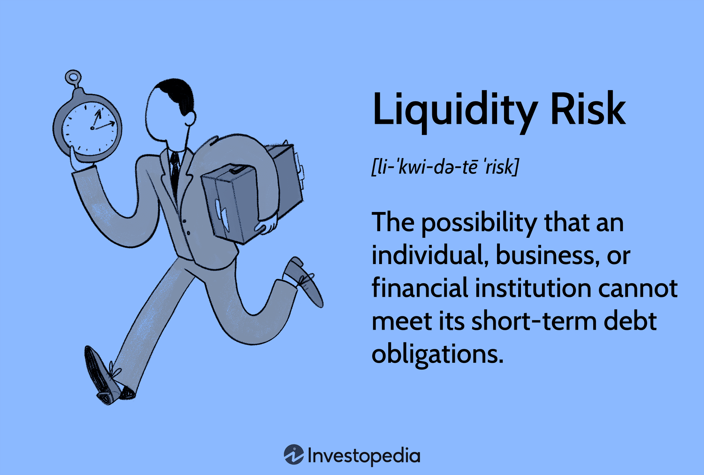

## Table of Contents

## What is liquidity risk?

Liquidity risk is the risk that a person or a company might not be able to quickly turn their assets into cash without losing a lot of value. Imagine you have a big collection of rare stamps. If you need money fast, you might have to sell your stamps for much less than they are really worth because not many people want to buy rare stamps right away.

This kind of risk is important for banks and financial companies because they need to have enough cash to meet their daily needs, like giving money to people who want to take it out of their accounts. If a bank doesn't have enough liquid assets, it could face serious problems, like not being able to pay its customers, which could lead to a crisis. So, managing liquidity risk is a big part of keeping a financial system stable and trustworthy.

## Why is liquidity important for businesses and investors?

Liquidity is really important for businesses because it helps them run smoothly every day. Imagine a store that needs to buy more products to sell. If the store doesn't have enough cash, it can't buy those products, and then it won't have anything to sell to customers. This can make the business struggle. Liquidity also helps businesses pay their bills on time, like rent and salaries. If a business can't pay these, it might have to close down. So, having enough liquid assets, like cash or things that can be quickly turned into cash, is key to keeping a business going strong.

For investors, [liquidity](/wiki/liquidity-risk-premium) is important because it lets them buy and sell investments easily. If an investor wants to sell a stock or a bond quickly, they need to be able to find someone who wants to buy it. If the market for that investment isn't liquid, the investor might have to wait a long time or sell it for less money than it's worth. This can be a big problem if the investor needs cash fast. So, liquidity helps investors feel more secure because they know they can turn their investments into cash when they need to.

## What are the common causes of liquidity risk?

Liquidity risk can happen for many reasons. One big reason is when a lot of people or companies suddenly want to take their money out at the same time. This is called a "bank run." If a bank doesn't have enough cash on hand, it can't give money to everyone who wants it, and this can cause big problems. Another reason is when the market for an asset, like a stock or a bond, isn't very active. If not many people want to buy that asset, it can be hard to sell it quickly without losing a lot of money.

Another cause of liquidity risk is when a company has too much of its money tied up in things that can't be turned into cash quickly. For example, if a company has a lot of money invested in big machines or buildings, it might not be able to sell those assets fast enough if it needs cash right away. Also, changes in the economy or big events, like a financial crisis, can make it harder for businesses and investors to get cash when they need it. During these times, everyone might be trying to sell their assets at the same time, which can make the market less liquid and increase liquidity risk.

## How can liquidity risk affect a company's operations?

Liquidity risk can really mess up a company's day-to-day work. If a company doesn't have enough cash on hand, it might struggle to pay for things it needs right away, like buying more supplies to make its products or paying its workers. If the company can't buy what it needs, it might not be able to keep making and selling its products, which can hurt its business a lot. Also, if the company can't pay its workers on time, it could lose good employees and have a hard time finding new ones.

Another way liquidity risk can affect a company is by making it hard to take advantage of new opportunities. For example, if a good chance to expand the business comes up, like buying another company or opening a new store, the company might not have the cash to do it. This means it could miss out on growing and making more money in the future. Plus, if people start to worry that the company might not be able to pay its bills, they might not want to do business with it, which can make the company's problems even worse.

## What are the different types of liquidity risk?

There are two main types of liquidity risk: funding liquidity risk and market liquidity risk. Funding liquidity risk happens when a company or a person doesn't have enough cash to pay for things they need right away, like bills or buying more supplies. It's like not having enough money in your wallet when you need to buy something important. This can be a big problem because if a company can't pay its bills, it might have to stop working or even go out of business.

Market liquidity risk is different. It's about how easy it is to sell an asset, like a stock or a bond, without losing a lot of money. Imagine you want to sell your bike quickly. If not many people want to buy bikes right now, you might have to sell it for less than it's worth. This can be a problem for investors because if they need cash fast and can't sell their investments easily, they might be in trouble. Both types of liquidity risk are important to watch out for because they can cause big problems for businesses and investors.

## How do financial institutions manage liquidity risk?

Financial institutions manage liquidity risk by keeping a close eye on how much cash they have and how much they might need in the future. They do this by making sure they always have enough liquid assets, like cash or things that can be turned into cash quickly, to meet their daily needs. They also keep track of how much money people are putting into and taking out of their accounts every day. This helps them know if they need to get more cash ready for times when a lot of people might want their money back at once.

Another way financial institutions manage liquidity risk is by planning ahead. They use something called a liquidity risk management plan, which is like a roadmap that tells them what to do if they start running low on cash. This plan includes ways to get more cash quickly, like borrowing from other banks or selling some of their assets. They also have rules about how much cash they need to keep on hand at all times, just to be safe. By doing all these things, financial institutions can make sure they have enough cash to keep running smoothly, even during tough times.

## What are some key indicators used to measure liquidity risk?

Key indicators used to measure liquidity risk help businesses and financial institutions know if they have enough cash to handle their daily needs. One important indicator is the cash ratio, which looks at how much cash and cash equivalents a company has compared to its short-term debts. If the cash ratio is high, it means the company can easily pay its bills. Another indicator is the current ratio, which compares all of a company's current assets, like cash and things that can be turned into cash quickly, to its current liabilities. A higher current ratio means the company is more likely to be able to pay its short-term bills.

Another useful indicator is the quick ratio, also called the acid-test ratio. This is similar to the current ratio but doesn't include inventory because inventory might take longer to turn into cash. If the quick ratio is high, it shows the company can pay its short-term debts even without selling its inventory. Financial institutions also look at the liquidity coverage ratio (LCR), which measures if they have enough high-quality liquid assets to survive a 30-day stressed funding scenario. By keeping an eye on these indicators, businesses and financial institutions can manage their liquidity risk better and make sure they have enough cash when they need it.

## How does liquidity risk impact the broader financial market?

Liquidity risk can have a big effect on the whole financial market. When a lot of people or companies want to take their money out at the same time, it can cause a big problem. This is like what happens during a bank run, where everyone wants their money back, but the bank doesn't have enough cash to give to everyone. If this happens, it can make people lose trust in the financial system. They might start to worry that other banks or financial companies could have the same problem, and this worry can spread quickly. If everyone starts pulling their money out of different places, it can lead to a bigger financial crisis.

Also, if the market for certain assets, like stocks or bonds, becomes less liquid, it can make it hard for investors to buy and sell these assets. When this happens, the prices of these assets can go down a lot because people have to sell them for less money just to get cash quickly. This can make the whole market feel unstable and can lead to more people wanting to sell their investments, making the problem even worse. So, managing liquidity risk is really important for keeping the financial market stable and making sure people feel safe about their money.

## What are the regulatory requirements related to liquidity risk management?

Governments and financial watchdogs have rules to make sure banks and other financial companies handle liquidity risk well. One big rule is called the Liquidity Coverage Ratio (LCR). This rule says that banks need to keep enough high-quality liquid assets, like cash or things that can be turned into cash fast, to survive for 30 days if they run into money problems. Another rule is the Net Stable Funding Ratio (NSFR), which looks at whether banks have enough stable funding to support their activities over a longer time, like a year. These rules help make sure banks can always pay their bills and keep the financial system safe.

There are also other rules that tell banks to have good plans for managing liquidity risk. They need to watch their cash levels closely and have a plan ready for what to do if they start running low on cash. This includes things like borrowing from other banks or selling some of their assets quickly. Regulators also check these plans to make sure they are good enough. By following these rules, banks can manage their liquidity risk better and help keep the financial market stable.

## Can you explain the difference between liquidity risk and market risk?

Liquidity risk and market risk are two different kinds of risks that can affect businesses and investors, but they work in different ways. Liquidity risk is about not having enough cash or not being able to turn assets into cash quickly without losing a lot of value. For example, if a company needs money fast but can't sell its assets easily, it might have to sell them for less than they're worth. This can cause big problems, like not being able to pay bills or buy what the company needs to keep running.

Market risk, on the other hand, is about the chance that the value of an investment might go down because of things happening in the market. This could be because of changes in interest rates, big events like a financial crisis, or even just because people's feelings about the market change. For example, if a lot of people suddenly think a stock is not a good investment anymore, its price might drop a lot. Unlike liquidity risk, market risk is about how the value of assets can change, not about how easy it is to turn them into cash.

## How do advanced models and tools help in predicting and managing liquidity risk?

Advanced models and tools help businesses and financial institutions predict and manage liquidity risk by using lots of data to see what might happen in the future. These models can look at things like how much cash a company has, how much it might need, and what could happen if a lot of people suddenly want their money back. They use math and computer programs to make guesses about different situations, like a financial crisis or a sudden drop in the market. By doing this, companies can plan ahead and make sure they have enough cash to handle any problems that might come up.

These tools also help companies keep an eye on their liquidity in real-time. They can show how much cash is coming in and going out every day, so managers can quickly see if they need to do something to get more cash. For example, if the models show that the company might run low on cash soon, they can use the tools to figure out the best way to get more, like borrowing money or selling some assets. This helps companies stay ready for anything and manage their liquidity risk better, keeping their business running smoothly no matter what happens.

## What are some case studies of major liquidity crises and the lessons learned from them?

One big liquidity crisis happened in 2008 during the global financial crisis. Many big banks and financial companies ran into trouble because they didn't have enough cash to pay their bills. A lot of people wanted to take their money out of these banks at the same time, but the banks couldn't give it to them. This led to a huge problem that affected the whole world. The lesson from this crisis was that banks need to have better plans for managing liquidity risk. Governments also learned that they need to have rules in place to make sure banks always have enough cash, even during tough times.

Another example is the 1998 collapse of Long-Term Capital Management (LTCM), a big [hedge fund](/wiki/hedge-fund-trading-strategies). LTCM had a lot of money invested in different things, but when the market changed suddenly, they couldn't sell these investments quickly enough to get the cash they needed. This caused a big scare in the financial world because LTCM's problems could have affected a lot of other companies. The lesson here was that even big investors need to be careful about liquidity risk. They need to think about how easy it will be to turn their investments into cash if things go wrong. This case also showed that regulators need to watch hedge funds and other big investors more closely to prevent big problems.

These two cases show how important it is to manage liquidity risk well. Companies and financial institutions need to always have enough cash and a good plan for what to do if they run into trouble. Governments and regulators also need to make sure there are rules in place to keep the financial system safe. By learning from these crises, we can do a better job of preventing big problems in the future.

## References & Further Reading

[1]: Amihud, Y., & Mendelson, H. (1986). ["Asset Pricing and the Bid-Ask Spread."](https://www.sciencedirect.com/science/article/pii/0304405X86900656) The Journal of Financial Economics, 17(2), 223-249.

[2]: de Prado, M. L. (2018). ["Advances in Financial Machine Learning."](https://www.amazon.com/Advances-Financial-Machine-Learning-Marcos/dp/1119482089) John Wiley & Sons.

[3]: Hasbrouck, J. (2009). ["Trading Costs and Returns for U.S. Equities: Estimating Effective Costs from Daily Data."](https://www.jstor.org/stable/20488006) Journal of Finance, 64(3), 1445-1477.

[4]: Jarrow, R. A., & Protter, P. (2005). ["Liquidity Risk and Arbitrage Pricing Theory."](https://link.springer.com/article/10.1007/s00780-004-0123-x) Finance and Stochastics, 9(3), 231-243.

[5]: Lehalle, C.-A., & Laruelle, S. (Eds.). (2013). ["Market Microstructure in Practice."](http://helper.ipam.ucla.edu/publications/fmws2/fmws2_12928.pdf) World Scientific.

[6]: Jansen, S. (2020). ["Machine Learning for Algorithmic Trading: Predictive Models to Extract Signals from Market and Alternative Data for Systematic Trading Strategies with Python."](https://github.com/stefan-jansen/machine-learning-for-trading) Packt Publishing.

[7]: Bangia, A., Diebold, F. X., Schuermann, T., & Stroughair, J. D. (1999). ["Liquidity Risk, Technical Report."](http://www.ssc.upenn.edu/~fdiebold/papers/paper25/bds.pdf) The Wharton School, University of Pennsylvania.

