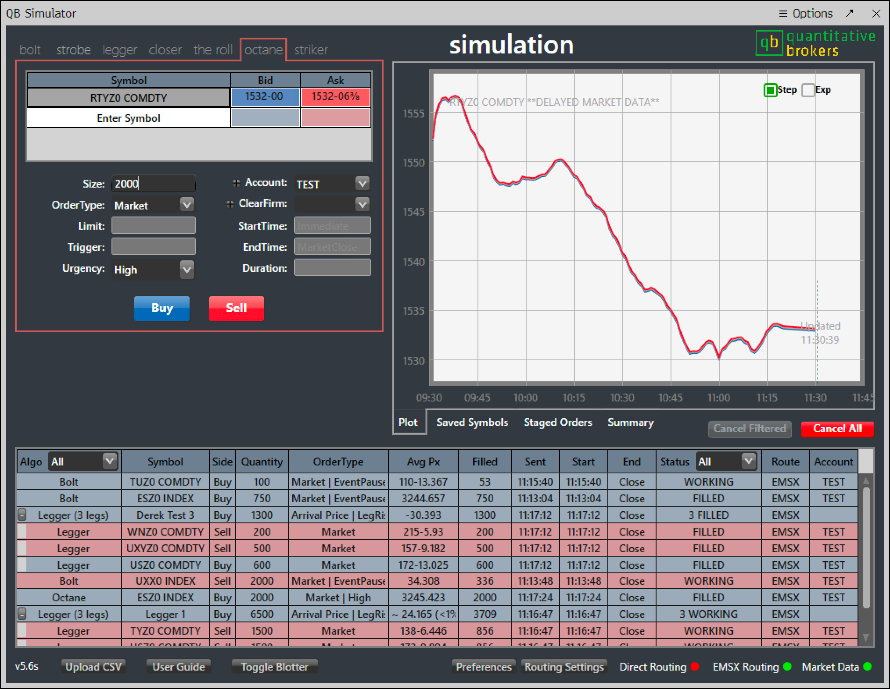

## Table of Contents

## What is liquidity in financial markets?

Liquidity in financial markets refers to how easily you can buy or sell an asset without causing a big change in its price. Think of it like a busy market where you can quickly sell your goods at a fair price because there are lots of buyers and sellers. If a market is liquid, it means there are enough people trading that you can get in and out of your investments without waiting too long or losing much value.

On the other hand, if a market is not liquid, it can be hard to sell your assets quickly. Imagine trying to sell something rare or unusual at a small market with few buyers. You might have to wait a long time or accept a lower price. This is why liquidity is important: it affects how easily you can turn your investments into cash and how much control you have over the price you get.

## What are liquidity-seeking algorithms?

Liquidity-seeking algorithms are computer programs that traders use to find the best places to buy or sell assets quickly and at good prices. These algorithms look at different markets and trading platforms to see where there are lots of buyers and sellers. By doing this, they help traders avoid markets where it's hard to trade because there aren't enough people trading.

These algorithms are really helpful because they can find hidden pockets of liquidity that might not be obvious to human traders. They do this by breaking up big orders into smaller ones and spreading them out over time and across different places. This way, they can get the best possible price without causing big changes in the market. It's like finding the best market stalls to sell your goods at the best price without scaring off other buyers or sellers.

## How do liquidity-seeking algorithms work?

Liquidity-seeking algorithms work by scanning different markets and trading platforms to find where there are lots of buyers and sellers. They look for places where it's easy to buy or sell without causing big price changes. These algorithms are smart because they can find hidden spots of liquidity that human traders might miss. They do this by breaking up big orders into smaller ones and spreading them out over time and across different places. This helps them get the best possible price without making the market move too much.

For example, if a trader wants to sell a large amount of a stock, the algorithm might split this into many small orders. It will then send these orders to different markets where there are lots of buyers. By doing this, the algorithm can sell the stock at a good price without flooding one market and causing the price to drop. This way, the trader gets a better overall price for their stock, and the market stays stable.

## What are the main goals of using liquidity-seeking algorithms?

The main goal of using liquidity-seeking algorithms is to help traders buy or sell assets quickly and at the best possible prices. These algorithms look for places in the market where there are lots of buyers and sellers. By finding these spots, they make it easier for traders to trade without waiting too long or losing money on the price.

Another important goal is to keep the market stable. When big orders are placed all at once, they can cause the price to move a lot. Liquidity-seeking algorithms break up these big orders into smaller ones and spread them out over time and across different markets. This way, they can sell or buy without causing big changes in the market, which helps keep things calm and predictable for everyone trading.

## What are the different types of liquidity-seeking algorithms?

There are a few different types of liquidity-seeking algorithms that traders use. One type is called a volume-weighted average price (VWAP) algorithm. This algorithm tries to buy or sell assets at a price that's close to the average price over a certain time period. It looks at how much of the asset is being traded and tries to match the average to get the best deal. Another type is the time-weighted average price (TWAP) algorithm. This one spreads out orders evenly over time, so it's good for when you want to buy or sell without causing big price changes.

Another type of liquidity-seeking algorithm is the implementation shortfall algorithm. This one tries to minimize the difference between the price you decide to trade at and the price you actually get. It's smart because it looks at how the market is moving and tries to make the best trades at the right times. Lastly, there are algorithms that use smart order routing. These algorithms look at different markets to find the best places to trade. They send parts of your order to different places where there are lots of buyers and sellers, helping you get the best price without moving the market too much.

## How do liquidity-seeking algorithms benefit traders?

Liquidity-seeking algorithms help traders by making it easier to buy or sell things quickly and at good prices. These algorithms look at lots of different markets to find where there are many buyers and sellers. By doing this, they can find the best places to trade without waiting too long or losing money on the price. This is really helpful for traders because it means they can get in and out of their investments faster and with less risk of losing money.

Another way these algorithms help is by keeping the market calm. When someone wants to buy or sell a lot of something, it can make the price move a lot if they do it all at once. But liquidity-seeking algorithms break up big orders into smaller ones and spread them out over time and across different places. This way, they can trade without causing big changes in the market. This helps everyone trading because the market stays stable and predictable.

## What are the potential risks associated with using liquidity-seeking algorithms?

Using liquidity-seeking algorithms can sometimes lead to problems. One big risk is that these algorithms might make the market move in unexpected ways. When lots of traders use these algorithms at the same time, they can all try to buy or sell in the same places. This can cause the price to jump around a lot, which can be bad for everyone trading.

Another risk is that these algorithms can make the market less fair. Some traders might have better algorithms than others, so they can find the best places to trade faster. This can leave other traders at a disadvantage, because they might not get as good a price. It's important for everyone to have a fair chance in the market, and these algorithms can sometimes make that harder.

## How do liquidity-seeking algorithms interact with market microstructure?

Liquidity-seeking algorithms play a big role in how markets work, especially in the tiny details of trading called market microstructure. These algorithms look at lots of small things like the number of buyers and sellers, how fast trades happen, and where the best prices are. By doing this, they help traders find the best spots to buy or sell their stuff without making the price move too much. This is important because it helps keep the market calm and makes it easier for everyone to trade.

Sometimes, though, these algorithms can mess with the market in ways people don't expect. When lots of traders use these algorithms at the same time, they might all try to trade in the same places. This can make prices jump around a lot, which can be bad for everyone. Also, some traders might have better algorithms than others, so they can find the best places to trade faster. This can make the market less fair, because not everyone gets the same chance to get a good price.

## What are the key performance metrics for evaluating liquidity-seeking algorithms?

When people want to see how well liquidity-seeking algorithms are doing, they look at a few important things. One big thing is how close the price they get is to the average price over a certain time. This is called the implementation shortfall. If the algorithm can trade at a price that's close to the average, it's doing a good job. Another thing they look at is how much the price moves when the algorithm trades. If the price stays pretty steady, it means the algorithm is good at spreading out trades without causing big changes.

Another key thing to check is how quickly the algorithm can buy or sell. This is called the speed of execution. If it can trade fast, it's helpful for traders who need to get in and out of the market quickly. Finally, people also look at how much the algorithm costs to use. If it's too expensive, it might not be worth it, even if it works well. So, the best algorithms are the ones that get good prices, keep the market calm, trade fast, and don't cost too much.

## How can liquidity-seeking algorithms be optimized for different market conditions?

Liquidity-seeking algorithms can be made better by changing how they work depending on what's happening in the market. If the market is busy with lots of people buying and selling, the algorithm can use this to its advantage by spreading out trades more quickly. But if the market is quiet, the algorithm might need to take its time and be more careful about where it trades. This way, it can still find good prices without causing big changes in the market.

Another way to make these algorithms better is by using different strategies for different types of markets. For example, if the market is moving a lot and prices are changing fast, the algorithm can use a strategy that helps it trade at the average price over time. But if the market is calm and prices are stable, it might be better to use a strategy that focuses on trading as quickly as possible. By being smart about which strategy to use, the algorithm can help traders get the best deals no matter what the market is like.

## What are the latest advancements in liquidity-seeking algorithm technology?

The latest advancements in liquidity-seeking algorithms have made them smarter and faster. One big improvement is the use of machine learning. This means the algorithms can learn from what's happening in the market and change how they work to get even better prices. They can look at lots of data really quickly and figure out the best places to trade. Another cool thing is that these algorithms can now work with other types of trading tools, like high-frequency trading systems. This helps them find even more spots where they can buy or sell without making the market move too much.

Another advancement is that these algorithms can now handle different types of markets better. They can change how they trade depending on if the market is busy or quiet. For example, if the market is moving a lot, the algorithm can use a strategy that helps it trade at the average price over time. But if the market is calm, it can focus on trading as quickly as possible. These new features make the algorithms more flexible and helpful for traders, no matter what's happening in the market.

## How do regulatory environments affect the use of liquidity-seeking algorithms?

Regulatory environments can change how traders use liquidity-seeking algorithms. Some rules might say that traders have to be very clear about what they're doing when they use these algorithms. This means they have to tell everyone how their algorithms work and what they're trying to do. Other rules might limit how fast these algorithms can trade or how much they can trade at one time. This is to make sure the market stays fair and doesn't get too crazy with everyone trying to trade at the same time.

These rules can make it harder for traders to use liquidity-seeking algorithms in the best way. For example, if there's a rule that says they can't trade too fast, the algorithms might not be able to find the best prices as quickly. But these rules are important because they help keep the market safe and fair for everyone. Traders have to think about these rules when they're setting up their algorithms, and sometimes they might need to change how their algorithms work to follow the rules.

## What is the Role of Aggressiveness in Algo Trading?

Aggressiveness in liquidity-seeking algorithms refers to their willingness to execute trades at a higher velocity, which can consequently increase market impact. The primary objective here is to capture liquidity efficiently while carefully managing the inadvertent disclosure of trading intent to the broader market. This balance is crucial to prevent counterproductive moves by market participants that may disadvantage the trader. 

An aggressive liquidity-seeking algorithm might engage in a larger proportion of the market [volume](/wiki/volume-trading-strategy) and cross the spread more frequently to satisfy order requirements. This can be quantified by the algorithm's participation rate, often expressed as a percentage of the overall market volume. An example of this is the Participation Rate Formula:

$$
\text{Participation Rate} = \frac{\text{Volume Traded by Algorithm}}{\text{Total Market Volume}} \times 100\%
$$

A higher participation rate typically indicates a more aggressive stance, as the algorithm actively seeks to capture available liquidity across the market's breadth. The decision on how aggressively an algorithm should operate requires a nuanced understanding of both the trader’s risk tolerance and prevailing market conditions. Highly aggressive strategies may lead to more significant market impact and higher execution costs, calling for careful consideration of potential trade-offs.

Market conditions can significantly influence the choice of aggressiveness. In volatile environments, the risk of adverse price movements increases, making it potentially beneficial to execute trades swiftly to lock in desired prices. Conversely, in stable markets, a less aggressive approach might be preferable to minimize the market's awareness of substantial buying or selling interest, thereby reducing the chance of unfavorable price shifts.

Traders must regularly evaluate their strategic approach, considering factors such as market [volatility](/wiki/volatility-trading-strategies), liquidity availability, and their specific execution goals. Advanced algorithms may adjust their level of aggressiveness dynamically, responding to real-time market data and predictive analytics to optimize trade execution. This adaptability is essential for maintaining effective strategies in the fast-paced and ever-changing landscape of financial markets.

## How do Quantitative Models Enhance Algorithm Efficiency?

Quantitative models significantly enhance the efficiency of liquidity-seeking algorithms by optimizing their trading strategies based on market conditions and historical data analysis. By predicting baseline activity levels, these models identify optimal moments for executing trades, thus minimizing the market impact and ensuring optimal trade execution.

To forecast these dynamics, models employ statistical techniques on historical market data to discern probable liquidity patterns. This data might include parameters such as trading volumes, price movements, and historical volatility, providing a comprehensive view of market behaviors. Quantitative models leverage this information to inform the algorithm's decision-making processes at granular levels. 

For instance, a quantitative model might use regression analysis to estimate expected changes in liquidity across different market conditions. The formula for a simple linear regression model could be:

$$

y = \beta_0 + \beta_1 x + \epsilon 
$$

where $y$ represents the liquidity measure, $\beta_0$ is the intercept, $\beta_1$ is the slope of the line, $x$ represents an independent variable such as time or trading volume, and $\epsilon$ accounts for random error.

Moreover, auction interactions and real-time imbalances are fundamental aspects where quantitative analysis proves invaluable. Algorithms can adjust their trading strategies based on imbalances detected during market auctions, where price fluctuations and volume spikes are prevalent. By calculating the order flow imbalance, algorithms can refine their execution strategies to capitalize on these fluctuations. This is achieved by implementing real-time analytics that [factor](/wiki/factor-investing) in immediate market shifts and adjust the trading velocity and order size accordingly.

Algorithmic performance is often evaluated on specific impact metrics derived from the disparity between the expected and actual price impacts. This involves assessing how the executed trades align with predicted liquidity distribution and how effectively the algorithm captures liquidity without causing significant price shifts. Through continuous feedback loops, market data helps fine-tune these algorithms, ensuring they remain responsive and efficient.

Thus, the integration of quantitative models into liquidity-seeking algorithms empowers traders to navigate complex market environments with precision, leveraging sophisticated analytics to make informed decisions while maintaining execution efficiency.

## References & Further Reading

[1]: Kissell, R. (2013). ["The Science of Algorithmic Trading and Portfolio Management."](https://www.sciencedirect.com/book/9780124016897/the-science-of-algorithmic-trading-and-portfolio-management) Academic Press.

[2]: Narang, R. K. (2013). ["Inside the Black Box: A Simple Guide to Quantitative and High Frequency Trading."](https://onlinelibrary.wiley.com/doi/book/10.1002/9781118662717) Wiley.

[3]: Schachter, B. M. (2018). ["The Fastest Way to Learn Algorithmic Trading."](https://www.researchgate.net/publication/328263256_The_nature_and_variety_of_innovation) Independently published.

[4]: Aldridge, I. (2013). ["High-Frequency Trading: A Practical Guide to Algorithmic Strategies and Trading Systems."](https://www.amazon.com/High-Frequency-Trading-Practical-Algorithmic-Strategies/dp/1118343506) Wiley.

[5]: Hearn, R., & Lo, A. W. (2017). ["Adaptive Markets: Financial Evolution at the Speed of Thought."](https://www.jstor.org/stable/45200293) Princeton University Press.