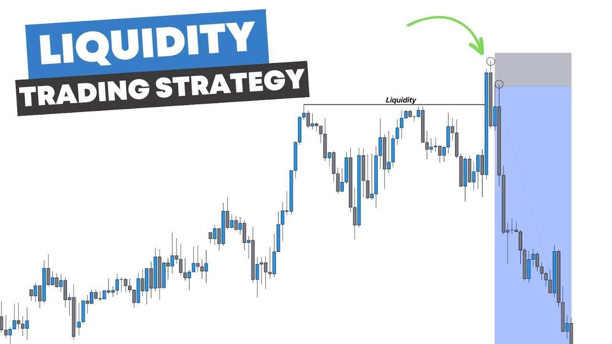

## Table of Contents

## What is liquidity in financial markets?

Liquidity in financial markets refers to how easily you can buy or sell an asset without causing a big change in its price. Think of it like a market where there are lots of buyers and sellers. If you want to sell something, and there are many people ready to buy it, you can sell it quickly and at a good price. This means the market is liquid. On the other hand, if there are few buyers, it might take a long time to sell, or you might have to lower the price a lot. This means the market is not very liquid.

Liquidity is important because it affects how safe and efficient the market is. When a market is liquid, it's easier for people to get in and out of investments. This can make them feel more confident about investing. For example, if you need to sell your stocks quickly to get cash, a liquid market helps you do that without losing much money. But if the market isn't liquid, it can be harder to sell your investments, and you might lose money trying to do so. So, liquidity is a key part of how well financial markets work.

## What does it mean to take liquidity in trading?

When someone talks about taking liquidity in trading, it means they are making a trade that uses up the orders that are already in the market. Imagine you want to buy a stock, and there are people who have already said they want to sell that stock at a certain price. When you buy from them, you are taking their liquidity because you are using up their sell orders.

This is important because it can affect the price of the stock. If there are a lot of people wanting to sell and you buy from them, you might not change the price much. But if there are only a few people wanting to sell, your buying can use up all their orders and push the price up. Traders need to think about this when they make their trades, especially if they are trading a lot of shares at once.

## How does a liquidity taking strategy differ from a liquidity providing strategy?

A liquidity taking strategy involves a trader buying or selling an asset by using the orders that are already in the market. This means the trader is taking away the liquidity that other traders have put into the market. For example, if you want to buy a stock, you look at the orders other people have placed to sell that stock and you buy from them. This can be good if you want to get in and out of a trade quickly, but it can also move the price a lot if there aren't many orders to take.

On the other hand, a liquidity providing strategy is when a trader puts their own orders into the market for others to use. Instead of taking away liquidity, they are adding it. For instance, if you want to sell a stock, you place an order at a certain price and wait for someone else to buy from you. This can be good if you want to earn a little bit of money from the difference between the price you set and the price someone is willing to pay, but it might take longer to complete the trade.

These two strategies are important because they help keep the market balanced. Liquidity takers help move prices and get trades done quickly, while liquidity providers help keep the market stable by always having orders available for others to use. Both roles are needed for a healthy and efficient market.

## What are the common types of orders used in liquidity taking strategies?

In liquidity taking strategies, traders often use market orders and aggressive limit orders. A market order is the simplest type of order where you tell your broker to buy or sell a stock right away at the best available price. This means you are taking the liquidity that other traders have put into the market. Market orders are good if you want to get into or out of a trade quickly, but they can also move the price a lot if there aren't many orders to take.

Aggressive limit orders are another type of order used in liquidity taking strategies. These are limit orders placed at or near the current market price. For example, if you want to buy a stock and the best sell order is at $50, you might place a buy limit order at $50.01 to make sure your order gets filled quickly. This type of order also takes liquidity from the market because it's designed to be filled right away, but it gives you a bit more control over the price compared to a market order.

Both market orders and aggressive limit orders are important tools for traders who want to take liquidity. They help traders get their trades done fast, which can be crucial in fast-moving markets. However, traders need to be careful because using these orders can sometimes lead to higher costs if the market moves against them.

## What are the potential benefits of using a liquidity taking strategy?

Using a liquidity taking strategy can help traders get into and out of trades quickly. When you use a market order or an aggressive limit order, you are taking the liquidity that other people have put into the market. This means you can buy or sell your stocks fast, which is good if you need to act right away. For example, if you see a good chance to make money and you want to jump on it, a liquidity taking strategy lets you do that without waiting.

Another benefit is that it can help you take advantage of short-term price movements. If you think the price of a stock is going to go up or down quickly, using a liquidity taking strategy can help you make a trade before the price changes too much. This can be especially useful in fast-moving markets where prices can change a lot in a short time. By taking liquidity, you can get in and out of these trades faster and possibly make more money.

## What are the risks associated with liquidity taking strategies?

When you use a liquidity taking strategy, you might face some risks. One big risk is that it can move the price a lot. If you buy or sell a lot of shares at once, you might use up all the orders that are already in the market. This can push the price up if you are buying, or down if you are selling. If the price moves against you, you might end up losing money. For example, if you want to buy a stock and there are only a few people selling, your buying can make the price go up a lot, and you might end up paying more than you wanted.

Another risk is that you might pay more in trading costs. When you use a market order or an aggressive limit order, you are often taking the best price that is available right away. This can mean you are paying a bit more to buy or getting a bit less when you sell. Over time, these extra costs can add up, especially if you are trading a lot. So, while a liquidity taking strategy can help you get into and out of trades quickly, it can also be more expensive and might not always be the best choice for everyone.

## How can market conditions influence the effectiveness of a liquidity taking strategy?

Market conditions can really change how well a liquidity taking strategy works. If the market is very busy with lots of people buying and selling, it's easier to take liquidity because there are plenty of orders to use. You can buy or sell quickly without moving the price too much. This is good for you because you can get into and out of trades fast, and you might not have to pay too much more for it. But if the market is quiet with not many people trading, it can be harder. Your trades might move the price a lot because there aren't enough orders to take. This means you might end up paying more to buy or getting less when you sell, which can be bad for you.

Also, the type of market you're in matters. In a market that moves a lot, like during big news events, a liquidity taking strategy can help you take advantage of quick price changes. You can jump into a trade right away and maybe make some money before the price shifts too much. But if the market is stable and not moving much, using this strategy might not be as helpful. You might not see big price changes to take advantage of, and the extra costs from taking liquidity might not be worth it. So, you need to think about what's happening in the market before you decide to use a liquidity taking strategy.

## What are some key indicators to monitor when implementing a liquidity taking strategy?

When you're using a liquidity taking strategy, it's important to keep an eye on the bid-ask spread. This is the difference between the highest price someone is willing to pay for a stock and the lowest price someone is willing to sell it for. A small bid-ask spread means the market is liquid, and it's easier for you to take liquidity without moving the price too much. But if the spread is big, it might be harder to take liquidity, and you might end up paying more or getting less than you wanted.

You should also watch the trading volume. This tells you how many shares of a stock are being bought and sold. If the volume is high, there are lots of people trading, and you can take liquidity more easily. But if the volume is low, there might not be enough orders for you to take, and your trades could move the price a lot. So, keeping an eye on these two things can help you decide when it's a good time to use a liquidity taking strategy.

## How can technology and algorithms enhance liquidity taking strategies?

Technology and algorithms can make liquidity taking strategies better by helping traders see and use the best prices in the market faster. With computers and special software, traders can look at a lot of information at once and make quick choices. For example, an algorithm can watch the market all the time and find the best time to buy or sell a stock. This means you can get into and out of trades faster and maybe pay less or get more money for your trades. Algorithms can also help you split big orders into smaller ones, so you don't move the price too much when you're taking liquidity.

Another way technology helps is by letting traders use different kinds of orders and trade in many markets at the same time. With the right tools, you can place market orders or aggressive limit orders very quickly across different places where stocks are traded. This can help you take liquidity from wherever it's easiest and cheapest. Plus, technology can help you keep track of important things like the bid-ask spread and trading volume, so you know when it's a good time to take liquidity. All these things together can make your liquidity taking strategy work better and help you make more money.

## What are the regulatory considerations for traders using liquidity taking strategies?

Traders using liquidity taking strategies need to be careful about following the rules set by financial regulators. These rules are there to make sure the market is fair and safe for everyone. For example, some regulators have rules about how fast you can trade and how much you can trade at once. This is to stop people from using technology to take too much liquidity and move the market in a way that's not fair. If you break these rules, you could get in trouble and have to pay fines or even be banned from trading.

Also, there are rules about how you report your trades. When you take liquidity, you need to make sure you're telling the right people about your trades in the right way. This helps keep the market open and honest. Regulators want to know what's happening in the market so they can watch for anything that might be wrong. So, if you're using a liquidity taking strategy, you need to keep up with these rules and make sure you're doing everything the right way.

## How do liquidity taking strategies adapt to different asset classes?

Liquidity taking strategies can be different depending on what kind of asset you're trading. For stocks, these strategies often work well because there are usually lots of people buying and selling. You can use market orders or aggressive limit orders to quickly buy or sell stocks without moving the price too much. But if you're trading something less common, like a small company's stock, it might be harder to take liquidity because there aren't as many orders to use. You might have to be more careful and maybe break your big orders into smaller ones to avoid moving the price a lot.

For other assets like forex or commodities, liquidity taking strategies can also be useful, but you need to think about how these markets work. In the forex market, where currencies are traded, there's usually a lot of liquidity because it's a big market with people trading all the time. You can take liquidity easily, but you still need to watch the bid-ask spread and trading volume to make sure you're not paying too much. In the commodities market, like trading oil or gold, liquidity can change a lot depending on what's happening in the world. You might need to adjust your strategy based on these changes to make sure you're taking liquidity at the right time and not moving the price too much.

## What advanced techniques can be used to optimize liquidity taking in highly competitive markets?

In highly competitive markets, traders can use smart order routing to optimize liquidity taking. This means using special software that looks at different places where you can trade the same asset and picks the best one for your order. For example, if you want to buy a stock, the software can find the place where you can get the best price and the most liquidity. This helps you take liquidity without moving the price too much. Another technique is to use iceberg orders, where you hide part of your big order so other traders don't see it all at once. This can help you take liquidity slowly without scaring other traders away and making the price move against you.

Another advanced technique is to use algorithms that can change how they trade based on what's happening in the market. These algorithms can watch things like the bid-ask spread and trading volume and decide the best time to take liquidity. For example, if the market is very busy, the algorithm might take liquidity quickly. But if the market is quiet, it might wait or break up your order into smaller pieces to avoid moving the price too much. By using these techniques, traders can get into and out of trades more smoothly, even in markets where everyone is trying to do the same thing.

## How can one handle commissions and manage risk limits effectively?

High-frequency trading (HFT) strategies inherently operate with high volumes of trades, making them particularly sensitive to transaction costs, such as commissions and fees. Given the sheer scale of transactions, even seemingly minor costs can significantly impact the overall profitability of an HFT strategy. Thus, incorporating these costs into profit and loss (PnL) calculations is crucial for accurate profitability analysis.

Calculating the net PnL for a trading strategy can be expressed as:

$$
\text{Net PnL} = \text{Gross PnL} - \text{Transaction Costs}
$$

where:

- $\text{Gross PnL}$ is the profit or loss before accounting for transaction costs.
- $\text{Transaction Costs}$ include all commissions and fees incurred by executing trades.

To ensure profitability, it is necessary to estimate these costs pre-trade and include them in the PnL estimates. Consider a simplified Python code snippet that outlines how one might calculate expected PnL with transaction costs:

```python
def calculate_net_pnl(gross_pnl, commission_rate, trade_volume):
    transaction_costs = commission_rate * trade_volume
    net_pnl = gross_pnl - transaction_costs
    return net_pnl
```

In addition to considering transaction costs, robust risk management is essential for the success and sustainability of HFT strategies. A vital component of risk management is setting position limits to limit market exposure. This practice helps mitigate potential losses due to adverse market movements. Position limits can be set based on a variety of factors, including market volatility, liquidity, and the overall risk appetite of the trading entity.

For instance, a maximum position limit can be defined to cap the total value of assets held at any time. This not only reduces the risk of excessive market exposure but also ensures compliance with regulatory requirements, which often mandate such limits to manage systemic risk.

In summary, addressing transaction costs and implementing effective risk management strategies are crucial elements in optimizing the profitability and sustainability of liquidity-taking strategies in algorithmic trading. By carefully accounting for these factors, traders can enhance their decision-making process and improve overall strategy performance.

## References & Further Reading

[1]: Bergstra, J., Bardenet, R., Bengio, Y., & Kégl, B. (2011). ["Algorithms for Hyper-Parameter Optimization."](https://papers.nips.cc/paper/4443-algorithms-for-hyper-parameter-optimization) Advances in Neural Information Processing Systems 24.

[2]: ["Advances in Financial Machine Learning"](https://www.amazon.com/Advances-Financial-Machine-Learning-Marcos/dp/1119482089) by Marcos Lopez de Prado

[3]: ["Evidence-Based Technical Analysis: Applying the Scientific Method and Statistical Inference to Trading Signals"](https://www.amazon.com/Evidence-Based-Technical-Analysis-Scientific-Statistical/dp/0470008741) by David Aronson

[4]: ["Machine Learning for Algorithmic Trading"](https://github.com/stefan-jansen/machine-learning-for-trading) by Stefan Jansen

[5]: ["Quantitative Trading: How to Build Your Own Algorithmic Trading Business"](https://books.google.com/books/about/Quantitative_Trading.html?id=j70yEAAAQBAJ) by Ernest P. Chan