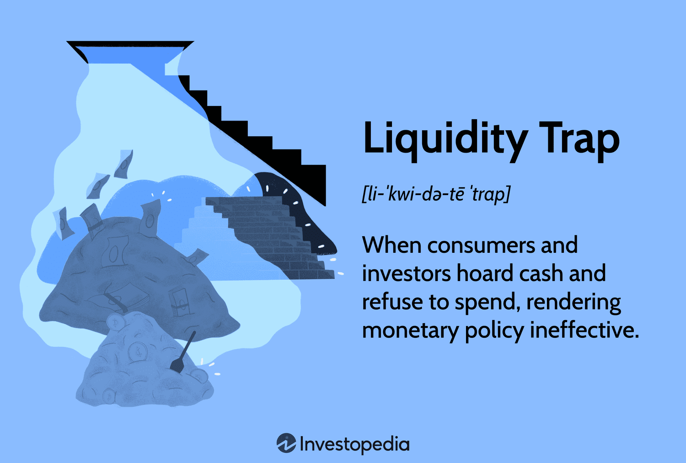

Liquidity traps, monetary policy, economic theory, and algorithmic trading are interconnected economic and financial concepts that significantly influence the global market. Understanding their interplay is essential for comprehending the broader dynamics of modern economies.

A liquidity trap occurs when interest rates are low, rendering monetary policy ineffective in stimulating economic growth. In such scenarios, consumers and businesses prefer holding cash over investing or spending, stagnating the economy despite central banks' efforts. This creates a challenging environment for policymakers.



Monetary policy, primarily managed by central banks, aims to control money supply and interest rates to foster economic stability and growth. Tools like interest rate adjustments and quantitative easing are often deployed to influence economic activity. However, in liquidity traps, these traditional approaches may fall short, necessitating innovative strategies to rejuvenate stagnating economies.

Economic theories developed by Keynes and others provide insights into managing liquidity traps. Keynesian economics suggests increased government spending to boost demand during periods of low economic activity. Similarly, modern theories, including Modern Monetary Theory (MMT), challenge conventional wisdom by proposing new methods for managing liquidity during economic downturns.

Algorithmic trading employs computer algorithms to execute trades at high speeds in financial markets, often using data-driven economic theories and indicators, including those related to liquidity conditions. These algorithms can adjust trading strategies in real-time based on prevailing market conditions, including signals of liquidity traps, offering a nuanced approach to market participation.

Addressing liquidity traps within economic policymaking and algorithmic trading frameworks is crucial for maintaining financial stability and promoting growth. As these concepts become increasingly entwined, a multidisciplinary approach is essential to crafting robust economic policies and innovative trading strategies that can effectively navigate the challenges posed by liquidity traps. This understanding sets the stage for exploring their implications and potential solutions in the following sections of this article.

## Table of Contents

## Understanding Liquidity Traps

A [liquidity](/wiki/liquidity-risk-premium) trap is an economic condition occurring when interest rates are extremely low and savings rates are high, rendering monetary policy ineffective. In this scenario, consumers and businesses choose to secure their money instead of investing or spending it, even if central banks attempt to stimulate the economy by increasing the money supply. This situation can severely hamper economic growth as the circulation of money in the economy stagnates.

Historically, the concept of a liquidity trap was popularized by John Maynard Keynes during the Great Depression of the 1930s. Keynes theorized that in times of economic downturn, increases in the money supply would not necessarily lead to increased spending or investment. Instead, individuals and firms might hoard money expecting further economic decline, thus rendering monetary policy impotent. This has raised significant implications on how economies recover from downturns, particularly when interest rates are at or near zero.

Signs of a liquidity trap include an economy characterized by stagnant growth despite monetary policy interventions. Extreme increases in the monetary base, yet continuing deflation or very low inflation, may also indicate the presence of a liquidity trap. Causes include heightened uncertainty, which prompts high savings rates, a saturation in borrowing among businesses and consumers, and the ineffective transmission of monetary policy from central banks to the broader economy.

Real-world instances of liquidity traps are exemplified by Japan's Lost Decade and the 2008 Financial Crisis. During Japan's Lost Decade in the 1990s, the country's economy was marked by low growth, deflation, and near-zero interest rates, despite the government's attempts to stimulate economic activity. The 2008 Financial Crisis similarly saw major economies like the United States encountering liquidity traps. Despite aggressive measures such as slashing interest rates and implementing quantitative easing, economic growth was sluggish as financial institutions tightened lending standards, and consumers increased savings in response to economic uncertainty.

## Monetary Policy and Its Challenges

Central banks play a vital role in implementing monetary policy to mitigate the effects of liquidity traps, where traditional monetary tools lose their effectiveness due to extremely low interest rates and hoarded cash by consumers and businesses. In such scenarios, central banks employ a variety of strategies, including [interest rate](/wiki/interest-rate-trading-strategies) adjustments, quantitative easing (QE), and negative interest rates, to stimulate economic activity.

**Interest Rate Adjustments** are the most conventional tool, where central banks lower rates to encourage borrowing and investment. However, in a liquidity trap, even zero or near-zero interest rates might not boost spending, as the incentive to hold onto cash remains significant despite low borrowing costs. 

**Quantitative Easing** involves central banks purchasing government securities or other financial assets to inject liquidity into the economy. This approach increases the money supply and lowers long-term interest rates, thus encouraging lending and investment. The effectiveness of QE can be significant in altering asset prices and yields, yet its impact on actual economic growth remains debated. Critics argue that QE may lead to asset bubbles without adequately boosting productive investment.

**Negative Interest Rates** are a more unconventional tool used when standard rate cuts are insufficient. By charging banks for holding excess reserves, central banks aim to push banks to lend more. Despite the innovative approach, negative rates may harm banking sector profitability and also have limited success as savers may not significantly change their behavior.

During the COVID-19 pandemic, these tools faced unprecedented challenges. Central banks worldwide, including the Federal Reserve, the European Central Bank, and the Bank of Japan, slashed rates and launched extensive QE programs to counter severe economic downturns. While these measures provided crucial liquidity relief, they also highlighted the limits of monetary policy in stimulating demand during lockdowns and high uncertainty. The pandemic emphasized the necessity for fiscal policy measures alongside monetary tools to address structural issues in the economy.

In conclusion, while central banks are equipped with a range of monetary policy instruments to combat liquidity traps, these tools have limitations, especially in severe economic conditions. The effectiveness of these strategies often depends on complementary fiscal policies and structural reforms to achieve comprehensive economic recovery and growth.

## Economic Theory and Liquidity Traps

Liquidity traps are a key concept in economic theory, particularly in the context of Keynesian economics and Modern Monetary Theory (MMT). A liquidity trap occurs when nominal interest rates are at or near zero, rendering monetary policy ineffective in stimulating economic growth. The traditional tools used by central banks become less effective since individuals and businesses prefer to hold cash rather than invest in higher-risk, low-return assets.

John Maynard Keynes first articulated the notion of a liquidity trap in the 1930s, proposing that during a downturn, conventional monetary policy may not be sufficient to spur economic recovery. Keynes argued that when interest rates are low, people may anticipate that they will rise in the future, leading them to hold on to cash rather than invest, anticipating better returns later. This hoarding can dampen economic demand and slow down recovery. In such scenarios, Keynesian economics advocates for increased government spending to boost demand and break the cycle of stagnation.

On the other hand, Modern Monetary Theory offers a different lens through which to view liquidity traps. MMT suggests that a government that issues its own currency can never "run out" of money in the same way a business or individual can. Proponents of MMT argue that in a liquidity trap, fiscal policy should take precedence over monetary policy, positing that government deficit spending can directly increase aggregate demand and economic activity without the constraints typically associated with deficit financing.

The debates surrounding liquidity traps and their management often revolve around the effectiveness and potential risks of these approaches. Critics of Keynesian economics argue that excessive government spending can lead to inefficiencies and long-term debt issues. Conversely, critics of MMT caution against unchecked government spending, warning it could lead to inflationary pressures once the economy exits the liquidity trap.

Comparatively, monetarists emphasize that inflation control should remain a primary focus and advocate for rules-based monetary policy. In contrast, the Austrian School of economics posits that market corrections can occur naturally over time without government intervention.

The conversation about liquidity traps, therefore, extends beyond merely identifying and managing them, encompassing broader economic philosophies about the role of government, the efficacy of monetary versus fiscal policy, and the potential long-term consequences of different economic strategies. Understanding these varied perspectives provides insights into the complexities associated with managing liquidity traps and informs policy decisions that aim for economic stability and growth.

## Algorithmic Trading and Economic Theories

Algorithmic trading has revolutionized financial markets by leveraging computational algorithms to execute trades at speeds and volumes previously unimaginable. Such systems can be designed to incorporate various economic theories, including those related to liquidity traps, to enhance trading performance and risk management. 

Liquidity traps occur when low interest rates fail to stimulate economic activity, rendering traditional monetary policy tools ineffective. This presents a challenge for traders as liquidity conditions can significantly influence market dynamics. Algorithmic trading systems can incorporate economic predictions related to these conditions by integrating data that flags potential liquidity trap-like scenarios. Algorithms use historical and real-time economic data to shape trading strategies, enabling dynamic adjustment based on changes in interest rates and monetary policy signals.

The impact of liquidity conditions on trading strategies can be profound. During a liquidity trap, conventional market predictors may lose relevance, requiring algorithms to adapt to altered market behaviours. For instance, when interest rates approach or reach zero, algorithms can shift focus from interest rate differentials to other financial indicators, such as inflation expectations or fiscal policy changes. 

To identify and respond to indicators of liquidity traps, algorithms can implement [machine learning](/wiki/machine-learning) models trained on macroeconomic and financial datasets. These models can identify patterns or anomalies suggestive of a liquidity trap, such as sustained low-interest rates and weak economic growth. By doing so, algorithms can signal shift strategies, such as moving from interest rate-sensitive assets to commodities or sectors benefiting from fiscal stimulus.

Python provides tools such as pandas and scikit-learn that are particularly useful in processing large datasets and implementing machine learning models for these purposes. For instance, the following Python snippet demonstrates a basic setup for employing a machine learning model to detect potential liquidity traps:

```python
import pandas as pd
from sklearn.ensemble import RandomForestClassifier

# Load dataset containing historical macroeconomic data
data = pd.read_csv('macroeconomic_data.csv')

# Features used: interest rates, inflation rates, GDP growth
features = data[['interest_rate', 'inflation_rate', 'gdp_growth']]
labels = data['liquidity_trap']  # Binary label: 1 indicates a liquidity trap

# Splitting the data into training and test datasets
from sklearn.model_selection import train_test_split
X_train, X_test, y_train, y_test = train_test_split(features, labels, test_size=0.3, random_state=42)

# Train a Random Forest model
model = RandomForestClassifier(n_estimators=100, random_state=42)
model.fit(X_train, y_train)

# Predict and evaluate the model
predictions = model.predict(X_test)

# Printing out the accuracy of the model
from sklearn.metrics import accuracy_score
print("Model Accuracy:", accuracy_score(y_test, predictions))
```

This basic example uses a random forest classifier to predict the presence of liquidity traps from historical economic indicators. Beyond identifying such macroeconomic constraints, trading algorithms can integrate strategies that capitalize on opportunities these environments present, such as investing in non-cyclical stocks or government bonds with positive real yields during prolonged periods of low rates.

By aligning algorithmic models with economic theories on liquidity traps, traders can better navigate the challenges presented by these conditions, optimizing their strategies for both stability and profitability in uncertain market environments.

## Integrating Policy Solutions for Future Stability

To address liquidity traps effectively, policymakers have increasingly recognized the importance of integrating fiscal policy and structural reforms alongside traditional monetary measures. Liquidity traps occur when interest rates are low, and savings rates are high, rendering monetary policy instruments less effective. This necessitates a broader approach involving fiscal stimulus and structural adjustments to rejuvenate economic activity.

Fiscal policies play a critical role in tandem with monetary measures by stimulating demand through government spending, tax incentives, and public investments. When monetary policy is insufficient, fiscal interventions can complement by injecting direct spending into the economy. Government spending on infrastructure projects, for example, not only creates jobs but also enhances long-term productivity through improved logistics and transportation networks. Public investment in technology and renewable energy sectors can spur innovation and sustainability, driving economic growth beyond the short term.

Tax incentives serve as another fiscal tool to influence economic behavior. By offering tax breaks or credits, governments can incentivize businesses to invest in capital expansion or research and development. This can lead to increased production capacity and innovation, which are vital for overcoming periods of economic stagnation associated with liquidity traps. Moreover, targeted tax reductions for low and middle-income earners can increase disposable income, thus driving consumption—a key component of aggregate demand.

Structural reforms, on the other hand, are essential for addressing deep-rooted inefficiencies that hinder economic growth. These reforms may include deregulation efforts to reduce bureaucratic hurdles, thus fostering a more business-friendly environment. Labor market reforms aimed at increasing workforce flexibility and competitiveness can also support economic recovery by aligning workforce skills with market demands. 

When evaluating past policy integration attempts, critical lessons emerge. Japan’s experience during its Lost Decade highlights both the challenges and necessity of timely and coordinated policy interventions. Initial reliance on monetary measures proved inadequate, emphasizing the need for synchronized fiscal policies and structural reforms. Similarly, during the 2008 Financial Crisis, countries that implemented comprehensive policy packages, including fiscal stimuli alongside monetary easing, generally experienced quicker recoveries.

The COVID-19 pandemic provides a recent example of policy integration's importance. Governments worldwide implemented expansive fiscal measures combined with innovative monetary policies to prevent economic collapse. These interventions highlighted the significance of agile policy frameworks that can quickly adapt to unforeseen global challenges.

In conclusion, addressing liquidity traps effectively requires a multidisciplinary approach that transcends monetary policy alone. The integration of fiscal measures, such as strategic government spending and tax incentives, with structural reforms offers a comprehensive strategy for economic stabilization and growth. Policymakers must continue to learn from past experiences to develop robust, adaptable economic systems capable of enduring future uncertainties.

## Conclusion

Liquidity traps present a significant challenge to economies worldwide, often rendering conventional monetary policy tools ineffective. These traps occur when nominal interest rates are at or near zero, inhibiting central banks' ability to stimulate economic activity through typical means such as rate cuts or quantitative easing. Historical examples, such as Japan's Lost Decade and the 2008 Financial Crisis, illustrate the profound impact liquidity traps can have on economic growth and stability.

Monetary policy, the primary tool for managing economic cycles, encounters considerable challenges in liquidity traps. Traditional methods like interest rate adjustments and even unconventional tools such as negative interest rates and quantitative easing may fail to stimulate demand sufficiently. During the COVID-19 pandemic, for instance, several central banks implemented emergency monetary measures, yet the effectiveness of these interventions remained under scrutiny.

Algorithmic trading, which has become a dominant force in financial markets, presents both challenges and opportunities concerning liquidity conditions. By integrating economic theories and tracking indicators of liquidity traps, advanced trading algorithms can potentially anticipate market movements, responding proactively to economic signals. This integration emphasizes the need for cohesiveness between economic theory and practical trading strategies.

Addressing liquidity traps requires a multidisciplinary approach, combining monetary and fiscal policies with structural reforms. Beyond immediate measures, government spending, tax incentives, and public investment play critical roles in stimulating demand and fostering economic resilience. Evaluating past policy integrations provides valuable insights for future strategies to combat liquidity issues effectively.

Looking ahead, developing robust economic systems capable of managing liquidity traps is imperative for ensuring long-term growth. Multidisciplinary approaches that leverage economic theories, algorithmic innovations, and coordinated policy efforts stand to create more adaptive and resilient economic frameworks. Such systems are crucial in navigating complex economic challenges and achieving sustainable growth trajectories.

## References & Further Reading

[1]: Keynes, J. M. (1936). ["The General Theory of Employment, Interest, and Money."](https://www.files.ethz.ch/isn/125515/1366_KeynesTheoryofEmployment.pdf) Palgrave Macmillan.

[2]: Krugman, P. (1998). ["It's Baaack: Japan's Slump and the Return of the Liquidity Trap."](https://www.brookings.edu/wp-content/uploads/1998/06/1998b_bpea_krugman_dominquez_rogoff.pdf) Brookings Papers on Economic Activity, 1998(2), 137-205.

[3]: Bernanke, B. S. (2000). ["Japanese Monetary Policy: A Case of Self-Induced Paralysis?"](https://www.princeton.edu/~pkrugman/bernanke_paralysis.pdf) In Japan's Financial Crisis and Its Parallels to U.S. Experience, NBER Chapters.

[4]: Eichengreen, B. (2015). ["Hall of Mirrors: The Great Depression, the Great Recession, and the Uses-and Misuses-of History."](https://archive.org/details/hallofmirrorsgre0000eich) Oxford University Press.

[5]: Wray, L. R. (2015). ["Modern Money Theory: A Primer on Macroeconomics for Sovereign Monetary Systems."](https://link.springer.com/book/10.1057/9781137265142) Palgrave Macmillan.

[6]: Nakamura, E., & Steinsson, J. (2018). ["Identification in Macroeconomics."](https://www.aeaweb.org/articles?id=10.1257/jep.32.3.59) Journal of Economic Literature, 56(3), 1075-1113.

[7]: Lopez de Prado, M. (2018). ["Advances in Financial Machine Learning."](https://www.amazon.com/Advances-Financial-Machine-Learning-Marcos/dp/1119482089) Wiley.

[8]: Kose, M. A., Sugawara, N., & Terrones, M. E. (2020). ["Global Recessions."](https://documents1.worldbank.org/curated/en/185391583249079464/pdf/Global-Recessions.pdf) Journal of International Economics, 127, 103391.