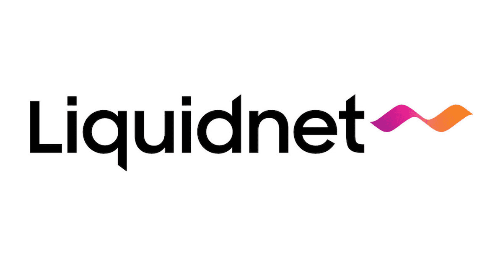

## Table of Contents

## What is Liquidnet?

Liquidnet is a company that helps big investors buy and sell large amounts of stocks without affecting the stock's price too much. It's like a special club where members can trade stocks quietly and directly with each other, away from the public stock exchanges. This is useful because when big investors try to trade on public exchanges, their large orders can move the stock price a lot, which they want to avoid.

Liquidnet uses technology to match buyers and sellers. When someone wants to buy or sell a stock, Liquidnet's system looks for someone who wants to do the opposite trade. If it finds a match, it helps them trade directly with each other. This makes trading easier and more private for big investors, and it can save them money because they don't have to worry about their trades affecting the market as much.

## How does Liquidnet function as a trading platform?

Liquidnet works as a special trading platform where big investors can trade large amounts of stocks quietly. It's like a private club where members can buy and sell stocks directly with each other, away from the busy public stock exchanges. This is important because when big investors trade on public exchanges, their large orders can move the stock price a lot, which they want to avoid. Liquidnet helps them keep their trades secret and smooth.

The platform uses smart technology to match buyers and sellers. When an investor wants to buy or sell a stock, Liquidnet's system searches for another member who wants to do the opposite trade. If it finds a match, it helps them trade directly with each other. This makes trading easier and more private for big investors, and it can save them money because they don't have to worry about their trades affecting the market as much.

## Who can use Liquidnet services?

Liquidnet is for big investors who want to trade large amounts of stocks without making a big fuss. These investors are usually from big companies like banks, pension funds, or investment firms. They need a special place to trade because their big orders can move stock prices a lot if done on public exchanges.

To use Liquidnet, you have to be a member. It's like joining a private club where only certain people can come in. Once you're a member, you can use Liquidnet's smart technology to find other members who want to trade the same stocks as you, but in the opposite way. This way, you can buy and sell stocks quietly and directly with each other.

## What types of securities can be traded on Liquidnet?

Liquidnet is a special place where big investors can trade different types of securities without making a big fuss. The main type of security you can trade on Liquidnet is stocks. These are shares in companies that people can buy and sell. Big investors like to trade stocks on Liquidnet because they can do it quietly and directly with other members.

Besides stocks, Liquidnet also lets you trade bonds. Bonds are like loans that investors give to companies or governments, and they get paid back with interest. Trading bonds on Liquidnet helps big investors because they can find other members who want to trade the same bonds, but in the opposite way. This makes trading smoother and more private for them.

## How does Liquidnet ensure the anonymity of its users?

Liquidnet keeps its users' identities secret by using a special system that hides who is buying and selling. When someone wants to trade, they don't see the other person's name or details. Instead, Liquidnet's technology matches buyers and sellers without revealing who they are. This way, big investors can trade without worrying about others knowing it's them.

The platform also uses a thing called "dark pools" to keep trades private. Dark pools are like hidden places where trades happen away from the public eye. When a trade is made, it's not shown on the public stock exchanges, so other people can't see what's happening. This helps keep the trades quiet and makes sure that the big investors' actions don't affect the stock prices too much.

## What are the benefits of using Liquidnet for institutional investors?

Using Liquidnet helps big investors, like those from banks or pension funds, trade large amounts of stocks and bonds without causing a big fuss. When these investors trade on public exchanges, their big orders can move stock prices a lot. But with Liquidnet, they can trade quietly and directly with other members. This means they don't have to worry about their trades affecting the market as much, which can save them money and help them get better prices.

Liquidnet also keeps the investors' identities a secret. When they trade, they don't see who they are trading with. This anonymity is important because it lets them make moves without others knowing it's them. Plus, Liquidnet's special technology matches buyers and sellers quickly and efficiently, making the whole trading process smoother and easier for these big investors.

## How does Liquidnet's technology facilitate large block trades?

Liquidnet's technology helps big investors trade large blocks of stocks and bonds by matching them with other investors who want to do the opposite trade. When a big investor wants to buy or sell a large amount, Liquidnet's system searches through its network of members to find someone who wants to do the opposite. This way, they can trade directly with each other without going through public exchanges where their big orders might move the stock price.

The platform uses smart algorithms to make sure these big trades happen smoothly and quickly. It keeps the trades private by using something called "dark pools," which are hidden places where trades happen away from the public eye. This privacy helps big investors trade without other people knowing it's them, which can prevent the market from reacting to their big moves.

## What is the significance of Liquidnet's global reach in trading?

Liquidnet's global reach is important because it lets big investors trade stocks and bonds all around the world. When you can trade in different countries, you have more choices and can find better deals. For example, if a big investor in the United States wants to buy stocks from a company in Japan, they can use Liquidnet to find someone in Japan who wants to sell those stocks. This makes it easier for investors to grow their portfolios and manage their money on a global scale.

Having a global network also helps keep trades private and efficient. Liquidnet's technology can match buyers and sellers from different countries quickly, so big trades can happen without causing a big fuss in the market. This is good for big investors because they can trade large amounts without worrying about moving stock prices too much. It also means they can take advantage of opportunities in different markets around the world, which can help them make smarter investment choices.

## How does Liquidnet comply with regulatory requirements across different jurisdictions?

Liquidnet works hard to follow the rules in different countries where it operates. It knows that each place has its own laws about trading and investing, so it makes sure to understand and follow all these rules. For example, in the United States, Liquidnet follows rules set by the Securities and Exchange Commission (SEC). In Europe, it follows rules from the European Securities and Markets Authority (ESMA). By doing this, Liquidnet keeps its trading platform safe and fair for everyone.

To make sure it's always following the rules, Liquidnet has special teams that keep an eye on changes in laws around the world. These teams work to update Liquidnet's systems and practices so they stay in line with new rules. This way, big investors can use Liquidnet without worrying about breaking any laws. It helps them trade confidently, knowing that Liquidnet is doing everything right.

## What are some case studies or examples of successful trades executed on Liquidnet?

One successful trade on Liquidnet involved a large pension fund that wanted to buy a big block of shares in a well-known tech company. The pension fund needed to keep the trade secret because it didn't want to affect the stock price. Liquidnet's technology quickly found a matching seller from another big investment firm. They traded directly with each other in Liquidnet's dark pool, and the trade was done smoothly without causing any big moves in the stock price. This helped the pension fund get a good price and keep its trade private.

Another example is when a big bank wanted to sell a large amount of bonds from a European company. The bank used Liquidnet to find buyers who were interested in those bonds. Liquidnet's global reach helped connect the bank with investors from different countries, and they were able to complete the trade efficiently. This trade showed how Liquidnet can help big investors manage their money on a global scale while keeping their actions quiet and efficient.

## How does Liquidnet integrate with other financial systems and platforms?

Liquidnet works well with other financial systems and platforms to make trading easier for big investors. It connects with big trading systems like Bloomberg and Reuters, which are like big networks where lots of financial information and trading happens. When Liquidnet is connected to these systems, its members can use them to find more trading opportunities and get real-time information about the market. This helps them make better trading decisions and trade more smoothly.

Liquidnet also uses something called APIs, which are like special tools that let different computer systems talk to each other. These APIs help Liquidnet's technology work with other trading platforms and financial software. For example, big investors can use their own trading software and still use Liquidnet to find and complete trades. This integration makes it easier for them to manage their trades and keep everything working together smoothly.

## What future developments or innovations can we expect from Liquidnet?

In the future, Liquidnet might come up with new ways to help big investors trade even better. They could use more smart technology, like [artificial intelligence](/wiki/ai-artificial-intelligence), to find matches for trades faster and more accurately. This would make trading even smoother and help big investors get the best prices for their stocks and bonds. Liquidnet might also work on making their platform easier to use, so big investors can trade without any trouble.

Another thing Liquidnet might do is expand its services to more types of investments. Right now, they mainly help with stocks and bonds, but they could start helping with other things like ETFs or even cryptocurrencies. This would give big investors more options and help them manage their money in new ways. By keeping up with new trends and technologies, Liquidnet can stay a helpful tool for big investors around the world.

## References & Further Reading

[1]: Aldridge, I. (2013). ["High-Frequency Trading: A Practical Guide to Algorithmic Strategies and Trading Systems."](https://www.amazon.com/High-Frequency-Trading-Practical-Algorithmic-Strategies/dp/1118343506) John Wiley & Sons.

[2]: Narang, R. (2013). ["Inside the Black Box: A Simple Guide to Quantitative and High-Frequency Trading."](https://onlinelibrary.wiley.com/doi/book/10.1002/9781118662717) John Wiley & Sons.

[3]: ["Markets in Financial Instruments Directive (MiFID II)."](https://eur-lex.europa.eu/legal-content/EN/TXT/?uri=celex%3A32014L0065) European Commission.

[4]: Treleaven, P., Galas, M., & Lalchand, V. (2013). ["Algorithmic Trading Review."](https://www.researchgate.net/publication/262239006_Algorithmic_Trading_Review) Communications of the ACM, 56(11), 76-85.

[5]: Gomber, P., Arndt, B., Lutat, M., & Uhle, T. (2011). ["High-frequency trading."](https://papers.ssrn.com/sol3/papers.cfm?abstract_id=1858626) The Financial Review, 46(2), 287-309.