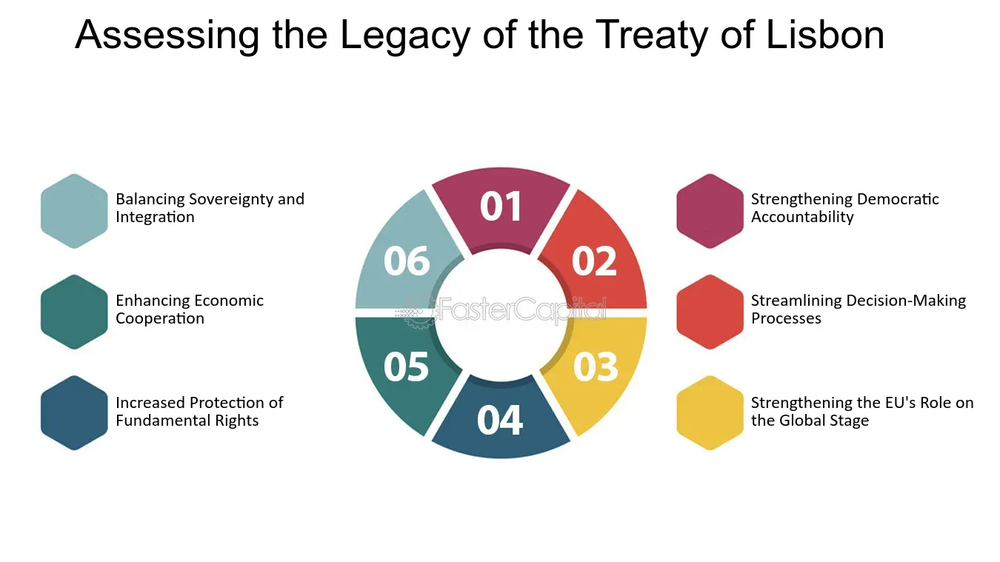

## Table of Contents

## What is the Lisbon Treaty?

The Lisbon Treaty is an important agreement that changed how the European Union (EU) works. It was signed in 2007 and started working in 2009. The treaty made the EU's rules easier to understand and made decision-making faster. It also gave more power to the European Parliament, which is like a big group of people elected to represent citizens of the EU countries.

One big change from the Lisbon Treaty was the creation of the position of the President of the European Council. This person helps lead meetings of the leaders from all the EU countries. Another change was that the EU got its own way to make laws and handle problems without always needing to ask each country for permission. This made the EU stronger and more able to act quickly when needed.

## When was the Lisbon Treaty signed and when did it come into effect?

The Lisbon Treaty was signed on December 13, 2007. This was a big day because leaders from all the European Union countries came together in Lisbon, Portugal, to sign the treaty. It was a step towards making the EU work better and faster.

The treaty came into effect on December 1, 2009. This means that from that date, the new rules and changes started being used in the EU. It helped the EU to make decisions more quickly and gave more power to the European Parliament, which represents the people of the EU countries.

## What were the main objectives of the Lisbon Treaty?

The Lisbon Treaty aimed to make the European Union work better and be more efficient. Before the treaty, making decisions in the EU was slow because all countries had to agree on everything. The treaty changed this by allowing more decisions to be made with a majority vote instead of needing everyone to agree. This made the EU faster at solving problems and getting things done. The treaty also made the EU's rules and laws easier to understand, which helped everyone know what the EU was doing.

Another big goal of the Lisbon Treaty was to give more power to the European Parliament. This is important because the Parliament is made up of people elected by EU citizens, so it represents the people's voice. By giving the Parliament more say in making laws, the treaty made the EU more democratic. The treaty also created new positions like the President of the European Council to help lead the EU and make it stronger. Overall, the Lisbon Treaty wanted to make the EU better at working together and responding to the needs of its citizens.

## What were the key changes introduced by the Lisbon Treaty?

The Lisbon Treaty made big changes to how the European Union works. One key change was that it made decision-making faster and easier. Before, all EU countries had to agree on everything, which took a long time. The treaty changed this by allowing more decisions to be made with a majority vote, so the EU could act quicker when needed. It also made the EU's rules and laws simpler and easier to understand, which helped everyone know what was going on.

Another important change was giving more power to the European Parliament. This group of people is elected by EU citizens, so it represents their voices. By letting the Parliament have more say in making laws, the treaty made the EU more democratic. The treaty also created new positions, like the President of the European Council, to help lead the EU. This person helps guide meetings of leaders from all EU countries, making the EU stronger and better at working together.

## How did the Lisbon Treaty affect the European Union's institutional framework?

The Lisbon Treaty changed how the European Union's institutions work by making them more efficient and democratic. Before the treaty, making decisions in the EU was slow because all countries needed to agree on everything. The treaty changed this by allowing more decisions to be made with a majority vote. This means that the EU can now act faster when there's a problem. The treaty also made the EU's rules and laws easier to understand, which helps everyone know what the EU is doing.

Another big change was giving more power to the European Parliament. This group of people is elected by EU citizens, so it represents their voices. By letting the Parliament have more say in making laws, the treaty made the EU more democratic. The treaty also created new positions like the President of the European Council. This person helps lead meetings of leaders from all EU countries, making the EU stronger and better at working together. These changes made the EU's institutional framework more effective and responsive to its citizens.

## What was the process of ratification for the Lisbon Treaty in different EU countries?

The process of ratifying the Lisbon Treaty was different in each EU country. Most countries chose to approve the treaty through their parliaments. This meant that the elected representatives in each country voted on whether to accept the treaty. For example, in Germany, the parliament voted to approve the treaty, and then the Constitutional Court checked to make sure it was okay with their laws. In some countries, like France and the Netherlands, they had already held referendums on a similar treaty before, so they chose to use their parliaments this time.

However, Ireland was different because they decided to hold a referendum, which means the people voted on it directly. In the first vote in 2008, the Irish people said no to the treaty. But after some changes and more talks, Ireland held another referendum in 2009, and this time, the people voted yes. Once all countries had ratified the treaty, it could come into effect. This process showed how important it was for all EU countries to agree before making big changes to how the EU works.

## How has the Lisbon Treaty impacted the decision-making process within the EU?

The Lisbon Treaty made the decision-making process in the EU faster and easier. Before the treaty, all EU countries had to agree on everything, which could take a long time. The treaty changed this by allowing more decisions to be made with a majority vote. This means that if most countries agree, the decision can go ahead without everyone saying yes. This change helped the EU act quicker when there are problems or when they need to make new laws.

The treaty also gave more power to the European Parliament, which is made up of people elected by EU citizens. This made the EU more democratic because the Parliament represents the voices of the people. With more say in making laws, the Parliament can now influence decisions more directly. Overall, these changes made the EU's decision-making process more efficient and responsive to what its citizens want.

## What are the criticisms and controversies surrounding the Lisbon Treaty?

Some people did not like the Lisbon Treaty because they thought it made the European Union too powerful. They worried that the EU was taking away too much control from individual countries. For example, the treaty allowed more decisions to be made with a majority vote instead of needing everyone to agree. Critics said this could mean that smaller countries might not have as much say as bigger ones. There were also concerns about the new positions created, like the President of the European Council, because some people felt these roles were too similar to having a leader of Europe, which they did not want.

Another big issue was how the treaty was approved. In most countries, the parliaments voted on it, but Ireland held a referendum where the people voted directly. The first time, the Irish people said no, which caused a lot of debate and delays. Some people thought that all countries should have held referendums, not just Ireland, to make sure everyone's voice was heard. This led to arguments about democracy and whether the treaty was really what the people wanted. Overall, these criticisms and controversies showed that changing how the EU works can be very complicated and can lead to a lot of different opinions.

## How has the Lisbon Treaty influenced the EU's foreign policy and international role?

The Lisbon Treaty helped the European Union be better at working together on foreign policy and having a bigger role in the world. Before the treaty, each country in the EU made its own foreign policy decisions, which could be confusing and less effective. The treaty created the position of the High Representative of the Union for Foreign Affairs and Security Policy. This person helps the EU speak with one voice on the world stage. They work to make sure all EU countries agree on big issues like peace, trade, and helping other countries. This makes the EU more powerful and able to do more good things around the world.

The treaty also made it easier for the EU to work with other countries and international groups. It set up the European External Action Service, which is like a big team that helps the EU deal with foreign countries. This team helps make plans and [carry](/wiki/carry-trading) out the EU's goals in different parts of the world. By working together better, the EU can help solve global problems like climate change, poverty, and conflicts. Overall, the Lisbon Treaty made the EU stronger and more able to help make the world a better place.

## What are the economic implications of the Lisbon Treaty for EU member states?

The Lisbon Treaty helped the European Union work better together on money and business matters. Before the treaty, each country made its own rules about trade and money, which could be confusing. The treaty made it easier for the EU to make rules that everyone follows. This helped make trade between countries smoother and more fair. It also gave the EU more power to help countries that were having money problems. By working together, the EU could help these countries get back on their feet faster.

Another big change was that the treaty helped the EU have a bigger say in the world economy. The EU could now speak with one voice when talking about trade with other big countries like the United States or China. This made the EU more powerful and able to make better deals. The treaty also made it easier for the EU to help its member countries grow their economies. By sharing ideas and working together, countries could learn from each other and find new ways to create jobs and make money.

## How has the Lisbon Treaty affected the balance of power between larger and smaller EU countries?

The Lisbon Treaty changed how power works in the European Union by making decision-making easier and quicker. Before the treaty, all countries had to agree on everything, which gave smaller countries a lot of power because they could stop decisions they did not like. But the treaty changed this by allowing more decisions to be made with a majority vote. This means that if most countries agree, the decision can go ahead even if some smaller countries do not like it. Some people worry that this change makes smaller countries less important because their votes do not matter as much.

On the other hand, the treaty also tried to keep things fair. It gave more power to the European Parliament, where every country has a number of seats based on its population but with a minimum number of seats for smaller countries. This means smaller countries still have a voice in the Parliament. Also, the treaty kept some rules where all countries need to agree on very important decisions, like changing the treaties themselves. This helps make sure that smaller countries are not left out completely. So, while the Lisbon Treaty did shift some power towards bigger countries, it also tried to balance this by keeping some protections for smaller ones.

## What are the future prospects and potential reforms of the Lisbon Treaty?

The Lisbon Treaty made the European Union work better, but some people think it could be even better in the future. They want to change some parts of the treaty to make the EU stronger and more fair. One idea is to give more power to the European Parliament so that the people's voices are heard even more. Another idea is to make it easier for the EU to help countries that are having money problems. Some people also want to change how decisions are made so that smaller countries have a bigger say. These changes could help the EU work together better and solve problems faster.

There are also talks about making the EU's rules easier to understand. Right now, the rules can be hard to follow, and some people think simpler rules would help everyone know what the EU is doing. Another big topic is how the EU works with other countries around the world. Some people want the EU to have a bigger role in helping with global problems like climate change and poverty. But changing the Lisbon Treaty is not easy because all EU countries need to agree on any changes. This means that any future reforms will need a lot of talking and working together to make sure everyone is happy with the new rules.

## References & Further Reading

[1]: Craig, P. and de Búrca, G. (2015). ["EU Law: Text, Cases, and Materials."](https://archive.org/details/eulawtextcasesma0000crai_n7y0) Oxford University Press.

[2]: Peers, S., Hervey, T., Kenner, J., and Ward, A. (2014). ["The EU Charter of Fundamental Rights: A Commentary."](https://books.google.com/books/about/The_EU_Charter_of_Fundamental_Rights.html?id=htOdBQAAQBAJ) Hart Publishing.

[3]: Moloney, N. (2014). ["EU Securities and Financial Markets Regulation."](https://academic.oup.com/book/57973) Oxford University Press.

[4]: Macchia, M. and Pirrone, F. (2020). ["Algorithmic Regulation: A Case Study of MiFID II."](https://www.academia.edu/123435872/MiFID_II_An_In_Depth_Analysis_of_Regulatory_Impact_Implementation_Challenges_and_Future_Directions_in_European_Financial_Markets) Journal of Financial Regulation and Compliance.

[5]: de Prado, M.L. (2018). ["Advances in Financial Machine Learning."](https://www.amazon.com/Advances-Financial-Machine-Learning-Marcos/dp/1119482089) Wiley.