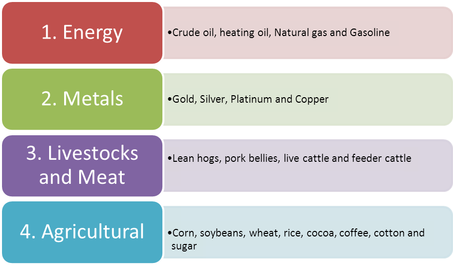

Algorithmic trading, commonly known as algo trading, has transformed the financial markets by allowing for the automated buying and selling of commodities and other financial instruments. This technological advancement leverages sophisticated algorithms, often incorporating machine learning and statistical methods, to execute trading decisions at speeds and frequencies that are impossible for human traders. The automation of trading processes not only enhances efficiency but also provides opportunities for traders to capitalize on arbitrage opportunities, manage risk more effectively, and implement complex trading strategies across diverse market conditions.

Commodities form a vital component of global markets and play a crucial role in algo trading. These fundamental goods, which include assets such as oil, gold, wheat, and corn, are intrinsically linked to both macroeconomic trends and geopolitical events. This link makes them ideal candidates for algorithmic strategies that can swiftly respond to market changes. The dynamic nature of commodity prices often results in volatility, thus presenting numerous trading opportunities that can be harnessed through algorithmic methods.



In this article, we explore the basics of commodities and their relevance in algo trading, offering insight into one of the most fundamental aspects of financial markets. By understanding not just what commodities are, but also the various types and market mechanisms associated with them, this guide aims to provide a comprehensive overview suitable for both beginners and seasoned traders. The section will delve into the intricacies of trading raw materials and discuss how algorithmic strategies can be applied effectively in these markets.

This exploration is crucial because successful algorithmic trading in commodities requires a deep understanding of both the underlying assets and the technological tools available. Whether you are looking to refine your trading strategies or gain a new perspective on the commodity markets, understanding these elements is essential. Join us as we explore the list of basic commodities relevant to raw materials markets within the context of algo trading, offering insights into how these basic elements of commerce can be navigated with precision and strategy through automation and advanced technology.

## Table of Contents

## Understanding Commodities

Commodities are fundamental goods utilized in commerce, characterized by their interchangeability with other goods of the same type. These homogeneous goods are essential because they form the building blocks for more complex products and are traded globally. Commodities are generally categorized into two main types: hard and soft commodities.

Hard commodities are typically natural resources that require extraction or mining. Examples include metals such as gold, silver, and copper, as well as energy resources like oil and natural gas. The extraction process for hard commodities often involves significant capital investment and technological expertise, influencing their market supply and price stability.

Soft commodities, on the other hand, are predominantly agricultural products. These include crops like wheat, corn, and soybeans, and livestock such as cattle and hogs. Due to their reliance on seasonal growth and harvesting cycles, soft commodities are more susceptible to weather conditions, pests, and diseases, which can affect supply levels and lead to price [volatility](/wiki/volatility-trading-strategies).

Trading of commodities predominantly occurs on futures exchanges, where standardized contracts are bought and sold. Futures contracts allow producers and consumers to hedge against price fluctuations, providing a degree of price certainty. For instance, a farmer can lock in a price for their corn crop ahead of the harvest, mitigating the risk of price drops. Conversely, a food manufacturer can secure a price for corn it needs months in advance, protecting against price increases.

The trading of commodities has evolved substantially, incorporating financial instruments and indices that introduce additional complexity and opportunities for traders. Derivatives such as options and swaps allow market participants to engage in more sophisticated trading strategies, leveraging the price movements of the underlying commodities without the need for physical delivery. Commodity indices, such as the Bloomberg Commodity Index, provide benchmarks for evaluating market performance and form the basis for various investment products.

A fundamental understanding of commodities is crucial for those interested in trading or investment strategies. Recognizing the interplay of supply and demand, geopolitical factors, and market sentiment can aid in anticipating price movements. Given their global significance, commodities offer opportunities for diversification, portfolio protection, and potentially lucrative trades for those equipped with the knowledge to navigate these markets effectively.

## Types of Commodities in Algo Trading

Algorithmic trading, or algo trading, engages with a diverse range of commodities, each possessing distinctive characteristics and influenced by dynamic market forces. The primary categories of commodities in algo trading include energy, metals, agriculture, and others such as lumber and rubber.

### Energy Commodities

Energy commodities are central to global markets due to their broad economic implications. Key energy commodities include oil and natural gas, both known for their volatility and significant price movements, which make them attractive targets for [algorithmic trading](/wiki/algorithmic-trading) strategies. The global dependence on energy resources ensures constant trading activity, leading to abundant historical data that can be leveraged by algorithms to predict price trends and optimize trades.

### Metal Commodities

Metal commodities, including gold, silver, and platinum, are sought after for various industrial uses and as investment safe havens. Gold, for example, has intrinsic value and is often traded based on its inverse relationship with currency valuations, particularly the U.S. dollar. Algorithmic trading systems can capitalize on these complex interactions by implementing trend-following or mean reversion strategies, thus exploiting potential price fluctuations.

### Agricultural Commodities

Commodities like corn, wheat, and soybeans dominate the agricultural market. These goods are sensitive to factors such as weather conditions, seasonal cycles, and geopolitical issues. Agricultural commodities present unique opportunities for algo traders who can integrate environmental data with market analysis to predict outcomes and perform trades with precision.

### Other Commodities

Other relevant commodities include lumber and rubber, which are crucial to sectors such as construction and manufacturing. Trading these commodities often involves understanding industrial demand cycles and economic growth indicators. Algorithms, especially those enhanced with [machine learning](/wiki/machine-learning) techniques, can analyze these data streams effectively to anticipate market shifts and adjust trading tactics accordingly.

Each category demands specific insights into market conditions, associated risks, and carefully tailored trading strategies. Algorithmic trading empowers traders to identify and capitalize on price trends and movements in these varied markets. By utilizing historical and real-time data, traders can execute trades with speed and accuracy that would be impossible with manual strategies alone, ultimately aiming for optimized returns and reduced risk exposure in the vast commodity landscape.

## Market Mechanisms and Risks

Commodity markets operate through several key mechanisms, primarily the spot and futures markets, each presenting distinct risk profiles and trading strategies. The spot market involves the immediate delivery of commodities at the current market price, reflecting real-time supply and demand dynamics. In contrast, the futures market allows participants to buy or sell a commodity at a predetermined price for delivery at a future date, offering a hedge against price volatility and uncertainties.

Volatility is a predominant risk in commodity markets, influenced by factors such as geopolitical events and macroeconomic conditions. Political instability or conflicts in major producing regions can disrupt supply chains, leading to abrupt price changes. Similarly, economic indicators such as inflation rates and currency fluctuations can cause significant market fluctuations.

Understanding concepts like backwardation and contango is essential for traders to gauge market expectations and identify potential trading opportunities. Backwardation occurs when the spot price of a commodity is higher than its futures price, often indicating supply shortages or high demand in the short term. Conversely, contango describes a situation where futures prices are higher than the spot price, suggesting that traders expect higher prices in the future, possibly due to anticipated storage costs or a surplus in supply.

Algorithmic trading systems offer a sophisticated approach to managing these risks through advanced models and real-time data analysis. By automating the trading process, algorithms can swiftly react to market movements, execute trades efficiently, and exploit temporary price discrepancies.

Effective risk management in algorithmic trading involves constructing strategies that balance potential returns with the risk of losses. This often necessitates the use of statistical models to predict price movements and measure the probability of adverse outcomes. For instance, traders might implement risk-reward ratios to set thresholds for acceptable loss levels in relation to anticipated gains. Python, a popular programming language for quantitative finance, can be employed to develop such strategies. An example of a simple risk management script in Python can look as follows:

```python
def calculate_risk_reward_ratio(expected_return, potential_loss):
    return expected_return / potential_loss

expected_return = 15.0  # Expected gain from a trade
potential_loss = 5.0    # Potential loss if the trade goes against you

risk_reward_ratio = calculate_risk_reward_ratio(expected_return, potential_loss)
print(f"Risk-Reward Ratio: {risk_reward_ratio}")
```

This balance ensures that trading strategies are robust, adaptive, and profitable over time, fostering long-term success in the volatile landscape of commodity markets.

## Algorithmic Trading Strategies for Commodities

Common algorithmic strategies employed in commodities trading encompass trend-following, mean reversion, [arbitrage](/wiki/arbitrage), and statistical models, each utilizing distinct market conditions and insights derived from data analysis.

Trend-following strategies involve identifying and capitalizing on ongoing market patterns. These can be executed through technical indicators such as moving averages or price channels. The core assumption is that prices follow trends more often than they move erratically. Algorithmic systems utilize these patterns by setting predefined criteria for entering and exiting trades, often using simple moving average (SMA) or exponential moving average (EMA) crossovers as signals. For instance, a trend-following algorithm might buy a commodity when its short-term SMA crosses above its long-term SMA.

Mean reversion strategies, on the other hand, operate on the premise that prices will revert to their historical average over time. These strategies are particularly effective in range-bound markets where commodities prices oscillate around a mean value. Algorithms employing a mean reversion approach might track price deviations from averages such as Bollinger Bands, taking positions when prices deviate significantly from the mean, expecting a reversal.

Arbitrage strategies exploit price discrepancies across different markets or instruments of the same commodity. Algorithms are designed to identify and execute trades instantaneously, buying underpriced commodities on one exchange while simultaneously selling overpriced ones on another. This requires robust high-frequency trading ([HFT](/wiki/high-frequency-trading-strategies)) systems capable of executing many trades in milliseconds to capture fleeting arbitrage opportunities.

Statistical models, including quantitative techniques such as regression analysis or machine learning algorithms, are used to predict future commodity prices based on historical data. These models may incorporate a wide array of market variables, including past prices, volumes, economic indicators, and even sentiment analysis from news sources. Machine learning can enhance these approaches by discovering complex patterns and relationships within data that may not be evident with conventional analytical techniques.

Execution efficiency and return maximization are further enhanced through strategies involving high-frequency trading, wherein algorithms execute a high [volume](/wiki/volume-trading-strategy) of trade orders in very short timeframes to capture small price movements. Additionally, market-making techniques, where algorithms continuously offer buy and sell quotes to facilitate market [liquidity](/wiki/liquidity-risk-premium), can also be employed profitably, especially in less liquid commodity markets.

The choice of strategy is often dictated by the trader's objectives, risk tolerance, and the specific characteristics of the commodity market being traded. A commodity like [crude oil](/wiki/crude-oil) may favor trend-following strategies due to its volatility, while mean reversion might be preferable in stable agricultural markets.

Crucially, [backtesting](/wiki/backtesting) and real-time monitoring are imperative for refining these algorithms. Backtesting involves simulating the trading strategy on historical data to evaluate its potential performance. This process helps in identifying the strengths and pitfalls of a strategy before deploying it in live markets. Python, with libraries like Pandas and Backtrader, can be effectively used for backtesting. For instance:

```python
import bt

# Define a simple moving average crossover strategy
class SmaCross(bt.SignalStrategy):
    def init(self):
        close = self.data.Close
        self.sma1 = self.I(bt.indicators.SMA, close, 10)
        self.sma2 = self.I(bt.indicators.SMA, close, 20)

    def next(self):
        if crossover(self.sma1, self.sma2):
            self.buy()
        elif crossover(self.sma2, self.sma1):
            self.sell()

# Fetch historical price data and run backtest
data = bt.feeds.GenericCSVData(...)
backtest = bt.Backtest(SmaCross, data)
bt.run(backtest)
```

In addition to backtesting, real-time monitoring allows traders to adjust their strategies dynamically in response to live market conditions, ensuring robustness and adaptability in varying market environments. This continuous iteration between strategy execution and analysis forms the backbone of successful algorithmic trading in commodities.

## Future Trends in Commodities Algo Trading

The future of commodities algorithmic trading is poised for significant innovation through the increased integration of [artificial intelligence](/wiki/ai-artificial-intelligence) (AI) and machine learning technologies. These advancements are expected to enhance the precision of market predictions and improve decision-making processes by enabling more sophisticated data analytics and real-time processing capabilities. 

AI and machine learning can process vast amounts of market data, identify patterns, and predict price movements with greater accuracy than traditional methods. For instance, machine learning algorithms can continuously adapt to new market conditions, enhancing their predictive power over time. By employing techniques such as [deep learning](/wiki/deep-learning) and neural networks, algorithms can uncover complex relationships in data that may not be immediately obvious through conventional analysis.

Incorporating sustainability and ethical considerations is expected to drive novel trading opportunities and influence market preferences. As global emphasis on environmental responsibility increases, commodities linked to sustainable practices may gain prominence, potentially leading to the development of new indices and financial products centered on sustainability metrics. This shift might encourage the creation of algorithms that favor commodities with lower carbon footprints or those sourced through ethical practices.

Regulatory changes and enhancements in market infrastructure will continue to shape the landscape of algorithmic trading in commodities. Regulatory bodies are increasingly focused on ensuring market stability and transparency, which can lead to the introduction of new rules affecting how algorithmic trading operates. Market participants must stay informed about these changes, as they can impact trading strategies and require adjustments in algorithmic models to remain compliant.

The continued evolution of market infrastructure, including advancements in trading platforms and communication technologies, will also play a critical role. High-frequency trading systems, for instance, rely on low-latency connections and advanced hardware to execute trades rapidly. Developments in blockchain technology and smart contracts might further revolutionize trading processes, offering enhanced security and efficiency.

To capitalize on these evolving markets, traders must remain adaptable and well-informed. Continuous learning and technological adaptation are crucial for maintaining a competitive edge. Market participants should keep abreast of emerging trends and regulatory shifts, utilizing cutting-edge tools for data analysis and algorithm development to optimize their trading strategies.

In conclusion, the integration of advanced technologies, coupled with an emphasis on sustainability and responsive adaptation to regulatory changes, will offer both challenges and opportunities for commodities algorithmic trading. By embracing these developments, traders can position themselves for success in the dynamic and rapidly-evolving financial environment of the future.

## Conclusion

The intersection of commodities and algorithmic trading offers significant prospects for astute and strategic engagement in the financial markets. To fully exploit these opportunities, understanding the different types of commodities and their inherent market dynamics is essential. Traders equipped with this knowledge can effectively use algorithmic tools to navigate the complexities of commodity trading, optimizing their strategies to contend with various market conditions.

Market intelligence is a crucial element in this framework, serving as the foundation for developing and implementing effective trading strategies. In the algorithmic era, this intelligence is powered by real-time data analysis, which allows traders to identify patterns, anticipate market movements, and execute transactions with precision. Combining such intelligence with robust trading strategies ensures that commodity traders can achieve success by making informed decisions that align with their market objectives.

As technology continues to evolve, embracing continuous learning and adaptability becomes increasingly important for traders. The rapid pace of innovations in artificial intelligence, machine learning, and data processing means that staying informed about technological advancements is not just beneficial, but necessary for maintaining a competitive edge.

Algorithmic trading in commodities, when approached with strategic planning and diligent execution, can lead to substantial benefits and long-term success. The ability to efficiently manage risks, capitalize on market opportunities, and adjust strategies in response to technological and market changes is vital. Ultimately, the dynamic integration of technology and market expertise enables traders to enhance their performance and achieve sustainable outcomes in the complex world of commodity trading.


## References & Further Reading

[1]: Aldridge, I. (2013). ["High-Frequency Trading: A Practical Guide to Algorithmic Strategies and Trading Systems,"](https://www.amazon.com/High-Frequency-Trading-Practical-Algorithmic-Strategies/dp/1118343506) 2nd Edition. Wiley.

[2]: Geman, H. (2005). ["Commodities and Commodity Derivatives: Modelling and Pricing for Agriculturals, Metals and Energy."](https://download.e-bookshelf.de/download/0000/5675/90/L-G-0000567590-0015270354.pdf) Wiley Finance.

[3]: Jarrow, R. A. (2019). ["Modeling Commodity Price Dynamics: A Review and Extensions."](https://www.taylorfrancis.com/books/mono/10.1201/9780429432842/modeling-fixed-income-securities-interest-rate-options-robert-jarrow) SSRN Electronic Journal.

[4]: Kaminski, K. (2016). ["Trading Commodity Futures with Classical Chart Patterns and Algorithmic Trading Strategies,"](https://www.amazon.com/Trading-Commodity-Futures-Classical-Patterns/product-reviews/0967460018) in Algorithmic Finance, 5(1-2), pp. 39-48.

[5]: Lopez de Prado, M. (2018). ["Advances in Financial Machine Learning."](https://www.amazon.com/Advances-Financial-Machine-Learning-Marcos/dp/1119482089) Wiley.

[6]: Yoon, H., & Swales, G. S. (1991). ["Predicting Stock Market Movements with Interval Discriminant Analysis,"](https://www.semanticscholar.org/paper/Predicting-stock-price-performance%3A-a-neural-Yoon-Swales/7b18622710b5a18986fc49254d75ef18dcd424c3) Journal of Financial and Quantitative Analysis, 26(4), 459-472.