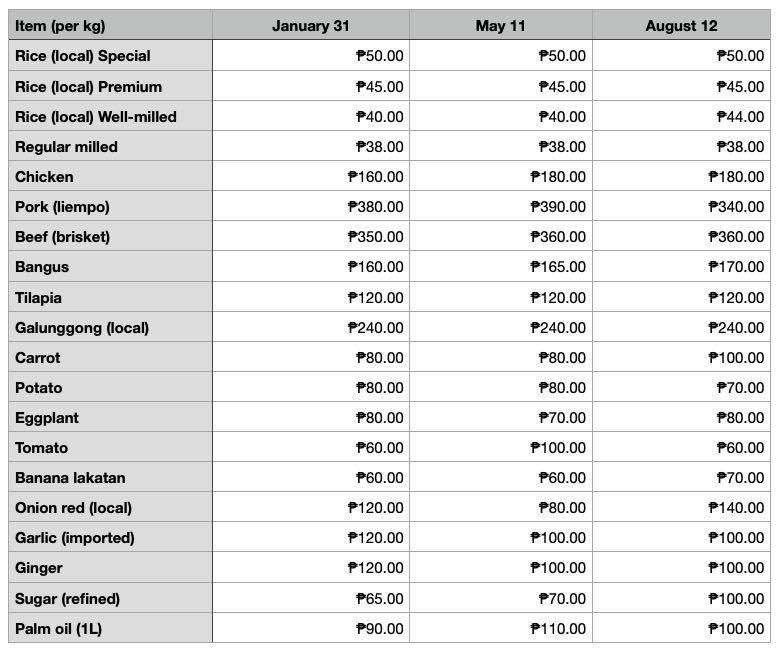

## Table of Contents

## What are basic commodities?

Basic commodities are essential goods that people need every day. These include things like food, water, and energy. They are important because everyone needs them to live a normal life. Without these basic commodities, it would be hard for people to survive and do their daily activities.

Governments and organizations often keep an eye on the supply and price of basic commodities. This is to make sure that everyone can afford them and that there is enough for everyone. Sometimes, the prices of these goods can change a lot, which can cause problems for people who need them. That's why it's important to manage and control the supply of basic commodities carefully.

## Why are basic commodities important for everyday life?

Basic commodities are important for everyday life because they are the things we need to live and be healthy. Food gives us energy and helps our bodies work properly. Water keeps us hydrated and is necessary for many body functions. Energy, like electricity or gas, helps us cook food, stay warm, and use important tools like lights and refrigerators. Without these basic things, it would be hard to do normal daily activities and stay healthy.

These commodities also help keep society running smoothly. When everyone can get the basic things they need, people can focus on other important parts of life like work, school, and spending time with family. If the supply of these goods is not enough or if they become too expensive, it can cause big problems. People might struggle to get what they need, which can lead to stress and hardship. That's why it's important for governments and organizations to make sure there is enough of these basic commodities for everyone.

## Can you name some examples of basic commodities?

Basic commodities are things that everyone needs every day. Some examples are food like rice, wheat, and vegetables. These foods give us energy and help us stay healthy. Water is another basic commodity. We need it to drink, cook, and clean. Without water, we can't live for very long.

Energy is also a basic commodity. It includes things like electricity and gas. We use electricity to power our homes, like turning on lights and using the refrigerator. Gas helps us cook our food and heat our homes. These energy sources are important for our daily lives.

Other basic commodities include clothing and shelter. Clothes keep us warm and protected from the weather. Shelter, like a house or apartment, gives us a safe place to live. These things are essential for everyone to live a normal life.

## How do the prices of basic commodities affect the economy?

The prices of basic commodities like food, water, and energy can have a big impact on the economy. When the prices of these goods go up, people have to spend more money on them. This means they might have less money to spend on other things like clothes, entertainment, or saving for the future. If many people have to spend more on basic needs, it can slow down the whole economy because there is less money going around for other businesses.

Governments and businesses watch the prices of basic commodities closely. If the prices go up too fast, it can cause inflation, which means everything starts to cost more. This can make life harder for people, especially those who don't have a lot of money. On the other hand, if the prices of basic commodities stay stable or go down, it can help keep the economy strong. People can afford what they need and have money left over to spend on other things, which helps businesses grow and creates more jobs.

## What factors influence the supply and demand of basic commodities?

Many things can affect how much of a basic commodity is available and how much people want it. One big [factor](/wiki/factor-investing) is the weather. If there is a lot of rain or a drought, it can change how much food farmers can grow. Natural disasters like floods or hurricanes can also destroy crops or damage places where food is stored. Another factor is how much it costs to make or get the commodity. If it costs more to grow food or get oil out of the ground, there might be less of it available because it's too expensive to produce.

People's needs and wants also change how much they want basic commodities. If there are more people in a place, they will need more food, water, and energy. If people have more money, they might want to buy more of these things. Sometimes, what people think might happen in the future can change demand too. For example, if people think there might be a shortage of a commodity soon, they might buy more of it now, which can make the shortage happen faster. Governments can also affect supply and demand by making rules about how much of a commodity can be produced or sold, or by giving money to help people buy basic things.

All these factors work together to change how much of a basic commodity is available and how much people want it. This balance between supply and demand is important because it affects the price of the commodity. If there is a lot of a commodity and not many people want it, the price will go down. But if there is not enough of a commodity and a lot of people want it, the price will go up. Keeping a good balance helps make sure that everyone can get the basic things they need.

## How do governments regulate basic commodities?

Governments have different ways to make sure there is enough of basic commodities like food, water, and energy for everyone. One way is by making rules about how much of these things can be made or sold. For example, they might say that farmers can only grow a certain amount of wheat or that companies can only take out a certain amount of oil from the ground. This helps keep the supply steady and stops too much or too little of the commodity from being available. Governments can also give money to farmers or companies to help them produce more of these basic things, especially if there is not enough.

Another way governments help is by controlling the prices of basic commodities. They might set a maximum price for things like bread or gas to make sure everyone can afford them. If the prices get too high, the government might step in to stop them from going up even more. Sometimes, governments keep a stockpile of basic commodities, like food or medicine, so they can give them out if there is a shortage. This helps make sure people always have what they need, even during tough times. By doing these things, governments try to keep the supply and prices of basic commodities stable, which helps everyone live a normal life.

## What role do basic commodities play in global trade?

Basic commodities like food, water, and energy are very important in global trade. Countries buy and sell these things to each other because not every country can grow or make enough of them. For example, a country that grows a lot of wheat might sell it to another country that doesn't grow enough wheat for its people. This helps make sure everyone around the world can get the basic things they need. Trading these commodities also helps countries make money and grow their economies.

The prices of basic commodities can change a lot in global trade. If there is not enough of something, like oil, the price can go up a lot. This can cause problems for countries that need to buy it. Sometimes, big events like wars or natural disasters can change how much of a commodity is available, which can make the prices go up or down. Governments and big companies watch these prices closely because they can affect the whole world's economy. When countries work together to trade basic commodities, it helps keep prices stable and makes sure everyone can get what they need.

## How have historical events impacted the availability of basic commodities?

Historical events have had a big impact on the availability of basic commodities. For example, wars can destroy farms and factories, making it hard to grow food or make things like energy. During World War II, many countries had trouble getting enough food because of fighting and blockades. This led to rationing, where people could only buy a certain amount of food. Another example is natural disasters. A big hurricane or drought can ruin crops and make it hard for people to get enough to eat. The Irish Potato Famine in the 1840s happened because a disease destroyed the potato crop, which was a main food for many people.

Economic events can also change how much of a basic commodity is available. During the Great Depression in the 1930s, many people didn't have enough money to buy food. This made it hard for farmers to sell their crops, and some had to destroy their food because they couldn't sell it. In more recent times, the global financial crisis in 2008 led to higher food prices, making it harder for people to afford basic things. These events show how history can affect the supply of basic commodities and how important it is for governments and organizations to plan and help people during tough times.

## What are the differences between renewable and non-renewable basic commodities?

Renewable basic commodities are things that can be used over and over again without running out. Examples are water, wind, and sunlight. These things come from nature and can be used to make energy, like electricity from wind turbines or solar panels. Because they come from nature, they can keep being made as long as the environment stays healthy. If we take care of the earth, we can always have these commodities. They are important because they help us have energy without hurting the planet.

Non-renewable basic commodities are things that can run out because there is only so much of them. Examples are oil, coal, and natural gas. These things are used to make energy too, but once we use them up, they are gone forever. It takes millions of years for the earth to make more of these commodities, so we need to be careful about how much we use. Using too much can cause problems because we won't have them in the future. That's why it's important to find other ways to get energy, like using renewable commodities.

## How does technology affect the production and distribution of basic commodities?

Technology helps a lot with making and moving basic commodities. For example, farmers use machines like tractors and harvesters to grow more food faster. They also use special tools to check the soil and weather, which helps them know the best time to plant and take care of their crops. This means we can grow more food and other things we need. Technology also helps with making energy. We use wind turbines and solar panels to get energy from the wind and sun, which are better for the earth than using oil or coal.

When it comes to moving basic commodities, technology makes it easier and faster. We use trucks, ships, and airplanes to take food, water, and energy to different places around the world. Computers and the internet help us keep track of where everything is and make sure it gets to the right place on time. This is important because it means people can get the things they need even if they live far away from where the commodities are made. Technology keeps getting better, which helps us have more basic commodities and use them in smarter ways.

## What are the future trends and predictions for basic commodities?

In the future, we might see more changes in how we get and use basic commodities. One big trend is using more renewable energy like wind and solar power. This is because people are worried about using up all the oil and coal, which are non-renewable. Governments and companies are working on new ways to use the sun, wind, and even water to make energy. This can help us have enough energy without hurting the earth. Another trend is using technology to grow food in new ways, like in big indoor farms. This can help us grow more food in places where it's hard to farm outside.

We also need to think about how climate change might affect basic commodities. Warmer weather and more storms can make it hard to grow food and get enough water. This might mean we need to find new ways to farm and save water. Countries might trade more with each other to make sure everyone has enough of what they need. Governments and big groups will keep working together to make sure there is enough food, water, and energy for everyone. They might use new rules and technology to help keep prices steady and make sure people can afford basic things.

## How can individuals and communities ensure sustainable use of basic commodities?

Individuals and communities can help make sure we use basic commodities in a way that doesn't hurt the earth by doing simple things every day. For example, people can save water by taking shorter showers and fixing leaks. They can also use less energy by turning off lights when they leave a room and using energy-saving light bulbs. When it comes to food, people can grow their own fruits and vegetables in a garden or buy food that is grown nearby. This helps cut down on the energy used to move food around. Communities can work together to share resources, like starting a community garden or setting up a system to share tools and equipment.

Another way to use basic commodities sustainably is by recycling and reducing waste. Instead of throwing things away, people can recycle materials like paper, plastic, and glass. This helps save the resources we need to make new things. Communities can also start programs to compost food waste, which turns it into soil that can be used to grow more food. By working together and making small changes, individuals and communities can help make sure there is enough of the basic things we need for a long time. This helps keep the earth healthy for everyone.


## Types of Commodities in Algo Trading

Algorithmic trading, or algo trading, engages with a diverse range of commodities, each possessing distinctive characteristics and influenced by dynamic market forces. The primary categories of commodities in algo trading include energy, metals, agriculture, and others such as lumber and rubber.

### Energy Commodities

Energy commodities are central to global markets due to their broad economic implications. Key energy commodities include oil and natural gas, both known for their volatility and significant price movements, which make them attractive targets for [algorithmic trading](/wiki/algorithmic-trading) strategies. The global dependence on energy resources ensures constant trading activity, leading to abundant historical data that can be leveraged by algorithms to predict price trends and optimize trades.

### Metal Commodities

Metal commodities, including gold, silver, and platinum, are sought after for various industrial uses and as investment safe havens. Gold, for example, has intrinsic value and is often traded based on its inverse relationship with currency valuations, particularly the U.S. dollar. Algorithmic trading systems can capitalize on these complex interactions by implementing trend-following or mean reversion strategies, thus exploiting potential price fluctuations.

### Agricultural Commodities

Commodities like corn, wheat, and soybeans dominate the agricultural market. These goods are sensitive to factors such as weather conditions, seasonal cycles, and geopolitical issues. Agricultural commodities present unique opportunities for algo traders who can integrate environmental data with market analysis to predict outcomes and perform trades with precision.

### Other Commodities

Other relevant commodities include lumber and rubber, which are crucial to sectors such as construction and manufacturing. Trading these commodities often involves understanding industrial demand cycles and economic growth indicators. Algorithms, especially those enhanced with [machine learning](/wiki/machine-learning) techniques, can analyze these data streams effectively to anticipate market shifts and adjust trading tactics accordingly.

Each category demands specific insights into market conditions, associated risks, and carefully tailored trading strategies. Algorithmic trading empowers traders to identify and capitalize on price trends and movements in these varied markets. By utilizing historical and real-time data, traders can execute trades with speed and accuracy that would be impossible with manual strategies alone, ultimately aiming for optimized returns and reduced risk exposure in the vast commodity landscape.

## Market Mechanisms and Risks

Commodity markets operate through several key mechanisms, primarily the spot and futures markets, each presenting distinct risk profiles and trading strategies. The spot market involves the immediate delivery of commodities at the current market price, reflecting real-time supply and demand dynamics. In contrast, the futures market allows participants to buy or sell a commodity at a predetermined price for delivery at a future date, offering a hedge against price volatility and uncertainties.

Volatility is a predominant risk in commodity markets, influenced by factors such as geopolitical events and macroeconomic conditions. Political instability or conflicts in major producing regions can disrupt supply chains, leading to abrupt price changes. Similarly, economic indicators such as inflation rates and currency fluctuations can cause significant market fluctuations.

Understanding concepts like backwardation and contango is essential for traders to gauge market expectations and identify potential trading opportunities. Backwardation occurs when the spot price of a commodity is higher than its futures price, often indicating supply shortages or high demand in the short term. Conversely, contango describes a situation where futures prices are higher than the spot price, suggesting that traders expect higher prices in the future, possibly due to anticipated storage costs or a surplus in supply.

Algorithmic trading systems offer a sophisticated approach to managing these risks through advanced models and real-time data analysis. By automating the trading process, algorithms can swiftly react to market movements, execute trades efficiently, and exploit temporary price discrepancies.

Effective risk management in algorithmic trading involves constructing strategies that balance potential returns with the risk of losses. This often necessitates the use of statistical models to predict price movements and measure the probability of adverse outcomes. For instance, traders might implement risk-reward ratios to set thresholds for acceptable loss levels in relation to anticipated gains. Python, a popular programming language for quantitative finance, can be employed to develop such strategies. An example of a simple risk management script in Python can look as follows:

```python
def calculate_risk_reward_ratio(expected_return, potential_loss):
    return expected_return / potential_loss

expected_return = 15.0  # Expected gain from a trade
potential_loss = 5.0    # Potential loss if the trade goes against you

risk_reward_ratio = calculate_risk_reward_ratio(expected_return, potential_loss)
print(f"Risk-Reward Ratio: {risk_reward_ratio}")
```

This balance ensures that trading strategies are robust, adaptive, and profitable over time, fostering long-term success in the volatile landscape of commodity markets.

## Algorithmic Trading Strategies for Commodities

Common algorithmic strategies employed in commodities trading encompass trend-following, mean reversion, [arbitrage](/wiki/arbitrage), and statistical models, each utilizing distinct market conditions and insights derived from data analysis.

Trend-following strategies involve identifying and capitalizing on ongoing market patterns. These can be executed through technical indicators such as moving averages or price channels. The core assumption is that prices follow trends more often than they move erratically. Algorithmic systems utilize these patterns by setting predefined criteria for entering and exiting trades, often using simple moving average (SMA) or exponential moving average (EMA) crossovers as signals. For instance, a trend-following algorithm might buy a commodity when its short-term SMA crosses above its long-term SMA.

Mean reversion strategies, on the other hand, operate on the premise that prices will revert to their historical average over time. These strategies are particularly effective in range-bound markets where commodities prices oscillate around a mean value. Algorithms employing a mean reversion approach might track price deviations from averages such as Bollinger Bands, taking positions when prices deviate significantly from the mean, expecting a reversal.

Arbitrage strategies exploit price discrepancies across different markets or instruments of the same commodity. Algorithms are designed to identify and execute trades instantaneously, buying underpriced commodities on one exchange while simultaneously selling overpriced ones on another. This requires robust high-frequency trading ([HFT](/wiki/high-frequency-trading-strategies)) systems capable of executing many trades in milliseconds to capture fleeting arbitrage opportunities.

Statistical models, including quantitative techniques such as regression analysis or machine learning algorithms, are used to predict future commodity prices based on historical data. These models may incorporate a wide array of market variables, including past prices, volumes, economic indicators, and even sentiment analysis from news sources. Machine learning can enhance these approaches by discovering complex patterns and relationships within data that may not be evident with conventional analytical techniques.

Execution efficiency and return maximization are further enhanced through strategies involving high-frequency trading, wherein algorithms execute a high [volume](/wiki/volume-trading-strategy) of trade orders in very short timeframes to capture small price movements. Additionally, market-making techniques, where algorithms continuously offer buy and sell quotes to facilitate market [liquidity](/wiki/liquidity-risk-premium), can also be employed profitably, especially in less liquid commodity markets.

The choice of strategy is often dictated by the trader's objectives, risk tolerance, and the specific characteristics of the commodity market being traded. A commodity like [crude oil](/wiki/crude-oil) may favor trend-following strategies due to its volatility, while mean reversion might be preferable in stable agricultural markets.

Crucially, [backtesting](/wiki/backtesting) and real-time monitoring are imperative for refining these algorithms. Backtesting involves simulating the trading strategy on historical data to evaluate its potential performance. This process helps in identifying the strengths and pitfalls of a strategy before deploying it in live markets. Python, with libraries like Pandas and Backtrader, can be effectively used for backtesting. For instance:

```python
import bt

# Define a simple moving average crossover strategy
class SmaCross(bt.SignalStrategy):
    def init(self):
        close = self.data.Close
        self.sma1 = self.I(bt.indicators.SMA, close, 10)
        self.sma2 = self.I(bt.indicators.SMA, close, 20)

    def next(self):
        if crossover(self.sma1, self.sma2):
            self.buy()
        elif crossover(self.sma2, self.sma1):
            self.sell()

# Fetch historical price data and run backtest
data = bt.feeds.GenericCSVData(...)
backtest = bt.Backtest(SmaCross, data)
bt.run(backtest)
```

In addition to backtesting, real-time monitoring allows traders to adjust their strategies dynamically in response to live market conditions, ensuring robustness and adaptability in varying market environments. This continuous iteration between strategy execution and analysis forms the backbone of successful algorithmic trading in commodities.

## References & Further Reading

[1]: Aldridge, I. (2013). ["High-Frequency Trading: A Practical Guide to Algorithmic Strategies and Trading Systems,"](https://www.amazon.com/High-Frequency-Trading-Practical-Algorithmic-Strategies/dp/1118343506) 2nd Edition. Wiley.

[2]: Geman, H. (2005). ["Commodities and Commodity Derivatives: Modelling and Pricing for Agriculturals, Metals and Energy."](https://download.e-bookshelf.de/download/0000/5675/90/L-G-0000567590-0015270354.pdf) Wiley Finance.

[3]: Jarrow, R. A. (2019). ["Modeling Commodity Price Dynamics: A Review and Extensions."](https://www.taylorfrancis.com/books/mono/10.1201/9780429432842/modeling-fixed-income-securities-interest-rate-options-robert-jarrow) SSRN Electronic Journal.

[4]: Kaminski, K. (2016). ["Trading Commodity Futures with Classical Chart Patterns and Algorithmic Trading Strategies,"](https://www.amazon.com/Trading-Commodity-Futures-Classical-Patterns/product-reviews/0967460018) in Algorithmic Finance, 5(1-2), pp. 39-48.

[5]: Lopez de Prado, M. (2018). ["Advances in Financial Machine Learning."](https://www.amazon.com/Advances-Financial-Machine-Learning-Marcos/dp/1119482089) Wiley.

[6]: Yoon, H., & Swales, G. S. (1991). ["Predicting Stock Market Movements with Interval Discriminant Analysis,"](https://www.semanticscholar.org/paper/Predicting-stock-price-performance%3A-a-neural-Yoon-Swales/7b18622710b5a18986fc49254d75ef18dcd424c3) Journal of Financial and Quantitative Analysis, 26(4), 459-472.